本文由红日安全成员： **七月火** 编写，如有不当，还望斧正。

## 前言

大家好，我们是红日安全-代码审计小组。最近我们小组正在做一个PHP代码审计的项目，供大家学习交流，我们给这个项目起了一个名字叫 [**PHP-Audit-Labs**](https://github.com/hongriSec/PHP-Audit-Labs) 。现在大家所看到的系列文章，属于项目 **第一阶段** 的内容，本阶段的内容题目均来自 [PHP SECURITY CALENDAR 2017](https://www.ripstech.com/php-security-calendar-2017/) 。对于每一道题目，我们均给出对应的分析，并结合实际CMS进行解说。在文章的最后，我们还会留一道CTF题目，供大家练习，希望大家喜欢。下面是 **第10篇** 代码审计文章：

## Day 10 - Anticipation

题目叫做预期，代码如下：

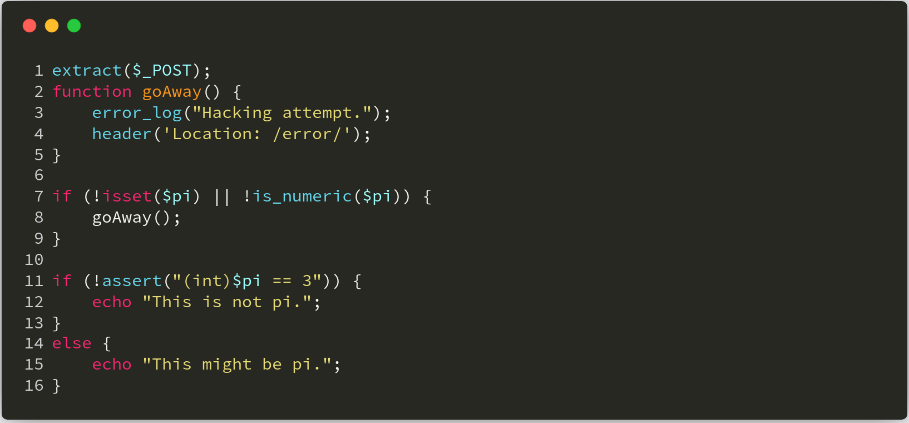

**漏洞解析** ：

这道题目实际上讲的是当检测到攻击时，虽然有相应的防御操作，但是程序未立即停止退出，导致程序继续执行的问题。程序在 **第一行处** 使用 **extract** 函数，将 **POST** 请求的数据全都注册成变量， **extract** 函数的定义如下：

>[ extract ](http://php.net/manual/zh/function.extract.php) ：(PHP 4, PHP 5, PHP 7)
>
>**功能** ：从数组中将变量导入到当前的符号表
>
>**定义** ： `int extract ( array &$array [, int $flags = EXTR_OVERWRITE [, string $prefix = NULL ]] )` 
>

该函数实际上就是把数组中的键值对注册成变量，具体可以看如下案例：

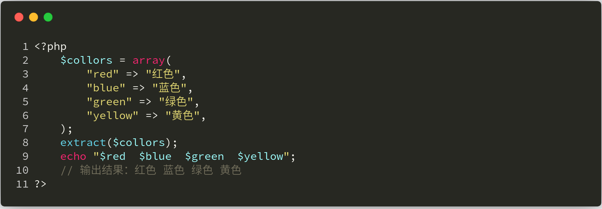

这样我们就可以控制 **第7行** 处的 **pi**  变量。程序对 **pi**  变量进行简单的验证，如果不是数字或者没有设置 **pi**  变量，程序就会执行 **goAway** 方法，即记录错误信息并直接重定向到 **/error/** 页面。看来程序员这里是对非法的操作进行了一定的处理。但是关键在于，程序在处理完之后，没有立即退出，这样程序又会按照流程执行下去，也就到了 **第11行** 的 **assert** 语句。由于前面 **pi**  变量可以被用户控制，所以在这一行存在远程代码执行漏洞。

例如我们的payload为：**pi=phpinfo()** （这里为POST传递数据），然后程序就会执行这个 **phpinfo** 函数。当然，你在浏览器端可能看不到 **phpinfo** 的页面，而是像下面这样的图片：

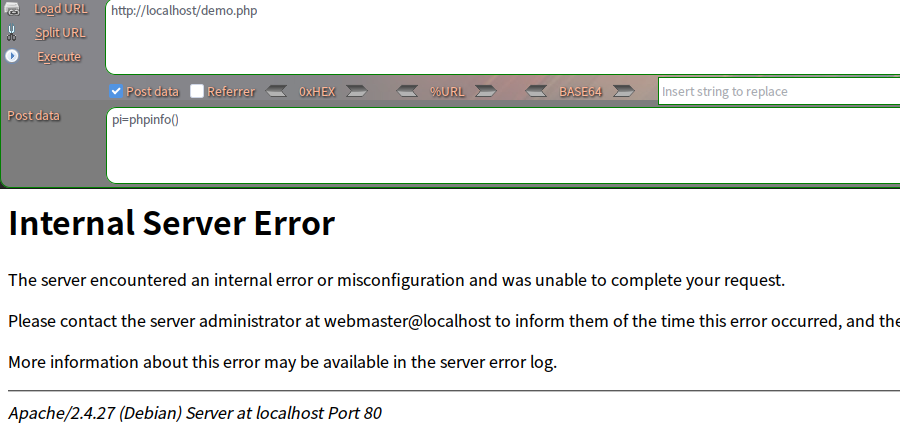

但是用 **BurpSuite** ，大家就可以清晰的看到程序执行了 **phpinfo** 函数：

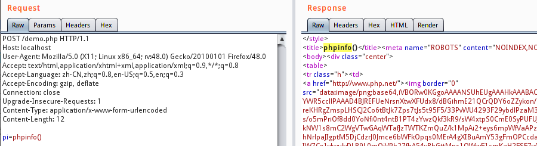

为了方便大家理解，笔者这里录制了debug程序的过程：

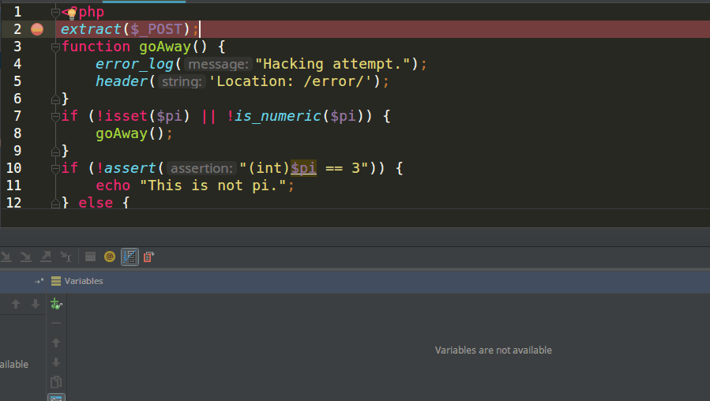

实际上，这种案例在真实环境下还不少。例如有些CMS通过检查是否存在install.lock文件，从而判断程序是否安装过。如果安装过，就直接将用户重定向到网站首页，却忘记直接退出程序，导致网站重装漏洞的发生。下面我们来看两个真实的案例。

## 实例分析

### FengCms 1.32 网站重装漏洞

本次实例分析，我们选取的是 **[FengCms 1.32](http://pan.baidu.com/s/1i33gNVR)** 。对于一个已经安装好的 **FengCms** ，当用户再次访问 **install/index.php** 时，就会导致网站重装。我们来具体看下程序的逻辑：

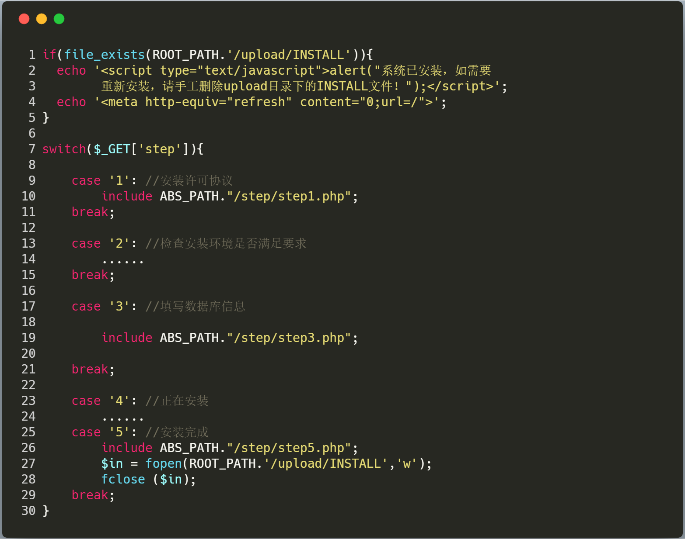

我们可以看到，如果是第一次安装网站，程序会在 **upload** 目录下生成一个 **INSTALL** 文件，用于表示该网站已经安装过(对应上图 **25-28行** 代码)。当我们再次访问该文件时，程序会先判断 **upload** 目录下是否有 **INSTALL** 文件。如果存在，则弹窗提示你先删除 **INSTALL** 文件才能进行网站重装(对应上图 **1-4行** 代码)。但是这里注意了，网站在弹出告警信息后，并没有退出，而是继续执行，所以我们在不删除 **INSTALL** 文件的情况下，仍可以重装网站。

比较有趣的是，原本网站网站成功后，程序会自动删除 **upload** 目录下的所有文件，来防止攻击者重装网站，然而这段代码却在注释当中，具体原因不得而知。

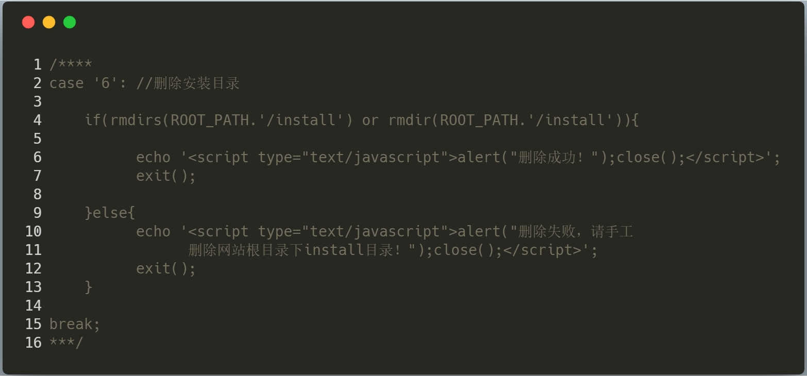

### Simple-Log1.6网站重装漏洞

我们再来看 **[Simple-Log1.6](http://down.admin5.com/php/42012.html#link)** 网站重装的例子。其 **install\index.php** 文件中，对网站安装成功的处理有问题，其代码是在下图 **17-20行** ，程序只是用 **header** 函数将其重定向到网站首页，然而程序还是会继续执行下去。

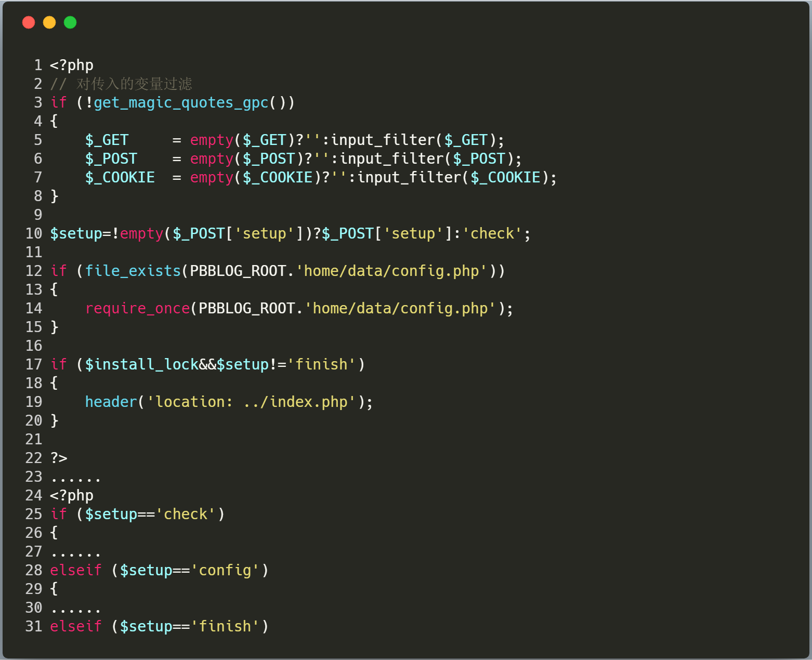

而且程序的安装逻辑其实是有问题的，安装步骤由 **$setup** 变量控制，而 **$setup** 变量可以被用户完全控制(如上图 **第10行** 代码)，攻击者完全可以控制网站的安装步骤。

## 漏洞利用

漏洞利用就极其简单了，我们先来看一下 **FengCms** ，我们直接访问 **install/index.php** 页面，无视弹出来的警告：

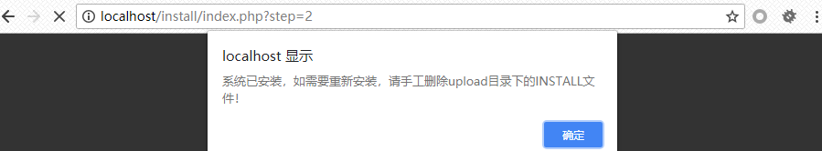

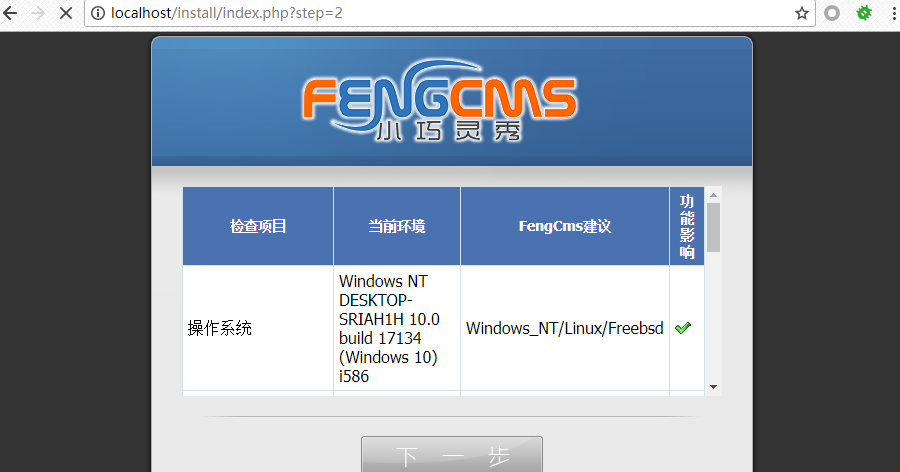

可以看到程序仍然可以继续安装。

我们再来看一下 **Simple-Log** 的重装利用：

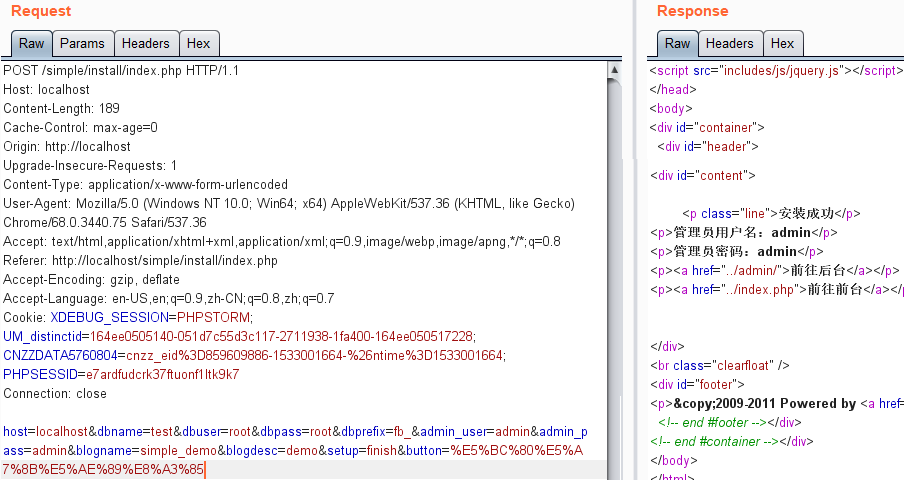

直接post以上数据，即可重装网站数据。

## 修复建议

实际上，要修复这一类型的漏洞，我们只要在正确的地方退出程序即可。拿这次的例题举例，我们只需要在检查到非法操作的时候，直接添加退出函数，即可避免漏洞发生。例如使用 **die** 、 **exit** 等函数都是可以的，具体修复代码如下：

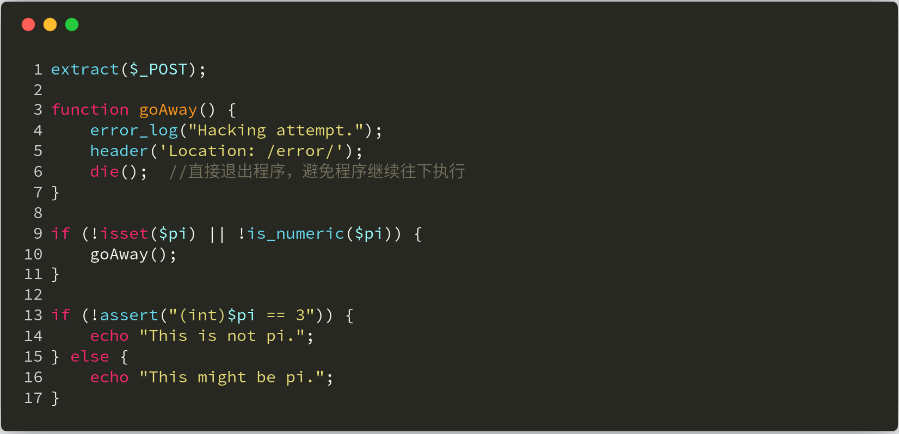

## 结语

看完了上述分析，不知道大家是否对 **未正确退出程序** 导致的攻击有了更加深入的理解，文中用到的 **CMS** 可以从这里( [**FengCms 1.32**](http://pan.baidu.com/s/1i33gNVR)  、 **[Simple-Log1.6](http://down.admin5.com/php/42012.html#link)** )下载，当然文中若有不当之处，还望各位斧正。如果你对我们的项目感兴趣，欢迎发送邮件到 **hongrisec@gmail.com** 联系我们。**Day10** 的分析文章就到这里，我们最后留了一道CTF题目给大家练手，题目如下：

```php
// index.php
<?php
include 'config.php';
function stophack($string){
    if(is_array($string)){
        foreach($string as $key => $val) {
            $string[$key] = stophack($val);
        }
    }
    else{
        $raw = $string;
        $replace = array("\\","\"","'","/","*","%5C","%22","%27","%2A","~","insert","update","delete","into","load_file","outfile","sleep",);
        $string = str_ireplace($replace, "HongRi", $string);
        $string = strip_tags($string);
        if($raw!=$string){
            error_log("Hacking attempt.");
            header('Location: /error/');
        }
        return trim($string);
    }
}
$conn = new mysqli($servername, $username, $password, $dbname);
if ($conn->connect_error) {
    die("连接失败: ");
}
if(isset($_GET['id']) && $_GET['id']){
    $id = stophack($_GET['id']);
    $sql = "SELECT * FROM students WHERE id=$id";
    $result = $conn->query($sql);
    if($result->num_rows > 0){
        $row = $result->fetch_assoc();
        echo '<center><h1>查询结果为：</h1><pre>'.<<<EOF
        +----+---------+--------------------+-------+
        | id | name    | email              | score |
        +----+---------+--------------------+-------+
        |  {$row['id']} | {$row['name']}   | {$row['email']}   |   {$row['score']} |
        +----+---------+--------------------+-------+</center>
EOF;
    }
}
else die("你所查询的对象id值不能为空！");
?>
```

```php
// config.php
<?php  
$servername = "localhost";
$username = "fire";
$password = "fire";
$dbname = "day10";
?>
```

```sql
# 搭建CTF环境使用的sql语句
create database day10;
use day10;
create table students (
id int(6) unsigned auto_increment primary key,
name varchar(20) not null,
email varchar(30) not null,
score int(8) unsigned not null );

INSERT INTO students VALUES(1,'Lucia','Lucia@hongri.com',100);
INSERT INTO students VALUES(2,'Danny','Danny@hongri.com',59);
INSERT INTO students VALUES(3,'Alina','Alina@hongri.com',66);
INSERT INTO students VALUES(4,'Jameson','Jameson@hongri.com',13);
INSERT INTO students VALUES(5,'Allie','Allie@hongri.com',88);

create table flag(flag varchar(30) not null);
INSERT INTO flag VALUES('HRCTF{tim3_blind_Sql}');
```

题解我们会阶段性放出，如果大家有什么好的解法，可以在文章底下留言，祝大家玩的愉快！