本文由红日安全成员： **licong** 编写，如有不当，还望斧正。

## 前言

大家好，我们是红日安全-代码审计小组。最近我们小组正在做一个PHP代码审计的项目，供大家学习交流，我们给这个项目起了一个名字叫 [**PHP-Audit-Labs**](https://github.com/hongriSec/PHP-Audit-Labs) 。现在大家所看到的系列文章，属于项目 **第一阶段** 的内容，本阶段的内容题目均来自 [PHP SECURITY CALENDAR 2017](https://www.ripstech.com/php-security-calendar-2017/) 。对于每一道题目，我们均给出对应的分析，并结合实际CMS进行解说。在文章的最后，我们还会留一道CTF题目，供大家练习，希望大家喜欢。下面是 **第11篇** 代码审计文章：

## Day 11 - Pumpkin Pie

题目如下：

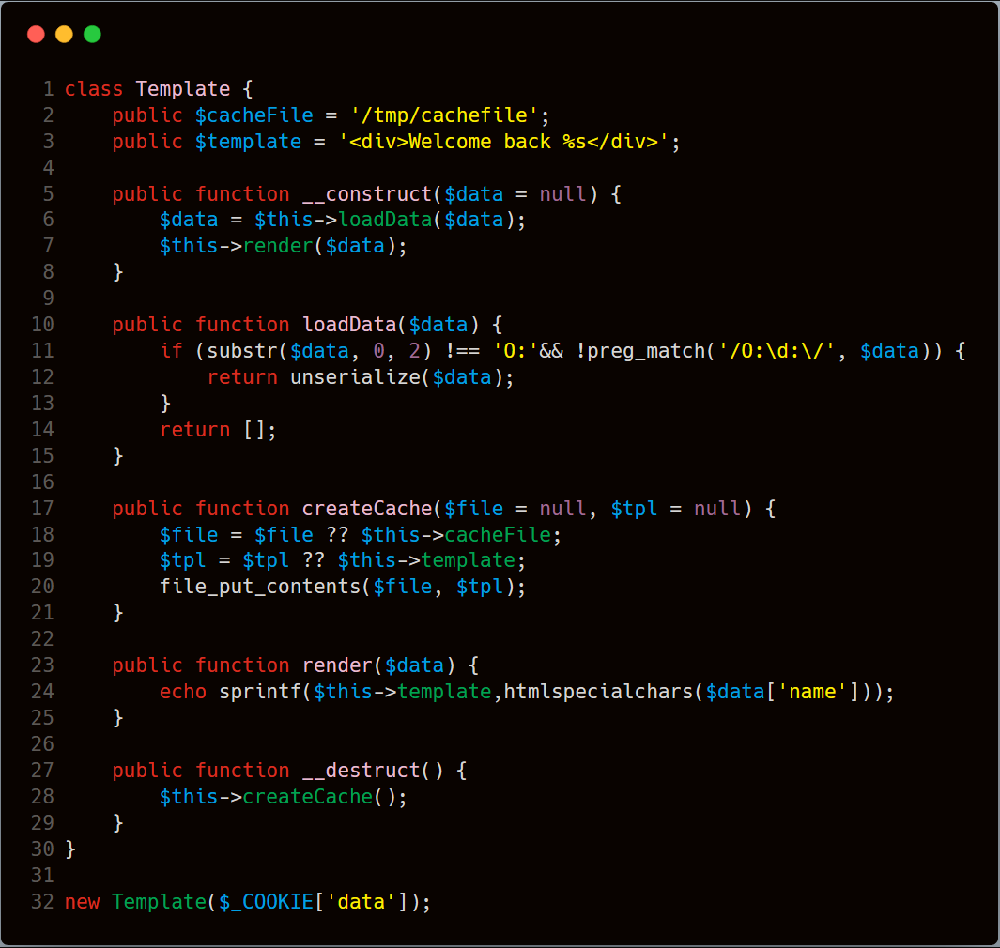

**漏洞解析：** (上图代码第11行正则表达式应改为：'/O:\d:/')

题目考察对php反序列化函数的利用。在第10行 **loadData()** 函数中，我们发现了 **unserialize** 函数对传入的 **$data** 变量进行了反序列。在反序列化前，对变量内容进行了判断，先不考虑绕过，跟踪一下变量，看看变量是否可控。在代码 **第6行** ，调用了 **loadData()** 函数，`$data`变量来自于 **__construct()** 构造函数传入的变量。代码第32行，对 **Template** 类进行了实例化，并将 **cookie** 中键为'data'数据作为初始化数据进行传入，`$data`数据我们可控。开始考虑绕过对传入数据的判断。

代码 **11行** ，第一个if，截取前两个字符，判断反序列化内容是否为对象，如果为对象，返回为空。php可反序列化类型有String,Integer,Boolean,Null,Array,Object。去除掉Object后，考虑采用数组中存储对象进行绕过。

第二个if判断,匹配 字符串为 \'O:任意十进制:',将对象放入数组进行反序列化后，仍然能够匹配到，返回为空，考虑一下如何绕过正则匹配，PHP反序列化处理部分源码如下：

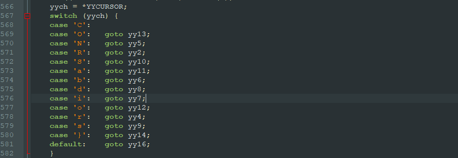

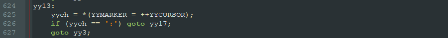

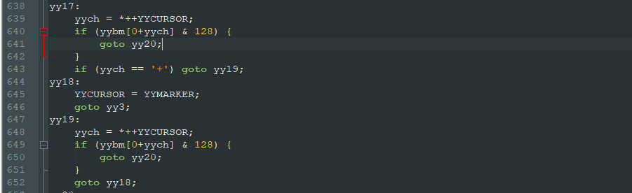

在PHP源码var_unserializer.c，对反序列化字符串进行处理，在代码568行对字符进行判断，并调用相应的函数进行处理，当字符为'O'时，调用 **yy13** 函数，在 **yy13** 函数中，对‘O‘字符的下一个字符进行判断，如果是':',则调用 **yy17** 函数,如果不是则调用 **yy3** 函数,直接return 0，结束反序列化。接着看 **yy17** 函数。通过观察yybm[]数组可知，第一个if判断是否为数字，如果为数字则跳转到 **yy20** 函数，第二个判断如果是'+'号则跳转到 **yy19** ，在 **yy19** 中，继续对 **+号** 后面的字符进行判断，如果为数字则跳转到 **yy20** ,如果不是则跳转到 **yy18** ， **y18** 最终跳转到 **yy3** ，退出反序列化流程。由此，在'O:',后面可以增加'+'，用来绕过正则判断。

绕过了过滤以后，接下来考虑怎样对反序列化进行利用，反序列化本质是将序列化的字符串还原成对应的类实例，在该过程中，我们可控的是序列化字符串的内容，也就是对应类中变量的值。我们无法直接调用类中的函数，但PHP在满足一定的条件下，会自动触发一些函数的调用，该类函数，我们称为魔术方法。通过可控的类变量，触发自动调用的魔术方法，以及魔术方法中存在的可利用点，进而形成反序列化漏洞的利用。

在代码31行，对象销毁时会调用 **createCache()** 函数，函数将 `$template` 中的内容放到了 `$cacheFile` 对应的文件中。 **file_put_contents()** 函数，当文件不存在时，会创建该文件。由此可构造一句话，写入当前路径。

 `$cacheFile` 和 `$template` 为类变量，反序列化可控，由此，构造以下反序列化内容，别忘了加'+'号

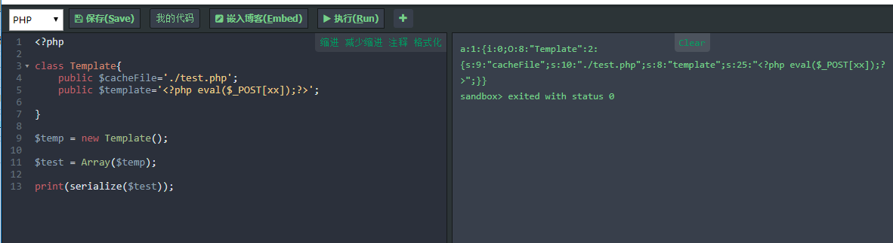

放入cookie需进行URL编码

```php
a:1:{i:0;O:+8:"Template":2:{s:9:"cacheFile";s:10:"./test.php";s:8:"template";s:25:"<?php eval($_POST[xx]);?>";}}
```

文件成功写入：

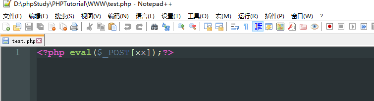

## 实例分析

本次实例分析，选取的是 **Typecho-1.1** 版本，在该版本中，用户可通过反序列化Cookie数据进行前台Getshell。该漏洞出现于 **install.php** 文件 **230行** ，具体代码如下：

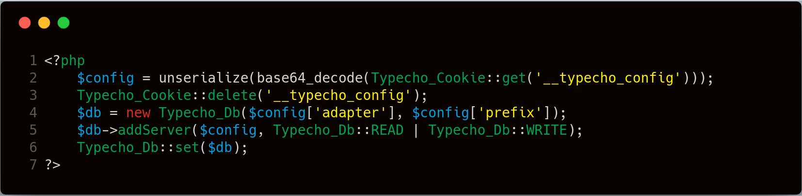

在上图代码 **第3行** ，对Cookie中的数据base64解码以后，进行了反序列化操作，该值可控，接下来看一下代码触发条件。文件几个关键判断如下：

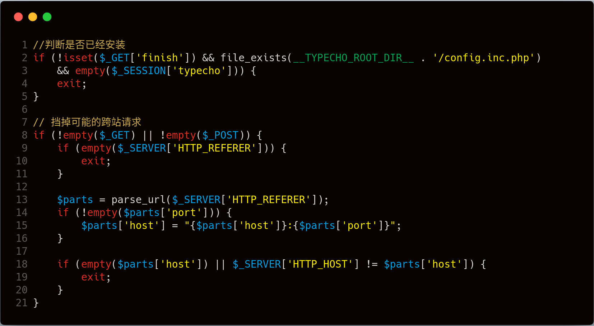

第一个if判断，可通过GET传递 **finish=任意值** 绕过 ，第二if判断是否有GET或者POST传参，并判断Referer是否为空，第四个if判断Referer是否为本站点。紧接着还有判断，如下图：

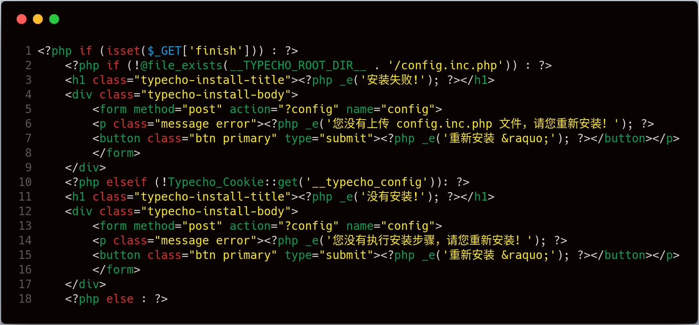

第一个if判断 **$_GET['finish']** 是否设置，然后判断 **config.inc.php文件** 是否存在，安装后已存在，第三个判断cookie中 **__typecho_config** 参数是否为空，不为空。进入else分支。综上，具体构造如下图：


```php
$config = unserialize(base64_decode(Typecho_Cookie::get('__typecho_config')));
Typecho_Cookie::delete('__typecho_config');
$db = new Typecho_Db($config['adapter'], $config['prefix']);
```

反序列化结果存储到 **$config** 变量中，然后将 **$config['adapter']** 和 **$config['prefix']** 作为 **Typecho_Db** 类的初始化变量创建类实例。我们可以在 **var/Typecho/Db.php** 文件中找到该类构造函数代码，具体如下：

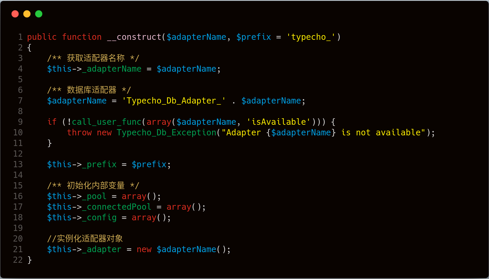

上图代码 **第6行** ，对传入的 **$adapterName** 变量进行了字符串拼接操作，对于PHP而言，如果 **$adapterName** 类型为对象，则会调用该类 **__toString()** 魔术方法。可作为反序列化的一个触发点，我们全局搜索一下 **__toString()** ，查看是否有可利用的点。实际搜索时，会发现有三个类都定义了 **__toString()** 方法：

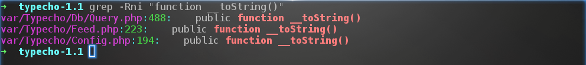

- 第一处 **var\Typecho\Config.php**：

  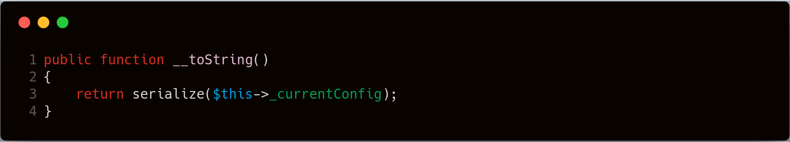

  调用 **serialize()** 函数进行序列化操作，会自动触发 **__sleep()** ，如果存在可利用的 **__sleep()** ，则可以进一步利用。

- 第二处 **var\Typecho\Db\Query.php**：
  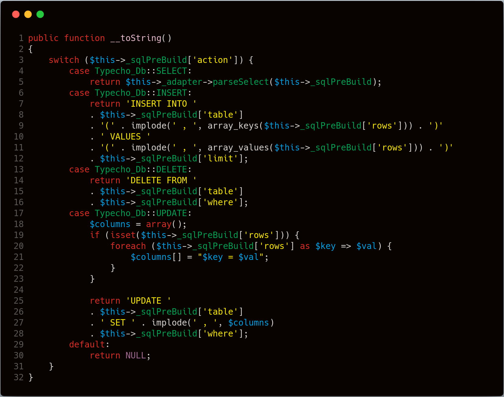

  该方法用于构建SQL语句，并没有执行数据库操作，所以暂无利用价值。

- 第三处**var\Typecho\Feed.php**：

  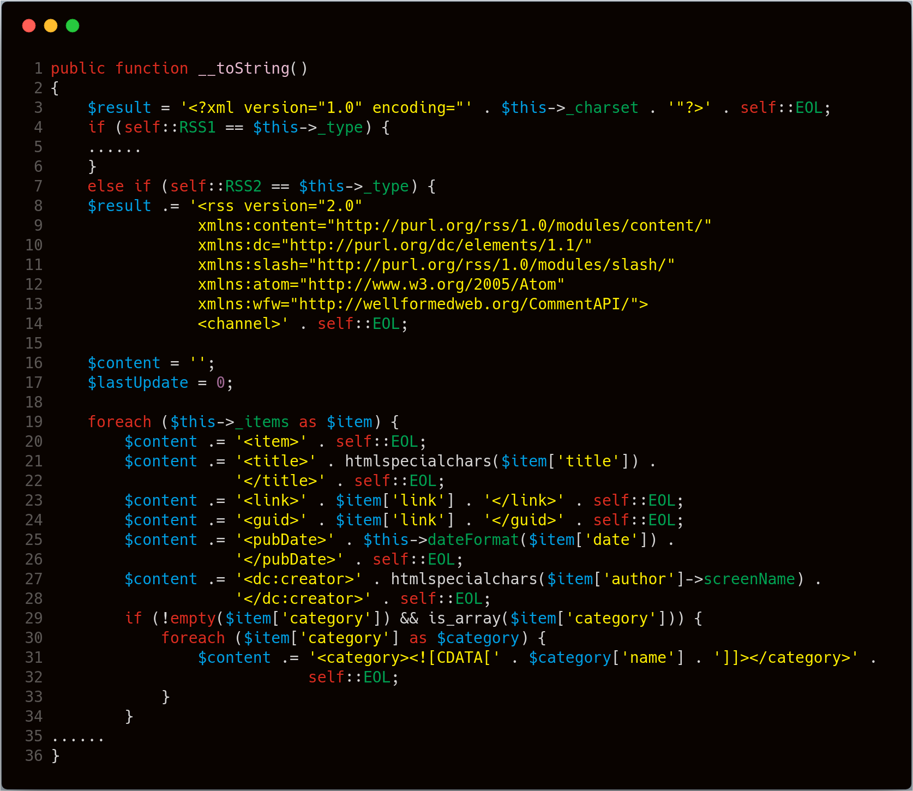

  在代码 **19行** ， **$this->_items** 为类变量，反序列化可控，在代码 **27行** ， **$item['author']->screenName** ，如果 **$item['author']** 中存储的类没有'screenName'属性或该属性为私有属性，此时会触发该类中的 **__get()** 魔法方法，这个可作为进一步利用的点，继续往下看代码，未发现有危险函数的调用。

记一波魔术方法及对应的触发条件，具体如下：

```php
__wakeup() //使用unserialize时触发
__sleep() //使用serialize时触发
__destruct() //对象被销毁时触发
__call() //在对象上下文中调用不可访问的方法时触发
__callStatic() //在静态上下文中调用不可访问的方法时触发
__get() //用于从不可访问的属性读取数据
__set() //用于将数据写入不可访问的属性
__isset() //在不可访问的属性上调用isset()或empty()触发
__unset() //在不可访问的属性上使用unset()时触发
__toString() //把类当作字符串使用时触发
__invoke() //当脚本尝试将对象调用为函数时触发
```

在 **var/Typecho/Request.php** 的  **Typecho_Request** 类中，我们发现 **__get()** 方法，跟踪该方法的调用，具体如下图：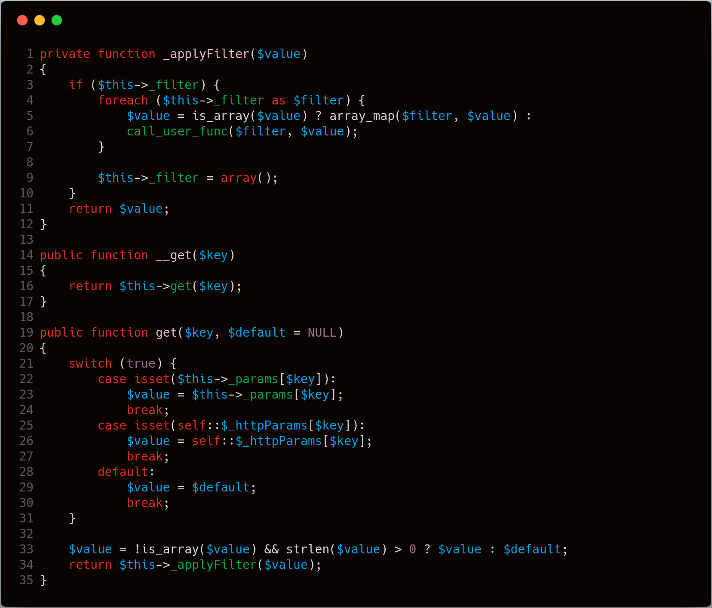

 **array_map()** 函数和 **call_user_func** 函数，都可以作为利用点，**$filter** 作为调用函数，**$value** 为函数参数，跟踪变量,看一下是否可控。这两个变量都来源于类变量，反序列化可控。从上面的分析中，可知当 **$item['author']** 满足一定条件会触发 **__get** 方法。

假设 **$item['author']** 中存储 **Typecho_Request** 类实例，此时调用 **$item['author']->screenName** ，在**Typecho_Request** 类中没有该属性，就会调用类中的 **__get($key)** 方法，**$key** 传入的值为 **scrrenName** 。参数传递过程如下：`$key='scrrenName'`=>`$this->_param[$key]`=>`$value`

我们将 **$this->_param['scrrenName']** 的值设置为想要执行的函数，构造 **$this->_filter** 为对应函数的参数值，具体构造如下：

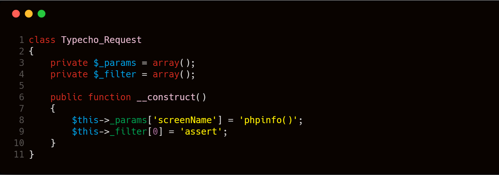

接下来我们去看一下 **Typecho_Feed** 类的构造，该类在 **var/Typecho/Feed.php** 文件中，代码如下：


上图代码 **第7行** ，满足 **self::RSS2** 与 **$this->_type** 相等进入该分支，所以 **$this->_type** 需要构造，**item['author']** 为触发点，需要构造 **$this_items** ，具体构造如下：

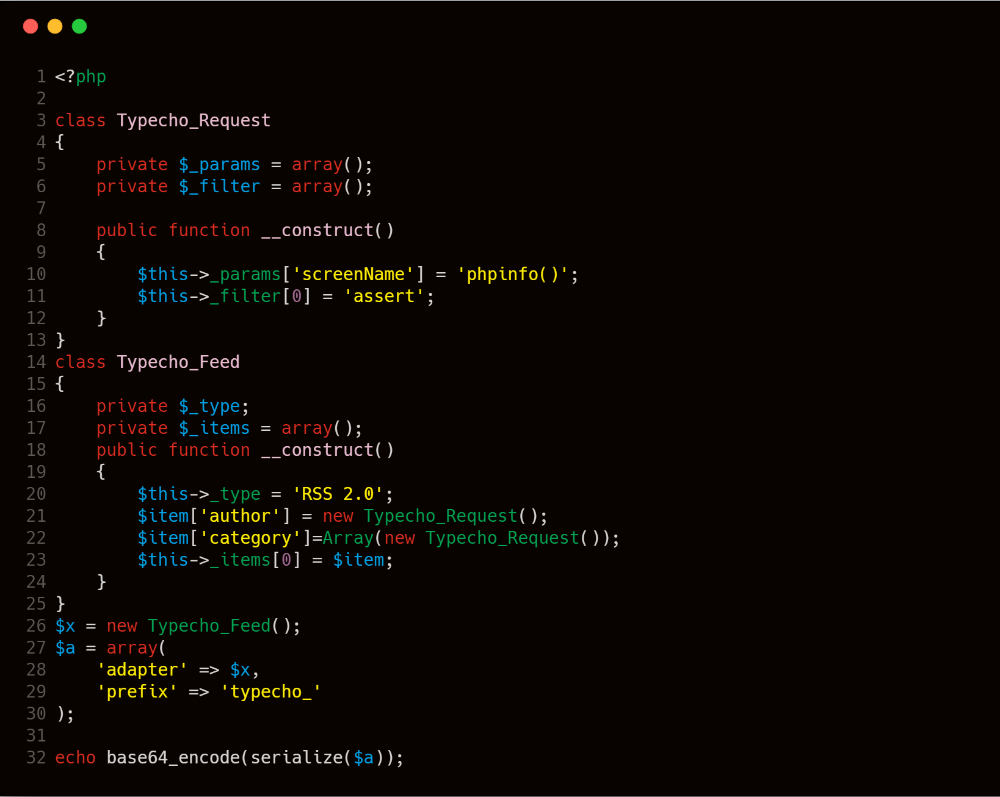

代码 **22行** 在实际利用没必要添加，install.php在代码 **54行** 调用 **ob_start()** 函数，该函数对输出内容进行缓冲,反序列化漏洞利用结束后，在**var\Typecho\Db.php**代码121行，触发异常，在 **var\Typecho\Common.php** 代码237行调用 **ob_end_clean()函数** 清除了缓冲区内容，导致无法看见执行结果，考虑在进入到异常处理前提前报错结束程序。由此构造该数据。执行结果如下： 

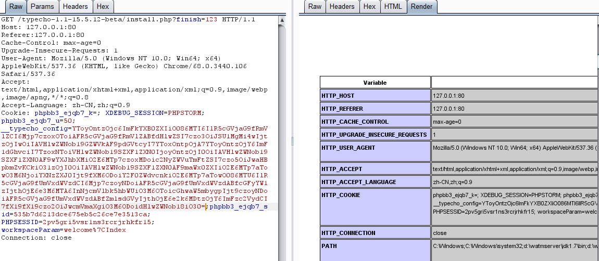

## 修复建议

造成该漏洞的原因主要有两点：

- 当 **config.inc.php** 文件存在的时，可绕过判断继续往下执行代码。
- 传入反序列化函数的参数可控

修复方法：在 **install.php** 文件第一行判断 **config.inc.php** 是否存在，如果存在，则退出代码执行。

```php
<?php 
if (file_exists(dirname(__FILE__) . '/config.inc.php'))
    exit('Access Denied');
?>
```

## 结语

看完了上述分析，不知道大家是否对反序列化利用有了一定的了解，文中用到的CMS可以从 [这里](https://github.com/typecho/typecho/archive/v1.1-15.5.12-beta.zip) 下载，当然文中若有不当之处，还望各位斧正。如果你对我们的项目感兴趣，欢迎发送邮件到 hongrisec@gmail.com 联系我们。**Day11** 的分析文章就到这里，我们最后留了一道CTF题目给大家练手，题目如下：

```php
<?php
include "config.php";

class HITCON{
    public $method;
    public $args;
    public $conn;

    function __construct($method, $args) {
        $this->method = $method;
        $this->args = $args;
        $this->__conn();
    }

    function __conn() {
        global $db_host, $db_name, $db_user, $db_pass, $DEBUG;
        if (!$this->conn)
            $this->conn = mysql_connect($db_host, $db_user, $db_pass);
        mysql_select_db($db_name, $this->conn);
        if ($DEBUG) {
            $sql = "DROP TABLE IF  EXISTS  users";
            $this->__query($sql, $back=false);
            $sql = "CREATE TABLE IF NOT EXISTS users (username VARCHAR(64),
            password VARCHAR(64),role VARCHAR(256)) CHARACTER SET utf8";

            $this->__query($sql, $back=false);
            $sql = "INSERT INTO users VALUES ('orange', '$db_pass', 'admin'), ('phddaa', 'ddaa', 'user')";
            $this->__query($sql, $back=false);
        }
        mysql_query("SET names utf8");
        mysql_query("SET sql_mode = 'strict_all_tables'");
    }

    function __query($sql, $back=true) {
        $result = @mysql_query($sql);
        if ($back) {
            return @mysql_fetch_object($result);
        }
    }
  
    function login() {
        list($username, $password) = func_get_args();
        $sql = sprintf("SELECT * FROM users WHERE username='%s' AND password='%s'", $username, md5($password));
        $obj = $this->__query($sql);

        if ( $obj != false ) {
            define('IN_FLAG', TRUE);
            $this->loadData($obj->role);
        }
        else {
          $this->__die("sorry!");
        }
    }

    function loadData($data) {
        if (substr($data, 0, 2) !== 'O:' && !preg_match('/O:\d:/', $data)) {
            return unserialize($data);
        }
        return [];
    }
  
    function __die($msg) {
        $this->__close();
        header("Content-Type: application/json");
        die( json_encode( array("msg"=> $msg) ) );
    }

    function __close() {
        mysql_close($this->conn);
    }

    function source() {
        highlight_file(__FILE__);
    }

    function __destruct() {
        $this->__conn();
        if (in_array($this->method, array("login", "source"))) {
            @call_user_func_array(array($this, $this->method), $this->args);
        }
        else {
            $this->__die("What do you do?");
        }
        $this->__close();
    }

    function __wakeup() {
        foreach($this->args as $k => $v) {
            $this->args[$k] = strtolower(trim(mysql_escape_string($v)));
        }
    }
}
class SoFun{
    public $file='index.php';

    function __destruct(){
        if(!empty($this->file)) {
            include $this->file;
        }
    }
    function __wakeup(){
    	$this-> file='index.php';
    }
}
if(isset($_GET["data"])) {
    @unserialize($_GET["data"]);
}
else {
    new HITCON("source", array());
}

?>
```

```php
//config.php
<?php
    $db_host = 'localhost';
    $db_name = 'test';
    $db_user = 'root';
    $db_pass = '123';
	$DEBUG = 'xx';
?>
```

```php
// flag.php
<?php
!defined('IN_FLAG') && exit('Access Denied');
echo "flag{un3eri@liz3_i3_s0_fun}";

?>
```

