本文由红日安全成员： **l1nk3r** 编写，如有不当，还望斧正。

## 前言

大家好，我们是红日安全-代码审计小组。最近我们小组正在做一个PHP代码审计的项目，供大家学习交流，我们给这个项目起了一个名字叫 [**PHP-Audit-Labs**](https://github.com/hongriSec/PHP-Audit-Labs) 。现在大家所看到的系列文章，属于项目 **第一阶段** 的内容，本阶段的内容题目均来自 [PHP SECURITY CALENDAR 2017](https://www.ripstech.com/php-security-calendar-2017/) 。对于每一道题目，我们均给出对应的分析，并结合实际CMS进行解说。在文章的最后，我们还会留一道CTF题目，供大家练习，希望大家喜欢。下面是 **第12篇** 代码审计文章：

## Day 12 - String Lights

题目代码如下：

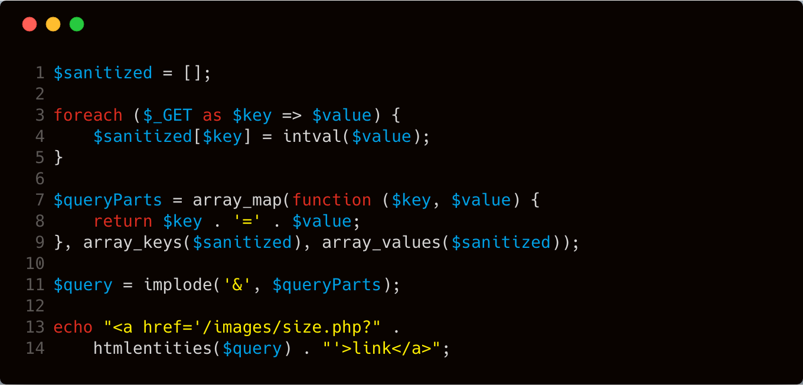

**漏洞解析** ：

根据题目意思，这里考察的应该是个 **xss漏洞** ， 漏洞触发点应该在代码中的 **第13-14行** 。这两行代码的作用是直接输出一个html的 `<a>` 标签。代码中的 **第3-5行** ，**foreach循环** 对 **$_GET** 传入的参数进行了处理，但是这里有个问题。我们看下 **第四行** 的代码，这行代码针对 **$value** 进行类型转换，强制变成int类型。但是这部分代码只处理了 **$value** 变量，没针对 **$key** 变量进行处理。经过了 **第3-5行** 的代码处理之后，根据 **&** 这个符号进行分割，然后拼接到 **第13行** 的 **echo** 语句中，在输出的时候又进行了一次 **htmlentities** 函数处理。 **htmlentities** 函数主要是会对一些特殊符号进行HTML实体编码。具体定义如下：

> [htmlentities](http://php.net/manual/zh/function.htmlentities.php) — 将字符转换为 HTML 转义字符
>
> ```php
> string htmlentities ( string $string [, int $flags = ENT_COMPAT | ENT_HTML401 [, string $encoding = ini_get("default_charset") [, bool $double_encode = true ]]] )
> ```
>
> 作用：在写PHP代码时，不能在字符串中直接写实体字符，PHP提供了一个将HTML特殊字符转换成实体字符的函数 htmlentities()。

注：**htmlentities()** 并不能转换所有的特殊字符，是转换除了空格之外的特殊字符，且单引号和双引号需要单独控制（通过第二个参数）。第2个参数取值有3种，分别如下：

- ENT_COMPAT（默认值）：只转换双引号。
- ENT_QUOTES：两种引号都转换。
- ENT_NOQUOTES：两种引号都不转换。

这里附上一个 [HTML 中有用的字符实体表](http://www.w3school.com.cn/html/html_entities.asp) 

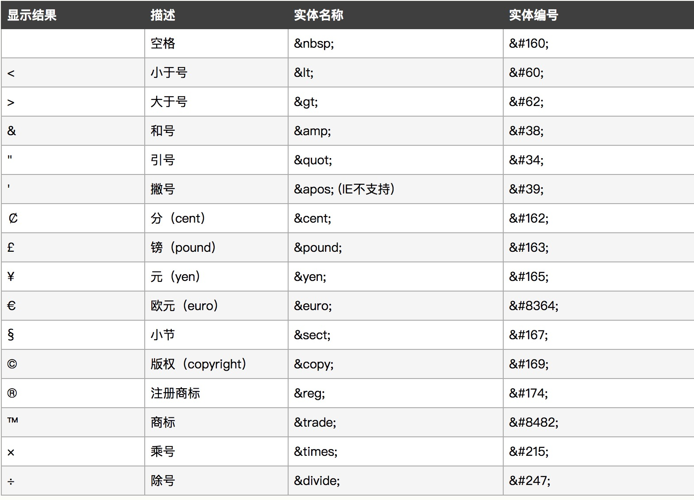

经过上面的分析，我们再回到题目，想想如何构造一下攻击 **payload** 。我们先梳理一些已知信息：

- 这里的 **$query** 参数可控
- 且 **htmlentities** 函数在这里可逃逸单引号
- xss的漏洞触发点在 `<a>` 标签。

在 `<a>` 中，我们可以通过 **javascript** 事件来执行js代码，例如： **onclick** 这类事件，因此最后的poc构造如下：

```
/?a'onclick%3dalert(1)%2f%2f=c
```

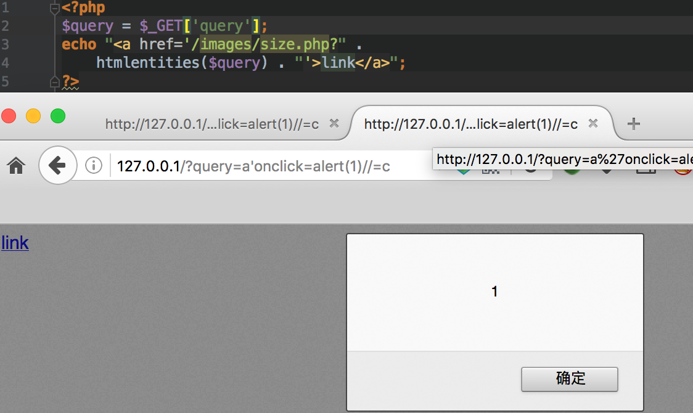

## 实例分析

本次实例分析选择 [DM企业建站系统 v201710](http://sqdownb.onlinedown.net/down/1510917608_44072_ym.rar) 中的 **sql注入漏洞** 来进行分析。首先，我们可以从cnvd上面看到一些相关信息，如下：

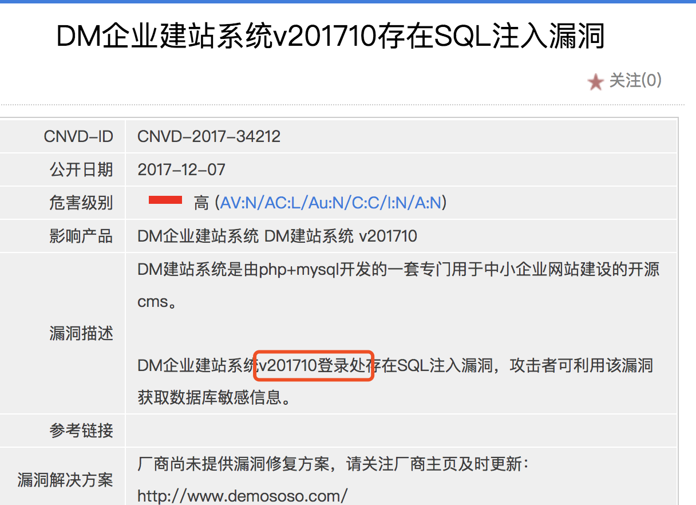

从漏洞通告中可以发现一些有用的信息，漏洞位置在登陆处，搭建的时候提示后台登陆口位置在 **admindm-yourname/g.php** 文件中，打开这个文件，发现重定向到 **admindm-yournamemod_common/login.php** 文件中，所以漏洞触发点应该就在这个文件中。

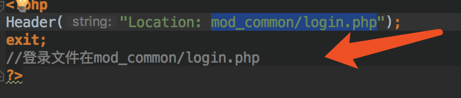

打开 **admindm-yournamemod_common/login.php** 这个文件，一眼就看到漏洞位置，截取部分相关代码如下：

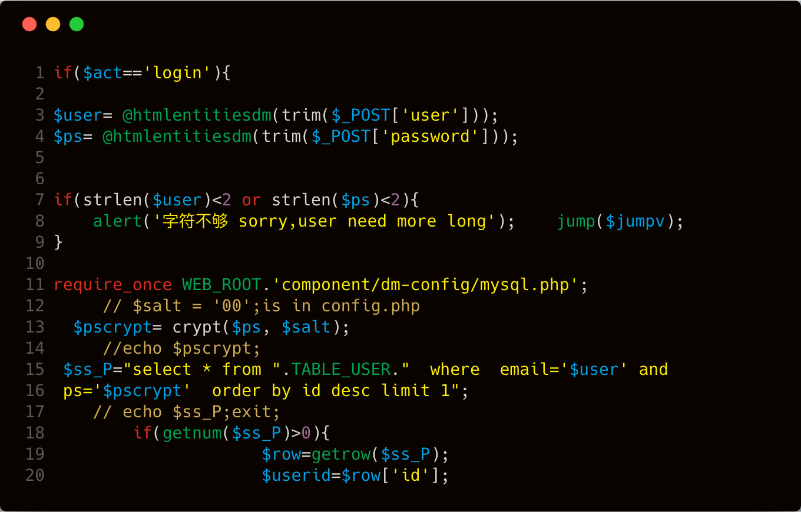

 **第15行** 很明显存在sql注入漏洞，通过拼接的方式直接插入到select语句中。 **第15行** 中的 **$user** 变量是通过 **POST** 方式提交上来，其值可控。但是上图的 **第3行** 代码调用 **htmlentitiesdm** 函数，对 **POST** 数据进行了处理，我们跟进这个 **htmlentitiesdm** 函数。该函数位置在 **component/dm-config/global.common.php** 文件中，截取关键代码如下：

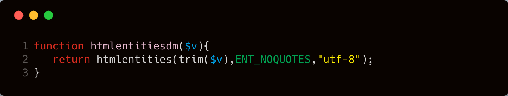

这个函数是调用 **htmlentities** 函数针对输入的数据进行处理。前面我们已经介绍过了这个函数的用法，这里这个函数的可选参数是 **ENT_NOQUOTES** ，也就是说两种引号都不转换。下面我们来看个小例子：

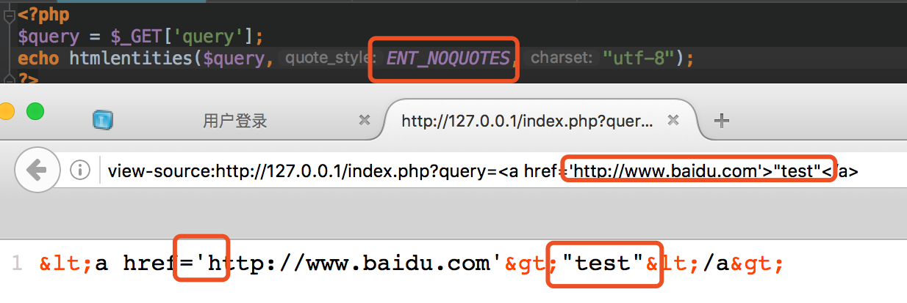

这里我猜测开发者应该是考虑到了xss的问题，但是由于 **htmlentities** 这个函数选择的参数出现了偏差，导致这里我们可以引入单引号造成注入的问题。

我们看看最新版是怎么修复，使用 **beyond compare** 对比两个版本代码的差别。

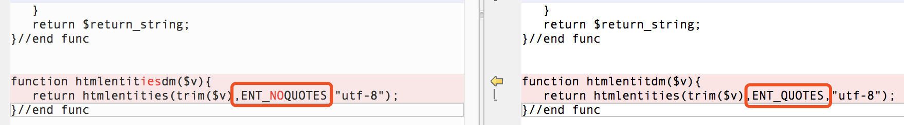

新版修复的时候将可选参数修改为 **ENT_QUOTES** ，这个参数的作用就是过滤单引号加双引号，我们来看看下面这个例子，就很容易明白了这个参数的作用了。

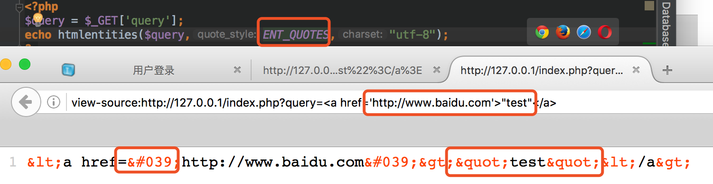

## 漏洞验证

这里因为没有回显，所以是盲注，下面是验证截图：

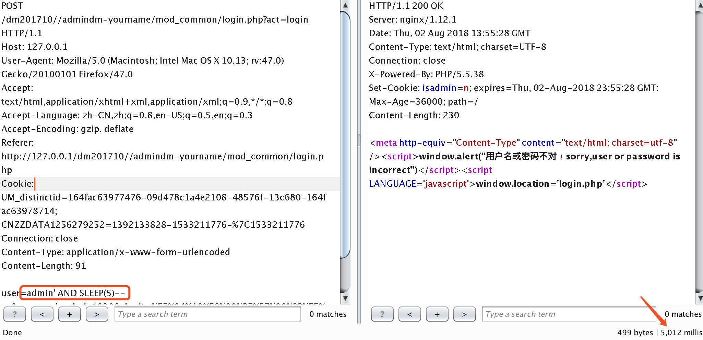

## 漏洞修复

针对 **htmlentities** 这个函数，我们建议大家在使用的时候，尽量加上可选参数，并且选择 **ENT_QUOTES** 参数。

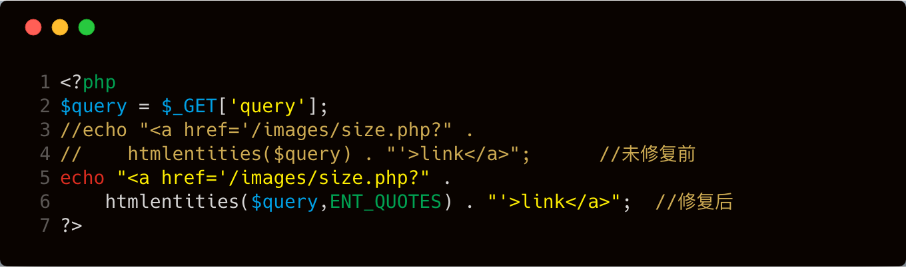

我们看看对比的效果

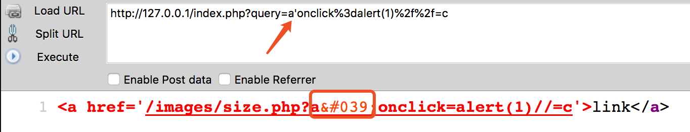

## 结语

看完了上述分析，不知道大家是否对 **htmlentities** 函数在使用过程中可能产生的问题，有了更加深入的理解，文中用到的代码可以从 [这里](http://sqdownb.onlinedown.net/down/1510917608_44072_ym.rar) 下载，当然文中若有不当之处，还望各位斧正。如果你对我们的项目感兴趣，欢迎发送邮件到 **hongrisec@gmail.com** 联系我们。**Day12** 的分析文章就到这里，我们最后留了一道CTF题目给大家练手，题目如下：

```php
<?php
require 'db.inc.php';

if(isset($_REQUEST['username'])){
    if(preg_match("/(?:\w*)\W*?[a-z].*(R|ELECT|OIN|NTO|HERE|NION)/i", $_REQUEST['username'])){
        die("Attack detected!!!");
    }
}

if(isset($_REQUEST['password'])){
    if(preg_match("/(?:\w*)\W*?[a-z].*(R|ELECT|OIN|NTO|HERE|NION)/i", $_REQUEST['password'])){
        die("Attack detected!!!");
    }
}

function clean($str){
    if(get_magic_quotes_gpc()){
        $str=stripslashes($str);
    }
    return htmlentities($str, ENT_QUOTES);
}

$username = @clean((string)$_GET['username']);
$password = @clean((string)$_GET['password']);


$query='SELECT * FROM ctf.users WHERE name=\''.$username.'\' AND pass=\''.$password.'\';';

#echo $query;

$result=mysql_query($query);
while($row = mysql_fetch_array($result))
{
    echo "<tr>";
    echo "<td>" . $row['name'] . "</td>";
    echo "</tr>";
}

?>
```

```php
<?php
$mysql_server_name="localhost";
$mysql_database="Day12";    /** 数据库的名称 */
$mysql_username="Hongri";  /** MySQL数据库用户名 */
$mysql_password="Hongri";  /** MySQL数据库密码 */
$conn = mysql_connect($mysql_server_name, $mysql_username,$mysql_password,'utf-8');
?>
```

```sql
# Host: localhost  (Version: 5.5.53)
# Date: 2018-08-05 12:55:29
# Generator: MySQL-Front 5.3  (Build 4.234)

/*!40101 SET NAMES utf8 */;

#
# Structure for table "users"
#

DROP TABLE IF EXISTS `users`;
CREATE TABLE `users` (
  `Id` int(11) NOT NULL AUTO_INCREMENT,
  `name` varchar(255) DEFAULT NULL,
  `pass` varchar(255) DEFAULT NULL,
  `flag` varchar(255) DEFAULT NULL,
  PRIMARY KEY (`Id`)
) ENGINE=MyISAM AUTO_INCREMENT=2 DEFAULT CHARSET=utf8;

#
# Data for table "users"
#

/*!40000 ALTER TABLE `users` DISABLE KEYS */;
INSERT INTO `users` VALUES (1,'admin','qwer!@#zxca','hrctf{sql_Inject1on_Is_1nterEst1ng}');
/*!40000 ALTER TABLE `users` ENABLE KEYS */;
```

题解我们会阶段性放出，如果大家有什么好的解法，可以在文章底下留言，祝大家玩的愉快！

## 参考文章

[Code-Audit-Challenges](https://github.com/CHYbeta/Code-Audit-Challenges/blob/master/php/challenge-50.md)
