本文由红日安全成员： **l1nk3r** 编写，如有不当，还望斧正。

## 前言

大家好，我们是红日安全-代码审计小组。最近我们小组正在做一个PHP代码审计的项目，供大家学习交流，我们给这个项目起了一个名字叫 [**PHP-Audit-Labs**](https://github.com/hongriSec/PHP-Audit-Labs) 。现在大家所看到的系列文章，属于项目 **第一阶段** 的内容，本阶段的内容题目均来自 [PHP SECURITY CALENDAR 2017](https://www.ripstech.com/php-security-calendar-2017/) 。对于每一道题目，我们均给出对应的分析，并结合实际CMS进行解说。在文章的最后，我们还会留一道CTF题目，供大家练习，希望大家喜欢。下面是 **第13篇** 代码审计文章：

## Day 13 - Turkey Baster

代码如下：

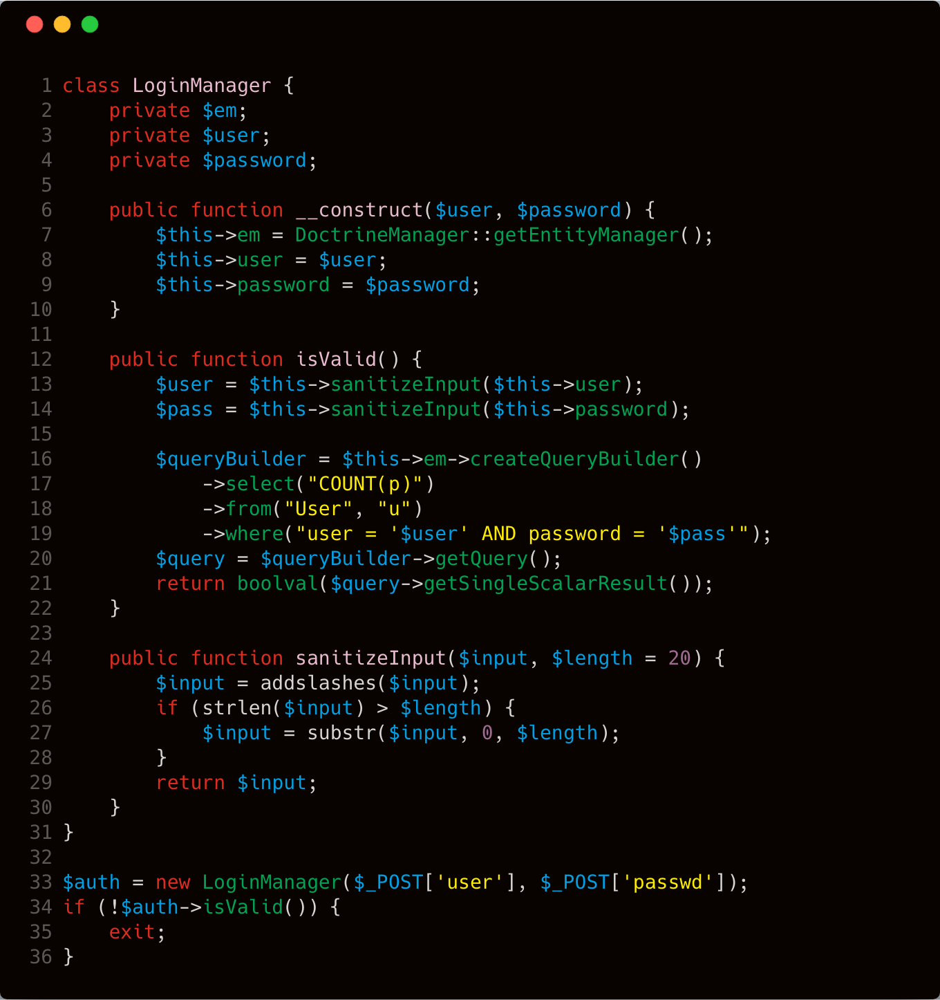

这是一道典型的用户登录程序，从代码来看，考察的应该是通过 **SQL注入** 绕过登陆验证。代码 **第33行** ，通过 **POST** 方式传入 **user** 和 **passwd** 两个参数，通过 **isValid()** 来判断登陆是否合法。我们跟进一下 **isValid()** 这个函数，该函数主要功能代码在 **第12行-第22行** ，我们看到 **13行** 和 **14行** 调用 **sanitizeInput()** 针对 **user** 和 **password** 进行相关处理。

跟进一下 **sanitizeInput()** ，主要功能代码在 **第24行-第29行** ，这里针对输入的数据调用 **addslashes** 函数进行处理，然后再针对处理后的内容进行长度的判断，如果长度大于20，就只截取前20个字符。 **addslashes** 函数定义如下：

> [addslashes](http://php.net/manual/zh/function.addslashes.php) — 使用反斜线引用字符串
>
> ```php
> string addslashes ( string $str )
> ```
>
> 作用：在单引号（'）、双引号（"）、反斜线（\）与 NUL（ **NULL** 字符）字符之前加上反斜线。

我们来看个例子：


那这题已经过滤了单引号，正常情况下是没有注入了，那为什么还能导致注入了，原因实际上出在了 **substr** 函数，我们先看这个函数的定义：

> [substr](http://php.net/manual/zh/function.substr.php) — 返回字符串的子串
>
> ```php
> string substr ( string $string , int $start [, int $length ] )
> ```
>
> 作用：返回字符串 `string` 由 `start` 和 `length` 参数指定的子字符串。 

我们来看个例子：

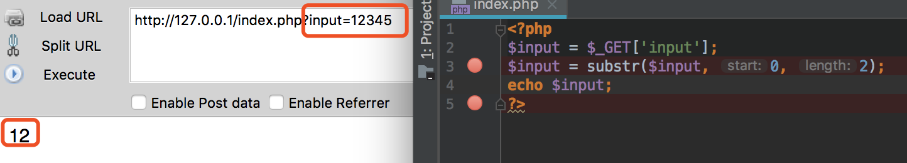

那么再回到这里，我们知道反斜杠可以取消特殊字符的用法，而注入想要通过单引号闭合，在这道题里势必会引入反斜杠。所以我们能否在反斜杠与单引号之间截断掉，只留一个反斜杠呢？答案是可以，我们看个以下这个例子。

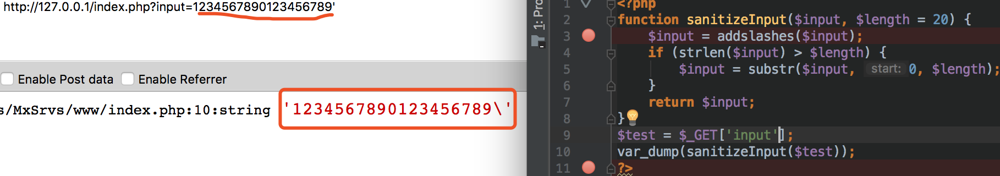

在这个例子中，我们直接使用题目代码中的过滤代码，并且成功在反斜杠和单引号之间截断了，那我们把这个payload带入到题目代码中，拼接一下 **第17行-第19行** 代码中的sql语句。

```php
select count(p) from user u where user = '1234567890123456789\' AND password = '$pass'
```

这里的sql语句由于反斜杠的原因， **user = '1234567890123456789\\'** 最后这个单引号便失去了它的作用。这里我们让 **pass=or 1=1#** ，那么最后的sql语句如下：

```php
select count(p) from user where user = '1234567890123456789\' AND password = 'or 1=1#'
```

这时候在此SQL语句中， **user** 值为 **1234567890123456789\\' AND password =**  ，因此我们可以保证带入数据库执行的结果为 **True** ，然后就能够顺利地通过验证。

所以这题最后的 **payload** 如下所示：

```php
user=1234567890123456789'&passwd=or 1=1#
```

## 实例分析

这里的实例分析，我们选择 **苹果CMS视频分享程序 8.0** 进行相关漏洞分析。漏洞的位置是在 **inc\common\template.php** ，我们先看看相关代码：

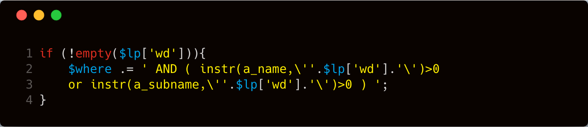

这里代码的 **第三行-第四行** 位置， **$lp['wd']** 变量位置存在字符串拼接，很明显存在 **sql注入** ，但是这个cms具有一些通用的注入防护，所以我们从头开始一步步的看。

首先在 **inc\module\vod.php** 文件中的，我们看到 **第一行** 代码当 **$method=search** 成立的时候，进入了 **第3行** 中的 **be("all", "wd")** 获取请求中 **wd** 参数的值，并且使用 **chkSql()** 函数针对 **wd** 参数的值进行处理。部分关键代码如下所示：

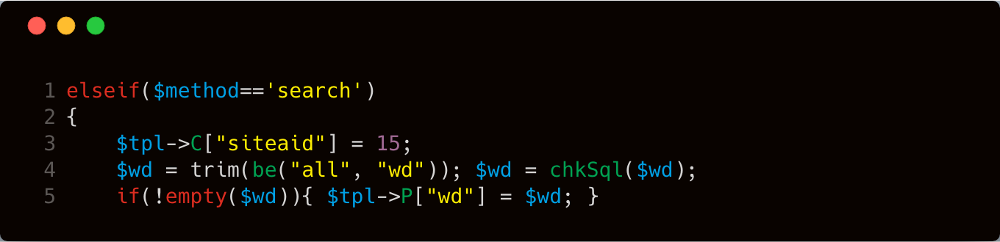

跟进一下 **be()** 函数，其位置在 **inc\common\function.php** 文件中，关键代码如下：

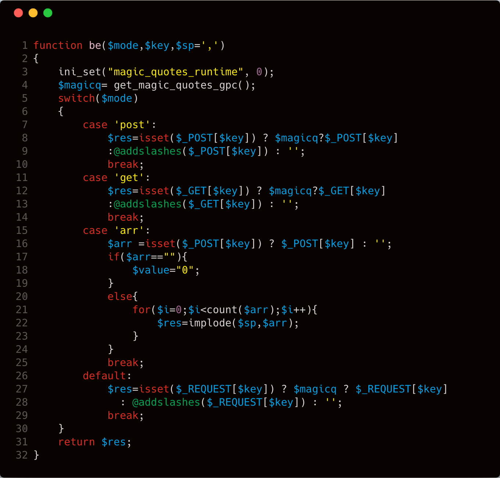

这部分代码的作用就是对 **GET，POST，REQUEST** 接收到的参数进行 **addslashes** 的转义处理。根据前面针对 **be("all", "wd")** 的分析，我们知道 **wd** 参数的值是通过 **REQUEST** 方式接收，并使用 **addslashes** 函数进行转义处理。再回到 **inc\module\vod.php** 文件中的，我们跟进一下 **chkSql()** 函数，该函数位置在 **inc\common\360_safe3.php** 文件中，具体代码如下：

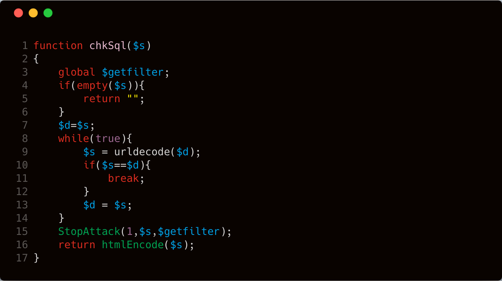

分析一下这部分代码的作用，其实就是在 **第8行-第12行** 针对接收到的的变量进行循环的 **urldecode** （也就是url解码）动作，然后在 **第15行** ，使用 **StopAttack** 函数解码后的数据进行处理，最后将处理后的数据通过 **htmlEncode** 方法进行最后的处理，然后返回处理之后的值。

我们先跟进一下 **StopAttack** 函数，该函数位置在 **inc\common\360_safe3.php** 文件中，我们截取部分相关代码如下：

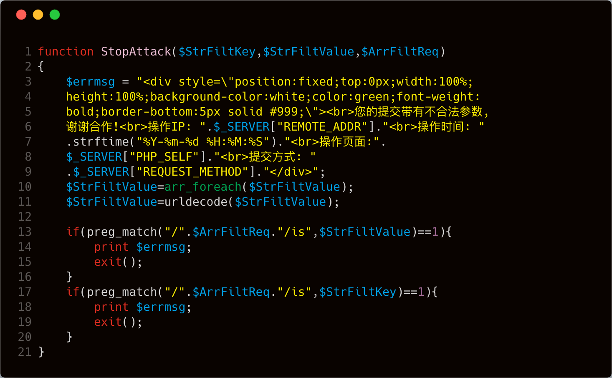

我们看到代码的 **第13行-第19行** 调用正则进行处理，而相关的正则表达式是 **$ArrFiltReq** 变量。这里 **第13行** 的 **$ArrFiltReq** 变量就是前面传入的 **$getfilter** ，即语句变成：

```php
preg_match("/".$getfilter."/is",1)
```

我们跟进一下 **$getfilter** 变量。该变量在 **inc\common\360_safe3.php** 文件中，我们截取部分相关代码如下：

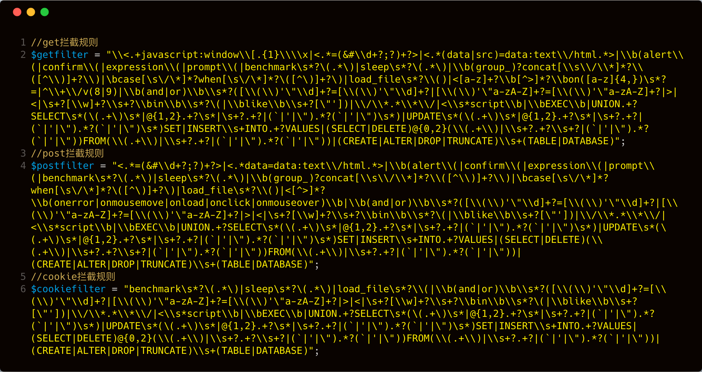

这串代码的功能显而易见，就是检测 **GET，POST，COOKIE** 中的恶意数据。刚刚在 **chkSql()** 函数最后有串代码是： **return htmlEncode($s);** ，我们跟进一下 **htmlEncode** 函数。该函数位置在 **inc\common\function.php** 文件中，相关代码如下：

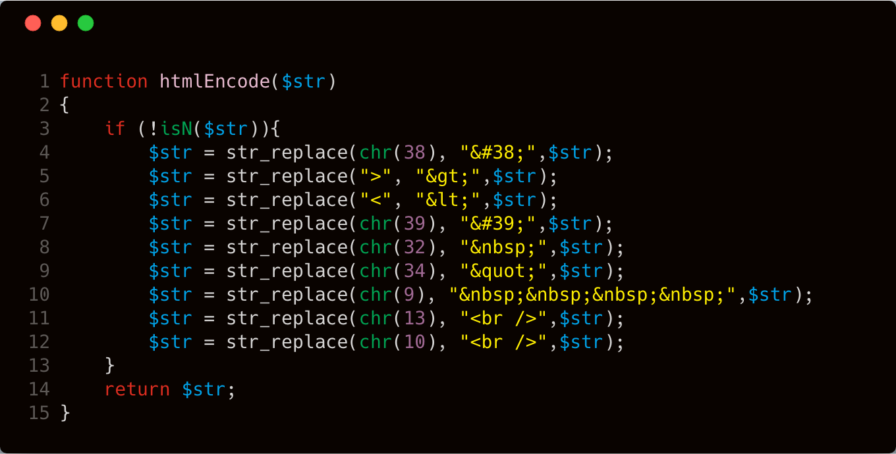

这段代码的功能是针对 **&** 、 **'** 、 **空格** 、 **"** 、 **TAB** 、 **回车** 、 **换行** 、 **大于小于号** 等符号进行实体编码转换。但是这里百密一疏，没有针对其他的空白字符和反斜杠进行处理。这里先埋下一个伏笔，我们继续往下看。

首先注入点是在 **inc\common\template.php** ，相关代码如下：


我们继续看看这个 **$lp['wd']** 的值是怎么获取的，在 **inc\common\template.php** 文件中找到其相关代码：

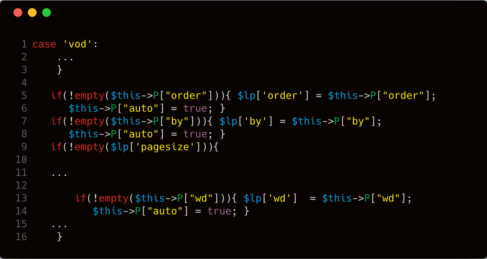

上图 **第13行** ，当 **P['wd']** 不为空的时候， **$lp['wd']** 是从 **P["wd"]** 中获取到数据的。根据前面我们的分析，在 **inc\module\vod.php** 文件中的存在这样一行代码： **$tpl->P["wd"] = \$wd;** 


而 **wd** 是可以从 **REQUEST** 中获取到，所以这里的 **wd** 实际上是可控的。

## 漏洞验证

现在我们需要针对漏洞进行验证工作，这就涉及到POC的构造。在前面分析中，我们知道 **htmlEncode** 针对 **&** 、 **'** 、 **空格** 、 **"** 、 **TAB** 、 **回车** 、 **换行** 、 **大于小于号** 进行实体编码转换。但是这里的注入类型是字符型注入，需要引入单引号来进行闭合，但是 **htmlEncode** 函数又对单引号进行了处理。因此我们可以换个思路。

我们看到注入攻击的时候，我们的 **$lp['wd']** 参数可以控制SQL语句中的两个位置，因此这里我们可以通过引入 **反斜杠** 进行单引号的闭合，但是针对前面的分析我们知道其调用了 **addslashes** 函数进行转义处理，而 **addslashes** 会对 **反斜杠** 进行处理，但是这里对用户请求的参数又会先进行 **url解码** 的操作，因此这里可以使用 **双url编码** 绕过 **addslashes** 函数。


```http
POST /maccms8/index.php?m=vod-search HTTP/1.1
Host: 127.0.0.1
User-Agent: Mozilla/5.0 (Windows NT 10.0; WOW64; rv:56.0) Gecko/20100101 Firefox/56.0
Accept: text/html,application/xhtml+xml,application/xml;q=0.9,*/*;q=0.8
Accept-Language: zh-CN,zh;q=0.8,en-US;q=0.5,en;q=0.3
Accept-Encoding: gzip, deflate
Content-Type: application/x-www-form-urlencoded
Content-Length: 98
Connection: keep-alive
Upgrade-Insecure-Requests: 1

wd=))||if((select%0b(select(m_name)``from(mac_manager))regexp(0x5e61)),(`sleep`(3)),0)#%25%35%63
```

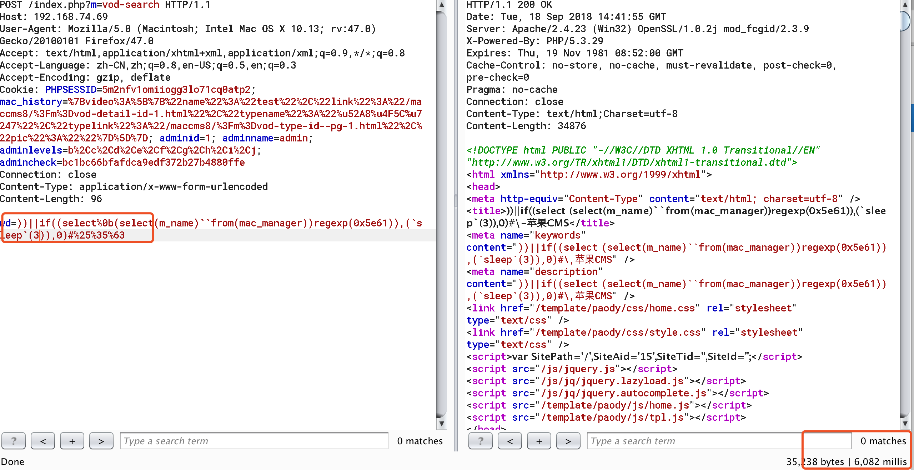

payload传到程序里，经过拼接后的数据库语句如下所示：

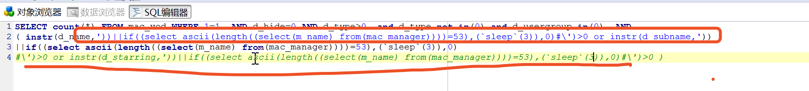

## 漏洞修复

这里的防御手段其实已经很多了，但就是因为这么多防御手段结合在一起出现了有趣的绕过方式。

```php
function htmlEncode($str)
{
	if (!isN($str)){
		$str = str_replace(chr(38), "&#38;",$str);
		$str = str_replace(">", "&gt;",$str);
		$str = str_replace("<", "&lt;",$str);
		$str = str_replace(chr(39), "&#39;",$str);
		$str = str_replace(chr(32), "&nbsp;",$str);
		$str = str_replace(chr(34), "&quot;",$str);
		$str = str_replace(chr(9), "&nbsp;&nbsp;&nbsp;&nbsp;",$str);
		$str = str_replace(chr(13), "<br />",$str);
		$str = str_replace(chr(10), "<br />",$str);
        $str = str_replace(chr(92), "<br />",$str);      //新增修复代码
	}
	return $str;
}
```

反斜杠的ascii码是92，这里新增一行代码处理反斜杠。

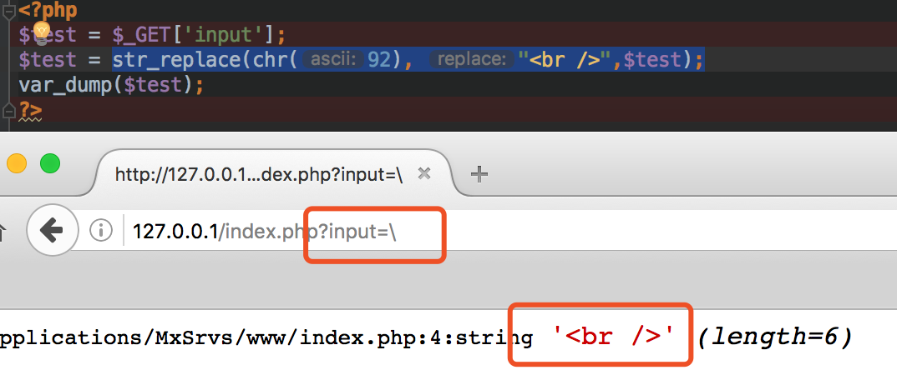

## 结语

看完了上述分析，不知道大家是否对 **htmlentities** 函数在使用过程中可能产生的问题，有了更加深入的理解，文中用到的代码可以从 [这里](https://www.lanzous.com/i1qm24f) 下载，当然文中若有不当之处，还望各位斧正。如果你对我们的项目感兴趣，欢迎发送邮件到 hongrisec@gmail.com 联系我们。 **Day13** 的分析文章就到这里，我们最后留了一道CTF题目给大家练手，题目如下：

```php
//index.php
<?php
require 'db.inc.php';
  function dhtmlspecialchars($string) {
      if (is_array($string)) {
          foreach ($string as $key => $val) {
              $string[$key] = dhtmlspecialchars($val);
          }
      }
      else {
          $string = str_replace(array('&', '"', '<', '>', '(', ')'), array('&amp;', '&quot;', '&lt;', '&gt;', '（', '）'), $string);
          if (strpos($string, '&amp;#') !== false) {
              $string = preg_replace('/&amp;((#(\d{3,5}|x[a-fA-F0-9]{4}));)/', '&\\1', $string);
          }
      }
      return $string;
  }
  function dowith_sql($str) {
      $check = preg_match('/select|insert|update|delete|\'|\/\*|\*|\.\.\/|\.\/|union|into|load_file|outfile/is', $str);
      if ($check) {
          echo "非法字符!";
          exit();
      }
      return $str;
  }
  // 经过第一个waf处理
  foreach ($_REQUEST as $key => $value) {
      $_REQUEST[$key] = dowith_sql($value);
  }
  // 经过第二个WAF处理
  $request_uri = explode("?", $_SERVER['REQUEST_URI']);
  if (isset($request_uri[1])) {
      $rewrite_url = explode("&", $request_uri[1]);
      foreach ($rewrite_url as $key => $value) {
          $_value = explode("=", $value);
          if (isset($_value[1])) {
              $_REQUEST[$_value[0]] = dhtmlspecialchars(addslashes($_value[1]));
          }
      }
  }
  // 业务处理
  if (isset($_REQUEST['submit'])) {
      $user_id = $_REQUEST['i_d'];
      $sql = "select * from ctf.users where id=$user_id";
      $result=mysql_query($sql);
      while($row = mysql_fetch_array($result))
      {
          echo "<tr>";
          echo "<td>" . $row['name'] . "</td>";
          echo "</tr>";
      }
  }
?>
```

```php
//db.inc.php
<?php
$mysql_server_name="localhost";
$mysql_database="ctf";    /** 数据库的名称 */
$mysql_username="root";  /** MySQL数据库用户名 */
$mysql_password="root";  /** MySQL数据库密码 */
$conn = mysql_connect($mysql_server_name, $mysql_username,$mysql_password,'utf-8');
?>
```

```sql
//ctf.sql
# Host: localhost  (Version: 5.5.53)
# Date: 2018-08-18 21:42:20
# Generator: MySQL-Front 5.3  (Build 4.234)

/*!40101 SET NAMES utf8 */;

#
# Structure for table "users"
#

DROP TABLE IF EXISTS `users`;
CREATE TABLE `users` (
  `Id` int(11) NOT NULL AUTO_INCREMENT,
  `name` varchar(255) DEFAULT NULL,
  `pass` varchar(255) DEFAULT NULL,
  `flag` varchar(255) DEFAULT NULL,
  PRIMARY KEY (`Id`)
) ENGINE=MyISAM AUTO_INCREMENT=2 DEFAULT CHARSET=utf8;

#
# Data for table "users"
#

/*!40000 ALTER TABLE `users` DISABLE KEYS */;
INSERT INTO `users` VALUES (1,'admin','qwer!@#zxca','hrctf{R3qu3st_Is_1nterEst1ng}');
/*!40000 ALTER TABLE `users` ENABLE KEYS */;
```

## 参考文章

[PHP的两个特性导致waf绕过注入](https://blog.csdn.net/u011721501/article/details/51824576) 

[request导致的安全性问题分析](https://blog.spoock.com/2018/05/05/request-vuln-analysis/) 
