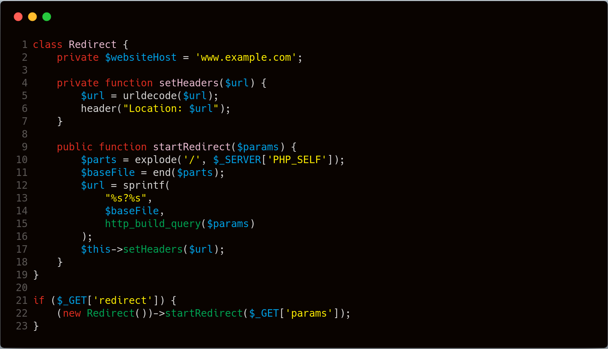
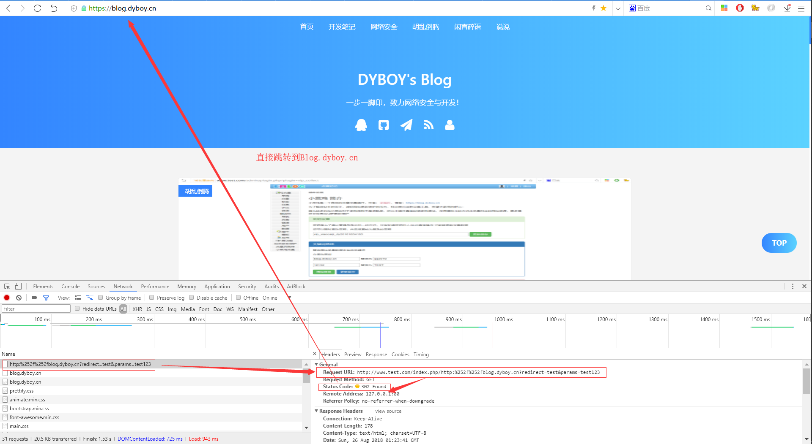
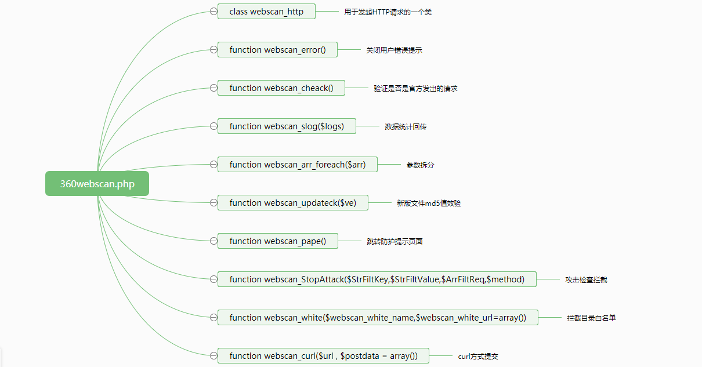
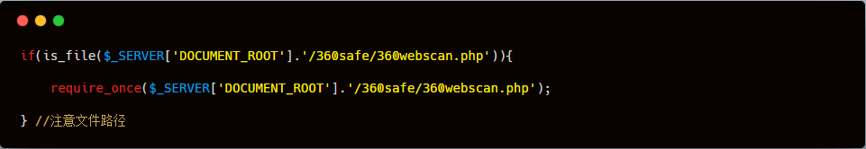
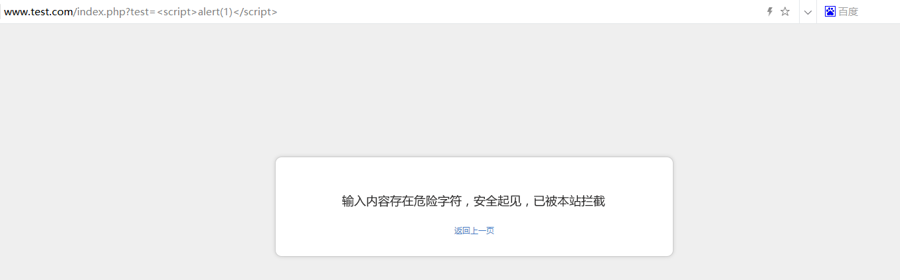
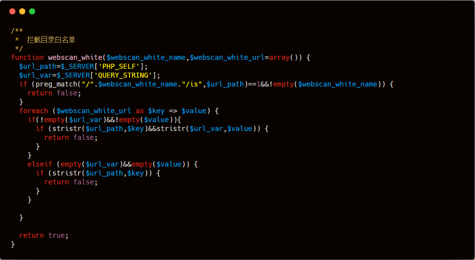
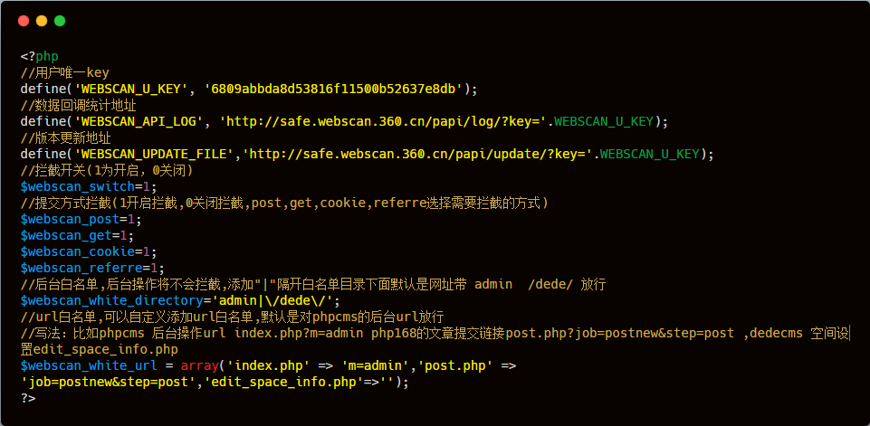
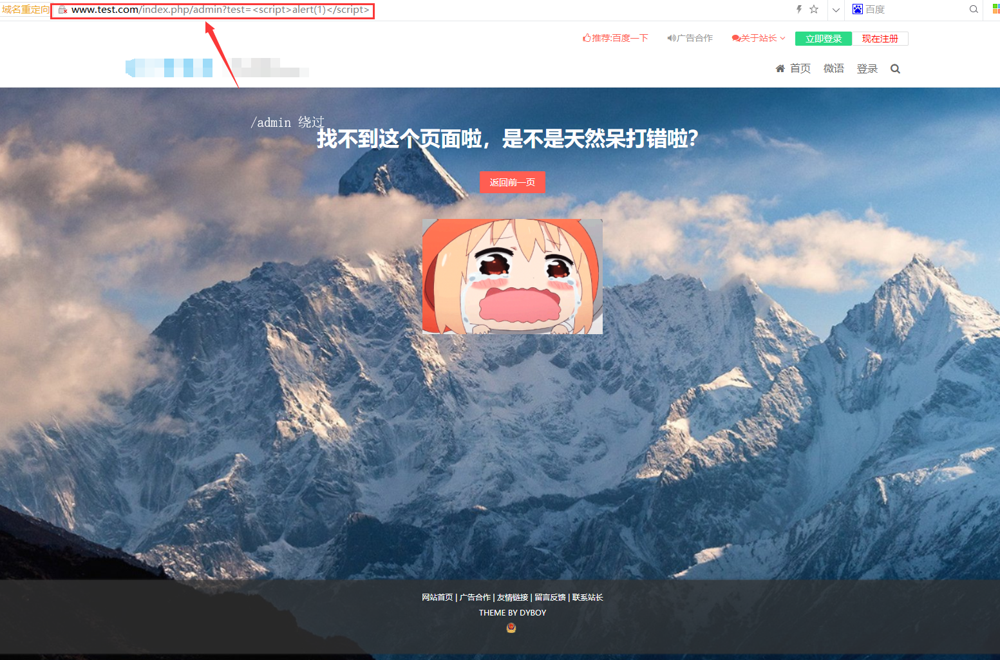

本文由红日安全成员： **DYBOY** 编写，如有不当，还望斧正。

## 前言

大家好，我们是红日安全-代码审计小组。最近我们小组正在做一个PHP代码审计的项目，供大家学习交流，我们给这个项目起了一个名字叫 [**PHP-Audit-Labs**](https://github.com/hongriSec/PHP-Audit-Labs) 。现在大家所看到的系列文章，属于项目 **第一阶段** 的内容，本阶段的内容题目均来自 [PHP SECURITY CALENDAR 2017](https://www.ripstech.com/php-security-calendar-2017/) 。对于每一道题目，我们均给出对应的分析，并结合实际CMS进行解说。在文章的最后，我们还会留一道CTF题目，供大家练习，希望大家喜欢。下面是 **第15篇** 代码审计文章：

## Day 15 - Sleigh Ride

题目叫做滑雪橇，代码如下：



**漏洞解析** ：

这一关主要考察的是 **$_SERVER['PHP_SELF']** 引发的一个任意网址跳转漏洞

首先，分析一下程序的运行

- 如果有 **$_GET['redirect']** 参数，那么就 New 一个 **Redirect** 对象，同时调用 **Redirect** 类的 **startRedirect** 方法
- **startRedirect** 函数接受一个 **GET** 类型的 **params** 参数，然后在 **explode()** 函数中，将 **$_SERVER['PHP_SELF']** 得到的值，以 **/** 分割成一个 **$parts** 数组。
- **$baseFile** 的值为 **$parts** 数组的最后一个值
- **$url** 的值为 **\$baseFile?http_build_query($params)** ，其中的 **http_build_query()** 函数就是一个将参数进行URL编码的一个操作，比如 **$params='test=123'**
- 然后调用 **setHeaders** 函数，首先解码 **$url** 参数，然后 **header()** 函数直接跳转 **$url**

**$_SERVER['PHP']** 存在的问题：

初看这个程序没什么问题，但是PHP自带的**$_SERVER['PHP_SELF']** 参数是可以控制的。其中 **PHP_SELF** 指当前的页面绝对地址，比如我们的网站：**http://www.test.com/redict/index.php**，那么**PHP_SELF** 就是 **/redict/index.php** 。但有个小问题很多人没有注意到，当**URL**是**PATH_INFO**的时候，比如：**http://www.test.com/redict/index.php/admin**，那么**PHP_SELF**就是**/redict/index.php/admin** 也就是说，其实 **PHP_SELF** 有一部分是我们可以控制的。

双编码问题：

URL本来是被浏览器编码过一次，服务器接收到来自浏览器URL请求的时候，会将URL解码一次，由于在程序中我们看到有 **urldecode()** 函数存在，它会再次解码一次URL，此时双编码URL就可以利用，用于绕过某些关键词检测。比如将 **/** 编码为： **%252f** 

漏洞利用：

比如我们要跳转到我的博客：**blog.dyboy.cn** ，那么就可以构造 **Payload** ：**http://www.test.com/index.php/http:%252f%252fblog.dyboy.cn?redirect=test&params=test123** ，访问即可重定向跳转到 **http://blog.dyboy.cn** 网址。如下图所示，发生了 **302** 跳转：



## 实例分析

其实关于这个漏洞的利用，是有很多src案例的。但是都是黑盒测试，不是很清楚后台的代码怎么设计的，这里可以提及到一个关于 **360webscan** 的防护脚本一个历史漏洞，正是使用了 **$_SERVER['PHP_SELF']** 这个变量，导致可以绕过360webscan防护脚本的防护，脚本的防护效果失效，现在此防护脚本更新了。

最新版下载地址： http://webscan.360.cn/protect/down?domain=www.test.com

旧版本下载地址：https://www.lanzous.com/i1qj0qh

其结构为：



因为这只是一个防护的辅助脚本，任何的程序都可以安装使用，这里就以 **Emlog5.3.1** 博客程序为例子，程序不重要，这个脚本可以安装接入到任何的程序中。

安装的方法：解压得到 **360safe** 文件夹，之后上传到我们的网站根目录中，同时在任意的全局文件中加入如下代码即可安装成功：



在按照上述安装方法安装后，测试访问： `http://www.test.com/index.php?test=<script>alert(1)</script>` ，XSS拦截显示：



比如GET传递的数据存在SQL注入恶意字符都会被拦截，虽然本脚本的正则过滤规则很好了，但是通过这一个 **$_SERVER['PHP_SELF']** ，可以通过白名单规则绕过攻击防护。

在存在绕过漏洞的360webscan历史版本中，如下图 **第194-219行** 的的代码（拦截目录白名单检测）：



在上图的 **第5行** ，我们看到 **$url_path** 的值是直接取的 **$_server['PHP_SELF']** 的值，同时没有做任何的验证或过滤。那么我们只要在请求的URL（提交的参数中）存在白名单目录，那么就可以绕过安全检测。

因为在 **webscan_cache.php** 中的默认的白名单目录存在 **admin** 。



然后我们访问：**http://www.test.com/index.php/admin?test=%3Cscript%3Ealert(1)%3C/script%3E**



此处虽然返回的状态码是 **404** ，但是，我们发现已经不再拦截了，如果再配合某些CMS或者PHP系统的伪静态特殊性，那么就可以成功的绕过防护。

## 修复建议

本次审计的其实不是漏洞，主要是一个 **$_SERVER['PHP_SELF']** 的问题，再遇上某系伪静态规则配合下，就会导致各种由此形成的各种漏洞。因此，这里推荐使用 **$_SERVER['SCRIPT_NAME']** 代替即可，同时，我们可以看到在最新的360webscan中已经更新了这个问题，并且就是使用 **$_SERVER['SCRIPT_NAME']** 。

## 结语

看完了上述分析，不知道大家是否对 **$_SERVER['PHP_SELF']** 函数有了更加深入的理解，文中用到的emlog可以从 [百度网盘](https://pan.baidu.com/s/1GqG4AfotoEVxxJPBdSW8Vg) （密码: **hkb4**） 下载，当然文中若有不当之处，还望各位斧正。如果你对我们的项目感兴趣，欢迎发送邮件到 hongrisec@gmail.com 联系我们。 **Day15** 的分析文章就到这里，我们最后留了一道CTF题目给大家练手，题目如下：

``` php
// index.php
<?php 
include "./config.php";
include "./flag.php";
error_reporting(0);

$black_list = "/admin|guest|limit|by|substr|mid|like|or|char|union|select|greatest|%00|\'|";
$black_list .= "=|_| |in|<|>|-|chal|_|\.|\(\)|#|and|if|database|where|concat|insert|having|sleep/i";
if(preg_match($black_list, $_GET['user'])) exit(":P"); 
if(preg_match($black_list, $_GET['pwd'])) exit(":P"); 

$query="select user from users where user='$_GET[user]' and pwd='$_GET[pwd]'";
echo "<h1>query : <strong><b>{$query}</b></strong><br></h1>";
$result = $conn->query($query);
if($result->num_rows > 0){
    $row = $result->fetch_assoc();
    if($row['user']) echo "<h2>Welcome {$row['user']}</h2>";
}

$result = $conn->query("select pwd from users where user='admin'");
if($result->num_rows > 0){
    $row = $result->fetch_assoc();
    $admin_pass = $row['pwd'];
}

if(($admin_pass)&&($admin_pass === $_GET['pwd'])){
    echo $flag;
}
highlight_file(__FILE__);
?>
```

```php
// config.php
<?php  
$servername = "localhost";
$username = "root";
$password = "toor";
$dbname = "day15";
$conn = new mysqli($servername, $username, $password, $dbname);
if ($conn->connect_error) {
    die("连接失败: ");
}
?>
```

``` sql
// flag.php
<?php
$flag = "HRCTF{Sql_and_byPass_WAF!}";
?>
```

```sql
// 题目环境.sql
DROP DATABASE IF EXISTS day15;
CREATE DATABASE day15;
USE day15;
CREATE TABLE users (
    id int(6) unsigned auto_increment primary key,
    user varchar(20) not null,
    pwd varchar(40) not null
);

INSERT INTO users(user,pwd) VALUES('Lucia','82ebeafb2b5dede380a0d2e1323d6d0b');
INSERT INTO users(user,pwd) VALUES('Admin','c609b5eda02acd7b163f500cb23b06b1');
```

题解我们会阶段性放出，如果大家有什么好的解法，可以在文章底下留言，祝大家玩的愉快！

## 相关文章

[360webscan防注入脚本全面绕过](https://www.leavesongs.com/penetration/360webscan-bypass.html) 

[[PHP防火墙]输入内容存在危险字符,安全起见,已被本站拦截](https://blog.dyboy.cn/websecurity/73.html) 