本文由红日安全成员： **七月火** 编写，如有不当，还望斧正。

## 前言

大家好，我们是红日安全-代码审计小组。最近我们小组正在做一个PHP代码审计的项目，供大家学习交流，我们给这个项目起了一个名字叫 [**PHP-Audit-Labs**](https://github.com/hongriSec/PHP-Audit-Labs) 。现在大家所看到的系列文章，属于项目 **第一阶段** 的内容，本阶段的内容题目均来自 [PHP SECURITY CALENDAR 2017](https://www.ripstech.com/php-security-calendar-2017/) 。对于每一道题目，我们均给出对应的分析，并结合实际CMS进行解说。在文章的最后，我们还会留一道CTF题目，供大家练习，希望大家喜欢。下面是 **第16篇** 代码审计文章：

## Day 16 - Poem

题目叫做诗，代码如下：

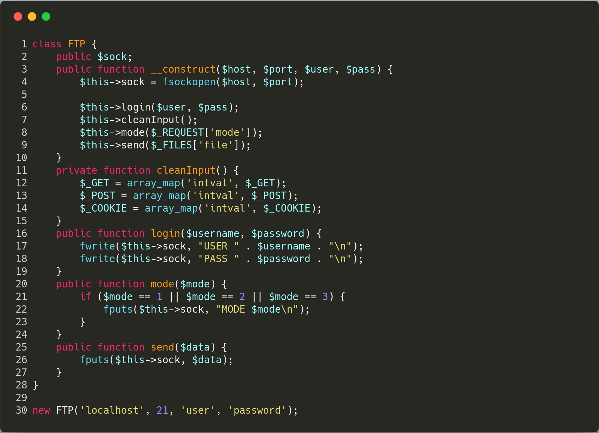

**漏洞解析** ：

这道题目包含了两个漏洞，利用这两个漏洞，我们可以往FTP连接资源中注入恶意数据，执行FTP命令。首先看到 **第7行** 代码，可以发现程序使用 **cleanInput** 方法过滤 **GET** 、 **POST** 、 **COOKIE** 数据，将他们强制转成整型数据。然而在 **第8行** 处，却传入了一个从 **REQUEST** 方式获取的 **mode** 变量。我们都知道超全局数组 **$_REQUEST** 中的数据，是 **$_GET** 、 **$_POST** 、 **$_COOKIE** 的合集，而且数据是复制过去的，并不是引用。我们先来看一个例子，来验证这一观点：

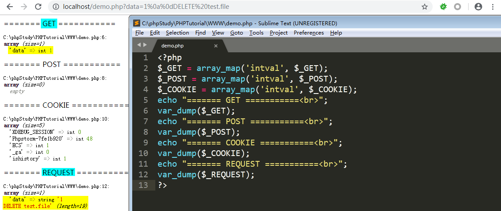

可以发现 **REQUEST** 数据丝毫不受过滤函数的影响。回到本例题，例题中的程序过滤函数只对 **GET** 、 **POST** 、 **COOKIE** 数据进行操作，最后拿来用的却是 **REQUEST** 数据，这显然会存在安全隐患。想了解更多 [**$_REQUEST**](http://www.php.net/manual/zh/reserved.variables.request.php) 信息，大家自己上官网学习。第二个漏洞的话，在代码 **第21行** ，这里用了 **==** 弱比较。关于这个问题，我们在前面的文章中讲的也很细致了，大家可以参考：[[红日安全]PHP-Audit-Labs题解之Day1-4](https://xz.aliyun.com/t/2491#toc-4) （Day4）。

至于本次案例的攻击payload，可以使用： **?mode=1%0a%0dDELETE%20test.file** ，这个即可达到删除FTP服务器文件的效果。

## 实例分析

本次实例分析，我们分析的是 **WordPress** 的 [All In One WP Security & Firewall](https://cn.wordpress.org/plugins/all-in-one-wp-security-and-firewall/) 插件。该插件在 **4.1.4 - 4.1.9** 版本中存在反射型XSS漏洞，漏洞原因和本次案例中的漏洞成因一致，官方也在 **4.2.0** 版本中修复了该漏洞。本次，我们将以 **4.1.4** 版本插件作为案例讲解。

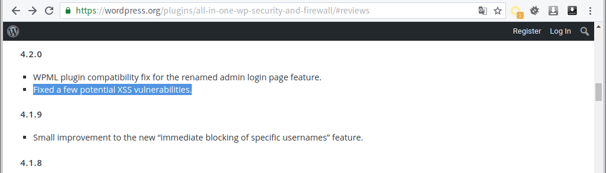

将下载下来的插件zip包，通过后台插件管理上传压缩包安装即可。本次发生问题的文件在于 **wp-content\plugins\all-in-one-wp-security-and-firewall\admin\wp-security-dashboard-menu.php** ，为了方便大家理解，我将问题代码抽取出来，简化如下：

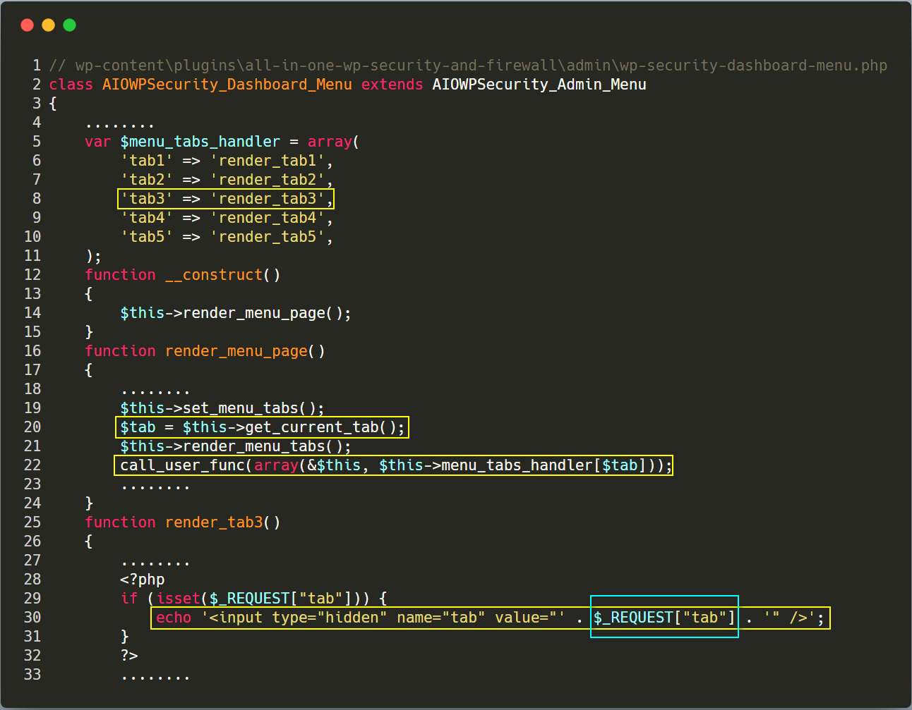

我们可以很清晰的看到，问题就出在 **第25行** 的 **render_tab3** 方法中，这里直接将 **REQUEST** 方式获取的 **tab** 变量拼接并输出。而实际上，在 **第20行** 已经获取了经过过滤处理的 **$tab** 变量。我们来看一下 **get_current_tab** 方法：

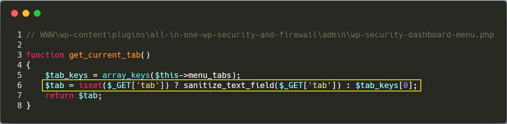

过滤函数的调用链如下图 **第1行** ，接着 **$tab** 变量就会经过 **wp_check_invalid_utf8** 方法的检测。

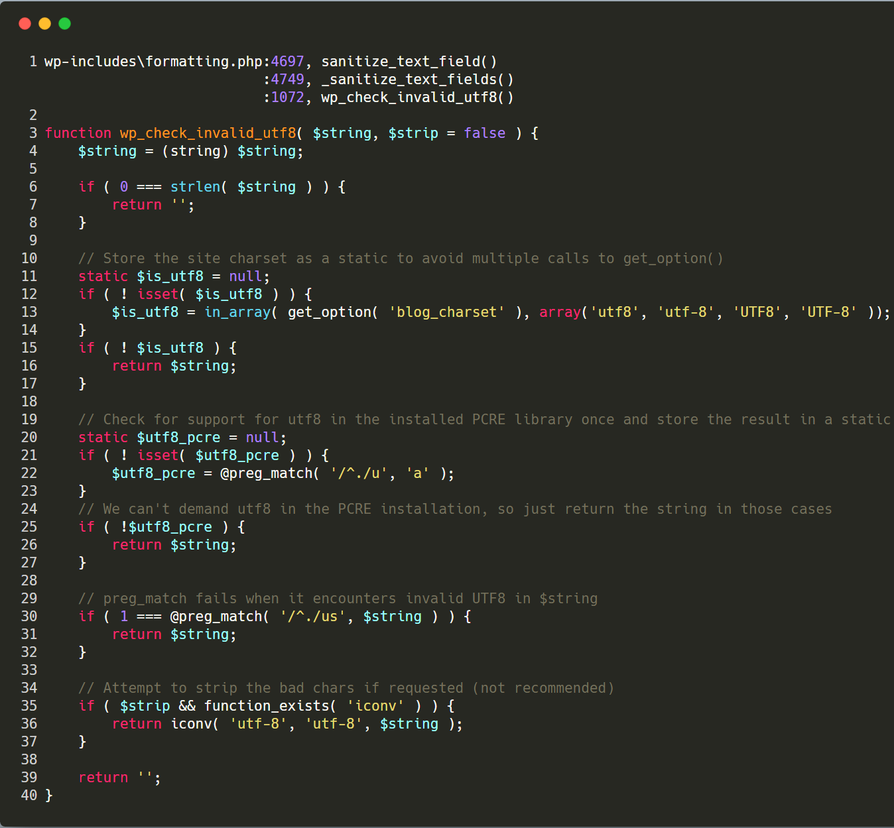

## 漏洞利用

下面我们来看看攻击 **payload** （向 http://website/wp-admin/admin.php?page=aiowpsec&tab=tab3 POST数据 `tab="><script>alert(1)</script>` ）：

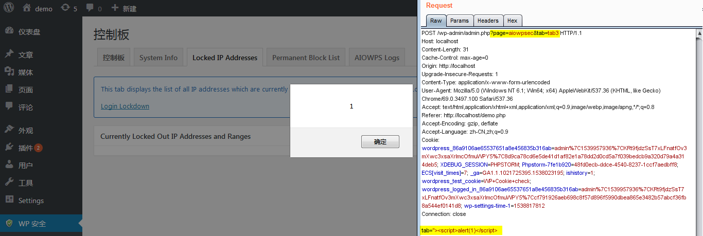

可以看到成功引发XSS攻击。我们最后再根据 **payload** 对代码的调用过程进行分析。首先，我们的 **payload** 会传入 **wp-admin/admin.php** 文件中，最后进入 **第14行** 的 **do_action('toplevel_page_aiowpsec');** 代码。

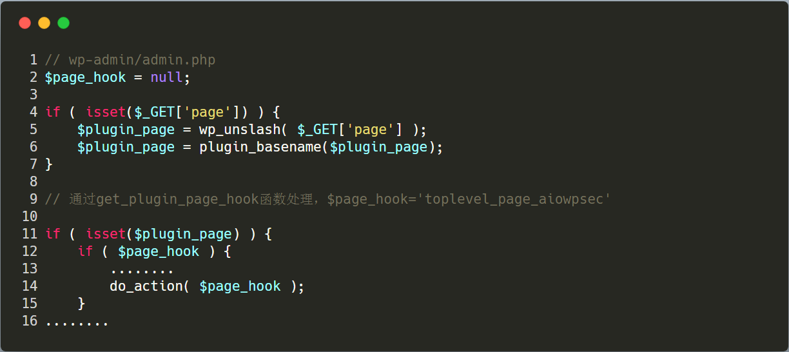

在 **wp-includes/plugin.php** 文件中，程序又调用了 **WP_Hook** 类的 **do_action** 方法，该方法调用了自身的 **apply_filters** 方法。

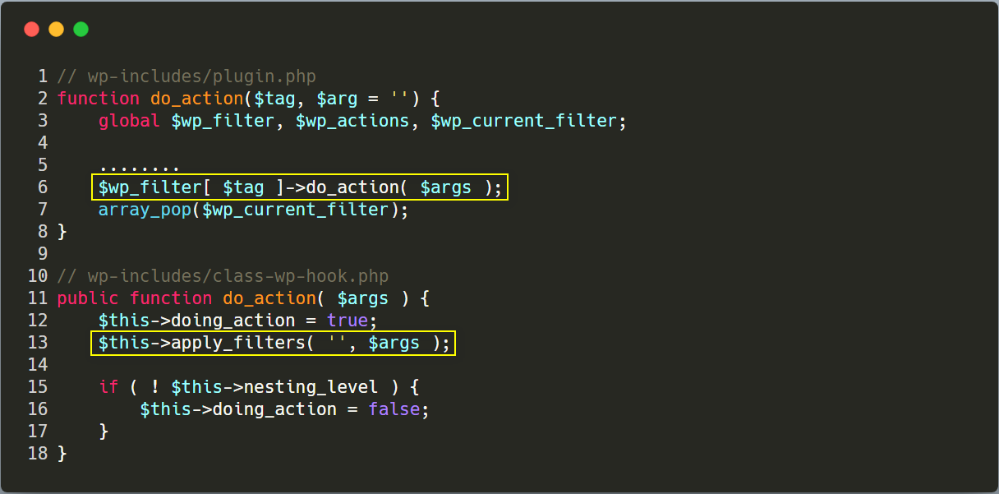

然后 **apply_filters** 方法调用了 **wp-content\plugins\all-in-one-wp-security-and-firewall\admin\wp-security-admin-init.php** 文件的 **handle_dashboard_menu_rendering** 方法，并实例化了一个 **AIOWPSecurity_Dashboard_Menu** 对象。

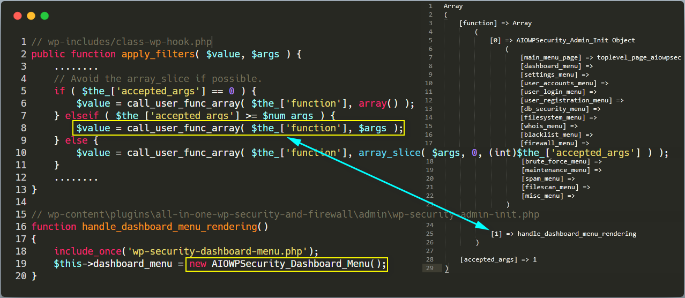

接下来就是开头文章分析的部分，也就是下面这张图片：


整个漏洞的攻击链就如下图所示：

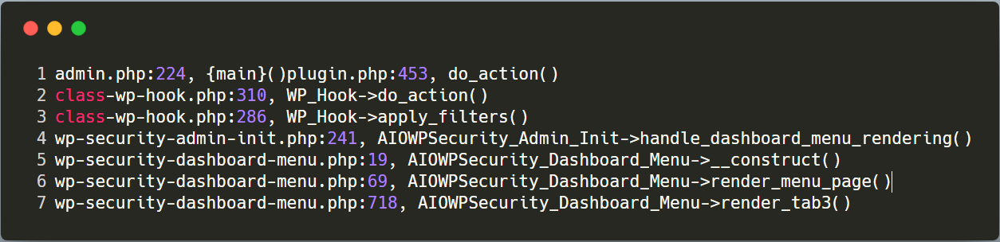

这里还有一个小知识点要提醒大家的是，案例中 **$_REQUEST["tab"]** 最后取到的是 **$_POST["tab"]** 的值，而不是 **$_GET["tab"]** 变量的值。这其实和 **php.ini** 中的 **request_order** 对应的值有关。例如在我的环境中， **request_order** 配置如下：


这里的 **"GP"** 表示的是 **GET** 和 **POST** ，且顺序从左往右。例如我们同时以 **GET** 和 **POST** 方式传输 **tab** 变量，那么最终用 **$_REQUEST['tab']** 获取到的就是 **$_POST['tab']** 的值。更详细的介绍可以看如下PHP手册的定义：

```php
request_order string
This directive describes the order in which PHP registers GET, POST and Cookie variables into the _REQUEST array. Registration is done from left to right, newer values override older values.

If this directive is not set, variables_order is used for $_REQUEST contents.

Note that the default distribution php.ini files does not contain the 'C' for cookies, due to security concerns.
```

## 修复建议

对于这个漏洞的修复方案，我们只要使用过滤后的 **$tab** 变量即可，且变量最好经过HTML实体编码后再输出，例如使用 **htmlentities** 函数等。

## 结语

看完了上述分析，不知道大家是否对 **$_REQUEST** 数组有了更加深入的理解，文中用到的 **CMS** 可以从这里( **[All In One WP Security & Firewall](https://wordpress.org/plugins/all-in-one-wp-security-and-firewall/advanced/)** )下载，当然文中若有不当之处，还望各位斧正。如果你对我们的项目感兴趣，欢迎发送邮件到 **hongrisec@gmail.com** 联系我们。**Day16** 的分析文章就到这里，我们最后留了一道CTF题目给大家练手，题目如下：

```php
// index.php
<?php
function check_inner_ip($url)
{
    $match_result=preg_match('/^(http|https)?:\/\/.*(\/)?.*$/',$url);
    if (!$match_result){
        die('url fomat error1');
    }
    try{
        $url_parse=parse_url($url);
    }
    catch(Exception $e){
        die('url fomat error2');
    }
    $hostname=$url_parse['host'];
    $ip=gethostbyname($hostname);
    $int_ip=ip2long($ip);
    return ip2long('127.0.0.0')>>24 == $int_ip>>24 || ip2long('10.0.0.0')>>24 == $int_ip>>24 || ip2long('172.16.0.0')>>20 == $int_ip>>20 || ip2long('192.168.0.0')>>16 == $int_ip>>16 || ip2long('0.0.0.0')>>24 == $int_ip>>24;
}

function safe_request_url($url)
{
    if (check_inner_ip($url)){
        echo $url.' is inner ip';
    }
    else{
        $ch = curl_init();
        curl_setopt($ch, CURLOPT_URL, $url);
        curl_setopt($ch, CURLOPT_RETURNTRANSFER, 1);
        curl_setopt($ch, CURLOPT_HEADER, 0);
        $output = curl_exec($ch);
        $result_info = curl_getinfo($ch);
        if ($result_info['redirect_url']){
            safe_request_url($result_info['redirect_url']);
        }
        curl_close($ch);
        var_dump($output);
    }
}

$url = $_POST['url'];
if(!empty($url)){
    safe_request_url($url);
}
else{
    highlight_file(__file__);
}
//flag in flag.php 

?>
```

```php
// flag.php
<?php
if (! function_exists('real_ip') ) {
    function real_ip()
    {
        $ip = $_SERVER['REMOTE_ADDR'];
        if (is_null($ip) && isset($_SERVER['HTTP_X_FORWARDED_FOR']) && preg_match_all('#\d{1,3}\.\d{1,3}\.\d{1,3}\.\d{1,3}#s', $_SERVER['HTTP_X_FORWARDED_FOR'], $matches)) {
            foreach ($matches[0] AS $xip) {
                if (!preg_match('#^(10|172\.16|192\.168)\.#', $xip)) {
                    $ip = $xip;
                    break;
                }
            }
        } elseif (is_null($ip) && isset($_SERVER['HTTP_CLIENT_IP']) && preg_match('/^([0-9]{1,3}\.){3}[0-9]{1,3}$/', $_SERVER['HTTP_CLIENT_IP'])) {
            $ip = $_SERVER['HTTP_CLIENT_IP'];
        } elseif (is_null($ip) && isset($_SERVER['HTTP_CF_CONNECTING_IP']) && preg_match('/^([0-9]{1,3}\.){3}[0-9]{1,3}$/', $_SERVER['HTTP_CF_CONNECTING_IP'])) {
            $ip = $_SERVER['HTTP_CF_CONNECTING_IP'];
        } elseif (is_null($ip) && isset($_SERVER['HTTP_X_REAL_IP']) && preg_match('/^([0-9]{1,3}\.){3}[0-9]{1,3}$/', $_SERVER['HTTP_X_REAL_IP'])) {
            $ip = $_SERVER['HTTP_X_REAL_IP'];
        }
        return $ip;
    }
}
$rip = real_ip();
if($rip === "127.0.0.1")
    die("HRCTF{SSRF_can_give_you_flag}");
else
    die("You IP is {$rip} not 127.0.0.1");
?>
```

题解我们会阶段性放出，如果大家有什么好的解法，可以在文章底下留言，祝大家玩的愉快！