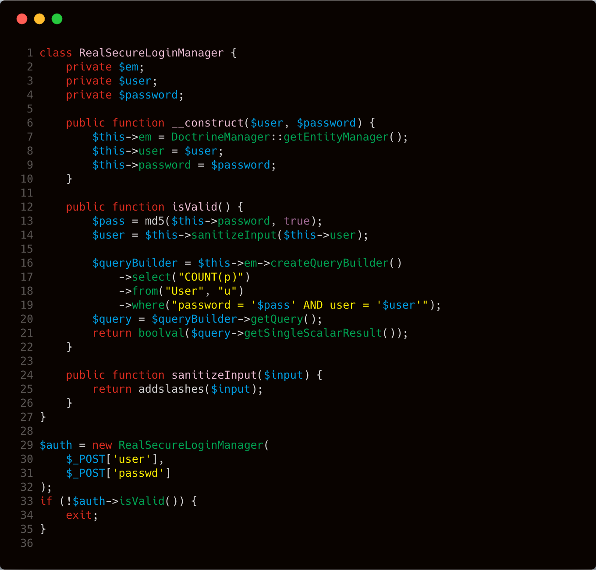
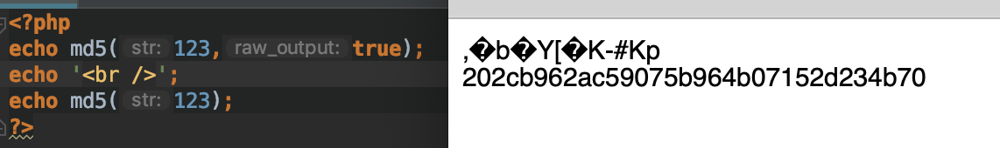
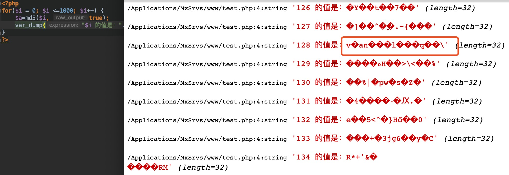
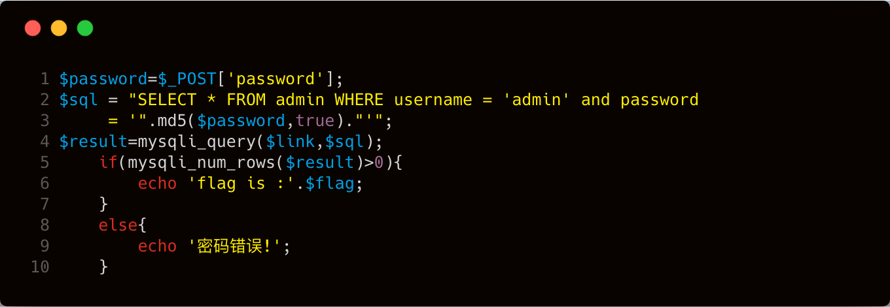
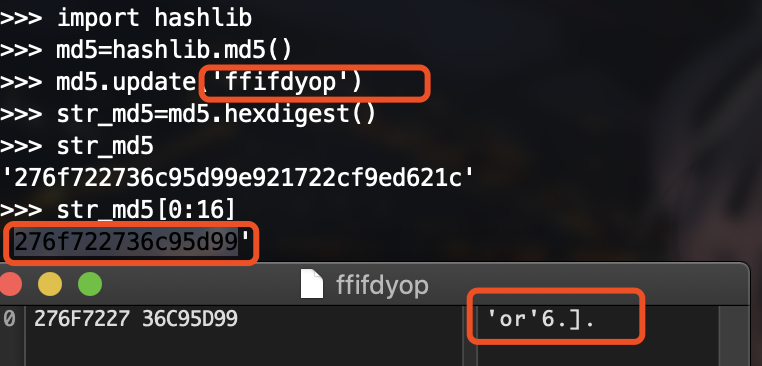
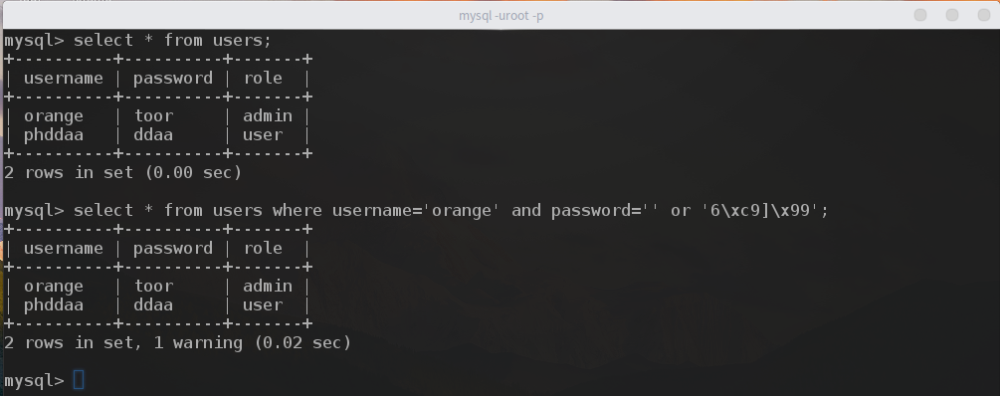
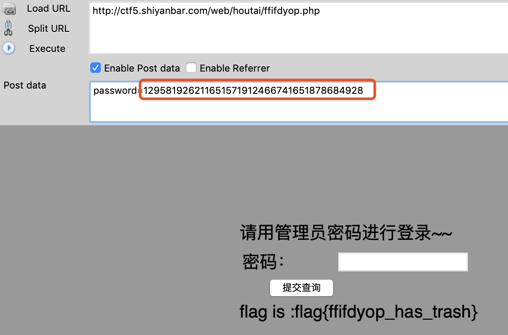
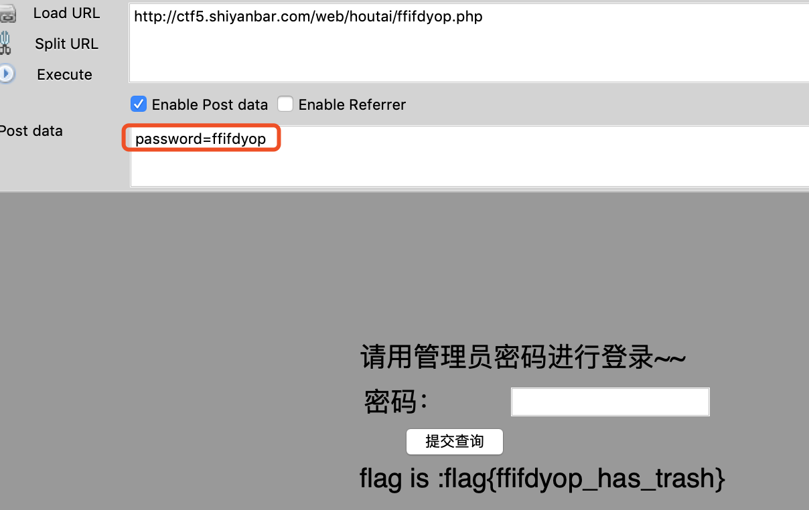
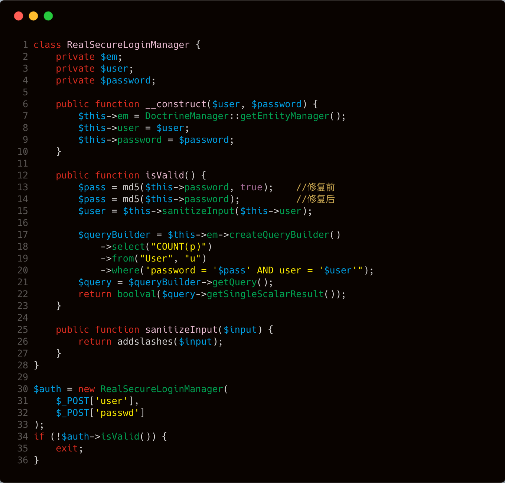

本文由红日安全成员： **l1nk3r** 编写，如有不当，还望斧正。

## 前言

大家好，我们是红日安全-代码审计小组。最近我们小组正在做一个PHP代码审计的项目，供大家学习交流，我们给这个项目起了一个名字叫 [**PHP-Audit-Labs**](https://github.com/hongriSec/PHP-Audit-Labs) 。现在大家所看到的系列文章，属于项目 **第一阶段** 的内容，本阶段的内容题目均来自 [PHP SECURITY CALENDAR 2017](https://www.ripstech.com/php-security-calendar-2017/) 。对于每一道题目，我们均给出对应的分析，并结合实际CMS进行解说。在文章的最后，我们还会留一道CTF题目，供大家练习，希望大家喜欢。下面是 **第17篇** 代码审计文章：

## Day 17 - Turkey Baster

题目代码如下：



这题实际上和我们之前分析 **Day13** 很相似，从 **第17行-20行** 代码中明显存在SQL语句拼接的形式，而 **$pass** 变量和 **\$user** 变量是在 **第30行和31行** 中通过 **POST** 方式由用户进行控制。这里很明显存在SQL注入漏洞，所以这题应该是考察SQL注入漏洞。

这里为什么说这题和 **Day13** 很相似呢，我们继续往下看。程序代码 **第14行** 调用 **sanitizeInput** 函数针对用户输入的 **$user** 变量进行了处理，跟进一下 **sanitizeInput** 函数，在 **第25行** 找到这个函数，这个函数的作用就是调用 **addslashes** 函数针对输入数据进行处理。 **addslashes** 函数定义如下：

> [addslashes](http://php.net/manual/zh/function.addslashes.php) — 使用反斜线引用字符串
>
> ```php
> string addslashes ( string $str )
> ```
>
> 作用：在单引号（'）、双引号（"）、反斜线（\）与 NUL（ **NULL** 字符）字符之前加上反斜线。

所以按照这种情况下这个地方，似乎不存在注入点了，先别急，我们继续往下看，我们看到 **第13行** 代码针对用户输入 **password** 的值调用 **md5** 函数进行相关处理。我们先来了解一下这个 **md5** 函数

> [md5](http://php.net/manual/zh/function.md5.php) — 计算字符串的 MD5 散列值
>
> ```php
> string md5 ( string $str [, bool $raw_output = false ] )
> ```

我们看到题目中的代码是这样的

```php
$pass = md5($this->password, true);
```

这里在 **$raw_output** 位置设置为了true，根据描述

> 如果可选的 `raw_output` 被设置为 **TRUE**，那么 MD5 报文摘要将以16字节长度的原始二进制格式返回。

那我们先来看看效果



现在整理一下这道题，我们知道我可以控制的点有两个变量，一个是 **\$user** ，一个是 **$pass** ，**$pass** 经过了 **md5** 的处理，但是返回字段不是标准的md5值，**$user** 经过了 **addslashes** 函数的处理，无法引入特殊符号去闭合。这里做个假设，如果我们经过 **$pass = md5(\$this->password, true);** 处理之后的值逃逸出一个反斜杆，那么实际上带入到数据库的值就如下所示：

```sql
select count(p) from user s where password='xxxxxx\' and user='xxx#'
```

如果这种情况发生，实际上也存在了SQL注入。我们尝试fuzz一下，看看会不会存在某个值经过了 **md5(xxx, true)** 处理之后，最后一位是反斜杠。



我们针对1-1000进行一下fuzz，发现 **md5(128, true)** 最后的结果带有反斜杠。因此这题最后的payload如下：

```
user= OR 1=1#&passwd=128
```

带入到数据库查询的语句如下：

```sql
select count(p) from user s where password='v�an���l���q��\' and user=' OR 1=1#'
```

最后我们之前 **Day13** 也是通过逃逸反斜杆，转义单引号，从而逃逸出一个单引号闭合了之前的SQL语句，之前 **Day13** 的payload如下所示：

```sql
select count(p) from user where user = '1234567890123456789\' AND password = 'or 1=1#'
```

这里也是因为SQL语句中有两个地方可控，因此，我们也可以通过这个办法造成SQL注入的问题，所以我才会说这道题实际上和 **Day13** 很相似。

## 实例分析

由于找不到由 **md5(xxx,true)** 函数引起的漏洞实例，所以本次实例分析选择实验吧的一道CTF题目，进行分析，[题目地址](http://ctf5.shiyanbar.com/web/houtai/ffifdyop.php)。

首先打开该题目提示后台登陆，猜测可能是个注入的题目，先看看有没有相关信息泄漏，右键源代码，发现泄漏的登陆逻辑代码。



从上图中的代码中的 **第5行** 可以看到，当查询结果返回大于0的时候，就会输出 **flag** ，我们前面分析过当 **md5** 函数的 **$raw_output** 设置会true的时候， **md5** 函数返回前16字节长度的原始二进制，然后再将二进制转换成字符串，这种情况下可能会引入单引号等特殊字符。

有人尝试过破解这个类型的字符，目前已知两个是 **ffifdyop** 和**129581926211651571912466741651878684928** ，我们来看看实际效果。



所以实际上这里就会导致了SQL注入

```sql
原先：SELECT * FROM admin WHERE username = 'admin' and password = 'md5($password,true)'
变成：SELECT * FROM admin WHERE username = 'admin' and password = ''or'6\xc9]\x99'
```

由于 **and** 运算符优先级比 **or** 高，所以前面的：**username = 'admin' and password = ''** 会先执行，然后将执行结果与后面的 **'6\xc9]\x99'** 进行 **or** 运算。在布尔运算中，除了 **0、'0'、false、null** ，其余结果都为真。所以整个 **SQL** 语句的 **where** 条件判断部分为真，这样可定就能查出数据，类似如下：



## 漏洞验证

所以最后两个payload都可以解出题目。





## 修复建议

建议在使用 **md5** 函数的时候，不要将 **$raw_output** 字段设置为**true** 。



## 结语

看完了上述分析，不知道大家是否对 **md5** 函数在使用过程中可能产生的问题，有了更加深入的理解，文中用到的题目可以从 [这里](http://ctf5.shiyanbar.com/web/houtai/ffifdyop.php) 进行练习，当然文中若有不当之处，还望各位斧正。如果你对我们的项目感兴趣，欢迎发送邮件到 hongrisec@gmail.com 联系我们。 **Day17** 的分析文章就到这里，我们最后留了一道CTF题目给大家练手，题目如下：

```php
//index.php
<!DOCTYPE html>
<html lang="en">
<head>
	<meta charset="UTF-8">
	<title>Document</title>
</head>
<body style="background-color: #999">
	<div style="position:relative;margin:0 auto;width:300px;height:200px;padding-top:100px;font-size:20px;">
	<form action="" method="post">
		<table>
			<tr>
				请用管理员密码进行登录~~
			</tr>
			<tr>
				<td>密码：</td><td><input type="text" name='password'></td>
			</tr>
			<tr>
				<td><input type="submit" name='submit' style="margin-left:30px;"></td>
			</tr>
		</table>
	</form>
	 	</div>
	<!-- $password=$_POST['password'];
	$sql = "SELECT * FROM admin WHERE username = 'admin' and password = '".md5($password,true)."'";
	$result=mysqli_query($link,$sql);
		if(mysqli_num_rows($result)>0){
			echo 'you are admin ';
		}
		else{
			echo '密码错误!';
		} -->
</body>
</html>
<?php
require 'db.inc.php';
$password=$_POST['password'];
$sql = "SELECT * FROM ctf.users WHERE username = 'admin' and password = '".md5($password,true)."'";
#echo $sql;
$result=mysql_query($sql);
if(mysql_num_rows($result)>0){
	echo 'you are admin ';
	if(!isset($_GET['option'])) die();
	$str = addslashes($_GET['option']);
	$file = file_get_contents('./config.php');
	$file = preg_replace('|\$option=\'.*\';|', "\$option='$str';", $file);
	file_put_contents('./config.php', $file);
	}
	else{
		echo '密码错误!';
	}
?>
```

```php
//config.php
<?php
$option='test';
?>
```

```sql
//ctf.sql
DROP TABLE IF EXISTS `users`;
CREATE TABLE `users` (
  `Id` int(11) NOT NULL AUTO_INCREMENT,
  `username` varchar(255) DEFAULT NULL,
  `password` varchar(255) DEFAULT NULL,
  PRIMARY KEY (`Id`)
) ENGINE=MyISAM AUTO_INCREMENT=2 DEFAULT CHARSET=utf8;

INSERT INTO `users` VALUES (1,'admin','qwer!@#zxca');
```

```php
//db.inc.php
<?php
$mysql_server_name="localhost";
$mysql_database="ctf";    /** 数据库的名称 */
$mysql_username="root";  /** MySQL数据库用户名 */
$mysql_password="root";  /** MySQL数据库密码 */
$conn = mysql_connect($mysql_server_name, $mysql_username,$mysql_password,'utf-8');
?>
```

## 参考文章

http://cvk.posthaven.com/sql-injection-with-raw-md5-hashes