本文由红日安全成员： **l1nk3r** 编写，如有不当，还望斧正。

## 前言

大家好，我们是红日安全-代码审计小组。最近我们小组正在做一个PHP代码审计的项目，供大家学习交流，我们给这个项目起了一个名字叫 **PHP-Audit-Labs** 。现在大家所看到的系列文章，属于项目 **第一阶段** 的内容，本阶段的内容题目均来自 [PHP SECURITY CALENDAR 2017](https://www.ripstech.com/php-security-calendar-2017/) 。对于每一道题目，我们均给出对应的分析，并结合实际CMS进行解说。在文章的最后，我们还会留一道CTF题目，供大家练习，希望大家喜欢。下面是 **第4篇** 代码审计文章：

## Day 4 - False Beard

题目名字叫假胡子，代码如下：

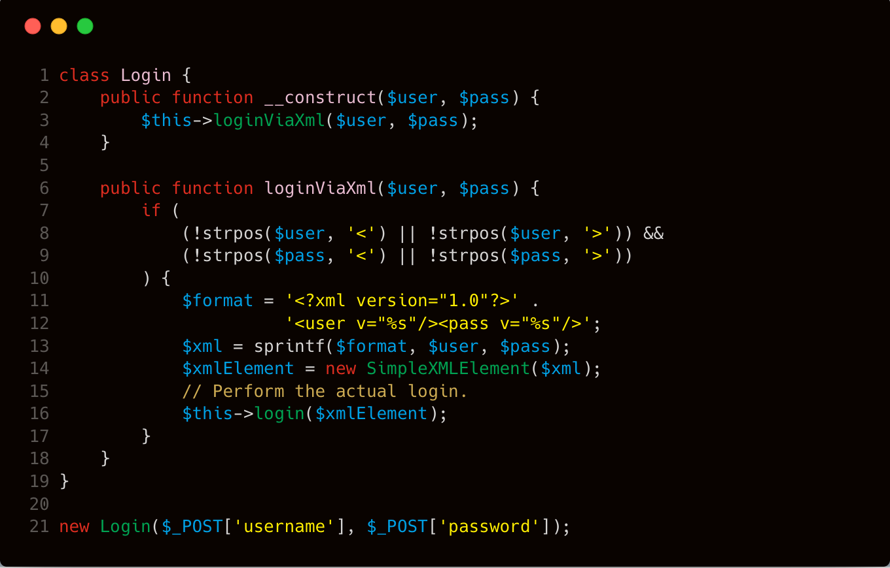

**题目解析：**

我们看到 **第11行** 和 **第12行** ，程序通过格式化字符串的方式，使用 **xml** 结构存储用户的登录信息。实际上这样很容易造成数据注入。然后 **第21行** 实例化 **Login** 类，并在 **第16行** 处调用 **login** 方法进行登陆操作。在进行登录操作之前，代码在 **第8行** 和 **第9行** 使用 **strpos** 函数来防止输入的参数含有 **<** 和 **>** 符号，猜测开发者应该是考虑到非法字符注入问题。我们先来看一下 **strpos** 函数的定义：

> **[strpos](http://php.net/manual/zh/function.strpos.php)** — 查找字符串首次出现的位置
>
> 作用：主要是用来查找字符在字符串中首次出现的位置。
>
> 结构：`int strpos ( string $haystack , mixed $needle [, int $offset = 0 ] )`

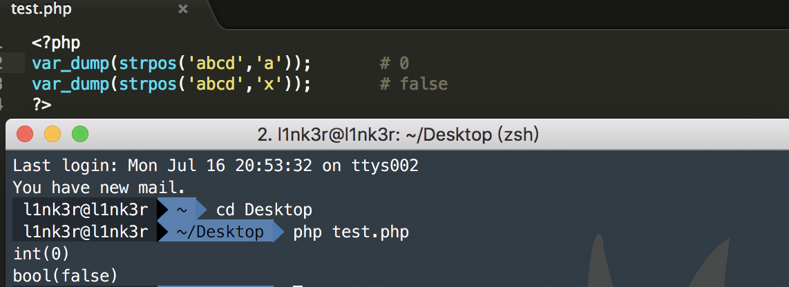

在上面这个例子中，**strpos** 函数返回查找到的子字符串的下标。如果字符串开头就是我们要搜索的目标，则返回下标 **0** ；如果搜索不到，则返回 **false** 。在这道题目中，开发者只考虑到 **strpos** 函数返回 **false** 的情况，却忽略了匹配到的字符在首位时会返回 **0** 的情况，因为 **false** 和 **0** 的取反均为 **true** 。这样我们就可以在用户名和密码首字符注入 **<** 符号，从而注入xml数据。我们尝试使用以下 **payload** ，观察 **strpos** 函数的返回结果。

```php
user=<"><injected-tag%20property="&pass=<injected-tag>
```

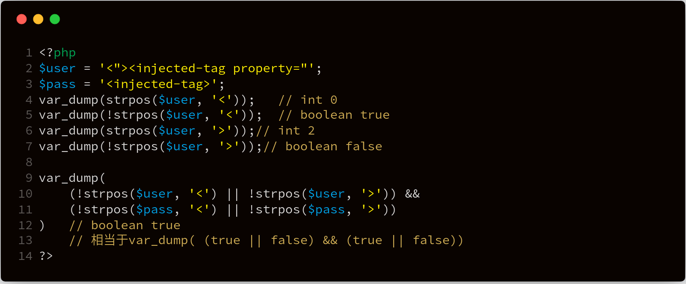

如上图所示，很明显是可以注入xml数据的。

## 实例分析

实际上，本次漏洞是开发者对 **strpos** 函数理解不够，或者说是开发者考虑不周，导致过滤方法可被绕过。由于我们暂时没有在互联网上找到 **strpos** 使用不当导致漏洞的CMS案例，所以这里只能选取一个相似的漏洞进行分析，同样是开发者验证不够周全导致的漏洞。

本次案例，我们选取 **DeDecms V5.7SP2正式版** 进行分析，该CMS存在未修复的任意用户密码重置漏洞。漏洞的触发点在 **member/resetpassword.php** 文件中，由于对接收的参数 **safeanswer** 没有进行严格的类型判断，导致可以使用弱类型比较绕过。我们来看看相关代码：

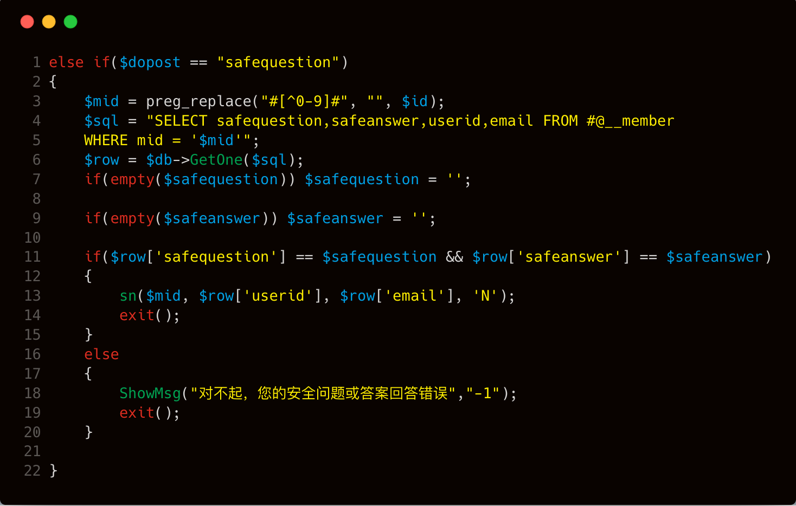

针对上面的代码做个分析，当 **$dopost** 等于 **safequestion** 的时候，通过传入的 **$mid** 对应的 **id** 值来查询对应用户的安全问题、安全答案、用户id、电子邮件等信息。跟进到 **第11行** ，当我们传入的问题和答案非空，而且等于之前设置的问题和答案，则进入 **sn** 函数。然而这里使用的是 **==** 而不是 **===** 来判断，所以是可以绕过的。假设用户没有设置安全问题和答案，那么默认情况下安全问题的值为 **0** ，答案的值为 **null** （这里是数据库中的值，即 **$row['safequestion']="0"** 、 **$row['safeanswer']=null** ）。当没有设置 **safequestion** 和 **safeanswer** 的值时，它们的值均为空字符串。第11行的if表达式也就变成了 **if('0' == '' && null == '')** ，即 **if(false && true)** ，所以我们只要让表达式 **$row['safequestion'] == $safequestion** 为 **true** 即可。下图是 **null == ''** 的判断结果：

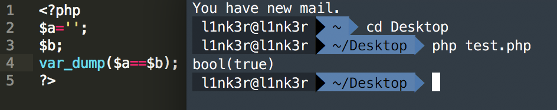

我们可以利用 **php弱类型** 的特点，来绕过这里 **$row['safequestion'] == $safequestion** 的判断，如下：

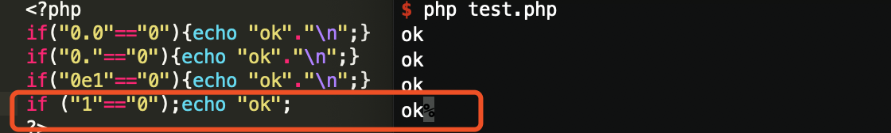

通过测试找到了三个的payload，分别是 **0.0** 、 **0.** 、 **0e1** ，这三种类型payload均能使得 **$row['safequestion'] == $safequestion**  为 **true** ，即成功进入 **sn** 函数。跟进 **sn** 函数，相关代码在 **member/inc/inc_pwd_functions.php** 文件中，具体代码如下：

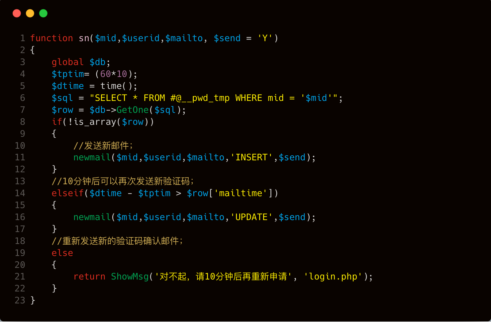

在 **sn** 函数内部，会根据id到pwd_tmp表中判断是否存在对应的临时密码记录，根据结果确定分支，走向 **newmail** 函数。假设当前我们第一次进行忘记密码操作，那么此时的 **$row** 应该为空，所以进入第一个 **if(!is_array($row))** 分支，在 **newmail** 函数中执行 **INSERT** 操作，相关操作代码位置在 **member/inc/inc_pwd_functions.php** 文件中，关键代码如下：

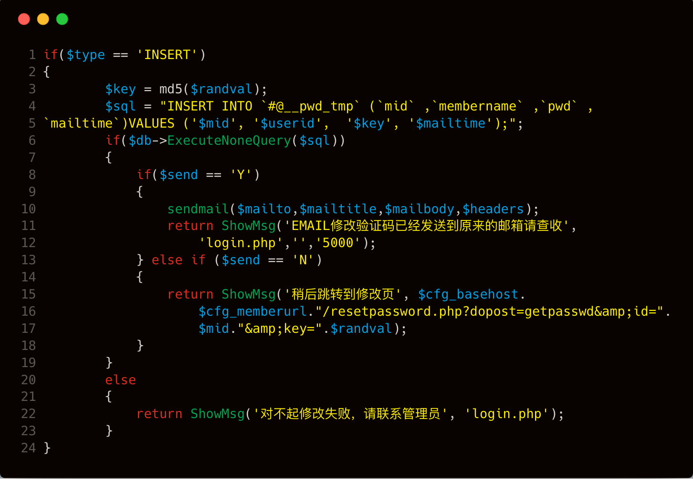

该代码主要功能是发送邮件至相关邮箱，并且插入一条记录至 **dede_pwd_tmp** 表中。而恰好漏洞的触发点就在这里，我们看看 **第13行** 至 **第18行** 的代码，如果 **($send == 'N')** 这个条件为真，通过 **ShowMsg** 打印出修改密码功能的链接。 **第17行** 修改密码链接中的 **$mid** 参数对应的值是用户id，而 **$randval** 是在第一次 **insert** 操作的时候将其 **md5** 加密之后插入到 **dede_pwd_tmp** 表中，并且在这里已经直接回显给用户。那么这里拼接的url其实是

```
http://127.0.0.1/member/resetpassword.php?dopost=getpasswd&id=$mid&key=$randval
```

继续跟进一下 **dopost=getpasswd** 的操作，相关代码位置在 **member/resetpassword.php** 中，


在重置密码的时候判断输入的用户id是否执行过重置密码，如果id为空则退出；如果 **$row** 不为空，则会执行以下操作内容，相关代码在 **member/resetpassword.php** 中。

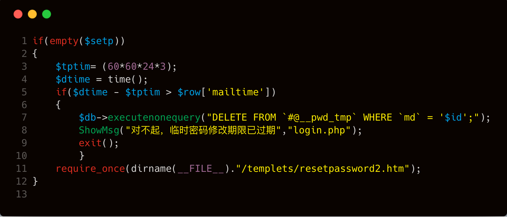

上图代码会先判断是否超时，如果没有超时，则进入密码修改页面。在密码修改页面会将 **$setp** 赋值为2。

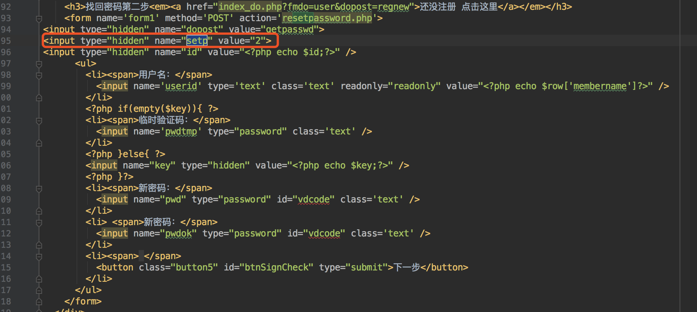

由于现在的数据包中 **$setp=2** ，因此这部分功能代码实现又回到了 **member/resetpassword.php** 文件中。

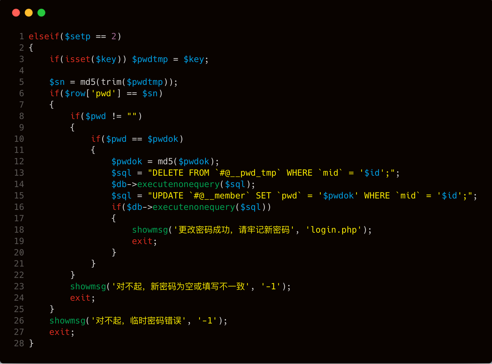

上图代码 **第6行** 判断传入的 **$key** 是否等于数据库中的 **$row['pwd']** ，如果相等就完成重置密码操作，至此也就完成了整个攻击的分析过程。

## 漏洞验证

我们分别注册 **test1** ， **test2** 两个账号

第一步访问 **payload** 中的 **url** 

```bash
http://127.0.0.1/dedecms/member/resetpassword.php?dopost=safequestion&safequestion=0.0&safeanswer=&id=9
```

这里 **test2** 的id是9

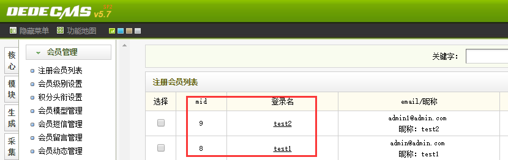

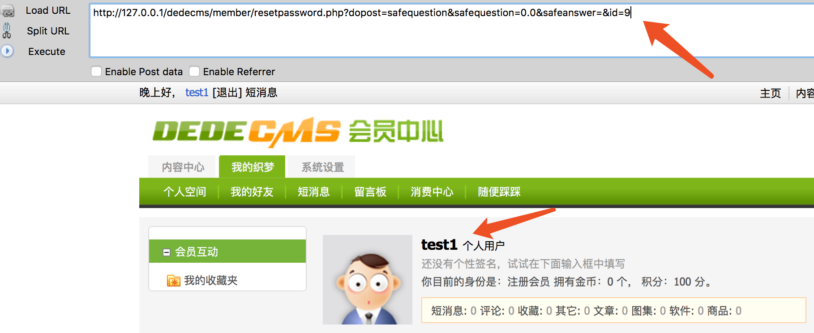


通过抓包获取到 **key** 值。


去掉多余的字符访问修改密码链接

```
http://192.168.31.240/dedecms/member/resetpassword.php?dopost=getpasswd&id=9&key=OTyEGJtg
```

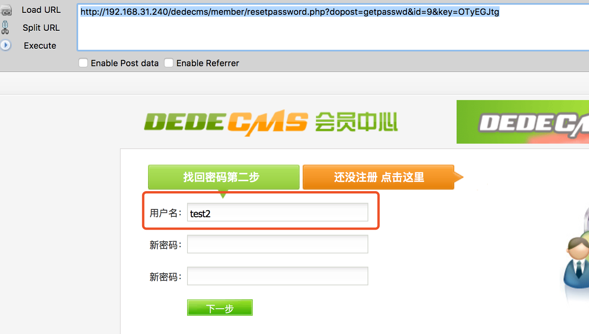

最后成功修改密码，我将密码修改成 **123456** ，数据库中 **test2** 的密码字段也变成了 **123456** 加密之后的值。


## 修复建议

针对上面 **DeDecms任意用户密码重置** 漏洞，我们只需要使用 **===** 来代替 **==** 就行了。因为 **===** 操作会同时判断左右两边的值和数据类型是否相等，若有一个不等，即返回 **false** 。具体修复代码如下：

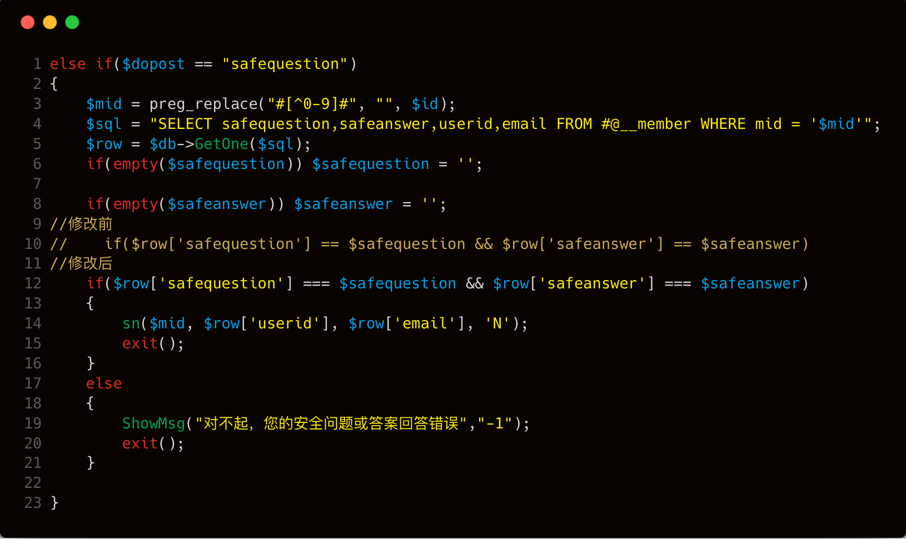

## 结语

看完了上述分析，不知道大家是否对 **strpos使用不当** 引发的漏洞有了更加深入的理解，文中用到的代码可以从 [这里](http://updatenew.dedecms.com/base-v57/package/DedeCMS-V5.7-UTF8-SP2.tar.gz) 下载，当然文中若有不当之处，还望各位斧正。如果你对我们的项目感兴趣，欢迎发送邮件到 **hongrisec@gmail.com** 联系我们。**Day4** 的分析文章就到这里，我们最后留了一道CTF题目给大家练手，题目如下：链接: <https://pan.baidu.com/s/1pHjOVK0Ib-tjztkgBxe3nQ> 密码: 59t2