本文由红日安全成员： **l1nk3r** 编写，如有不当，还望斧正。

## 前言

大家好，我们是红日安全-代码审计小组。最近我们小组正在做一个PHP代码审计的项目，供大家学习交流，我们给这个项目起了一个名字叫 **PHP-Audit-Labs** 。现在大家所看到的系列文章，属于项目 **第一阶段** 的内容，本阶段的内容题目均来自 [PHP SECURITY CALENDAR 2017](https://www.ripstech.com/php-security-calendar-2017/) 。对于每一道题目，我们均给出对应的分析，并结合实际CMS进行解说。在文章的最后，我们还会留一道CTF题目，供大家练习，希望大家喜欢。下面是 **第5篇** 代码审计文章：

## Day 5 - postcard

题目叫做明信片，代码如下：

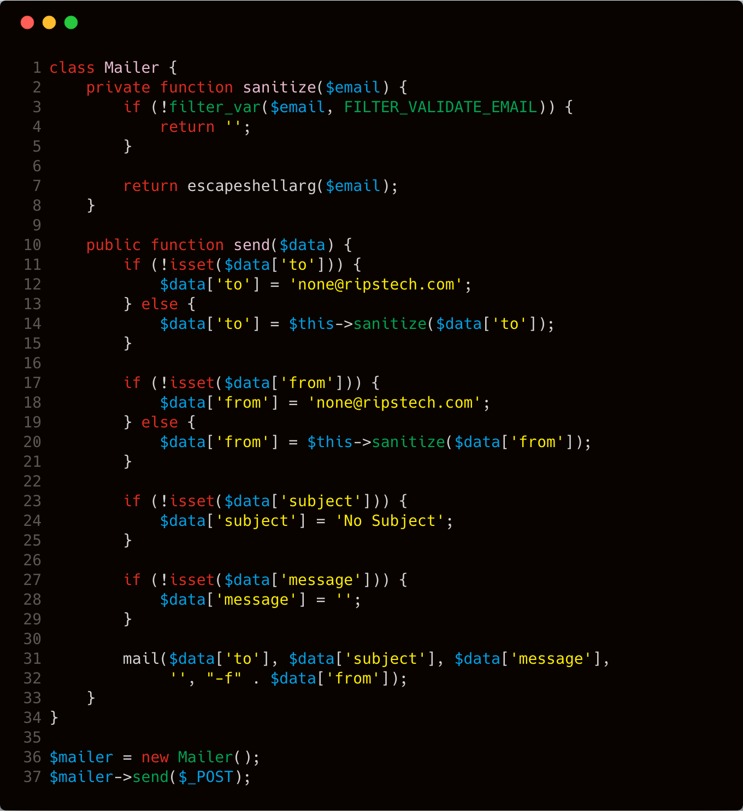

**漏洞解析** ：

这道题其实是考察由 **php** 内置函数 **mail** 所引发的命令执行漏洞。我们先看看 **php** 自带的 **mail** 函数的用法：

```php
bool mail (
	string $to ,
	string $subject ,
	string $message [,
	string $additional_headers [,
	string $additional_parameters ]]
)
```

其参数含义分别表示如下：

> - to，指定邮件接收者，即接收人
> - subject，邮件的标题
> - message，邮件的正文内容
> - additional_headers，指定邮件发送时其他的额外头部，如发送者From，抄送CC，隐藏抄送BCC
> - additional_parameters，指定传递给发送程序sendmail的额外参数。

在Linux系统上， **php** 的 **mail** 函数在底层中已经写好了，默认调用 **Linux** 的 **[sendmail](http://www.sendmail.com/)** 程序发送邮件。而在额外参数( **additional_parameters** )中， **sendmail** 主要支持的选项有以下三种：

> * -O option = value
>
>   QueueDirectory = queuedir 选择队列消息
>
>
> * -X logfile
>
>   这个参数可以指定一个目录来记录发送邮件时的详细日志情况。
>
>
> * -f from email
>
>   这个参数可以让我们指定我们发送邮件的邮箱地址。

举个简单例子方便理解: 

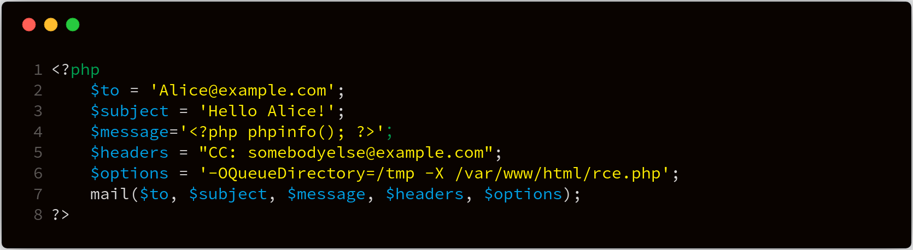

上面这个样例中，我们使用 **-X** 参数指定日志文件，最终会在 **/var/www/html/rce.php** 中写入如下数据：

```php
17220 <<< To: Alice@example.com
 17220 <<< Subject: Hello Alice!
 17220 <<< X-PHP-Originating-Script: 0:test.php
 17220 <<< CC: somebodyelse@example.com
 17220 <<<
 17220 <<< <?php phpinfo(); ?>
 17220 <<< [EOF]
```

当然这题如果只是这一个问题的话，会显的太简单了，我们继续往下看，在 **第3行** 有这样一串代码

```php
filter_var($email, FILTER_VALIDATE_EMAIL)
```

这串代码的主要作用，是确保在第5个参数中只使用有效的电子邮件地址 **$email** 。我们先了解一下 **filter_var()** 函数的定义：

> **[filter_var](http://php.net/manual/zh/function.filter-var.php)** ：使用特定的过滤器过滤一个变量
>
> ```
> mixed filter_var ( mixed $variable [, int $filter = FILTER_DEFAULT [, mixed $options ]] )
> ```
>
> **功能** ：这里主要是根据第二个参数filter过滤一些想要过滤的东西。

关于 **filter_var()** 中 **FILTER_VALIDATE_EMAIL** 这个选项作用，我们可以看看这个帖子 [PHP FILTER_VALIDATE_EMAIL](https://stackoverflow.com/questions/19220158/php-filter-validate-email-does-not-work-correctly) 。这里面有个结论引起了我的注意： **none of the special characters in this local part are allowed outside quotation marks** ，表示所有的特殊符号必须放在双引号中。 **filter_var()** 问题在于，我们在双引号中嵌套转义空格仍然能够通过检测。同时由于底层正则表达式的原因，我们通过重叠单引号和双引号，欺骗 **filter_val()** 使其认为我们仍然在双引号中，这样我们就可以绕过检测。下面举个简单的例子，方便理解：

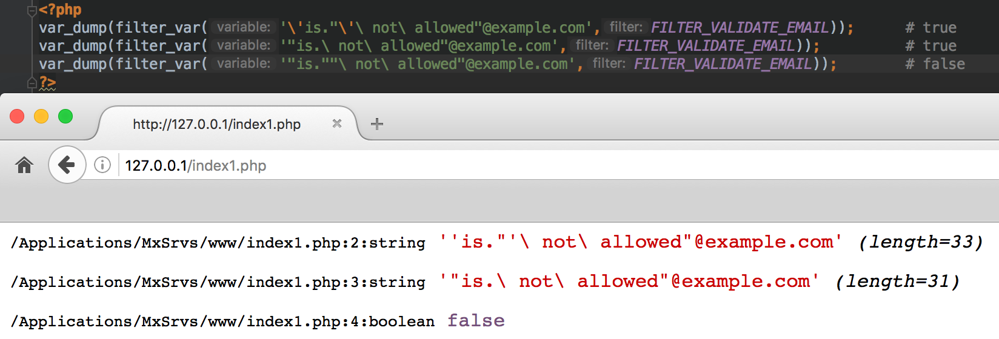

当然由于引入的特殊符号，虽然绕过了 **filter_var()** 针对邮箱的检测，但是由于PHP的 **mail()** 函数在底层实现中，调用了 **escapeshellcmd()** 函数，对用户输入的邮箱地址进行检测，导致即使存在特殊符号，也会被 **escapeshellcmd()** 函数处理转义，这样就没办法达到命令执行的目的了。 **escapeshellcmd()** 函数在底层代码如下（详细点 [这里](https://github.com/php/php-src/blob/PHP-5.6.29/ext/standard/mail.c ) ）：

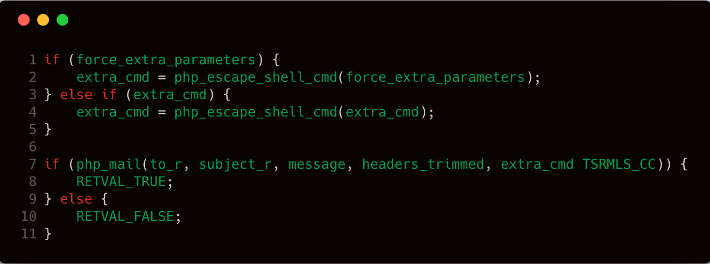

因此我们继续往下看，在第七行有这样一串代码：

```php
return escapeshellarg($email);
```

这句代码主要是处理 **\$email** 传入的数据。我们先来看一下 **escapeshellarg** 函数的定义：

> **[escapeshellarg](http://php.net/manual/zh/function.escapeshellarg.php)** — 把字符串转码为可以在 shell 命令里使用的参数
>
> **功能** ：escapeshellarg() 将给字符串增加一个单引号并且能引用或者转码任何已经存在的单引号，这样以确保能够直接将一个字符串传入 shell 函数，shell 函数包含 exec()，system() 执行运算符(反引号)
>
> **定义** ：`string escapeshellarg ( string $arg )`

具体功能作用，可以参考如下案例：

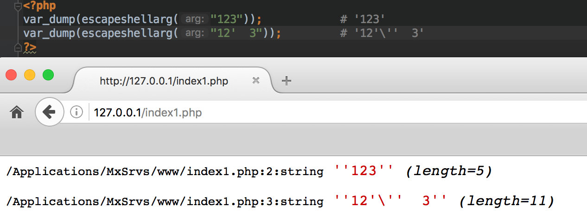

那我们前面说过了PHP的 **mail()** 函数在底层调用了 **escapeshellcmd()** 函数对用户输入的邮箱地址进行处理，即使我们使用带有特殊字符的payload，绕过 **filter_var()** 的检测，但还是会被 **escapeshellcmd()** 处理。然而 **escapeshellcmd()** 和 **escapeshellarg** 一起使用，会造成特殊字符逃逸，下面我们给个简单例子理解一下：

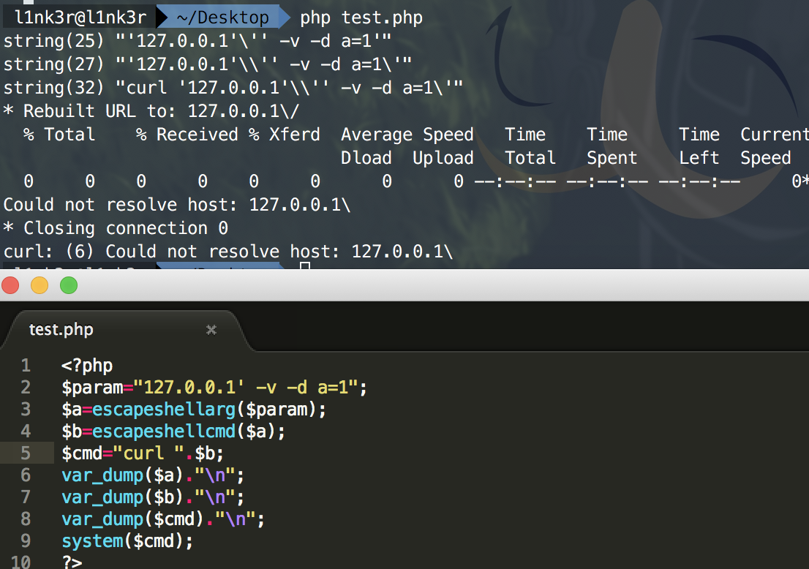

详细分析一下这个过程：

1. 传入的参数是

   ```
   127.0.0.1' -v -d a=1
   ```

2. 由于`escapeshellarg`先对单引号转义，再用单引号将左右两部分括起来从而起到连接的作用。所以处理之后的效果如下：

   ```
   '127.0.0.1'\'' -v -d a=1'
   ```

3. 接着 `escapeshellcmd` 函数对第二步处理后字符串中的 `\` 以及 `a=1'` 中的单引号进行转义处理，结果如下所示：

   ```
   '127.0.0.1'\\'' -v -d a=1\'
   ```

4. 由于第三步处理之后的payload中的 `\\` 被解释成了 `\` 而不再是转义字符，所以单引号配对连接之后将payload分割为三个部分，具体如下所示：

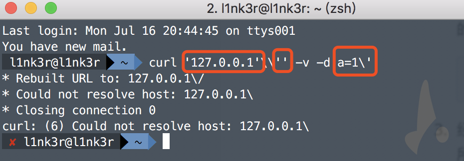

所以这个payload可以简化为 `curl 127.0.0.1\ -v -d a=1'` ，即向 `127.0.0.1\` 发起请求，POST 数据为 `a=1'` 。

总结一下，这题实际上是考察绕过 **filter_var()** 函数的邮件名检测，通过 **mail** 函数底层实现中调用的 **escapeshellcmd()** 函数处理字符串，再结合 **escapeshellarg()** 函数，最终实现参数逃逸，导致 **远程代码执行** 。

## 实例分析

这里实例分析选择 **PHPMailer 命令执行漏洞** （  **CVE-2016-10045** 和 **CVE-2016-10033** ）。项目代码可以通过以下方式下载：

```bash
git clone https://github.com/PHPMailer/PHPMailer
cd PHPMailer
git checkout -b CVE-2016-10033 v5.2.17
```

### 漏洞原理

#### CVE-2016-10033

在github上直接diff一下，对比一下不同版本的 **[class.phpmailer.php](https://github.com/PHPMailer/PHPMailer/compare/v5.2.17...v5.2.18#diff-ace81e501931d8763b49f2410cf3094d)** 文件，差异如下：

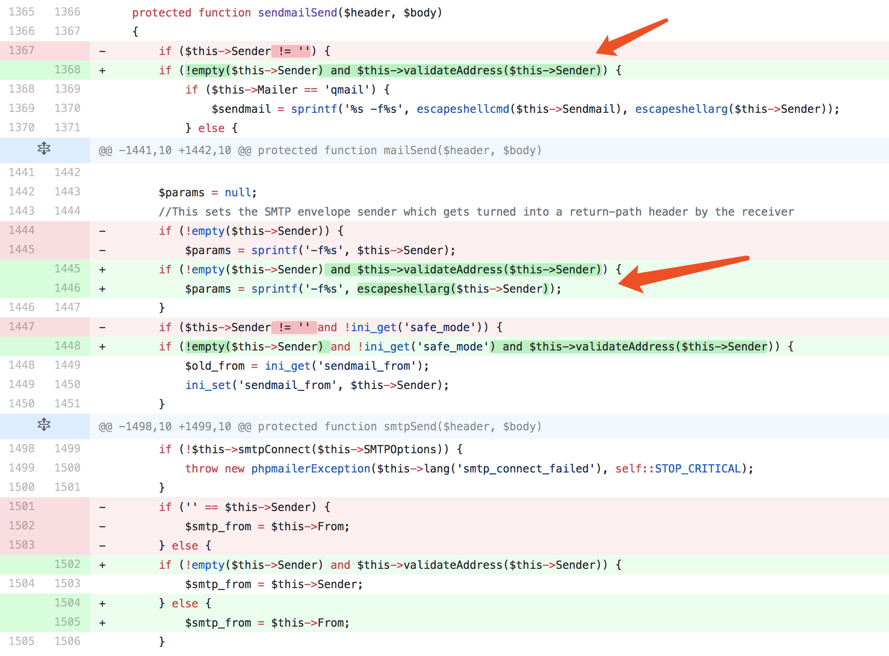

这里在 **sendmailSend** 函数中加了 **validateAddress** 函数，来针对发送的数据进行判断，判断邮箱地址的合法性。另外针对传入的数据，调用了 **escapeshellarg** 函数来转义特殊符号，防止注入参数。然而这样做，就引入了我们上面讨论的问题，即同时使用 **escapeshellarg** 函数和 **escapeshellcmd()** 函数，导致单引号逃逸。由于程序没有对传命令参数的地方进行转义，所以我们可以结合 **mail** 函数的第五个参数 **-X** 写入 **webshell** 。

下面详细看一下代码，漏洞具体位置在 **class.phpmailer.php** 中，我们截取部分相关代码如下 ：

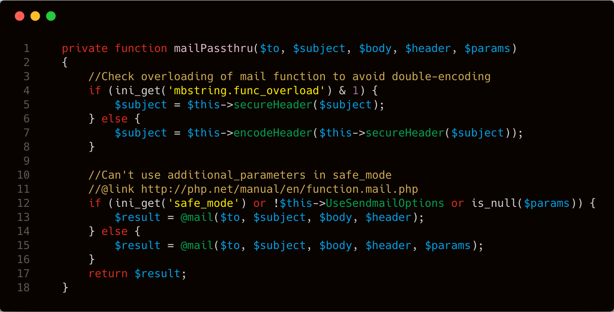

在上图第12行处没有对 **\$params** 变量进行严格过滤，只是简单地判断是否为 **null** ，所以可以直接传入命令。我们继续往下看，我们发现在上图第12行，当 **safe_mode** 模式处于关闭状态时， **mail()** 函数才会传入 **\$params** 变量。

进一步跟跟进 **\$params** 参数，看看它是怎么来的。这个参数的位置在 **class.phpmailer.php** 中，我们截取部分相关代码，具体看下图 **第11行** ： 

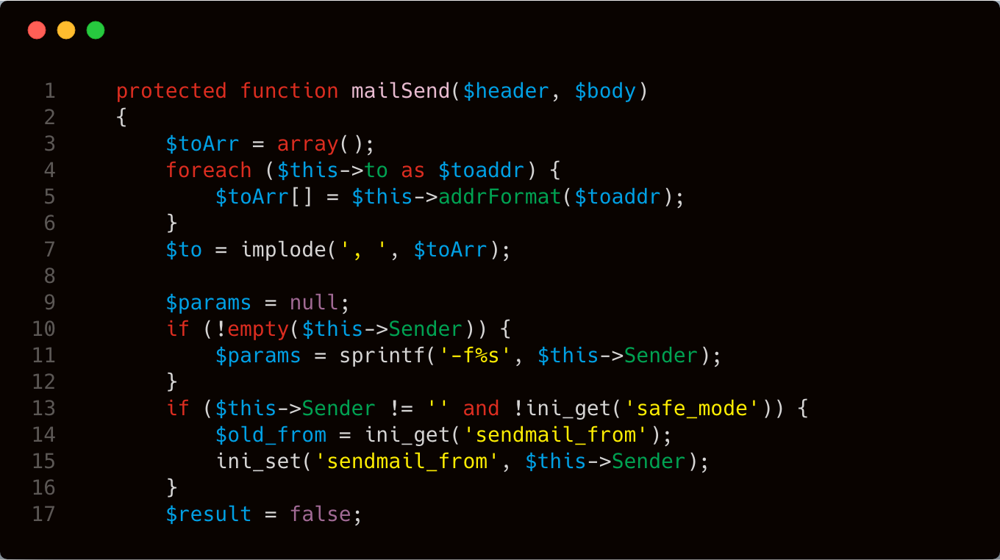

很明显 **\$params** 是从 **\$this->Sender** 传进来的，我们找一下 **\$this->Sender** ，发现这个函数在 **class.phpmailer.php** 中，截取部分相关代码，具体看下图 **第10行** ：

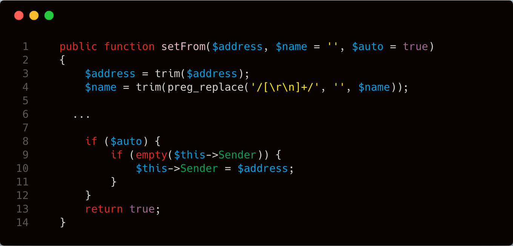

这里在 **setFrom** 函数中将 **\$address** 经过某些处理之后赋值给 **\$this->Sender** 。我们详细看看 **\$address** 变量是如何处理的。主要处理函数均在 **class.phpmailer.php** 文件中，我们截取了部分相关代码，在下图 **第三行** 中使用了 **validateAddress** 来处理 **\$address** 变量。

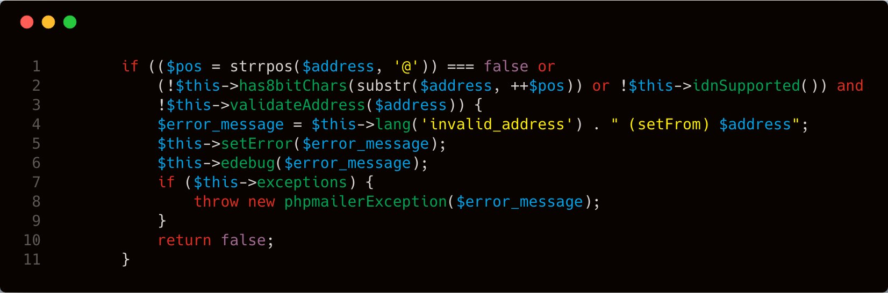

所以跟进一下 **validateAddress** 函数，这个函数位置在 **class.phpmailer.php** 文件中。我们看看程序流程，相关代码如下：

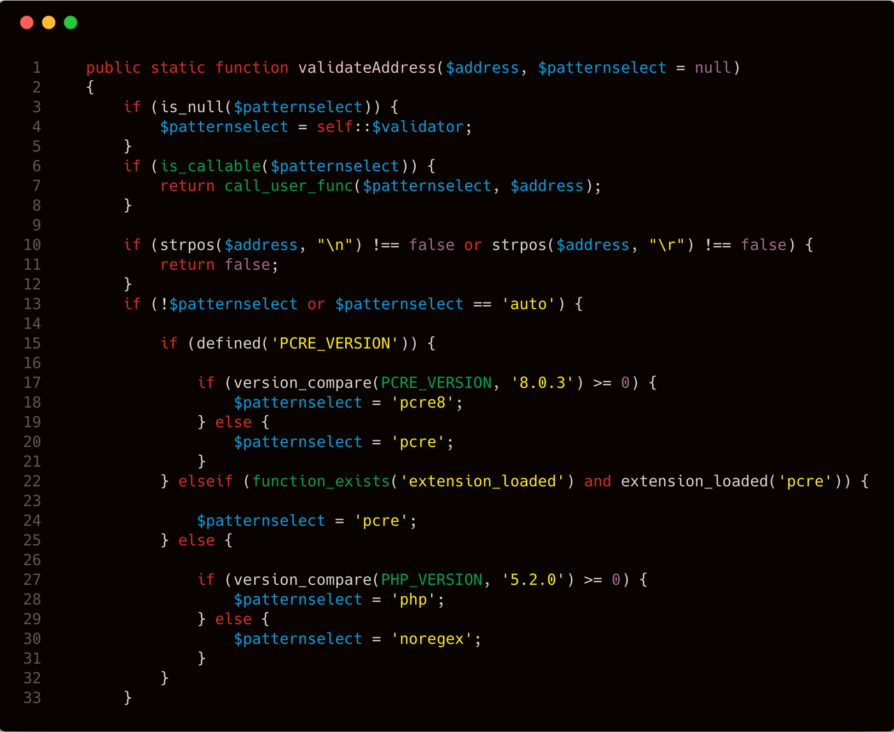

分析一下这段代码，大概意思就是对环境进行了判断，如果没有 **prce** 并且 **php** 版本 **<5.2.0** ，则 **$patternselect = 'noregex'** 。接着往下看，在 **class.phpmailer.php** 文件中，有部分关于 **\$patternselect** 的 **swich** 操作，我只选择了我们需要的那个，跟踪到下面的 **noregex** 。

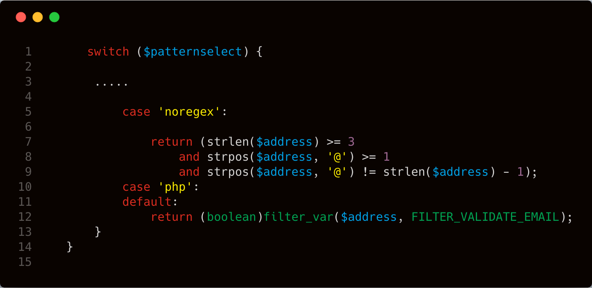

这里简单的只是根据 **@** 符号来处理字符，所以这里的payload很简单。

```
a( -OQueueDirectory=/tmp -X/var/www/html/x.php )@a.com
```

然后通过 **linux** 自身的 **sendmail** 写log的方式，把log写到web根目录下。将日志文件后缀定义为 **.php** ，即可成功写入webshell。

#### CVE-2016-10045

diff一下5.2.20和5.2.18发现针对 **escapeshellcmd** 和 **escapeshellarg** 做了改动。

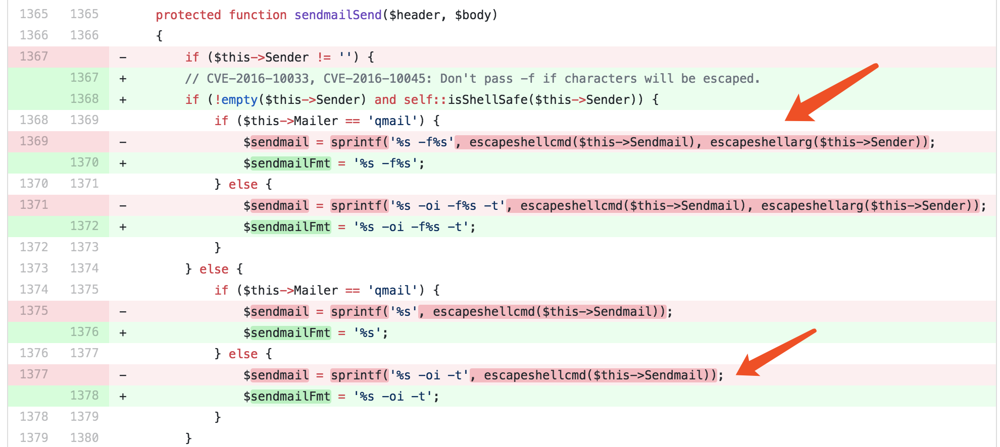

这里其实有个很奇妙的漏洞，针对用户输入使用 **escapeshellarg** 函数进行处理。所以，在最新版本中使用之前的 payload 进行攻击会失败，例如：

```
a( -OQueueDirectory=/tmp -X/var/www/html/x.php )@a.com
```

但是，却可以使用下面这个  **payload** 进行攻击：

```
a'( -OQueueDirectory=/tmp -X/var/www/html/x.php )@a.com
```

实际上，可用于攻击的代码只是在之前的基础上多了一个单引号。之所以这次的攻击代码能够成功，是因为修复代码多了  **escapeshellcmd** 函数，结合上 **mail()** 函数底层调用的 **escapeshellarg** 函数，最终导致单引号逃逸。

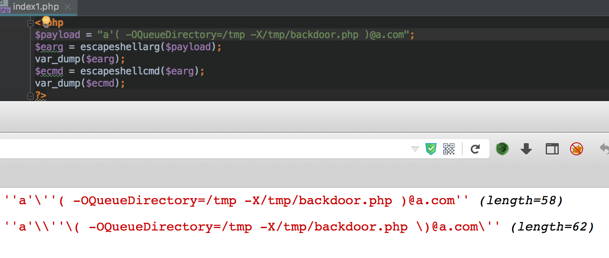

我们的 **payload** 最终在执行时变成了

```
'-fa'\\''\( -OQueueDirectory=/tmp -X/var/www/html/test.php \)@a.com\'
```

按照刚才上面的分析，我们将payload化简分割一下就是`-fa\(`、`-OQueueDirectory=/tmp`、`-X/var/www/html/test.php`、`)@a.com'`，这四个部分。最终的参数就是这样被注入的。

### 漏洞利用

漏洞有一些基本要求：
**1、php version < 5.2.0**
**2、phpmailer < 5.2.18**
**3、php 没有安装 pcre（no default）**
**4、safe_mode = false（default）**

存在正则绕过之后，以及 **escapeshellarg**  和 **escapeshellcmd** 一起使用造成的神奇现象之后。

只需要 **phpmailer < 5.2.20** 

**[环境，poc，exp相关](https://github.com/opsxcq/exploit-CVE-2016-10033)**

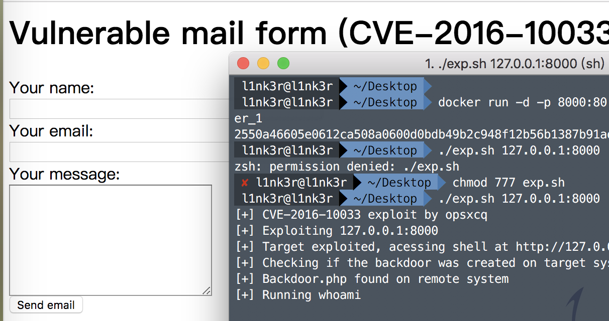

## 修复建议

我们来看一下 **PHPMailer** 官方给出的修复代码。官方对用户传入的参数进行检测，如果当中存在被转义的字符，则不传递 **-f** 参数（**-f** 参数表示发邮件的人，如果不传递该参数，我们的payload就不会被带入 **mail** 函数，也就不会造成命令执行），所以不建议大家同时使用 **escapeshellcmd()** 和 **escapeshellarg()** 函数对参数进行过滤，具体修复代码如下：

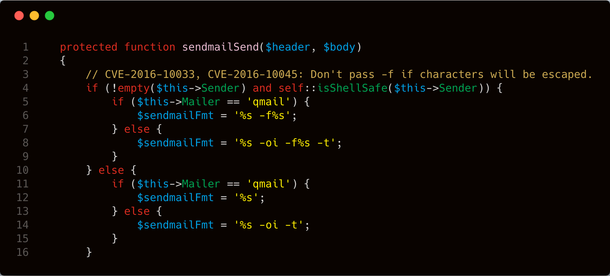

## 结语

看完了上述分析，不知道大家是否对 **escapeshellarg()** 和 **escapeshellcmd()** 两个函数一起使用所产生的问题，有了更加深入的理解，文中用到的代码可以从 [这里](https://github.com/PHPMailer/PHPMailer) 下载，当然文中若有不当之处，还望各位斧正。如果你对我们的项目感兴趣，欢迎发送邮件到 **hongrisec@gmail.com** 联系我们。**Day5** 的分析文章就到这里，我们最后留了一道CTF题目给大家练手，题目如下：

```php
//index.php
<?php
highlight_file('index.php');
function waf($a){
    foreach($a as $key => $value){
        if(preg_match('/flag/i',$key)){
            exit('are you a hacker');
        }
    }
}
foreach(array('_POST', '_GET', '_COOKIE') as $__R) {
    if($$__R) { 
        foreach($$__R as $__k => $__v) { 
            if(isset($$__k) && $$__k == $__v) unset($$__k); 
        }
    }

}
if($_POST) { waf($_POST);}
if($_GET) { waf($_GET); }
if($_COOKIE) { waf($_COOKIE);}

if($_POST) extract($_POST, EXTR_SKIP);
if($_GET) extract($_GET, EXTR_SKIP);
if(isset($_GET['flag'])){
    if($_GET['flag'] === $_GET['hongri']){
        exit('error');
    }
    if(md5($_GET['flag'] ) == md5($_GET['hongri'])){
        $url = $_GET['url'];
        $urlInfo = parse_url($url);
        if(!("http" === strtolower($urlInfo["scheme"]) || "https"===strtolower($urlInfo["scheme"]))){
            die( "scheme error!");
        }
        $url = escapeshellarg($url);
        $url = escapeshellcmd($url);
        system("curl ".$url);
    }
}
?>
```

```php
// flag.php
<?php
$flag = "HRCTF{Are_y0u_maz1ng}";
?>
```

题解我们会在项目第一阶段完成后放出，just having fun！

## 相关文章

[phpmailer RCE漏洞分析](https://lorexxar.cn/2016/12/28/cve-2016-10030/)

[PHP escapeshellarg()+escapeshellcmd() 之殇](https://paper.seebug.org/164/)

[PHPMailer 命令执行漏洞（CVE-2016-10033）分析](https://blog.chaitin.cn/phpmailer-cve-2016-10033/)

