本文由红日安全成员： **水清云影** 编写，如有不当，还望斧正。

## 前言

大家好，我们是红日安全-代码审计小组。最近我们小组正在做一个PHP代码审计的项目，供大家学习交流，我们给这个项目起了一个名字叫 [**PHP-Audit-Labs**](https://github.com/hongriSec/PHP-Audit-Labs) 。现在大家所看到的系列文章，属于项目 **第一阶段** 的内容，本阶段的内容题目均来自 [PHP SECURITY CALENDAR 2017](https://www.ripstech.com/php-security-calendar-2017/) 。对于每一道题目，我们均给出对应的分析，并结合实际CMS进行解说。在文章的最后，我们还会留一道CTF题目，供大家练习，希望大家喜欢。下面是 **第6篇** 代码审计文章：

## Day6 - Forst Pattern

题目叫福斯特模式，代码如下

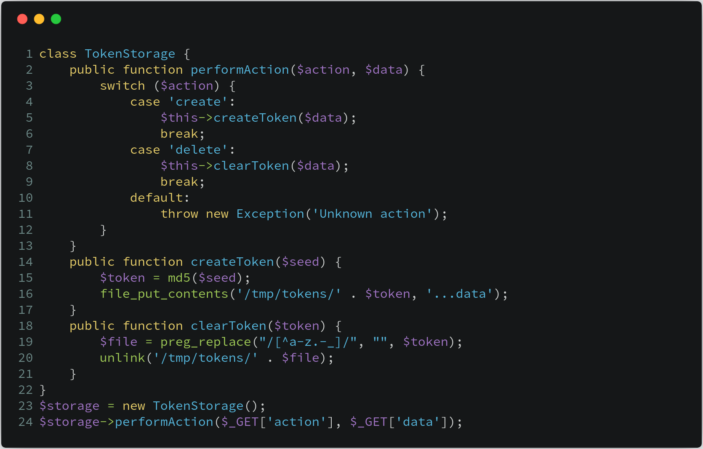

**漏洞解析** ：

这一关考察的内容是由正则表达式不严谨导致的任意文件删除漏洞， 导致这一漏洞的原因在 **第19行** ， **preg_replace** 中的 **pattern** 部分 ，该正则表达式并未起到过滤目录路径字符的作用。`[^a-z.-_]`  表示匹配除了 **a** 字符到 **z** 字符、**.** 字符到 **_** 字符之间的所有字符。因此，攻击者还是可以使用点和斜杠符号进行路径穿越，最终删除任意文件，例如使用 **payload** ： `action = delete＆data = ../../ config.php`，便可删除 **config.php** 文件。

>[**preg_replace**](http://php.net/manual/zh/function.preg-replace.php)：(PHP 4, PHP 5, PHP 7)
>
>**功能** ： 函数执行一个正则表达式的搜索和替换
>
>**定义** ： `mixed preg_replace ( mixed $pattern , mixed $replacement , mixed $subject [, int $limit = -1 [, int &$count ]] )`
>
>搜索 **subject** 中匹配 **pattern** 的部分， 如果匹配成功将其替换成 **replacement** 。

##实例分析

本次实例分析，我们选取的是 **WeEngine0.8** 版本。漏洞入口文件为 **web/source/site/category.ctrl.php** ，我们可以看到下图 **14行** 处调用了 **file_delete** 函数，而这是一个文件删除相关操作，我们可以看一下该函数的具体定义。下图是入口文件代码：

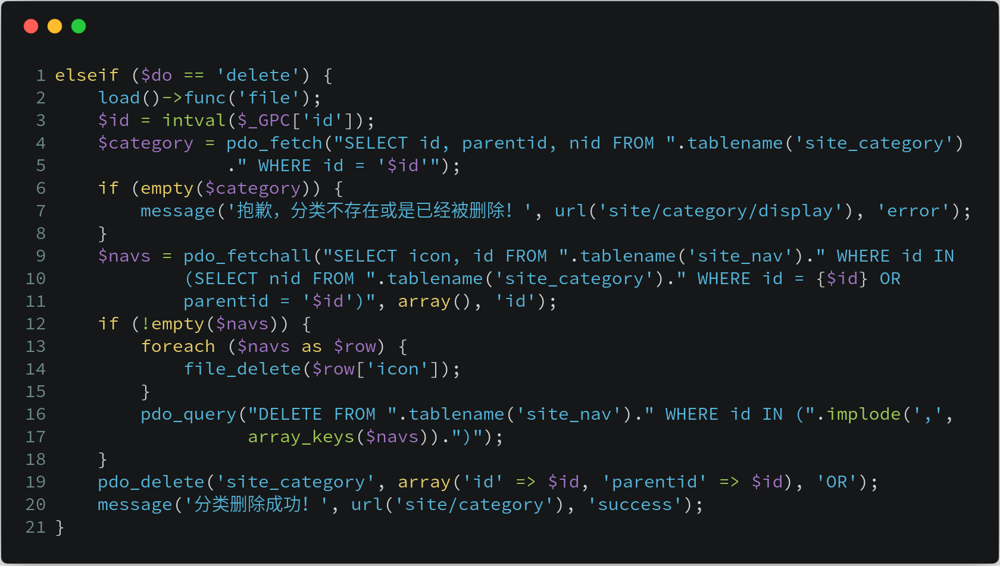

 **file_delete** 这一函数可以在 **framework/function/file.func.php** 文件中找到，该方法功能用于检测文件是否存在，如果存在，则删除文件。但是查看上下文发现，程序并没有对文件名 **$file** 变量进行过滤，所以文件名就可以存在类似 **../** 这种字符，这样也就引发任意文件删除漏洞，**file_delete** 函数代码如下：

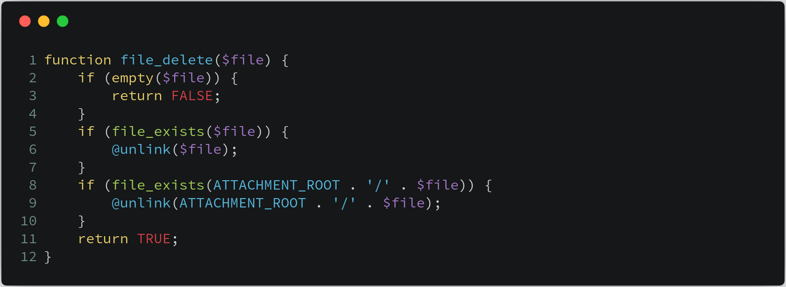

现在我们在回溯回去，看看 **$file** 变量从何处来。实际上，上图的 **$file** 变量对应的是 **$row['icon']** 的值，也就是说如果我们可以控制 **$row['icon']** 的值，就可以删除任意文件。那么我们来看看 **$row** 变量从何而来。该变量就在我们刚刚分析的第一张图片中( **web/source/site/category.ctrl.php** 文件)，该值为变量 **$navs** 中的元素值，具体代码如下：

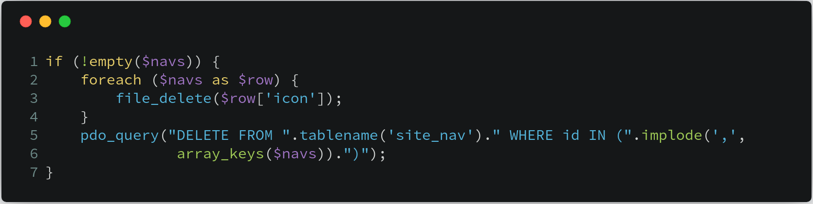

我们再往上看，即可找到 **$navs** 变量的取值情况。可以看到 **$navs** 变量的是从数据库 **site_nav** 表中取出的，包含了 **icon** 和 **id** 两个字段，具体代码如下：

```php
$navs = pdo_fetchall("SELECT icon, id FROM ".tablename('site_nav')." WHERE id IN (SELECT nid FROM ".tablename('site_category')." WHERE id = {$id} OR parentid = '$id')", array(), 'id');
```

现在我们要做的，就是找找看数据库中的这两个字段是否可以被用户控制。我们继续往前查找，发现了如下代码：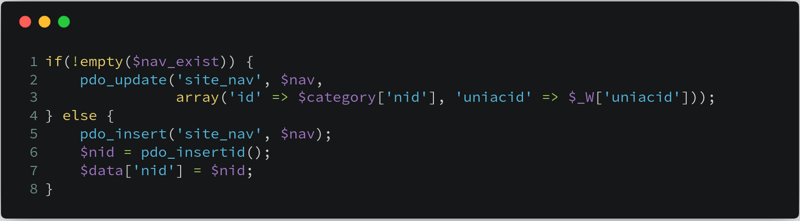

**site_nav** 表中的数据，对应的是 **$nav** 变量。我们继续往上寻找 **$nav** 变量，发现 **$nav['icon']** 变量是从 **$_GPC['iconfile']** 来的，即可被用户控制( 下图 **第21行** )。这里的 **$nav['icon']** 变量，其实就是我们文章开头分析的传入 **file_delete** 函数的参数，具体代码如下：

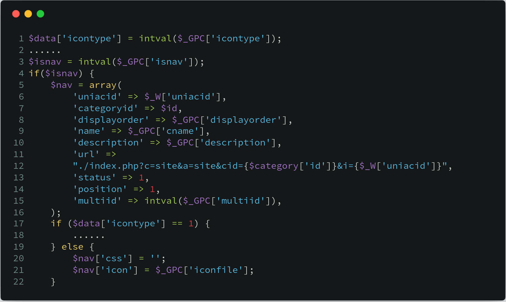

由于 **$nav['icon']** 变量可被用户控制，程序有没有对其进行消毒处理，直接就传入了 **file_delete** 函数，最终导致了文件删除漏洞。至此，我们分析完了整个漏洞的发生过程，接下看看如何进行攻击。

##漏洞验证

访问url：http://xxx.xxx.xxx.xxx/WeEngine/web/index.php?c=account&a=display ，点击管理公众号：


找到分类设置，点击添加文章分类。这里对应的url为：http://xxx.xxx.xxx.xxx/WeEngine/web/index.php?c=site&a=category，实际上表示 **site** 控制器的 **category** 模块，即对应 **category.ctrl.php** 文件。

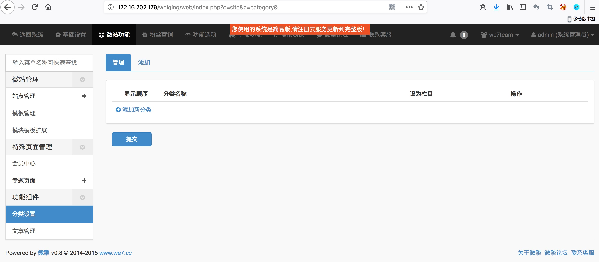

选择对应的内容，进入 **if($isnav)** 判断：

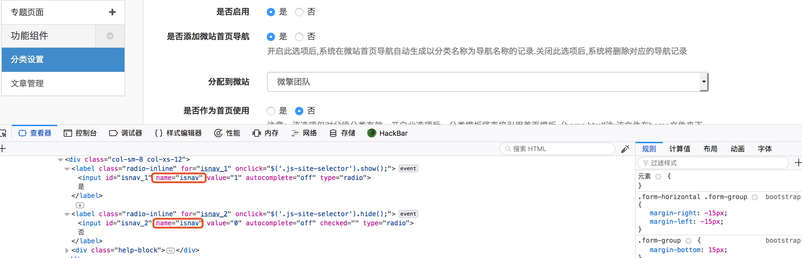


在上传图标位置输入要删除文件的路径

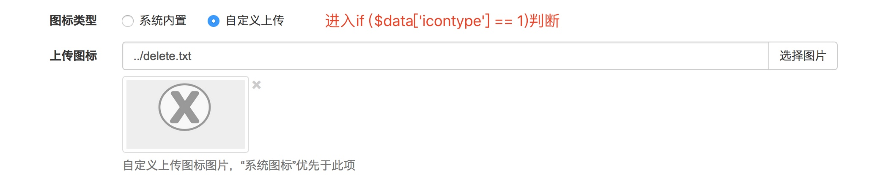

我们建立 **delete.txt** 文件，用于测试任意文件删除：

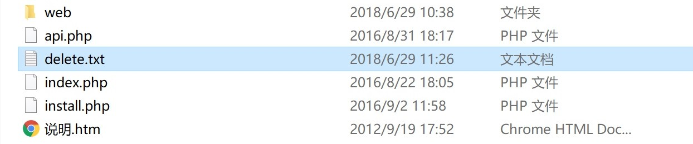

我们点击删除时，就会调用 **file_delete** 函数，同时就会删除掉我们插入到数据库中的图片名：


这个类型任意文件删除有点类似于二次注入，在添加分类时先把要删除的文件名称插入到数据库中，然后点击删除分类时，会从数据库中取出要删除的文件名。

##修复建议

漏洞是没有对 `$row['icon']` 参数进行过滤，可以将文件名内容加入目录阶层字符，造成任意文件删除漏洞，所以我们要在传入的参数中过滤"../"等目录阶层字符，避免目录穿越，删除其他文件夹下文件。我们在修复中可以过滤掉 `$row['icon']` 中的目录穿越字符，引入我们自定义的一个函数 `checkstr` 函数。同时 `$row['icon']` 只是文件的名称，并非是一个路径，因此过滤字符并不会影响到实际功能，对此修复意见我们提供如下代码：

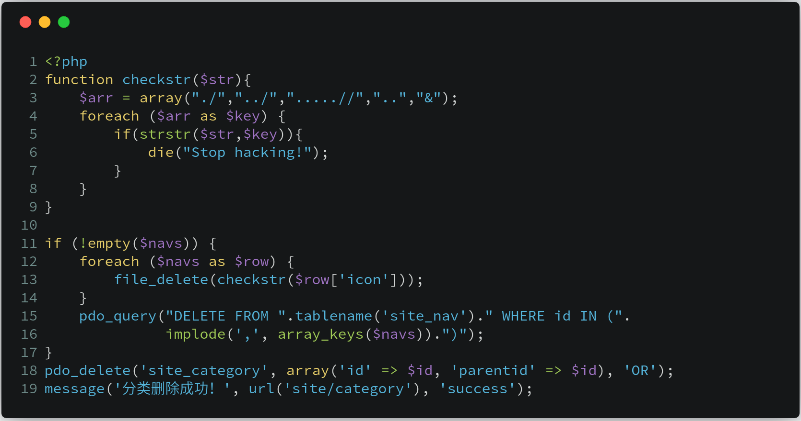

## 结语

看完了上述分析，不知道大家是否对 **路径穿越问题** 有了更加深入的理解，文中用到的CMS可以从 [这里](https://pan.baidu.com/s/1dwZgXLBK_7It6qTVkamB_w  ) 下载（密码:hgjm） 下载，当然文中若有不当之处，还望各位斧正。如果你对我们的项目感兴趣，欢迎发送邮件到 **hongrisec@gmail.com** 联系我们。**Day6** 的分析文章就到这里，我们最后留了一道CTF题目给大家练手，题目如下：

```php
// index.php
<?php
include 'flag.php';
if  ("POST" == $_SERVER['REQUEST_METHOD'])
{
    $password = $_POST['password'];
    if (0 >= preg_match('/^[[:graph:]]{12,}$/', $password))
    {
        echo 'Wrong Format';
        exit;
    }
    while (TRUE)
    {
        $reg = '/([[:punct:]]+|[[:digit:]]+|[[:upper:]]+|[[:lower:]]+)/';
        if (6 > preg_match_all($reg, $password, $arr))
            break;
        $c = 0;
        $ps = array('punct', 'digit', 'upper', 'lower');
        foreach ($ps as $pt)
        {
            if (preg_match("/[[:$pt:]]+/", $password))
            $c += 1;
        }
        if ($c < 3) break;
        if ("42" == $password) echo $flag;
        else echo 'Wrong password';
        exit;
    }
}
highlight_file(__FILE__);
?>
```

```php
// flag.php
<?php $flag = "HRCTF{Pr3g_R3plac3_1s_Int3r3sting}";?>
```


