本文由红日安全成员： **l1nk3r** 编写，如有不当，还望斧正。

## 前言

大家好，我们是红日安全-代码审计小组。最近我们小组正在做一个PHP代码审计的项目，供大家学习交流，我们给这个项目起了一个名字叫 [**PHP-Audit-Labs**](https://github.com/hongriSec/PHP-Audit-Labs) 。现在大家所看到的系列文章，属于项目 **第一阶段** 的内容，本阶段的内容题目均来自 [PHP SECURITY CALENDAR 2017](https://www.ripstech.com/php-security-calendar-2017/) 。对于每一道题目，我们均给出对应的分析，并结合实际CMS进行解说。在文章的最后，我们还会留一道CTF题目，供大家练习，希望大家喜欢。下面是 **第7篇** 代码审计文章：

## Day 7 - Bell

题目叫做钟，代码如下：

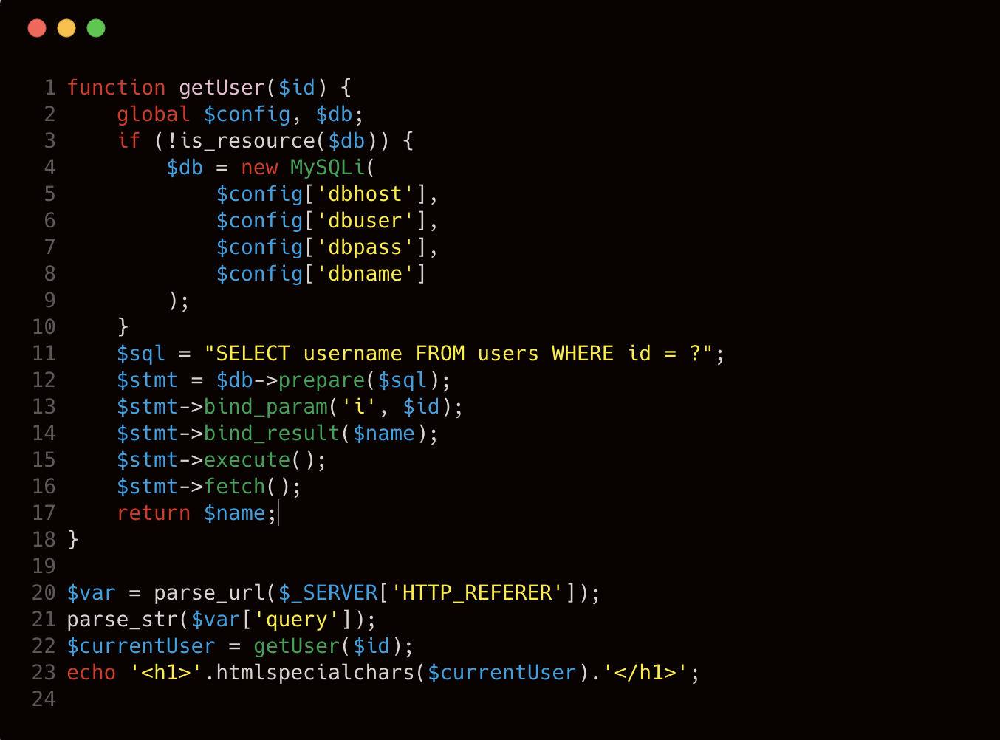

**漏洞解析** ：

这一关其实是考察变量覆盖漏洞，⽽导致这⼀漏洞的发⽣则是不安全的使⽤ **parse_str** 函数。 由于 **第21行** 中的 **parse_str()** 调用，其行为非常类似于注册全局变量。我们通过提交类似 **config[dbhost]=127.0.0.1** 这样类型的数据，这样因此我们可以控制 **getUser()** 中第5到8行的全局变量 **$config** 。如果目标存在登陆验证的过程，那么我们就可以通过变量覆盖的方法，远程连接我们自己的mysql服务器，从而绕过这块的登陆验证，进而进行攻击。我们来看看PHP官方对 **parse_str** 函数的定义：

>[ **parse_str** ](http://php.net/manual/zh/function.parse-str.php)
>
>**功能** ：parse_str的作用就是解析字符串并且注册成变量，它在注册变量之前不会验证当前变量是否存在，所以会直接覆盖掉当前作用域中原有的变量。
>
>**定义** ：`void parse_str( string $encoded_string [, array &$result ] )`
>
>如果 **encoded_string** 是 URL 传入的查询字符串（query string），则将它解析为变量并设置到当前作用域（如果提供了 result 则会设置到该数组里 ）。

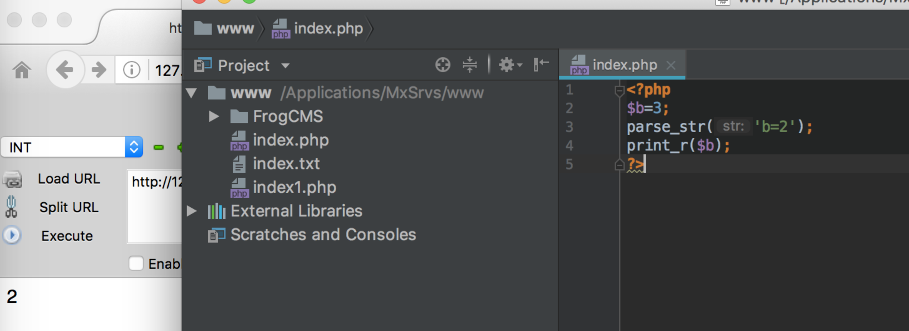

## 实例分析

本次实例分析，我们选取的是 **DedeCmsV5.6** 版本。该版本的**buy_action.php**处存在SQL注入漏洞，这里其实和 **parse_str** 有很大关系，下⾯我们来看看具体的漏洞位置。

### 补丁分析

官网于20140225发布了**V5.7.36** 正式版0225常规更新补丁，这里面的改动一共四个文件 **dede/sys_info.php** 、 **dede/templets/sys_info.htm** 、**include/uploadsafe.inc.php** 、**member/buy_action.php** 。这里我们关注一下 **member/buy_action.php** 这个文件的改动情况。

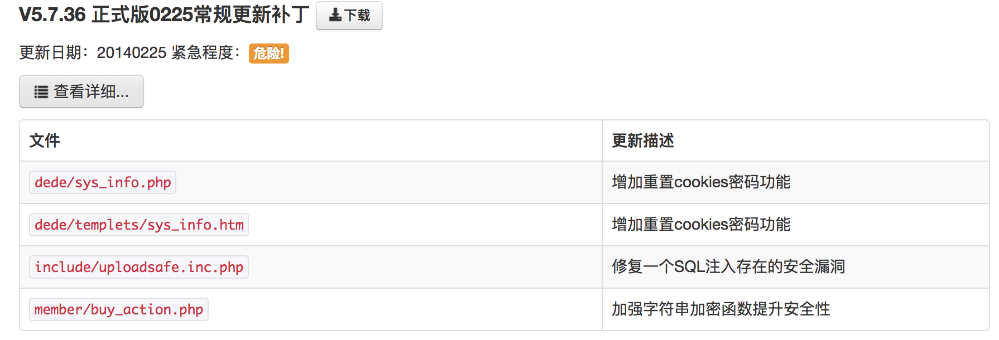

diff一下补丁和源文件：（这里采用sublime的FileDiffs插件来进行diff对比）

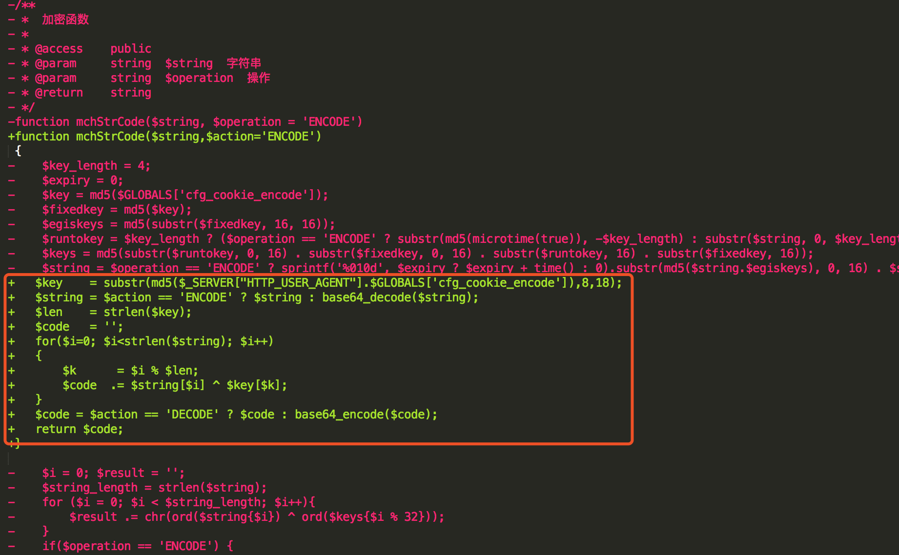

改动部分，主要针对加密函数的强度进行了加强，所以做一个推断这个漏洞应该是由于 **mchStrCode** 这个编码方法造成的。在读这个函数时发现，如果在我们知道 **cfg_cookie_encode** 的情况下，被编码字符串是可以被逆推出来的。

这个漏洞在乌云上爆出来的时候，是sql注入，所以我推断可能在调用这个编码函数进行解码的地方，解码之后可能没有任何过滤和绕过，又或者可以可绕过过滤，导致sql语句拼接写入到了数据库，而且这里解码的函数可以被攻击者控制，从而导致了SQL注入的产生。

### 原理分析

我们全局搜索一下哪些地方调用了这个 **mchStrCode** 函数，发现有三处（可以用sublime `Ctrl+Shitf+F` 进行搜索）：


**第17行** (上图)的 **parse_str** 引起了我的兴趣，看一下这一小段代码做了些什么（下图第4行处）：

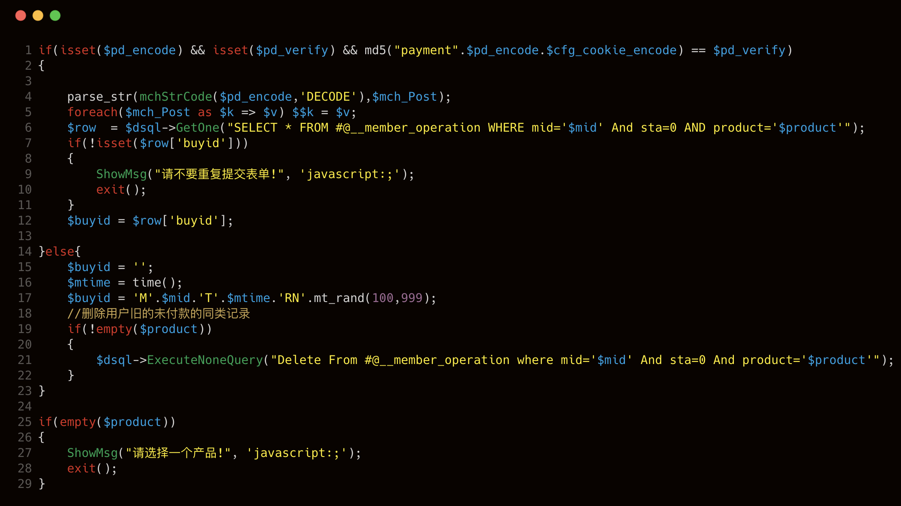

我们重点来看if语句开始时的三行代码， **mchStrCode** 是我们在上一小节通过对比补丁发现变化的函数。也就是说，这个函数可以编码或者解码用户提交的数据，而且 **$pd_encode** 也是我们可以控制的变量。

**parse_str** 方法将解码后 **$pd_encode** 中的变量放到 **$mch_Post** 数组中，之后的 **foreach** 语句存在明显的变量覆盖，将 **$mch_Post** 中的key定义为变量，同时将key所对应的value赋予该变量。然后，再向下就是执行SQL查询了。

在这个过程中存在一个明显的疏忽是，没有对定义的 **key** 进行检查，导致攻击者可以通过 **mschStrCode** 对攻击代码进行编码，从而绕过GPC和其他过滤机制，使攻击代码直达目标。我们再来看看 **mchStrCode** 函数的代码：

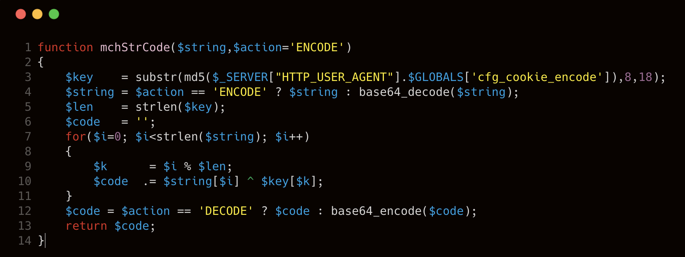

上图我们要注意第三行 **$key** 值的获取方法：

````php
$key = substr(md5($_SERVER["HTTP_USER_AGENT"].$GLOBALS['cfg_cookie_encode']),8,18);
````

这里将 **$_SERVER["HTTP_USER_AGENT"]** 和 **$GLOBALS['cfg_cookie_encode']** 进行拼接，然后进行md5计算之后取前 **18** 位字符，其中的 **$_SERVER["HTTP_USER_AGENT"]** 是浏览器的标识，可以被我们控制，关键是这个 **$GLOBALS['cfg_cookie_encode']** 是怎么来的。通过针对补丁文件的对比，发现了 **/install/index.php** 的 **$rnd_cookieEncode** 字符串的生成同样是加强了强度， **$rnd_cookieEncode** 字符串最终也就是前面提到的 **$GLOBALS['cfg_cookie_encode']** 

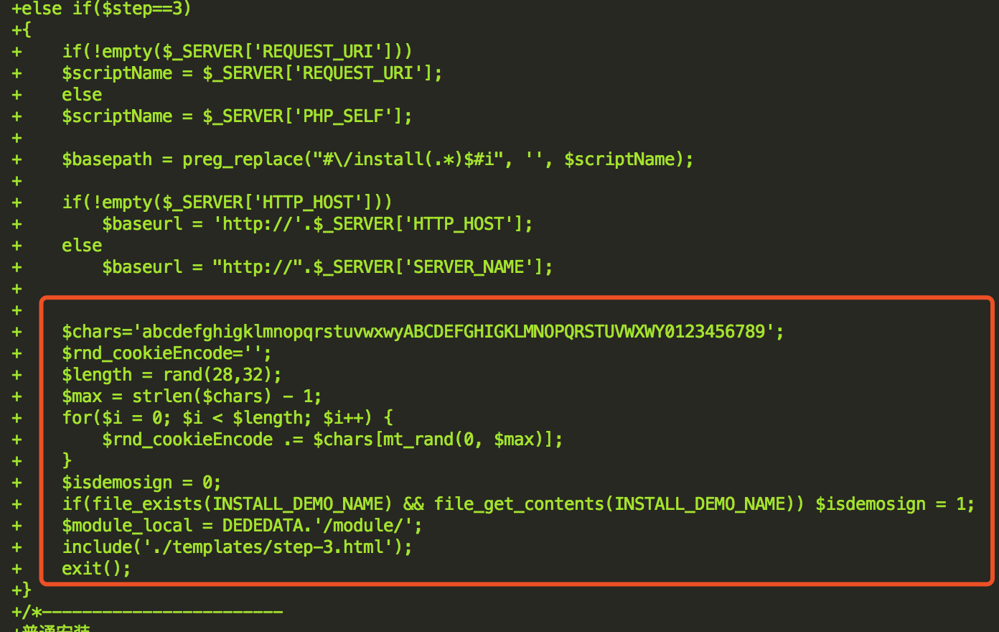

看看源代码里是怎么处理这个的 **$rnd_cookieEncode** 变量的。

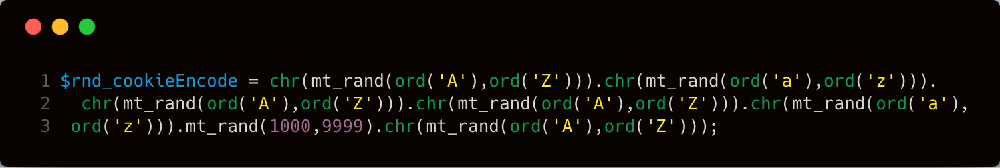

这段代码生成的加密密匙很有规律，所有密匙数为26^6*(9999-1000)=2779933068224,把所有可能的组合生成字典，用passwordpro暴力跑MD5或者使用GPU来破解，破解出md5过的密匙也花不了多少时间。 当然这个是完全有可能的，但是很耗时间，所以下一步看看有没有办法能够绕过这个猜测的过程，让页面直接回显回来。

### 利用思路

虽然整个漏洞利用原理很简单，但是利用难度还是很高的，关键点还是如何解决这个 **mchStrCode** ， **mchStrCode** 这个函数的编码过程中需要知道网站预设的 **cfg_cookie_encode** ，而这个内容在用户界面只可以获取它的MD5值。虽然**cfg_cookie_encode**的生成有一定的规律性，我们可以使用MD5碰撞的方法获得，但是时间成本太高，感觉不太值得。所以想法是在什么地方可以使用 **mchStrCode** 加密可控参数，并且能够返回到页面中。所以搜索一下全文哪里调用了这个函数。

于是，我们在 **member/buy_action.php** 的104行找到了一处加密调用：**$pr_encode = str_replace('=', '', mchStrCode($pr_encode));** 我们来看一下这个分支的整个代码：

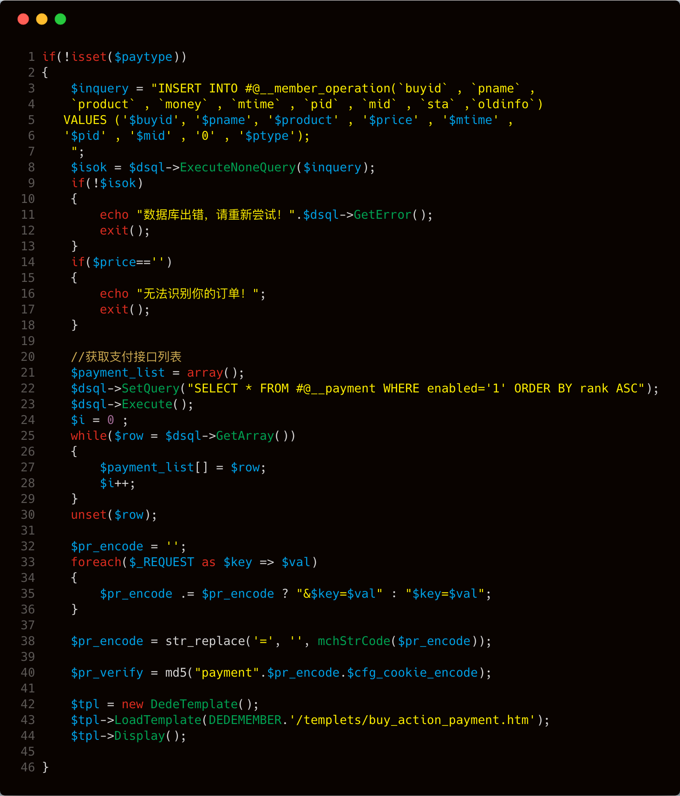

这里的 **第38行** 有一 `$tpl->LoadTemplate(DEDEMEMBER.'/templets/buy_action_payment.htm');` 在 **/templets/buy_action_payment.htm** 中，我找到了页面上回显之前加密的 **$pr_encode** 和 **$pr_verify** 。

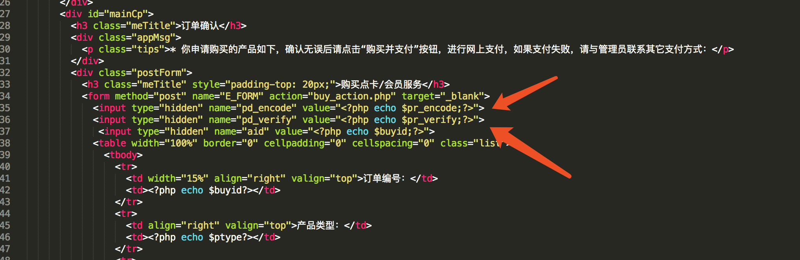

通过这部分代码，我们可以通过 **[cfg_dbprefix=SQL注入]** 的提交请求，进入这个分支，让它帮助我来编码 **[cfg_dbprefix=SQL注入]** ，从而获取相应的 **pr_encode** 和 **pr_verify** 。 但是 **common.inc.php** 文件对用户提交的内容进行了过滤，凡提交的值以cfg、GLOBALS、GET、POST、COOKIE 开头都会被拦截，如下图第11行。

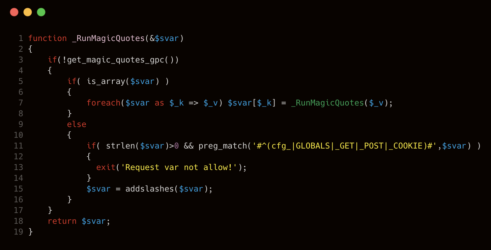

这个问题的解决就利用到了 **$REQUEST** 内容与 **parse_str** 函数内容的差异特性。我们url传入的时候通过**[a=1&b=2%26c=3]**这样的提交时， **$REQUEST** 解析的内容就是 **[a=1，b=2%26c=3]** 。而通过上面代码的遍历进入 **parse_str** 函数的内容则是 **[a=1&b=2&c=3]** ，因为 **parse_str** 函数会针对传入进来的数据进行解码，所以解析后的内容就变成了**[a=1，b=2，c=3]**。所以可以通过这种方法绕过 **common.inc.php** 文件对于参数内容传递的验证。

### 漏洞利用

访问 **buy_action.php** 文件，使用如下参数：

```less
product=card&pid=1&a=1%26cfg_dbprefix=dede_member_operation WHERE 1=@'/!12345union/ select 1,2,3,4,5,6,7,8,9,10 FROM (SELECT COUNT(),CONCAT( (SELECT pwd FROM dede_member LIMIT 0,1),FLOOR(RAND(0)2))x FROM INFORMATION_SCHEMA.CHARACTER_SETS GROUP BY x)a %23
```

其中 **product** 和 **pid** 参数是为了让我们进入 **mchStrCode** 对传入数据进行编码的分支，参数 **a** 是为了配合上面提到的差异性而随意添加的参数。从 **cfg_dbprefix** 开始，便是真正的SQL注入攻击代码。 访问该URL后，在页面源码中找到 **pd_encode** 和 **pd_verify** 字段的值，由于用户 **Cookie** 和 **User-Agent** 不同，所获取的值也不同，然后在页面上找到了 **pd_encode** 和 **pd_verify**的值，如下图：

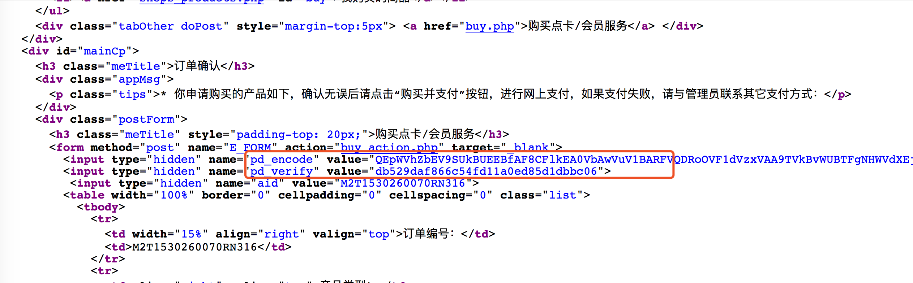

最后再构造一下payload就好了：

```less
http://127.0.0.1//dedecms5.6/member/buy_action.php?pd_encode=QEpWVhZbEV9SUkBUEEBfAF8CFlkEA0VbAwVuV1BARFVQDRoOVF1dVzxVAA9TVkBvWUBTFgNHWVdXEjRwIDB0EwMNdhcZRVMBAwwMRw1RCgweE0FVWlVVEEICHAoVAU8MSVcdBR4HGggaXU4CABh/YCx1RUpidn51dWQWJy1mfmwRG097KixycmYYFhhlIS52c2wZQhRcRSRjfH8QUlVSAT1eVVVbVxEYKSt8emYQBhwHTU51fHd2YEtqJCx1GwIZBBkfHEJ1Ynd0Eip2Iy1jfnNkf394OzFweH10c017LSNjcnFkc2JpNydnYxh+YCxtNUJzahJIH1EWR0RmfWddWxBMDAxSR1tUCwEAUFEEBV4JVFEBUVYIHgIHAQRQXAQHCAsLAAIBSFYJBgUGUB0HVwEFCAgUA1UMVlUEVQJWBFIBUAQVc3ZjaCd5MSMAAwIABgYBU1IHDQkBB1IIVVMBBQcdBwUEXVsABwsKAU5QERZBFgFxEwJwQVB1AQELHFIOXUwDBwoeBwIPQVB1TAkMAFoBVlUCAAEWVFRFDANBVWdfWxFLEQtcVg8BAwMGVFMEBg8PBVUAQzJ5Y2F1ZWN/IF9XA1tdBFVeVAcIAlRVDlJVAFtRVV5YC1INAVsHBgpUBBZyAQZWZUtcQCp8WFAXd1dUU2VFARB6dGdmUQh1AVcMAABVAVJSVVcKAABdAlAAA0R1VlZVel9RDQxnWVVcD1INVlICAAICBwQQIAdXVXRWVQpWMQtcVm1vVVt7AFcOAl4IAlANBFUGVlMFBFIHUA&pd_verify=fbe183b4c5a69ac7fb394a4b5cd5cfcb
```

再次提醒，因为每个人的 **cookie** 和 **User-Agent** 都不一样，所以生成的也不一样，建议大家自己生成一下。

## 修复建议

为了解决变量覆盖问题，可以在注册变量前先判断变量是否存在，如果使用 **extract** 函数可以配置第二个参数是 **EXTR_SKIP** 。使用 **parse_str** 函数之前先自行通过代码判断变量是否存在。

这里提供一个demo漏洞样例代码，以及demo的修复方法。

**demo漏洞**

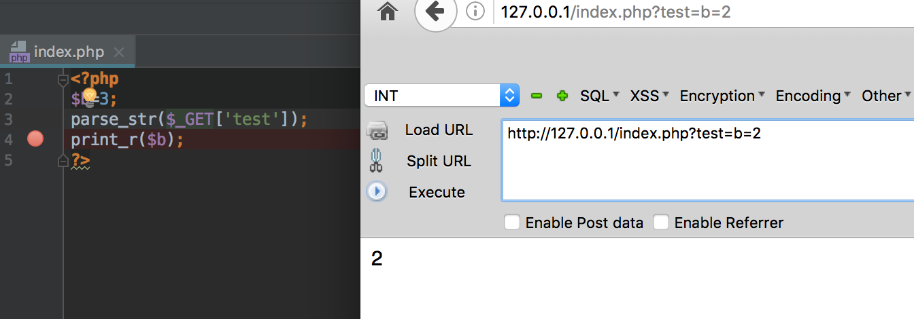

**demo漏洞修复**

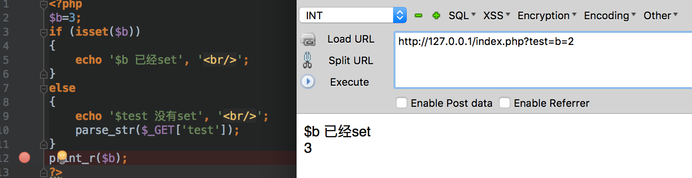

## 结语

看完了上述分析，不知道大家是否对 **parse_str()** 函数有了更加深入的理解，文中用到的CMS可以从 [这里](http://www.dedecms.com/upimg/soft/2010/DedeCmsV5.6-UTF8-Final.tar.gz) 下载，当然文中若有不当之处，还望各位斧正。如果你对我们的项目感兴趣，欢迎发送邮件到 **hongrisec@gmail.com** 联系我们。**Day7** 的分析文章就到这里，我们最后留了一道CTF题目给大家练手，题目如下：

**index.php**

```php
//index.php
<?php
$a = “hongri”;
$id = $_GET['id'];
@parse_str($id);
if ($a[0] != 'QNKCDZO' && md5($a[0]) == md5('QNKCDZO')) {
    echo '<a href="uploadsomething.php">flag is here</a>';
}
?>
```

```php
//uploadsomething.php
<?php
header("Content-type:text/html;charset=utf-8");
$referer = $_SERVER['HTTP_REFERER'];
if(isset($referer)!== false) {
    $savepath = "uploads/" . sha1($_SERVER['REMOTE_ADDR']) . "/";
    if (!is_dir($savepath)) {
        $oldmask = umask(0);
        mkdir($savepath, 0777);
        umask($oldmask);
    }
    if ((@$_GET['filename']) && (@$_GET['content'])) {
        //$fp = fopen("$savepath".$_GET['filename'], 'w');
        $content = 'HRCTF{y0u_n4ed_f4st}   by:l1nk3r';
        file_put_contents("$savepath" . $_GET['filename'], $content);
        $msg = 'Flag is here,come on~ ' . $savepath . htmlspecialchars($_GET['filename']) . "";
        usleep(100000);
        $content = "Too slow!";
        file_put_contents("$savepath" . $_GET['filename'], $content);
    }
   print <<<EOT
<form action="" method="get">
<div class="form-group">
<label for="exampleInputEmail1">Filename</label>
<input type="text" class="form-control" name="filename" id="exampleInputEmail1" placeholder="Filename">
</div>
<div class="form-group">
<label for="exampleInputPassword1">Content</label>
<input type="text" class="form-control" name="content" id="exampleInputPassword1" placeholder="Contont">
</div>
<button type="submit" class="btn btn-default">Submit</button>
</form>
EOT;
}
else{
    echo 'you can not see this page';
}
?>
```

题解我们会阶段性放出，如果大家有什么好的解法，可以在文章底下留言，祝大家玩的愉快！

## 相关文章

[DedeCMS最新通杀注入(buy_action.php)分析](http://webscan.360.cn/news/news128)