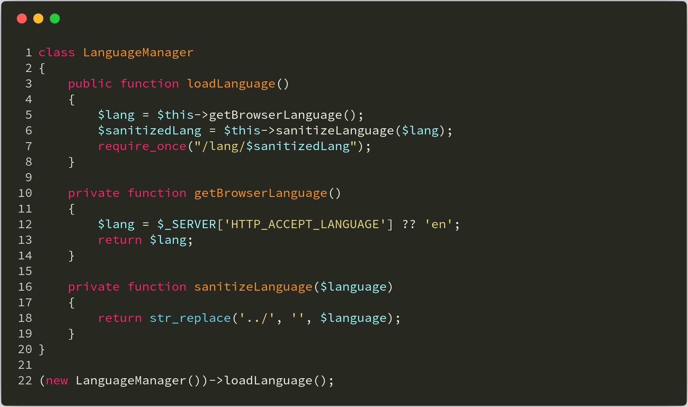
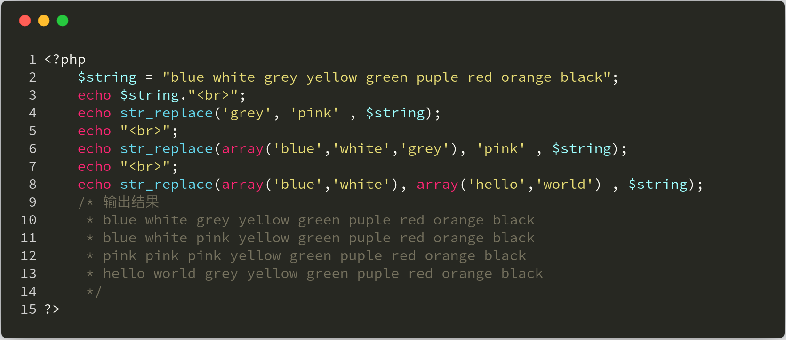
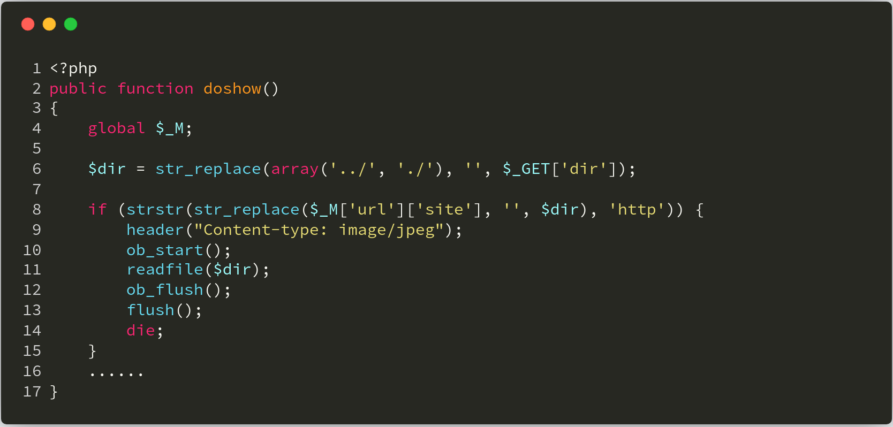
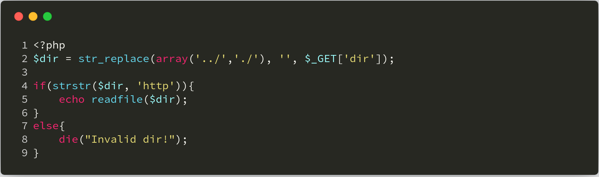
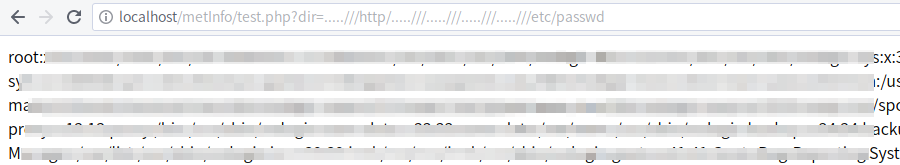
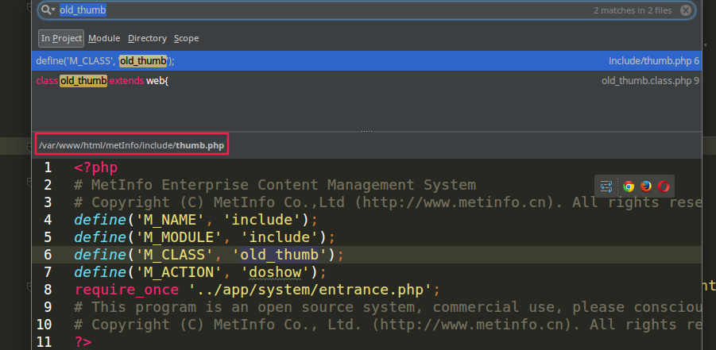
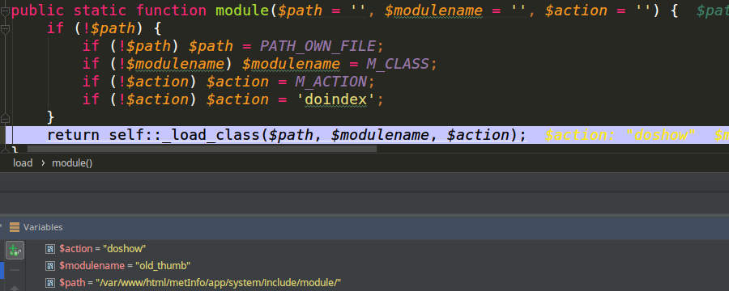
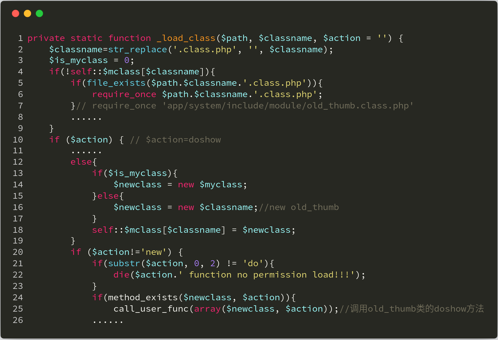
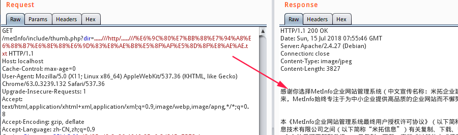
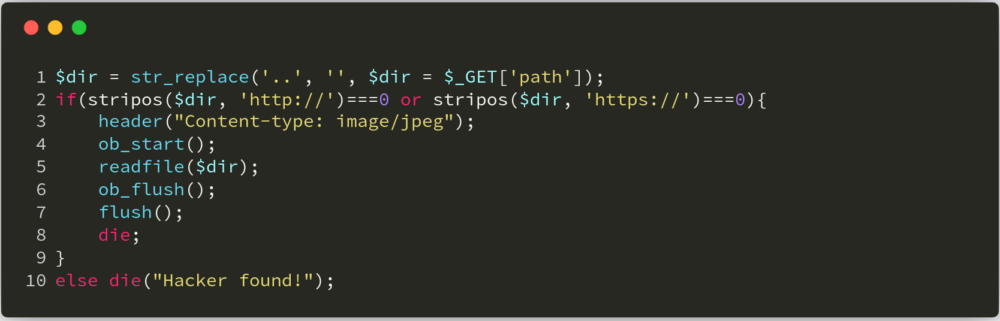

本文由红日安全成员： **七月火** 编写，如有不当，还望斧正。

## 前言

大家好，我们是红日安全-代码审计小组。最近我们小组正在做一个PHP代码审计的项目，供大家学习交流，我们给这个项目起了一个名字叫 [**PHP-Audit-Labs**](https://github.com/hongriSec/PHP-Audit-Labs) 。现在大家所看到的系列文章，属于项目 **第一阶段** 的内容，本阶段的内容题目均来自 [PHP SECURITY CALENDAR 2017](https://www.ripstech.com/php-security-calendar-2017/) 。对于每一道题目，我们均给出对应的分析，并结合实际CMS进行解说。在文章的最后，我们还会留一道CTF题目，供大家练习，希望大家喜欢。下面是 **第9篇** 代码审计文章：

## Day 9 - Rabbit

题目叫做兔子，代码如下：



**漏洞解析** ：

这一题考察的是一个 **str_replace** 函数过滤不当造成的任意文件包含漏洞。在上图代码 **第18行** 处，程序仅仅只是将 **../** 字符替换成空，这并不能阻止攻击者进行攻击。例如攻击者使用payload：**....//** 或者 **..././** ，在经过程序的 **str_replace** 函数处理后，都会变成 **../** ，所以上图程序中的 **str_replace** 函数过滤是有问题的。我们来看一下PHP手册对 **str_replace** 函数的具体定义：

>[ str_replace ](http://php.net/manual/zh/function.str-replace.php)：(PHP 4, PHP 5, PHP 7)
>
>**功能** ：子字符串替换
>
>**定义** ： `mixed str_replace ( mixed $search , mixed $replace , mixed $subject [, int &$count ] )` 
>
>该函数返回一个字符串或者数组。如下：
>
>str_replace(字符串1，字符串2，字符串3)：将字符串3中出现的所有字符串1换成字符串2。
>
>str_replace(数组1，字符串1，字符串2)：将字符串2中出现的所有数组1中的值，换成字符串1。
>
>str_replace(数组1，数组2，字符串1)：将字符串1中出现的所有数组1一一对应，替换成数组2的值，多余的替换成空字符串。



## 实例分析

本次实例分析，我们选取的是 **Metinfo 6.0.0** 版本。漏洞文件在 **app/system/include/module/old_thumb.class.php** 中，我们发现程序将变量 **$dir** 中出现的 **../** 和 **./** 字符替换成空字符串（下图第6行处），猜想开发者应该是有考虑到路径穿越问题，所以做了此限制。具体代码如下：



接着在第8行处，用 **strstr** 函数判断 **$dir** 变量中是否含有 **http** 字符串，如果有，则读取加载 **$dir** 变量，并以图片方式显示出来。这里猜测开发者的意图是，加载远程图片。关于 **strstr** 函数，定义如下：

>[ strstr ](http://php.net/manual/zh/function.strstr.php)：(PHP 4, PHP 5, PHP 7)
>
>**功能** ：查找字符串的首次出现
>
>**定义** ： `string strstr ( string $haystack , mixed $needle [, bool $before_needle = FALSE ] )` 
>
>返回 `haystack` 字符串从 `needle` 第一次出现的位置开始到 `haystack` 结尾的字符串。
>
>```php
>domain = strstr('hongrisec@gmail.com', '@');
>// 上面输出：@gmail.com
>user = strstr('hongrisec@gmail.com, '@', true); // 从 PHP 5.3.0 起
>// 上面输出：hongrisec
>```

然而这段代码是可以绕过的，例如我们使用 **payload：.....///http/.....///.....///.....///.....///etc/passwd** ，过滤后实际就变成： **../http/../../../../etc/passwd** ，效果如下：





接下来，我们要做的就是搜索程序在哪里调用了这个文件。用 **phpstorm** 加载整个项目文件，按住 `Ctrl+Shift+F` 键，搜索关键词 **old_thumb** ，发现在 **include/thumb.php** 文件中调用 **old_thumb** 类，搜索结果如下图：



我们在 **include/thumb.php** 文件中，可以看到 **M_CLASS** 定义为 **old_thumb** ，而 **M_ACTION** 定义为 **doshow** 。我们接着跟进到 **app/system/entrance.php** 文件中，在该文件的末尾可以看包含了 **app/system/include/class/load.class.php** 文件，引入了 **load** 类，然后调用了 **load** 类的 **module** 方法。

```php
// app/system/include/class/load.class.php
require_once PATH_SYS_CLASS.'load.class.php';
load::module();
```

我们跟进 **module** 方法，并查看各个变量的赋值情况( **app/system/include/class/load.class.php** 文件)：



上图程序最后调用了 **load** 类的 **_load_class** 方法，我们跟进该方法，详细代码如下：



可以看到上图代码第16行处实例化了一个 **old_thumb** 类对象，然后在第25行处调用了 **old_thumb** 类的 **doshow** 方法， **doshow** 方法中的 **$dir** 变量就是用户可以控制的。以上便是完整的攻击过程分析，下面我们看看具体如何进行攻击。

## 漏洞利用

实际上攻击的话就很简单了，因为 **$dir** 变量是直接通过 **GET请求** 获取的，然后用 **str_replace** 方法处理，而 **str_replace** 方法处理又有问题，所以我们构造 **payload** 如下：

```bash
http://localhost/metInfo/include/thumb.php?dir=.....///http/.....///最终用户授权许可协议.txt
```



成功读取 **最终用户授权许可协议.txt** 文件。

## 修复建议

关于修复建议，这里先抛出个问题给大家，针对这个案例，下面的修复代码是否可行？

```php
$dir = str_replace(array('..','//'), '', $_GET['dir']);
```

咋一看，这个代码好像完美地修复了路径穿越问题，但是，我们在修复代码的时候一定要结合实际情况。比如在metinfo中，程序这里原来的功能是加载远程图片，使用上面的修复代码，会导致正常的图片链接无法加载，这种修复肯定是无效的。这里给出我的修复代码，如下图：



## 结语

看完了上述分析，不知道大家是否对 **str_replace()** 函数过滤路径符号有了更加深入的理解，文中用到的CMS可以从 [这里](https://www.metinfo.cn/upload/file/MetInfo6.0.0.zip) 下载，当然文中若有不当之处，还望各位斧正。如果你对我们的项目感兴趣，欢迎发送邮件到 **hongrisec@gmail.com** 联系我们。**Day9** 的分析文章就到这里，我们最后留了一道CTF题目给大家练手，题目如下：

```php
// index.php
<?php  
include 'config.php';
include 'function.php';

$conn = new mysqli($servername,$username,$password,$dbname);
if($conn->connect_error){
    die('连接数据库失败');
}

$sql = "SELECT COUNT(*) FROM users";
$result = $conn->query($sql);
if($result->num_rows > 0){
    $row = $result->fetch_assoc();
    $id = $row['COUNT(*)'] + 1;
}
else die($conn->error);

if(isset($_POST['msg']) && $_POST['msg'] !==''){
    $msg = addslashes($_POST['msg']);
    $msg = replace_bad_word(convert($msg));
    $sql = "INSERT INTO users VALUES($id,'".$msg."')";
    $result = $conn->query($sql);
    if($conn->error) die($conn->error);
}
echo "<center><h1>Welcome come to HRSEC message board</center></h1>";
echo <<<EOF
<center>
    <form action="index.php" method="post">
        <p>Leave a message: <input type="text" name="msg" /><input type="submit" value="Submit" /></p>
    </form>
</center>
EOF;
$sql = "SELECT * FROM users";
$result = $conn->query($sql);
if($result->num_rows > 0){
    echo "<center><table border='1'><tr><th>id</th><th>message</th><tr></center>";
    while($row = $result->fetch_row()){
        echo "<tr><th>$row[0]</th><th>$row[1]</th><tr>";
    }
    echo "</table></center>";
}
$conn->close();
?>
```

```php
// function.php
<?php  
function replace_bad_word($str){
    global $limit_words;
    foreach ($limit_words as $old => $new) {
        strlen($old) > 2 && $str = str_replace($old,trim($new),$str);
    }
    return $str;
}

function convert($str){
    return htmlentities($str);
}

$limit_words = array('造反' => '造**', '法轮功' => '法**');

foreach (array('_GET','_POST') as $method) {
    foreach ($$method as $key => $value) {
        $$key = $value;
    }
}
?>
```

```php
// config.php
<?php  
$servername = "localhost";
$username = "hongrisec";
$password = "hongrisec";
$dbname = "day9";
?>
```

```sql
# 搭建CTF环境使用的sql语句
create database day9;
use day9;
create table users(
id integer auto_increment not null primary key,
message varchar(50)
);
create table flag( flag varchar(40));
insert into flag values('HRCTF{StR_R3p1ac3_anD_sQ1_inJ3ctIon_zZz}');
```

题解我们会阶段性放出，如果大家有什么好的解法，可以在文章底下留言，祝大家玩的愉快！

## 相关文章

[Metinfo 6.0.0 任意文件读取漏洞](http://badcode.cc/2018/05/26/Metinfo-6-0-0-%E4%BB%BB%E6%84%8F%E6%96%87%E4%BB%B6%E8%AF%BB%E5%8F%96%E6%BC%8F%E6%B4%9E/) 

[MetInfo 任意文件读取漏洞的修复与绕过](https://paper.seebug.org/676/) 

