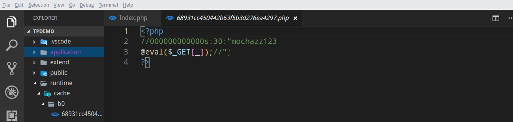
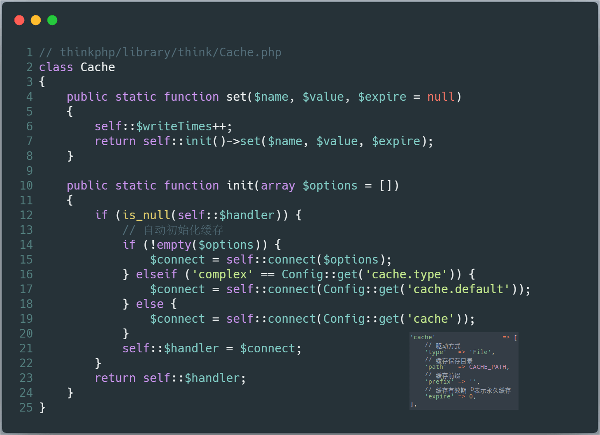
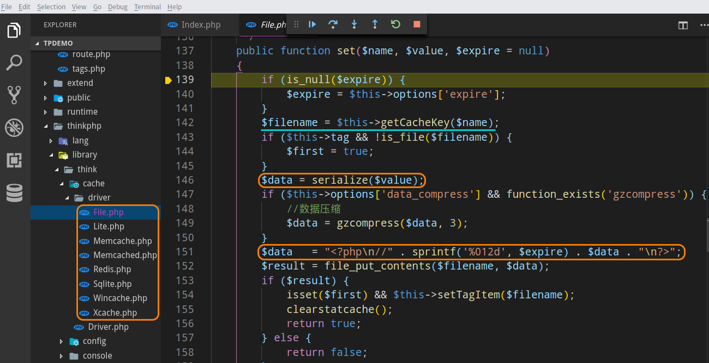
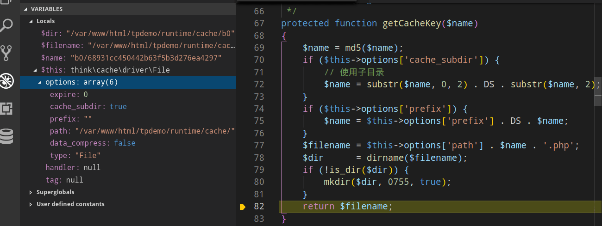
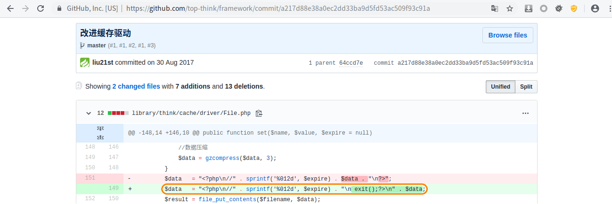
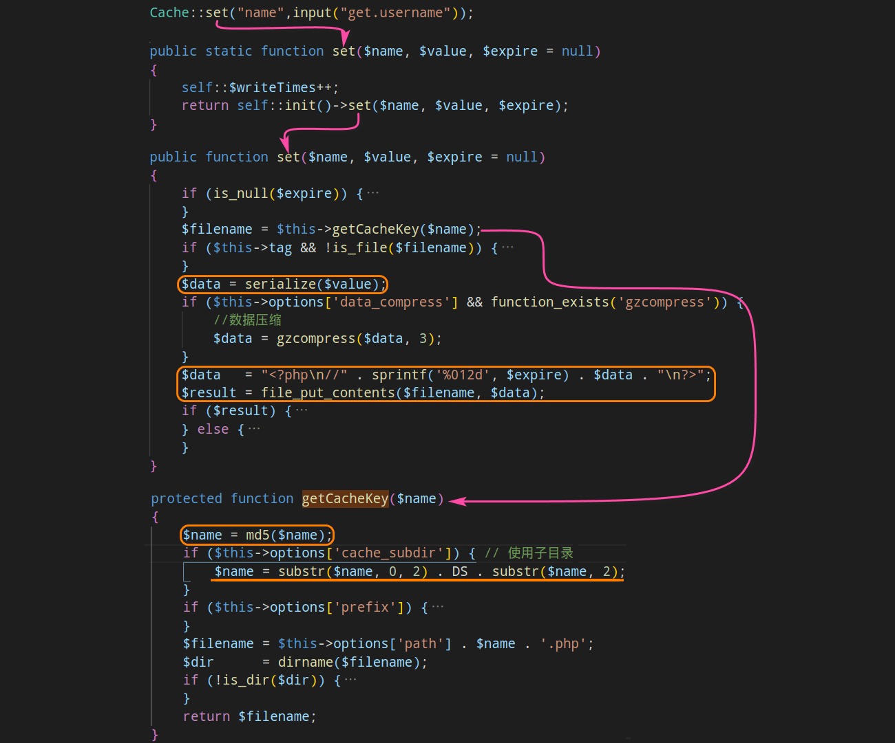

本系列文章将针对 **ThinkPHP** 的历史漏洞进行分析，今后爆出的所有 **ThinkPHP** 漏洞分析，也将更新于 [ThinkPHP-Vuln](https://github.com/Mochazz/ThinkPHP-Vuln) 项目上。本篇文章，将分析 **ThinkPHP** 中存在的 **远程代码执行** 漏洞。

## 漏洞概要

本次漏洞存在于 **ThinkPHP** 的缓存类中。该类会将缓存数据通过序列化的方式，直接存储在 **.php** 文件中，攻击者通过精心构造的 **payload** ，即可将 **webshell** 写入缓存文件。缓存文件的名字和目录均可预测出来，一旦缓存目录可访问或结合任意文件包含漏洞，即可触发 **远程代码执行漏洞** 。漏洞影响版本： **5.0.0<=ThinkPHP5<=5.0.10** 。

## 漏洞环境

通过以下命令获取测试环境代码：

```bash
composer create-project --prefer-dist topthink/think=5.0.10 tpdemo
```

将 **composer.json** 文件的 **require** 字段设置成如下：

```json
"require": {
    "php": ">=5.4.0",
    "topthink/framework": "5.0.10"
},
```

然后执行 `composer update` ，并将 **application/index/controller/Index.php** 文件代码设置如下：

```php
<?php
namespace app\index\controller;
use think\Cache;
class Index
{
    public function index()
    {
        Cache::set("name",input("get.username"));
        return 'Cache success';
    }
}
```

访问 **http://localhost/tpdemo/public/?username=mochazz123%0d%0a@eval($_GET[_]);//** ，即可将 **webshell** 写入缓存文件。



## 漏洞分析

我们跟进 **Cache** 类的 **set** 方法，发现其先通过单例模式 **init** 方法，创建了一个类实例，该类由 **cache** 的配置项 **type** 决定，默认情况下其值为 **File** 。在本例中， **self::$handler** 即为 **think\cache\driver\File** 类实例。



在 **thinkphp/library/think/cache/driver/** 目录下，我们可以看到 **Thinkphp5** 支持的几种缓存驱动类。我们接着上面的分析，程序调用 **think\cache\driver\File** 类的 **set** 方法。可以看到 **data** 数据没有经过任何处理，只是序列化后拼接存储在文件中，这里的 **$this->options['data_compress']** 变量默认情况下为 **false** ，所以数据不会经过 **gzcompress** 函数处理。虽然在序列化数据前面拼接了单行注释符 **//** ，但是我们可以通过注入换行符绕过该限制。



现在我们就来看看缓存文件的名字是如何生成的。从上一张图片 **第142行** ，我们可以看到文件名是通过调用 **getCacheKey** 方法获得的，我们跟进该方法。可以看到缓存文件的子目录和文件名均和缓存类设置的键有关（如本例中缓存类设置的键为 **name** ）。程序先获得键名的 **md5** 值，然后将该 **md5** 值的前 **2** 个字符作为缓存子目录，后 **30** 字符作为缓存文件名。如果应用程序还设置了前缀 **$this->options['prefix']** ，那么缓存文件还将多一个上级目录。



至此，我们已将本次漏洞分析完毕，接下来还想说说关于该漏洞的一些细节。首先，这个漏洞要想利用成功，我们得知道缓存类所设置的键名，这样才能找到 **webshell** 路径；其次如果按照官方说明开发程序， **webshell** 最终会被写到 **runtime** 目录下，而官方推荐 **public** 作为 **web** 根目录，所以即便我们写入了 **shell** ，也无法直接访问到；最后如果程序有设置 **$this->options['prefix']** 的话，在没有源码的情况下，我们还是无法获得 **webshell** 的准确路径。

## 漏洞修复

官方的修复方法是：将数据拼接在 **php** 标签之外，并在 **php** 标签中拼接 **exit()** 函数。



## 攻击总结

最后，再通过一张攻击流程图来回顾整个攻击过程。

